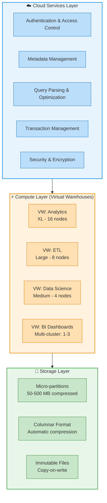

# 1.1 Snowflake Architecture Overview

> **Key Terms**
>
> **Multi-Cluster Shared Data Architecture** — Snowflake's unique hybrid design combining shared-disk data accessibility with shared-nothing compute scalability.
>
> **Cloud Services Layer** — The "brain" of Snowflake handling authentication, metadata, query parsing, optimization, and access control.
>
> **Virtual Warehouse** — An independent MPP compute cluster that executes queries without contending with other warehouses for resources.
>
> **Storage Layer** — Centralized, compressed columnar storage managed entirely by Snowflake using cloud-native object storage (S3, Azure Blob, GCS).
>
> **Micro-partition** — A contiguous, immutable unit of storage (50–500 MB compressed) that forms the foundation of Snowflake's data organization.
>
> **Elasticity** — The ability to instantly scale compute resources up/down or out/in without downtime or data movement.
>
> **Zero-Copy Cloning** — Creating metadata-only copies of objects without physically duplicating underlying data.
>
> **Snowflake Object Hierarchy** — Organization → Account → Database → Schema → Objects (tables, views, stages, etc.).

---

## Overview

Snowflake's architecture is the single most tested concept in the SnowPro Core COF-C03 exam. Domain 1 accounts for **31% of the exam**, and this topic forms the conceptual foundation for nearly every other domain. Understanding why Snowflake chose a multi-cluster shared data architecture — and how it differs from traditional approaches — is essential for answering questions about performance, scaling, concurrency, storage, and cost optimization.

Snowflake was purpose-built for the cloud from the ground up (first released in 2014). It is not a port of an existing on-premises database. This design decision enabled three architectural layers that operate independently: **Storage**, **Compute** (Virtual Warehouses), and **Cloud Services**. Each layer scales independently, which eliminates the resource contention problems of shared-disk systems and the data shuffling overhead of shared-nothing systems.

For the exam, focus on: which layer handles what responsibility, what happens when you scale compute vs. storage, how concurrency is achieved without degradation, and how Snowflake's approach delivers benefits that neither shared-disk nor shared-nothing architectures can achieve alone.

---

## Characteristics

| Feature | Description | Exam Relevance |
|---------|-------------|----------------|
| **SaaS delivery model** | Fully managed — no hardware, software, or tuning required | Frequently tested: "What does the customer NOT manage?" |
| **ANSI SQL support** | Standard SQL with extensions for semi-structured data | Know that Snowflake uses SQL, not a proprietary language |
| **Multi-cluster compute** | Independent virtual warehouses share centralized data | Core concept tested in ~10% of questions |
| **Columnar storage** | Data stored in compressed columns within micro-partitions | Tested in storage/performance questions |
| **Automatic optimization** | Pruning, caching, and statistics maintained without DBA intervention | Know what is automatic vs. what requires user action |
| **Native semi-structured support** | VARIANT, OBJECT, ARRAY types with schema-on-read | Tested in data loading and transformation questions |
| **Time Travel & Fail-safe** | Data recovery: 0–90 days Time Travel + 7 days Fail-safe | Numbers are heavily tested |
| **Cross-cloud replication** | Data sharing and replication across AWS, Azure, GCP | Know that architecture supports multi-cloud |
| **Transparent pricing** | Separate billing for storage ($/TB/month) and compute (credits/hour) | Understand decoupled billing model |

---

## Architecture Diagram



---

## Detailed Content

### Multi-Cluster Shared Data Architecture

Snowflake's architecture consists of three physically and logically separated layers:

**1. Storage Layer (Centralized, Shared)**
- All data is stored in a single, centralized location using the underlying cloud provider's object storage (Amazon S3, Azure Blob Storage, or Google Cloud Storage).
- Data is organized into **micro-partitions**: immutable, compressed columnar files sized between 50–500 MB (uncompressed size: up to 500 MB; compressed actual storage is typically much smaller).
- Snowflake manages all aspects of storage: compression, encryption (AES-256), organization, and file sizing. Users cannot access the underlying files directly.
- Storage is billed separately from compute at a flat rate per TB per month.

**Exam-Critical:** The customer NEVER manages the storage layer. You cannot choose file formats for internal storage, change compression algorithms, or access raw micro-partitions.

**2. Compute Layer (Virtual Warehouses)**
- Consists of one or more independent **virtual warehouses** — each an MPP (Massively Parallel Processing) cluster of compute nodes.
- Each warehouse operates independently: starting, stopping, scaling, and failing without affecting other warehouses.
- Warehouses access the centralized storage layer via the Cloud Services layer but cache data locally in SSD for performance (the **local disk cache** or **warehouse cache**).
- Warehouses come in T-shirt sizes: X-Small (1 node/server) through 6X-Large (512 nodes). Each size-up doubles the nodes and credits per hour.

**Exam-Critical:** Virtual warehouses do NOT share compute resources. Scaling up (bigger size) improves complex query speed. Scaling out (multi-cluster) improves concurrency.

**3. Cloud Services Layer**
- The "brain" that coordinates everything: authentication, infrastructure management, metadata, query optimization, access control, and transaction management.
- Operates on compute instances provisioned and managed by Snowflake (not charged to customer unless usage exceeds 10% of daily warehouse consumption).
- Maintains the **metadata store** that powers Time Travel, pruning, zero-copy cloning, and query optimization.
- This layer runs 24/7, even when all virtual warehouses are suspended.

**Exam-Critical:** Cloud Services runs continuously. It is not billed unless it exceeds 10% of daily warehouse compute.

---

### Separation of Storage and Compute Benefits

The independent scaling of storage and compute delivers concrete benefits tested on the exam:

| Benefit | How It Works | Traditional Limitation Solved |
|---------|-------------|-------------------------------|
| **Independent scaling** | Add storage without adding compute (and vice versa) | Shared-nothing requires adding both together |
| **Concurrency without degradation** | Spin up additional warehouses reading the same data | Shared-disk suffers lock contention at scale |
| **Pay-per-use compute** | Suspend warehouses when idle; pay $0 for compute | On-prem hardware runs 24/7 regardless of usage |
| **No data movement for new workloads** | A new warehouse instantly accesses all existing data | Shared-nothing requires redistribution/resharding |
| **Workload isolation** | ETL, analytics, and ML use separate warehouses | Resource contention between workloads eliminated |

---

### Snowflake vs. Traditional Architectures

Snowflake's multi-cluster shared data architecture is a hybrid that takes the best of both traditional models:

**Shared-Disk Architecture** (e.g., Oracle RAC):
- All nodes access a single shared storage layer.
- Advantage: single copy of data, no resharding.
- Disadvantage: storage I/O becomes the bottleneck; lock contention limits scaling.

**Shared-Nothing Architecture** (e.g., Hadoop, Teradata, Redshift):
- Each node has its own local storage; data is distributed/partitioned.
- Advantage: scales well for parallel processing.
- Disadvantage: data redistribution required when scaling; join performance depends on data co-location; data skew causes hotspots.

**Snowflake's Hybrid Approach:**
- Like shared-disk: all compute nodes access a single centralized data store (no data resharding).
- Like shared-nothing: each virtual warehouse is an independent MPP cluster (no resource contention between workloads).
- Unlike both: storage and compute scale independently; no hardware management; automatic optimization.

---

### Key Design Principles

1. **Elasticity** — Scale up/down in seconds. Add/remove clusters for concurrency. No downtime.
2. **No Hardware Management** — Snowflake manages all infrastructure. Customers interact via SQL and UI only.
3. **Transparent Optimization** — Automatic micro-partition pruning, statistics collection, and result caching require zero DBA intervention.
4. **Continuous Data Protection** — Time Travel (up to 90 days for Enterprise+) and Fail-safe (7 days, Snowflake-recoverable only) are always active.
5. **Security by Default** — All data encrypted at rest (AES-256) and in transit (TLS 1.2+). No option to disable encryption.

---

### Snowflake Object Hierarchy

```
Organization (Org)
 └── Account (deployment in a specific cloud/region)
      └── Database
           └── Schema
                └── Objects (Tables, Views, Stages, Pipes, Streams, Tasks,
                             Sequences, File Formats, Procedures, UDFs, etc.)
```

**Exam-Critical Hierarchy Facts:**
- An **Organization** can contain multiple accounts across different cloud providers and regions.
- Each **Account** exists in exactly one cloud provider and one region.
- A **Database** contains one or more schemas. The default schemas are `PUBLIC` and `INFORMATION_SCHEMA`.
- **Schema** is the primary container for database objects. Fully qualified names follow: `database.schema.object`.
- Objects like warehouses, resource monitors, and roles exist at the **account level**, not within a database.

---

## SQL Examples

### Example 1: Exploring the Object Hierarchy

```sql
-- Show all databases in the current account
SHOW DATABASES;

-- Show schemas within a specific database
SHOW SCHEMAS IN DATABASE my_database;

-- Show tables within a schema (fully qualified)
SHOW TABLES IN SCHEMA my_database.public;

-- Use a three-part naming convention (database.schema.object)
SELECT * FROM my_database.public.customers LIMIT 10;
```

### Example 2: Virtual Warehouse Management (Compute Layer)

```sql
-- Create a warehouse demonstrating independent compute scaling
-- Exam note: Each size-up DOUBLES nodes and credits/hour
CREATE WAREHOUSE analytics_wh
  WAREHOUSE_SIZE = 'LARGE'          -- 8 nodes, 8 credits/hour
  AUTO_SUSPEND = 300                 -- Suspend after 5 minutes idle
  AUTO_RESUME = TRUE                 -- Resume on query submission
  MIN_CLUSTER_COUNT = 1             -- Multi-cluster: minimum clusters
  MAX_CLUSTER_COUNT = 3             -- Multi-cluster: maximum clusters
  SCALING_POLICY = 'STANDARD';      -- vs ECONOMY (exam tests this)

-- Scale UP (vertical) for complex queries: doubles compute power
ALTER WAREHOUSE analytics_wh SET WAREHOUSE_SIZE = 'XLARGE';  -- 16 nodes

-- Suspend warehouse: $0 compute cost when not running
ALTER WAREHOUSE analytics_wh SUSPEND;

-- Resume warehouse
ALTER WAREHOUSE analytics_wh RESUME;
```

### Example 3: Demonstrating Workload Isolation

```sql
-- Different workloads use separate warehouses reading the SAME data
-- This demonstrates the "shared data" aspect of the architecture

-- ETL warehouse: runs overnight batch loads
CREATE WAREHOUSE etl_wh
  WAREHOUSE_SIZE = 'XLARGE'
  AUTO_SUSPEND = 60;

-- BI warehouse: handles dashboards with high concurrency
CREATE WAREHOUSE bi_wh
  WAREHOUSE_SIZE = 'MEDIUM'
  MIN_CLUSTER_COUNT = 1
  MAX_CLUSTER_COUNT = 5
  SCALING_POLICY = 'STANDARD';

-- Both access the same table without data movement or contention
-- ETL team loads data:
USE WAREHOUSE etl_wh;
INSERT INTO sales.public.orders SELECT * FROM staging.raw.orders_new;

-- BI team queries same data simultaneously (no contention):
USE WAREHOUSE bi_wh;
SELECT region, SUM(amount) FROM sales.public.orders GROUP BY region;
```

### Example 4: Observing Architecture Layers in Action

```sql
-- Cloud Services layer: metadata queries consume no warehouse credits
-- These run even with warehouse suspended (uses Cloud Services compute)
SHOW WAREHOUSES;
SHOW DATABASES;
SELECT CURRENT_ACCOUNT();
SELECT CURRENT_REGION();

-- Check warehouse credit usage to observe compute billing
SELECT
    warehouse_name,
    credits_used_compute,
    credits_used_cloud_services,  -- Only billed if > 10% of compute
    start_time
FROM SNOWFLAKE.ACCOUNT_USAGE.WAREHOUSE_METERING_HISTORY
WHERE start_time >= DATEADD('day', -7, CURRENT_TIMESTAMP())
ORDER BY start_time DESC;

-- View micro-partition metadata (storage layer visibility)
-- Exam note: Snowflake tracks min/max per column per partition for pruning
SELECT
    table_name,
    active_bytes,
    time_travel_bytes,
    failsafe_bytes,
    retained_for_clone_bytes
FROM SNOWFLAKE.ACCOUNT_USAGE.TABLE_STORAGE_METRICS
WHERE table_catalog = 'MY_DATABASE'
ORDER BY active_bytes DESC
LIMIT 10;
```

---

## Comparison: Snowflake vs. Traditional Architectures

| Characteristic | Shared-Disk (Oracle RAC) | Shared-Nothing (Hadoop/Redshift) | Snowflake Multi-Cluster Shared Data |
|---------------|--------------------------|----------------------------------|--------------------------------------|
| **Storage** | Single shared SAN/NAS | Distributed across nodes | Centralized cloud object storage |
| **Compute** | Multiple nodes sharing storage | Each node processes local data | Independent MPP warehouse clusters |
| **Scaling storage** | Add storage devices | Add nodes (adds compute too) | Add storage independently ($$/TB) |
| **Scaling compute** | Add nodes (limited by I/O) | Add nodes (requires resharding) | Resize warehouse or add clusters |
| **Concurrency** | Degrades with lock contention | Limited by node resources | Add warehouses or clusters — no contention |
| **Data movement** | None needed | Required for rebalancing/joins | None — all warehouses read shared data |
| **Hardware mgmt** | Customer managed | Customer managed | Fully managed by Snowflake |
| **Elasticity** | Days/weeks to scale | Hours to scale | Seconds to scale |
| **Data co-location** | N/A (shared storage) | Required for performance | Not needed — optimizer handles pruning |
| **Failure impact** | Node failure may affect all | Node failure loses local data | Warehouse failure isolated; data safe in object storage |

---

## Exam Tips

- **Memorize the three layers:** Storage, Compute (Virtual Warehouses), Cloud Services. Know what each one does. Questions will describe a scenario and ask which layer handles it.
- **Cloud Services is always running.** Even with all warehouses suspended, metadata queries, access control, and security operate. It costs nothing unless >10% of daily warehouse compute.
- **Scaling UP vs. OUT:** Scaling up (larger warehouse size) helps complex queries. Scaling out (multi-cluster warehouses) helps concurrency. The exam WILL test this distinction.
- **Warehouse sizes double:** XS=1, S=2, M=4, L=8, XL=16, 2XL=32, 3XL=64, 4XL=128, 5XL=256, 6XL=512 nodes. Credits per hour also double with each size.
- **Micro-partition size:** 50–500 MB compressed. This is immutable (copy-on-write). The exam tests these numbers.
- **Data is encrypted always:** AES-256 at rest, TLS 1.2 in transit. You CANNOT disable encryption. This is not optional.
- **Snowflake is NOT:** open-source, based on Hadoop, a fork of PostgreSQL, or a port of any on-premises database. It was built from scratch for the cloud.
- **Account = one cloud, one region.** An account cannot span multiple regions. Use replication/failover for multi-region.
- **Fully qualified naming:** `database.schema.object` (three parts). Warehouses, roles, and users are account-level objects (not within a database).
- **Auto-suspend and auto-resume** are warehouse properties. Default auto-suspend is 600 seconds (10 minutes) for warehouses created via the UI.
- **No DBA tuning required:** Snowflake automatically handles indexing (via micro-partition metadata), statistics, compression, and data distribution.

---

## Common Misconceptions

| Misconception | Reality |
|---------------|---------|
| "Snowflake uses a shared-nothing architecture" | Snowflake uses a **hybrid**: shared data (centralized storage) with shared-nothing compute (independent warehouses) |
| "Scaling up a warehouse improves concurrency" | Scaling UP improves individual query speed. Scaling OUT (multi-cluster) improves concurrency |
| "Suspended warehouses still cost money" | Suspended warehouses cost **$0** for compute. Only storage costs persist |
| "Cloud Services layer has no cost" | It DOES consume credits, but is only billed when exceeding 10% of daily warehouse compute |
| "You need to choose a compression algorithm" | Snowflake automatically selects and applies optimal compression per column |
| "Larger warehouses are always better" | Simple queries on small data complete just as fast on XS. Larger warehouses only help complex/large queries |
| "Virtual warehouses store data" | Warehouses have a **local cache** (SSD) but do NOT persistently store data. Data lives in the storage layer |
| "You can access micro-partitions directly" | Micro-partitions are internally managed. Users cannot read, modify, or configure them directly |
| "Each warehouse has its own copy of data" | All warehouses read from the **same** centralized storage. Caches are local and ephemeral |
| "Snowflake requires you to manage nodes" | Snowflake is fully managed SaaS. You choose warehouse sizes; Snowflake provisions the nodes |

---

## Key Takeaways

1. **Three independent layers** — Storage, Compute, and Cloud Services each scale independently and serve distinct purposes. This separation is Snowflake's core architectural advantage.

2. **Hybrid architecture** — Snowflake combines centralized shared storage (like shared-disk) with independent MPP compute clusters (like shared-nothing), avoiding the downsides of both traditional models.

3. **No resource contention** — Virtual warehouses are isolated. One team's heavy ETL workload cannot degrade another team's dashboard performance, because they use separate compute clusters accessing the same data.

4. **Elasticity in seconds** — Warehouses can be resized, suspended, resumed, or multi-clustered in seconds with no downtime and no data movement.

5. **Fully managed, no DBA required** — Compression, encryption, indexing (via micro-partition pruning metadata), statistics, and storage optimization are all automatic and transparent.

6. **Decoupled billing** — Storage is billed per TB/month. Compute is billed per credit/second (minimum 60 seconds). This separation means you only pay for what you use.

7. **Object hierarchy matters** — Organization → Account → Database → Schema → Objects. Warehouses and roles exist at the account level, not within databases.

---

## References

- [Snowflake Architecture Overview](https://docs.snowflake.com/en/user-guide/intro-key-concepts)
- [Key Concepts & Architecture](https://docs.snowflake.com/en/user-guide/intro-key-concepts#snowflake-architecture)
- [Virtual Warehouses](https://docs.snowflake.com/en/user-guide/warehouses)
- [Multi-Cluster Warehouses](https://docs.snowflake.com/en/user-guide/warehouses-multicluster)
- [Micro-Partitions & Data Clustering](https://docs.snowflake.com/en/user-guide/tables-clustering-micropartitions)
- [Understanding Snowflake Table Structures](https://docs.snowflake.com/en/user-guide/tables-storage-considerations)
- [Cloud Services Layer Billing](https://docs.snowflake.com/en/user-guide/credits#cloud-services-credit-usage)
- [SnowPro Core Certification Study Guide](https://learn.snowflake.com/courses/snowpro-core-certification)

---

[Previous: None] | [Home](../README.md) | [Next: 1.2 Cloud Services Layer →](./1.2_Cloud_Services_Layer.md)
