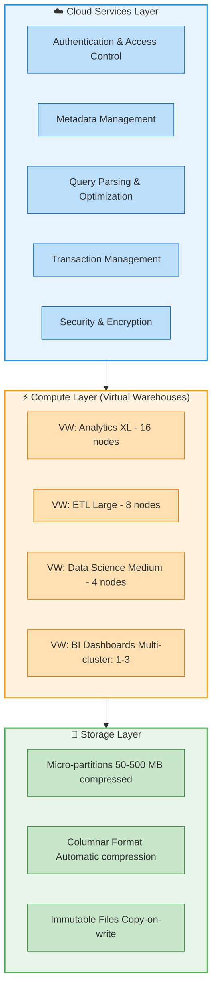

# 1.1 Snowflake Architecture Overview

> **Key Terms**
>
> **Multi-Cluster Shared Data Architecture** — Snowflake's unique hybrid design combining shared-disk data accessibility with shared-nothing compute scalability.
>
> **Cloud Services Layer** — The "brain" of Snowflake handling authentication, metadata, query parsing, optimization, and access control.
>
> **Virtual Warehouse** — An independent MPP compute cluster that executes queries without contending with other warehouses for resources.
>
> **Storage Layer** — Centralized, compressed columnar storage managed entirely by Snowflake using cloud-native object storage (S3, Azure Blob, GCS).
>
> **Micro-partition** — A contiguous, immutable unit of storage (50–500 MB compressed) that forms the foundation of Snowflake's data organization.
>
> **Elasticity** — The ability to instantly scale compute resources up/down or out/in without downtime or data movement.
>
> **Zero-Copy Cloning** — Creating metadata-only copies of objects without physically duplicating underlying data.
>
> **Snowflake Object Hierarchy** — Organization → Account → Database → Schema → Objects (tables, views, stages, etc.).

---

## Overview

Snowflake's architecture is the single most tested concept in the SnowPro Core COF-C03 exam. Domain 1 accounts for **31% of the exam**, and this topic forms the conceptual foundation for nearly every other domain. Understanding why Snowflake chose a multi-cluster shared data architecture — and how it differs from traditional approaches — is essential for answering questions about performance, scaling, concurrency, storage, and cost optimization.

Snowflake was purpose-built for the cloud from the ground up (first released in 2014). It is not a port of an existing on-premises database. This design decision enabled three architectural layers that operate independently: **Storage**, **Compute** (Virtual Warehouses), and **Cloud Services**. Each layer scales independently, which eliminates the resource contention problems of shared-disk systems and the data shuffling overhead of shared-nothing systems.

For the exam, focus on: which layer handles what responsibility, what happens when you scale compute vs. storage, how concurrency is achieved without degradation, and how Snowflake's approach delivers benefits that neither shared-disk nor shared-nothing architectures can achieve alone.

---

## Characteristics

| Feature | Description | Exam Relevance |
|---------|-------------|----------------|
| **SaaS delivery model** | Fully managed — no hardware, software, or tuning required | Frequently tested: "What does the customer NOT manage?" |
| **ANSI SQL support** | Standard SQL with extensions for semi-structured data | Know that Snowflake uses SQL, not a proprietary language |
| **Multi-cluster compute** | Independent virtual warehouses share centralized data | Core concept tested in ~10% of questions |
| **Columnar storage** | Data stored in compressed columns within micro-partitions | Tested in storage/performance questions |
| **Automatic optimization** | Pruning, caching, and statistics maintained without DBA intervention | Know what is automatic vs. what requires user action |
| **Native semi-structured support** | VARIANT, OBJECT, ARRAY types with schema-on-read | Tested in data loading and transformation questions |
| **Time Travel & Fail-safe** | Data recovery: 0–90 days Time Travel + 7 days Fail-safe | Numbers are heavily tested |
| **Cross-cloud replication** | Data sharing and replication across AWS, Azure, GCP | Know that architecture supports multi-cloud |
| **Transparent pricing** | Separate billing for storage ($/TB/month) and compute (credits/hour) | Understand decoupled billing model |

---

## Architecture Diagram



---

## Detailed Content

### Multi-Cluster Shared Data Architecture

Snowflake's architecture consists of three physically and logically separated layers:

**1. Storage Layer (Centralized, Shared)**
- All data is stored in a single, centralized location using the underlying cloud provider's object storage (Amazon S3, Azure Blob Storage, or Google Cloud Storage).
- Data is organized into **micro-partitions**: immutable, compressed columnar files sized between 50–500 MB (uncompressed size: up to 500 MB; compressed actual storage is typically much smaller).
- Snowflake manages all aspects of storage: compression, encryption (AES-256), organization, and file sizing. Users cannot access the underlying files directly.
- Storage is billed separately from compute at a flat rate per TB per month.

**Exam-Critical:** The customer NEVER manages the storage layer. You cannot choose file formats for internal storage, change compression algorithms, or access raw micro-partitions.

**2. Compute Layer (Virtual Warehouses)**
- Consists of one or more independent **virtual warehouses** — each an MPP (Massively Parallel Processing) cluster of compute nodes.
- Each warehouse operates independently: starting, stopping, scaling, and failing without affecting other warehouses.
- Warehouses access the centralized storage layer via the Cloud Services layer but cache data locally in SSD for performance (the **local disk cache** or **warehouse cache**).
- Warehouses come in T-shirt sizes: X-Small (1 node/server) through 6X-Large (512 nodes). Each size-up doubles the nodes and credits per hour.

**Exam-Critical:** Virtual warehouses do NOT share compute resources. Scaling up (bigger size) improves complex query speed. Scaling out (multi-cluster) improves concurrency.

**3. Cloud Services Layer**
- The "brain" that coordinates everything: authentication, infrastructure management, metadata, query optimization, access control, and transaction management.
- Operates on compute instances provisioned and managed by Snowflake (not charged to customer unless usage exceeds 10% of daily warehouse consumption).
- Maintains the **metadata store** that powers Time Travel, pruning, zero-copy cloning, and query optimization.
- This layer runs 24/7, even when all virtual warehouses are suspended.

**Exam-Critical:** Cloud Services runs continuously. It is not billed unless it exceeds 10% of daily warehouse compute.

---

### Separation of Storage and Compute Benefits

The independent scaling of storage and compute delivers concrete benefits tested on the exam:

| Benefit | How It Works | Traditional Limitation Solved |
|---------|-------------|-------------------------------|
| **Independent scaling** | Add storage without adding compute (and vice versa) | Shared-nothing requires adding both together |
| **Concurrency without degradation** | Spin up additional warehouses reading the same data | Shared-disk suffers lock contention at scale |
| **Pay-per-use compute** | Suspend warehouses when idle; pay $0 for compute | On-prem hardware runs 24/7 regardless of usage |
| **No data movement for new workloads** | A new warehouse instantly accesses all existing data | Shared-nothing requires redistribution/resharding |
| **Workload isolation** | ETL, analytics, and ML use separate warehouses | Resource contention between workloads eliminated |

---

### Snowflake vs. Traditional Architectures

Snowflake's multi-cluster shared data architecture is a hybrid that takes the best of both traditional models:

**Shared-Disk Architecture** (e.g., Oracle RAC):
- All nodes access a single shared storage layer.
- Advantage: single copy of data, no resharding.
- Disadvantage: storage I/O becomes the bottleneck; lock contention limits scaling.

**Shared-Nothing Architecture** (e.g., Hadoop, Teradata, Redshift):
- Each node has its own local storage; data is distributed/partitioned.
- Advantage: scales well for parallel processing.
- Disadvantage: data redistribution required when scaling; join performance depends on data co-location; data skew causes hotspots.

**Snowflake's Hybrid Approach:**
- Like shared-disk: all compute nodes access a single centralized data store (no data resharding).
- Like shared-nothing: each virtual warehouse is an independent MPP cluster (no resource contention between workloads).
- Unlike both: storage and compute scale independently; no hardware management; automatic optimization.

---

### Key Design Principles

1. **Elasticity** — Scale up/down in seconds. Add/remove clusters for concurrency. No downtime.
2. **No Hardware Management** — Snowflake manages all infrastructure. Customers interact via SQL and UI only.
3. **Transparent Optimization** — Automatic micro-partition pruning, statistics collection, and result caching require zero DBA intervention.
4. **Continuous Data Protection** — Time Travel (up to 90 days for Enterprise+) and Fail-safe (7 days, Snowflake-recoverable only) are always active.
5. **Security by Default** — All data encrypted at rest (AES-256) and in transit (TLS 1.2+). No option to disable encryption.

---

### Snowflake Object Hierarchy

```
Organization (Org)
 └── Account (deployment in a specific cloud/region)
      └── Database
           └── Schema
                └── Objects (Tables, Views, Stages, Pipes, Streams, Tasks,
                             Sequences, File Formats, Procedures, UDFs, etc.)
```

**Exam-Critical Hierarchy Facts:**
- An **Organization** can contain multiple accounts across different cloud providers and regions.
- Each **Account** exists in exactly one cloud provider and one region.
- A **Database** contains one or more schemas. The default schemas are `PUBLIC` and `INFORMATION_SCHEMA`.
- **Schema** is the primary container for database objects. Fully qualified names follow: `database.schema.object`.
- Objects like warehouses, resource monitors, and roles exist at the **account level**, not within a database.

---

## SQL Examples

### Example 1: Exploring the Object Hierarchy

```sql
-- Show all databases in the current account
SHOW DATABASES;

-- Show schemas within a specific database
SHOW SCHEMAS IN DATABASE my_database;

-- Show tables within a schema (fully qualified)
SHOW TABLES IN SCHEMA my_database.public;

-- Use a three-part naming convention (database.schema.object)
SELECT * FROM my_database.public.customers LIMIT 10;
```

### Example 2: Virtual Warehouse Management (Compute Layer)

```sql
-- Create a warehouse demonstrating independent compute scaling
-- Exam note: Each size-up DOUBLES nodes and credits/hour
CREATE WAREHOUSE analytics_wh
  WAREHOUSE_SIZE = 'LARGE'          -- 8 nodes, 8 credits/hour
  AUTO_SUSPEND = 300                 -- Suspend after 5 minutes idle
  AUTO_RESUME = TRUE                 -- Resume on query submission
  MIN_CLUSTER_COUNT = 1             -- Multi-cluster: minimum clusters
  MAX_CLUSTER_COUNT = 3             -- Multi-cluster: maximum clusters
  SCALING_POLICY = 'STANDARD';      -- vs ECONOMY (exam tests this)

-- Scale UP (vertical) for complex queries: doubles compute power
ALTER WAREHOUSE analytics_wh SET WAREHOUSE_SIZE = 'XLARGE';  -- 16 nodes

-- Suspend warehouse: $0 compute cost when not running
ALTER WAREHOUSE analytics_wh SUSPEND;

-- Resume warehouse
ALTER WAREHOUSE analytics_wh RESUME;
```

### Example 3: Demonstrating Workload Isolation

```sql
-- Different workloads use separate warehouses reading the SAME data
-- This demonstrates the "shared data" aspect of the architecture

-- ETL warehouse: runs overnight batch loads
CREATE WAREHOUSE etl_wh
  WAREHOUSE_SIZE = 'XLARGE'
  AUTO_SUSPEND = 60;

-- BI warehouse: handles dashboards with high concurrency
CREATE WAREHOUSE bi_wh
  WAREHOUSE_SIZE = 'MEDIUM'
  MIN_CLUSTER_COUNT = 1
  MAX_CLUSTER_COUNT = 5
  SCALING_POLICY = 'STANDARD';

-- Both access the same table without data movement or contention
-- ETL team loads data:
USE WAREHOUSE etl_wh;
INSERT INTO sales.public.orders SELECT * FROM staging.raw.orders_new;

-- BI team queries same data simultaneously (no contention):
USE WAREHOUSE bi_wh;
SELECT region, SUM(amount) FROM sales.public.orders GROUP BY region;
```

### Example 4: Observing Architecture Layers in Action

```sql
-- Cloud Services layer: metadata queries consume no warehouse credits
-- These run even with warehouse suspended (uses Cloud Services compute)
SHOW WAREHOUSES;
SHOW DATABASES;
SELECT CURRENT_ACCOUNT();
SELECT CURRENT_REGION();

-- Check warehouse credit usage to observe compute billing
SELECT
    warehouse_name,
    credits_used_compute,
    credits_used_cloud_services,  -- Only billed if > 10% of compute
    start_time
FROM SNOWFLAKE.ACCOUNT_USAGE.WAREHOUSE_METERING_HISTORY
WHERE start_time >= DATEADD('day', -7, CURRENT_TIMESTAMP())
ORDER BY start_time DESC;

-- View micro-partition metadata (storage layer visibility)
-- Exam note: Snowflake tracks min/max per column per partition for pruning
SELECT
    table_name,
    active_bytes,
    time_travel_bytes,
    failsafe_bytes,
    retained_for_clone_bytes
FROM SNOWFLAKE.ACCOUNT_USAGE.TABLE_STORAGE_METRICS
WHERE table_catalog = 'MY_DATABASE'
ORDER BY active_bytes DESC
LIMIT 10;
```

---

## Comparison: Snowflake vs. Traditional Architectures

| Characteristic | Shared-Disk (Oracle RAC) | Shared-Nothing (Hadoop/Redshift) | Snowflake Multi-Cluster Shared Data |
|---------------|--------------------------|----------------------------------|--------------------------------------|
| **Storage** | Single shared SAN/NAS | Distributed across nodes | Centralized cloud object storage |
| **Compute** | Multiple nodes sharing storage | Each node processes local data | Independent MPP warehouse clusters |
| **Scaling storage** | Add storage devices | Add nodes (adds compute too) | Add storage independently ($$/TB) |
| **Scaling compute** | Add nodes (limited by I/O) | Add nodes (requires resharding) | Resize warehouse or add clusters |
| **Concurrency** | Degrades with lock contention | Limited by node resources | Add warehouses or clusters — no contention |
| **Data movement** | None needed | Required for rebalancing/joins | None — all warehouses read shared data |
| **Hardware mgmt** | Customer managed | Customer managed | Fully managed by Snowflake |
| **Elasticity** | Days/weeks to scale | Hours to scale | Seconds to scale |
| **Data co-location** | N/A (shared storage) | Required for performance | Not needed — optimizer handles pruning |
| **Failure impact** | Node failure may affect all | Node failure loses local data | Warehouse failure isolated; data safe in object storage |

---

## Exam Tips

- **Memorize the three layers:** Storage, Compute (Virtual Warehouses), Cloud Services. Know what each one does. Questions will describe a scenario and ask which layer handles it.
- **Cloud Services is always running.** Even with all warehouses suspended, metadata queries, access control, and security operate. It costs nothing unless >10% of daily warehouse compute.
- **Scaling UP vs. OUT:** Scaling up (larger warehouse size) helps complex queries. Scaling out (multi-cluster warehouses) helps concurrency. The exam WILL test this distinction.
- **Warehouse sizes double:** XS=1, S=2, M=4, L=8, XL=16, 2XL=32, 3XL=64, 4XL=128, 5XL=256, 6XL=512 nodes. Credits per hour also double with each size.
- **Micro-partition size:** 50–500 MB compressed. This is immutable (copy-on-write). The exam tests these numbers.
- **Data is encrypted always:** AES-256 at rest, TLS 1.2 in transit. You CANNOT disable encryption. This is not optional.
- **Snowflake is NOT:** open-source, based on Hadoop, a fork of PostgreSQL, or a port of any on-premises database. It was built from scratch for the cloud.
- **Account = one cloud, one region.** An account cannot span multiple regions. Use replication/failover for multi-region.
- **Fully qualified naming:** `database.schema.object` (three parts). Warehouses, roles, and users are account-level objects (not within a database).
- **Auto-suspend and auto-resume** are warehouse properties. Default auto-suspend is 600 seconds (10 minutes) for warehouses created via the UI.
- **No DBA tuning required:** Snowflake automatically handles indexing (via micro-partition metadata), statistics, compression, and data distribution.

---

## Common Misconceptions

| Misconception | Reality |
|---------------|---------|
| "Snowflake uses a shared-nothing architecture" | Snowflake uses a **hybrid**: shared data (centralized storage) with shared-nothing compute (independent warehouses) |
| "Scaling up a warehouse improves concurrency" | Scaling UP improves individual query speed. Scaling OUT (multi-cluster) improves concurrency |
| "Suspended warehouses still cost money" | Suspended warehouses cost **$0** for compute. Only storage costs persist |
| "Cloud Services layer has no cost" | It DOES consume credits, but is only billed when exceeding 10% of daily warehouse compute |
| "You need to choose a compression algorithm" | Snowflake automatically selects and applies optimal compression per column |
| "Larger warehouses are always better" | Simple queries on small data complete just as fast on XS. Larger warehouses only help complex/large queries |
| "Virtual warehouses store data" | Warehouses have a **local cache** (SSD) but do NOT persistently store data. Data lives in the storage layer |
| "You can access micro-partitions directly" | Micro-partitions are internally managed. Users cannot read, modify, or configure them directly |
| "Each warehouse has its own copy of data" | All warehouses read from the **same** centralized storage. Caches are local and ephemeral |
| "Snowflake requires you to manage nodes" | Snowflake is fully managed SaaS. You choose warehouse sizes; Snowflake provisions the nodes |

---

## Key Takeaways

1. **Three independent layers** — Storage, Compute, and Cloud Services each scale independently and serve distinct purposes. This separation is Snowflake's core architectural advantage.

2. **Hybrid architecture** — Snowflake combines centralized shared storage (like shared-disk) with independent MPP compute clusters (like shared-nothing), avoiding the downsides of both traditional models.

3. **No resource contention** — Virtual warehouses are isolated. One team's heavy ETL workload cannot degrade another team's dashboard performance, because they use separate compute clusters accessing the same data.

4. **Elasticity in seconds** — Warehouses can be resized, suspended, resumed, or multi-clustered in seconds with no downtime and no data movement.

5. **Fully managed, no DBA required** — Compression, encryption, indexing (via micro-partition pruning metadata), statistics, and storage optimization are all automatic and transparent.

6. **Decoupled billing** — Storage is billed per TB/month. Compute is billed per credit/second (minimum 60 seconds). This separation means you only pay for what you use.

7. **Object hierarchy matters** — Organization → Account → Database → Schema → Objects. Warehouses and roles exist at the account level, not within databases.

---

## References

- [Snowflake Architecture Overview](https://docs.snowflake.com/en/user-guide/intro-key-concepts)
- [Key Concepts & Architecture](https://docs.snowflake.com/en/user-guide/intro-key-concepts#snowflake-architecture)
- [Virtual Warehouses](https://docs.snowflake.com/en/user-guide/warehouses)
- [Multi-Cluster Warehouses](https://docs.snowflake.com/en/user-guide/warehouses-multicluster)
- [Micro-Partitions & Data Clustering](https://docs.snowflake.com/en/user-guide/tables-clustering-micropartitions)
- [Understanding Snowflake Table Structures](https://docs.snowflake.com/en/user-guide/tables-storage-considerations)
- [Cloud Services Layer Billing](https://docs.snowflake.com/en/user-guide/credits#cloud-services-credit-usage)
- [SnowPro Core Certification Study Guide](https://learn.snowflake.com/courses/snowpro-core-certification)

---

## Additional Exam Scenarios

### Scenario 1: Migration from Teradata to Snowflake

**Situation:** A financial services company is migrating from Teradata (a shared-nothing MPP system) to Snowflake. Their Teradata DBAs are concerned about data redistribution and choosing the correct distribution keys for optimal join performance in Snowflake.

**Question:** What should you tell the DBA team about data distribution in Snowflake?

- A) They need to define distribution keys on each table to optimize joins, similar to Teradata.
- B) Snowflake uses hash distribution by default but allows custom partitioning.
- C) Snowflake automatically organizes data into micro-partitions and does not require users to define distribution keys or worry about data co-location.
- D) Snowflake uses round-robin distribution and requires manual clustering keys on all tables.

**Answer: C)**

**Explanation:** Snowflake's architecture eliminates the need for distribution keys, partition keys, or data co-location strategies. Data is automatically organized into micro-partitions with metadata (min/max values, distinct counts) that the query optimizer uses for pruning. Unlike Teradata where poor distribution keys cause data skew and slow joins, Snowflake handles all data organization transparently. Option A describes Teradata/Redshift behavior. Option B is incorrect — there is no hash distribution concept. Option D is wrong — clustering keys are optional optimization, not mandatory, and Snowflake does not use round-robin distribution.

**Exam Trap:** Candidates with Teradata/Redshift experience often assume Snowflake requires distribution or sort keys. Remember: Snowflake's optimizer handles data organization automatically.

---

### Scenario 2: Complete Workload Isolation

**Situation:** A healthcare company has three teams: a data engineering team running heavy ETL jobs, a business analytics team running dashboards, and a compliance team running ad-hoc audit queries. The data engineering ETL jobs are causing dashboard timeouts for the analytics team.

**Question:** How does Snowflake's architecture enable complete workload isolation for these teams?

- A) Create separate databases for each team so their queries don't interfere.
- B) Create separate virtual warehouses for each team — each warehouse is an independent compute cluster that cannot impact other warehouses, while all access the same shared data.
- C) Use resource monitors to limit the ETL team's CPU usage during business hours.
- D) Upgrade to a larger single warehouse so all three teams have enough resources.

**Answer: B)**

**Explanation:** Snowflake's multi-cluster shared data architecture provides workload isolation through independent virtual warehouses. Each warehouse is a separate MPP cluster — the ETL warehouse consuming 100% of its resources has zero impact on the BI warehouse. All warehouses read from the same centralized storage layer, so no data duplication or movement is needed. Option A doesn't solve compute contention — queries in the same warehouse still compete. Option C limits usage but doesn't isolate workloads. Option D doesn't provide isolation — all teams still share one compute cluster.

**Exam Trap:** The key insight is that isolation happens at the compute layer (separate warehouses), NOT at the data layer (separate databases). Multiple warehouses can query the same tables simultaneously without contention.

---

### Scenario 3: Concurrent Query Performance

**Situation:** A retail company has 200 business analysts running reports against the same sales data every Monday morning. They experience severe query queuing and slow response times using a single Large warehouse.

**Question:** What is the most appropriate architectural solution?

- A) Scale up the warehouse to 4X-Large to provide more processing power.
- B) Configure the warehouse as a multi-cluster warehouse with auto-scaling (e.g., MIN_CLUSTER_COUNT=1, MAX_CLUSTER_COUNT=6) to handle concurrency spikes.
- C) Create 200 separate X-Small warehouses, one per analyst.
- D) Enable result caching to eliminate all query execution.

**Answer: B)**

**Explanation:** Multi-cluster warehouses are designed specifically for concurrency problems. When queries queue because too many are running simultaneously, scaling OUT (adding clusters) allows more queries to run in parallel. Each cluster is a full copy of the warehouse that shares the same data. Option A (scaling up) helps individual query performance but doesn't help concurrency — a 4XL warehouse still has the same concurrency limit. Option C is operationally impractical and wasteful. Option D helps only for identical repeated queries, not 200 different reports.

**Exam Trap:** Scaling UP = faster individual queries (more nodes working on one query). Scaling OUT (multi-cluster) = more queries running simultaneously. The exam tests this distinction repeatedly.

---

### Scenario 4: Suspended Warehouse and Data Access

**Situation:** A company suspends their analytics warehouse every evening at 7 PM to save costs. At 9 PM, a security analyst needs to run an urgent query against the company's audit logs stored in Snowflake.

**Question:** What happens when the security analyst submits the query?

- A) The query fails because the warehouse is suspended and data is inaccessible.
- B) The data is lost when the warehouse is suspended and must be reloaded.
- C) If AUTO_RESUME = TRUE, the warehouse automatically resumes, executes the query, and will auto-suspend again after the idle timeout. Data is always available in the storage layer.
- D) The query runs on the Cloud Services layer without needing a warehouse.

**Answer: C)**

**Explanation:** Suspending a warehouse ONLY stops compute billing — it does NOT affect data availability. Data lives permanently in the centralized storage layer, completely independent of any warehouse's state. When AUTO_RESUME is enabled (which is the default), submitting a query automatically restarts the warehouse. Option A is wrong — data exists in storage regardless of warehouse state. Option B is a critical misconception — warehouses have local cache but data is permanent in cloud storage. Option D is only true for metadata-only queries (SHOW commands, etc.), not data queries.

**Exam Trap:** Warehouses do NOT store data. They are pure compute. Suspending a warehouse is like turning off a computer — the hard drive (storage layer) still has all the data. This is a direct benefit of separating storage from compute.

---

### Scenario 5: Cloud Services vs. Compute Layer Confusion

**Situation:** A developer runs `SHOW TABLES IN SCHEMA sales.public;` and notices no warehouse credits were consumed. They then run `SELECT COUNT(*) FROM sales.public.orders;` and see warehouse credits being used.

**Question:** Which statement correctly explains this behavior?

- A) SHOW commands are free because they query small tables. SELECT queries are charged because they query large tables.
- B) SHOW commands are handled by the Cloud Services layer using metadata and don't require a warehouse. SELECT queries require compute from a virtual warehouse to scan data.
- C) SHOW commands use a hidden free warehouse. SELECT queries use the user's assigned warehouse.
- D) The first query was cached; the second query was not.

**Answer: B)**

**Explanation:** The Cloud Services layer maintains a comprehensive metadata store that can answer many queries without engaging a virtual warehouse. SHOW commands, DESCRIBE, DDL operations, access control checks, and certain system functions are all handled by Cloud Services. Only queries that need to scan actual table data (DML, SELECT from tables) require a running virtual warehouse. Option A incorrectly frames it as a size issue. Option C invents a "hidden warehouse" that doesn't exist. Option D is unrelated to the architectural distinction.

**Exam Trap:** Know which operations use Cloud Services vs. which require a warehouse. Cloud Services handles: metadata queries, authentication, access control, query parsing/optimization, DDL. Warehouse required for: DML (INSERT/UPDATE/DELETE), SELECT from tables, COPY INTO.

---

### Scenario 6: Departmental Billing Separation

**Situation:** A large enterprise wants to track and charge back Snowflake compute costs to individual departments: Marketing, Finance, and Engineering. Each department should only pay for the compute they consume.

**Question:** How does Snowflake's architecture enable this billing separation?

- A) Create separate Snowflake accounts for each department.
- B) Create separate virtual warehouses for each department (e.g., MARKETING_WH, FINANCE_WH, ENGINEERING_WH) and use resource monitors to track credit usage per warehouse.
- C) Use role-based access control to tag queries with department labels for billing.
- D) This is not possible in Snowflake; all compute costs are aggregated at the account level.

**Answer: B)**

**Explanation:** Because each virtual warehouse is an independent compute cluster with its own credit consumption, creating separate warehouses per department provides natural billing separation. WAREHOUSE_METERING_HISTORY tracks credits per warehouse, making chargeback reporting straightforward. Resource monitors can set credit quotas per warehouse. Option A works but creates unnecessary complexity and prevents easy data sharing. Option C doesn't natively exist. Option D is false — Snowflake's architecture makes this trivially achievable through warehouse separation.

**Exam Trap:** The architecture's separation of compute into independent warehouses isn't just about performance isolation — it also enables financial isolation. One warehouse = one billing unit.

---

### Scenario 7: Queries Without a Warehouse

**Situation:** A junior DBA is troubleshooting and notices that certain operations succeed even though all warehouses in the account are suspended. They observe that `SHOW DATABASES`, `DESCRIBE TABLE`, `CREATE ROLE`, and `ALTER USER` all execute successfully.

**Question:** Which layer is handling these operations?

- A) The Storage Layer, which processes metadata requests directly.
- B) The Cloud Services Layer, which handles infrastructure management, metadata, DDL, and access control independently of virtual warehouses.
- C) A system-reserved virtual warehouse that is always running but hidden from users.
- D) These operations are queued until a warehouse is resumed.

**Answer: B)**

**Explanation:** The Cloud Services layer operates 24/7 regardless of warehouse state. It handles authentication, metadata management (SHOW, DESCRIBE), DDL (CREATE, ALTER, DROP for non-data operations), access control (GRANT, REVOKE), and query optimization. This layer has its own compute resources managed entirely by Snowflake. Option A is wrong — the storage layer holds data files, not request processing logic. Option C is a myth — there is no hidden warehouse. Option D is incorrect — these operations execute immediately.

**Exam Trap:** The Cloud Services layer is always active. If a question asks "which operations can run without a warehouse," think: metadata operations, DDL, access control, and account management.

---

### Scenario 8: Object Hierarchy and Containment

**Situation:** A new Snowflake administrator is trying to understand the object hierarchy. They want to grant a role access to all current and future tables in a schema, and they want to know where virtual warehouses and roles "live" in the hierarchy.

**Question:** Which statement about Snowflake's object hierarchy is correct?

- A) Warehouses and roles are contained within databases, so you must specify the database when creating them.
- B) Warehouses and roles are account-level objects that exist outside the Database → Schema hierarchy. Tables, views, and stages exist within schemas.
- C) Roles are schema-level objects, and warehouses are database-level objects.
- D) All objects in Snowflake, including warehouses and roles, must exist within a schema.

**Answer: B)**

**Explanation:** Snowflake's object hierarchy is: Organization → Account → Database → Schema → Objects (tables, views, stages, pipes, etc.). However, warehouses, roles, users, resource monitors, network policies, and integrations are account-level objects — they exist at the account level, not within any database or schema. This is why you can use any warehouse with any database, and roles can span access across multiple databases. Option A, C, and D all incorrectly place warehouses or roles within the database/schema hierarchy.

**Exam Trap:** The exam frequently tests which objects are account-level vs. schema-level. Remember: if you never specify a database or schema when creating it (CREATE WAREHOUSE, CREATE ROLE, CREATE USER), it's an account-level object.

---

### Scenario 9: Scaling Strategy Selection

**Situation:** A data science team runs a single extremely complex machine learning feature engineering query that joins 10 large tables and takes 45 minutes on a Large warehouse. They want to reduce this to under 15 minutes.

**Question:** What scaling strategy should they use?

- A) Enable multi-cluster warehouse with MAX_CLUSTER_COUNT = 4 to parallelize the query.
- B) Scale UP the warehouse to X-Large or 2X-Large to double or quadruple compute nodes working on the single query.
- C) Create 4 separate warehouses and split the query across them.
- D) Use Snowflake's query acceleration service to add shared compute resources to the query.

**Answer: B)**

**Explanation:** For a single complex query that needs more compute power, scaling UP (increasing warehouse size) is the correct approach. A larger warehouse has more nodes in its MPP cluster that can work on the query in parallel. Scaling OUT (multi-cluster) adds separate clusters that handle separate queries — it does NOT split a single query across clusters. Option A is wrong because multi-cluster helps concurrency, not individual query performance. Option C is incorrect — you cannot manually split a query across warehouses. Option D (query acceleration) is real but is designed for queries with large scans, not as a primary scaling strategy for this scenario.

**Exam Trap:** Multi-cluster warehouses do NOT make individual queries faster. Each cluster runs its own set of queries independently. For one slow query: scale UP. For many concurrent queries: scale OUT.

---

### Scenario 10: Architecture After Migration from Hadoop

**Situation:** A media company is migrating from a Hadoop/HDFS cluster. Their Hadoop administrators ask: "In Snowflake, how do we add more storage nodes when our data grows? And how do we rebalance data when we add new compute nodes?"

**Question:** What is the correct response?

- A) You add storage nodes through the Snowflake UI and rebalance using the REBALANCE command.
- B) Storage and compute are the same in Snowflake, just like Hadoop — you add nodes that provide both.
- C) In Snowflake, you never manage storage nodes or rebalance data. Storage scales automatically and infinitely in cloud object storage. Adding compute (resizing a warehouse) requires no data movement because compute reads from centralized shared storage.
- D) You file a support ticket with Snowflake to add storage capacity to your account.

**Answer: C)**

**Explanation:** This is the fundamental benefit of Snowflake's separated architecture. In Hadoop (shared-nothing), storage and compute are co-located on the same nodes — adding capacity means adding nodes and rebalancing data across them. In Snowflake, storage is in cloud object storage (S3/Azure Blob/GCS) which scales infinitely without user intervention. Compute (warehouses) is independent — resizing a warehouse doesn't move data because all warehouses read from the same shared storage. Option A invents non-existent features. Option B incorrectly describes Snowflake as shared-nothing. Option D is wrong — storage is automatically managed.

**Exam Trap:** Former Hadoop/Spark administrators often assume Snowflake requires data rebalancing or node management. The key message: Snowflake eliminated these operational burdens entirely through architecture.

---

## Deep Dive: Frequently Tested Concepts

### Snowflake vs. Shared-Nothing Systems (Hadoop, Redshift): The EXACT Differences

The exam frequently tests the distinctions between Snowflake and shared-nothing systems. Here is the complete comparison:

| Aspect | Shared-Nothing (Hadoop/Redshift) | Snowflake |
|--------|----------------------------------|-----------|
| **Data storage location** | Distributed across compute nodes (HDFS blocks or local disks) | Centralized in cloud object storage, separate from compute |
| **Adding storage** | Add nodes (which also adds unwanted compute) | Storage grows automatically; billed per TB/month |
| **Adding compute** | Add nodes (requires data redistribution/rebalancing) | Resize warehouse instantly; no data movement |
| **Data distribution** | User must choose distribution/partition keys | Automatic micro-partitioning; no user configuration |
| **Node failure** | Data on that node is unavailable until recovered | No impact — data is in replicated object storage; warehouse restarts cleanly |
| **Concurrent workloads** | Compete for same cluster resources | Each warehouse is fully isolated |
| **Scaling speed** | Hours (provision nodes, redistribute data) | Seconds (spin up cloud compute, read shared storage) |
| **Join optimization** | Depends on data co-location; bad keys = data shuffling | Optimizer handles pruning and joins without co-location requirements |
| **Idle cost** | Hardware runs 24/7 whether used or not | Suspend warehouse = $0 compute cost |

**Key exam insight:** Snowflake eliminated the three main pain points of shared-nothing:
1. No data redistribution when scaling
2. No distribution key design decisions
3. No resource contention between workloads

---

### Why "Hybrid Architecture" Is the Best Description

The exam may ask: "Which best describes Snowflake's architecture?" The correct answer is always a variation of "multi-cluster shared data" or "hybrid architecture." Here's why:

**What Snowflake takes from shared-disk:**
- Single centralized data store (all compute accesses the same copy of data)
- No data redistribution when adding/removing compute
- No data co-location requirements for joins

**What Snowflake takes from shared-nothing:**
- Independent MPP compute clusters (warehouses don't share CPU/memory)
- No resource contention between workloads
- Horizontal scalability of compute

**What Snowflake adds beyond both:**
- Completely independent scaling of storage and compute
- Per-second billing with ability to suspend compute
- Multiple independent compute clusters on the same data simultaneously
- Automatic optimization without DBA intervention
- Infinite cloud storage without capacity planning

The term "multi-cluster shared data" captures this precisely: multiple independent compute clusters (multi-cluster) + one shared data layer (shared data). This is NOT shared-nothing (because storage is shared/centralized) and NOT shared-disk (because compute clusters are independent, not contending for shared resources).

---

### Cloud Services Credit Adjustment: The 10% Rule

**The Rule:** Cloud Services layer compute is free up to 10% of your daily total warehouse compute consumption. You are only billed for the amount that EXCEEDS 10%.

**How it works with example calculation:**

```
Daily warehouse compute credits consumed:    100 credits
Cloud Services compute credits consumed:      8 credits
10% threshold (10% of warehouse compute):    10 credits

Billable Cloud Services credits:             MAX(0, 8 - 10) = 0 credits
```

In this example, the 8 Cloud Services credits are fully covered because they don't exceed the 10-credit threshold.

**Another example where you ARE billed:**

```
Daily warehouse compute credits consumed:    50 credits
Cloud Services compute credits consumed:     12 credits
10% threshold (10% of warehouse compute):    5 credits

Billable Cloud Services credits:             MAX(0, 12 - 5) = 7 credits
```

Here, only 5 credits are covered by the adjustment, so 7 credits are billed.

**When Cloud Services credits accumulate:**
- Heavy use of Snowpipe (serverless ingestion)
- Excessive SHOW/DESCRIBE commands (unusual)
- Complex access control evaluations
- High-frequency API calls (e.g., many short-lived connections)
- Partner tools running frequent metadata queries

**Exam-critical facts:**
- The adjustment is calculated DAILY, not monthly
- If all warehouses are suspended all day (0 compute credits), the 10% threshold is 0, so ALL Cloud Services credits are billed
- The 10% applies to warehouse compute credits only, not to serverless features like Snowpipe, automatic clustering, or materialized views (those are billed separately)

---

### Snowflake's Metadata Store: What It Tracks

The metadata store within the Cloud Services layer is one of Snowflake's most powerful components. It enables many "magical" features without user intervention:

**What the metadata store tracks per micro-partition:**
- Number of records (row count)
- Column-level min/max values (for partition pruning)
- Number of distinct values per column (NDV)
- Number of NULL values per column
- Byte size of each column
- Cumulative table depth (number of micro-partitions overlapping a value range)

**What this enables (frequently tested):**

| Capability | How Metadata Enables It |
|-----------|------------------------|
| **Partition pruning** | Min/max values allow skipping partitions that can't contain matching rows — no index needed |
| **Query optimization** | NDV and row counts help the optimizer choose join strategies and estimate costs |
| **Zero-copy cloning** | Clones share micro-partition pointers; metadata tracks which partitions belong to which table version |
| **Time Travel** | Metadata tracks micro-partition versions over time; querying past data means pointing to old partitions |
| **SHOW TABLE statistics** | Row counts, bytes, partition counts returned instantly from metadata — no table scan |
| **Automatic clustering info** | Overlap depth statistics determine if re-clustering would help |
| **Result cache matching** | Metadata knows if underlying data changed since last identical query |

**Exam-critical facts about metadata:**
- Metadata queries do NOT require a running warehouse (answered by Cloud Services)
- `SELECT COUNT(*) FROM table` uses metadata and is nearly instant (no full scan)
- Snowflake collects ALL partition-level statistics automatically — no ANALYZE TABLE or COMPUTE STATISTICS command needed
- The metadata store is what makes Snowflake's "no indexes" design possible — pruning IS the optimization strategy
- Metadata is NOT stored in micro-partitions — it's maintained separately by the Cloud Services layer

---

[Previous: None] | [Home](../README.md) | [Next: 1.2 Cloud Services Layer →](./1.2_Cloud_Services_Layer.md)
