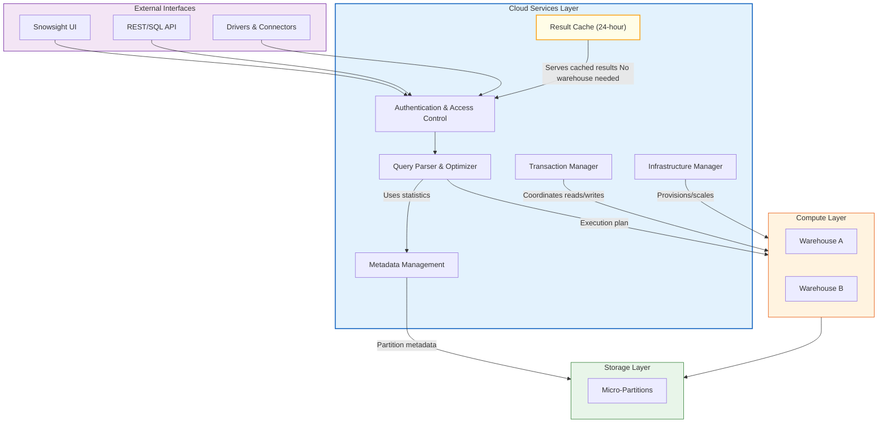

# 1.2 Cloud Services Layer

> **Key Terms**
>
> **Cloud Services Layer** — The "brain" of Snowflake; an always-on layer that coordinates authentication, metadata, query optimization, and transaction management across all accounts.
>
> **Metadata Store** — Persistent repository of statistics about micro-partitions, tables, schemas, and objects used for query pruning and optimization.
>
> **Query Optimizer** — Cost-based optimizer within cloud services that generates execution plans without requiring a running warehouse.
>
> **Result Cache** — 24-hour server-side cache of query results stored in cloud services; serves identical queries instantly with no warehouse credit cost.
>
> **Cloud Services Billing** — Credits charged for cloud services compute only when daily consumption exceeds 10% of the total daily warehouse credit usage.
>
> **Global Services** — Infrastructure management processes including automatic failover, replication coordination, and resource provisioning.
>
> **Access Control** — RBAC and DAC security model enforcement managed entirely by the cloud services layer.

---

## Overview

The **Cloud Services Layer** is the coordinating intelligence of Snowflake's multi-cluster shared data architecture. It runs continuously (always-on) regardless of whether any virtual warehouse is active, handling the critical functions that make Snowflake a fully managed service: authentication, metadata management, query compilation, transaction coordination, and security enforcement.

For the COF-C03 exam, this topic carries significant weight within Domain 1 (31% of the exam). You should be able to identify which operations are handled by cloud services versus compute or storage, explain how the result cache works and when it is invalidated, and articulate the 10% billing threshold rule. Exam questions frequently test whether candidates understand that cloud services operations such as DDL statements, metadata queries, and SHOW commands do not require a running warehouse.

Understanding the cloud services layer is also foundational for later domains — query optimization ties into Domain 4 (Performance), access control feeds into Domain 2 (Account Management and Data Governance), and metadata management connects to Domain 3 (Data Loading). Mastering this topic builds the conceptual framework for much of the exam.

---

## Cloud Services Components

| Service | Function | Exam Relevance |
|---------|----------|----------------|
| Authentication & Access Control | User login, MFA, SSO, RBAC/DAC enforcement | Know that all security is managed here, not at warehouse level |
| Metadata Management | Micro-partition statistics, table/column metadata, data lineage | Enables pruning without scanning data; no warehouse needed for SHOW commands |
| Query Optimization | Parsing SQL, cost-based optimization, plan generation | Optimizer uses metadata to minimize data scanned |
| Transaction Management | ACID compliance, read/write isolation, locking | All transactions coordinated centrally across concurrent warehouses |
| Infrastructure Management | Warehouse provisioning, auto-scaling, failover | Cloud services decides when to scale; handles node failures transparently |
| Result Cache | 24-hour storage of query results | No credits consumed; invalidated on underlying data change |
| Cloud Services Billing | Compute charges for heavy DDL/metadata workloads | Only charged when exceeding 10% of daily warehouse credits |

---

## Architecture Diagram



---

## Detailed Content

### Authentication and Access Control

All security enforcement lives in the cloud services layer. This includes:

- **User authentication** — Username/password, key-pair, OAuth, SAML/SSO, and MFA
- **Role-Based Access Control (RBAC)** — Roles granted to users, roles granted to other roles, forming a role hierarchy
- **Discretionary Access Control (DAC)** — Object owners can grant privileges on their objects
- **Network policies** — IP allow/block lists enforced before query processing begins
- **Session management** — Tracking active sessions, enforcing session policies and timeouts

Key exam point: Security is centrally managed. You cannot bypass access control by connecting through a different warehouse — the cloud services layer intercepts and authorizes every request before it reaches compute.

### Metadata Management

The metadata store is one of the most powerful components of the cloud services layer. For every micro-partition, Snowflake maintains:

- **Range min/max values** for every column (enables partition pruning)
- **Number of distinct values** per column
- **NULL counts** per column
- **Byte size and row counts** per partition
- **Clustering depth** information
- **Table-level statistics** including row counts, byte sizes, and clustering ratios

This metadata enables the optimizer to eliminate partitions that cannot contain relevant data — a process called **pruning** — without ever scanning the actual data files. When you run a `SHOW TABLES` or `DESCRIBE TABLE` command, the response comes entirely from metadata with zero warehouse involvement.

### Query Parsing, Optimization, and Compilation

Every SQL statement submitted to Snowflake passes through the cloud services layer's query processing pipeline:

1. **Parsing** — SQL text is validated for syntax and resolved against the catalog
2. **Semantic analysis** — Object references are resolved, privileges are checked
3. **Optimization** — The cost-based optimizer evaluates execution strategies using metadata statistics
4. **Plan generation** — An execution plan is produced and sent to the virtual warehouse

The optimizer makes critical decisions: join order, join strategy (hash vs. merge vs. broadcast), aggregation strategies, and which partitions to prune. These decisions happen in cloud services before any warehouse compute is consumed.

### Transaction Management (ACID Compliance)

Snowflake provides full **ACID** transaction semantics, coordinated by the cloud services layer:

| Property | Implementation |
|----------|---------------|
| **Atomicity** | Statements either fully commit or fully rollback |
| **Consistency** | Constraints and metadata always reflect committed state |
| **Isolation** | Snapshot isolation by default (read-committed); `SERIALIZABLE` available |
| **Durability** | Committed data persists in cloud storage with replication |

Transaction coordination is especially important when multiple warehouses read and write concurrently. The cloud services layer manages version control of micro-partitions to ensure readers see consistent snapshots while writers create new partitions atomically.

### Infrastructure Management

The cloud services layer acts as the orchestrator for all compute resources:

- **Warehouse provisioning** — Spins up compute nodes when a warehouse is resumed
- **Auto-suspend** — Monitors inactivity and suspends warehouses after the configured timeout
- **Auto-scale (multi-cluster)** — Adds or removes clusters based on queuing thresholds
- **Node failure recovery** — Detects failed nodes and redistributes work transparently
- **Upgrade management** — Rolling upgrades with zero downtime

### Result Cache Management

The **result cache** stores the results of queries for 24 hours within the cloud services layer. When an identical query is submitted:

1. Cloud services checks if a cached result exists
2. Verifies that underlying data has not changed (no DML on referenced tables)
3. Confirms the user has the same role/privileges
4. Returns the cached result **with no warehouse required and no credit cost**

Result cache invalidation triggers:
- Any DML (INSERT, UPDATE, DELETE, MERGE) on referenced tables
- 24-hour time expiration
- Micropartition changes from background reclustering or Time Travel expiration

Key exam facts:
- The result cache is **per-account**, not per-warehouse — any user can benefit from another user's cached query
- Queries must be **textually identical** (same SQL string, same session parameters)
- The warehouse does **not** need to be running to serve cached results

### Cloud Services Billing

Cloud services operations consume compute resources. Snowflake applies a daily adjustment:

> **The 10% Rule**: Cloud services credits are charged only when the daily cloud services consumption exceeds 10% of the total daily virtual warehouse credit consumption.

Example calculation:
- Daily warehouse credits consumed: 100 credits
- Daily cloud services credits consumed: 8 credits
- 10% threshold: 10 credits
- **Billed cloud services credits: 0** (8 < 10, below threshold)

Another example:
- Daily warehouse credits consumed: 100 credits
- Daily cloud services credits consumed: 15 credits
- 10% threshold: 10 credits
- **Billed cloud services credits: 5** (only the excess above 10 is billed: 15 - 10 = 5)

Operations that contribute to cloud services compute:
- Heavy DDL operations (CREATE, ALTER, DROP at scale)
- Cloning large objects
- Metadata-intensive operations (listing thousands of objects)
- Query recompilation
- Snowpipe file notifications and metadata management

---

## SQL Examples

### Example 1: Operations That Use Only Cloud Services (No Warehouse Needed)

```sql
-- These commands are served entirely by Cloud Services
-- No warehouse credit cost, no warehouse needs to be running

-- Metadata queries
SHOW DATABASES;
SHOW TABLES IN SCHEMA my_db.public;
DESCRIBE TABLE my_db.public.customers;

-- DDL operations
CREATE DATABASE analytics_db;
ALTER WAREHOUSE reporting_wh SET AUTO_SUSPEND = 300;
DROP TABLE IF EXISTS staging.temp_data;

-- Access control
GRANT SELECT ON ALL TABLES IN SCHEMA sales TO ROLE analyst_role;
REVOKE INSERT ON TABLE sensitive_data FROM ROLE junior_role;

-- Account-level queries
SELECT CURRENT_ACCOUNT(), CURRENT_REGION(), CURRENT_VERSION();
```

### Example 2: Observing Cloud Services Credit Usage

```sql
-- Monitor cloud services credit consumption
-- This query helps identify if you are at risk of exceeding the 10% threshold

SELECT
    warehouse_name,
    SUM(credits_used_compute) AS warehouse_credits,
    SUM(credits_used_cloud_services) AS cloud_services_credits,
    ROUND(
        SUM(credits_used_cloud_services) /
        NULLIF(SUM(credits_used_compute), 0) * 100, 2
    ) AS cloud_services_pct
FROM snowflake.account_usage.warehouse_metering_history
WHERE start_time >= DATEADD('day', -7, CURRENT_TIMESTAMP())
GROUP BY warehouse_name
ORDER BY cloud_services_credits DESC;
```

### Example 3: Result Cache in Action

```sql
-- First execution: Uses warehouse credits, result is cached
SELECT
    region,
    COUNT(*) AS order_count,
    SUM(amount) AS total_revenue
FROM sales.orders
WHERE order_date >= '2025-01-01'
GROUP BY region;

-- Second execution (identical SQL, same role, no DML on table):
-- Served from result cache — 0 credits, no warehouse needed
SELECT
    region,
    COUNT(*) AS order_count,
    SUM(amount) AS total_revenue
FROM sales.orders
WHERE order_date >= '2025-01-01'
GROUP BY region;

-- Check if your last query used the result cache
SELECT
    query_id,
    query_text,
    bytes_scanned,           -- 0 if served from result cache
    warehouse_name,          -- NULL if served from result cache
    execution_status
FROM TABLE(information_schema.query_history_by_session())
ORDER BY start_time DESC
LIMIT 5;
```

### Example 4: Metadata and Pruning Statistics

```sql
-- View how the optimizer uses metadata for pruning
-- The partition statistics are maintained by Cloud Services

SELECT
    query_id,
    partitions_scanned,
    partitions_total,
    ROUND(partitions_scanned / NULLIF(partitions_total, 0) * 100, 1) AS pct_scanned,
    bytes_scanned,
    rows_produced
FROM TABLE(information_schema.query_history())
WHERE query_text ILIKE '%orders%'
  AND partitions_total > 0
ORDER BY start_time DESC
LIMIT 10;

-- Example of a query that benefits from pruning via metadata:
-- If orders is clustered by order_date, Cloud Services metadata tells the
-- optimizer exactly which partitions contain dates in this range
SELECT * FROM sales.orders
WHERE order_date BETWEEN '2025-06-01' AND '2025-06-30';
```

---

## Layer Responsibility Comparison

| Responsibility | Cloud Services | Compute (Warehouses) | Storage |
|---------------|:-:|:-:|:-:|
| Authentication & authorization | Yes | -- | -- |
| Query parsing & optimization | Yes | -- | -- |
| Metadata management | Yes | -- | -- |
| Transaction coordination | Yes | -- | -- |
| Query execution (DML/DQL) | -- | Yes | -- |
| Data scanning & filtering | -- | Yes | -- |
| Join processing & aggregation | -- | Yes | -- |
| Result cache serving | Yes | -- | -- |
| Local disk cache (SSD) | -- | Yes | -- |
| Data persistence | -- | -- | Yes |
| Micro-partition storage | -- | -- | Yes |
| Compression & encryption at rest | -- | -- | Yes |
| Automatic clustering (background) | Yes (coordination) | Yes (execution) | Yes (storage) |
| Time Travel data retention | Yes (metadata) | -- | Yes (data) |
| Warehouse provisioning/scaling | Yes | -- | -- |
| Billing & resource monitoring | Yes | -- | -- |

---

## Exam Tips

1. **The 10% billing rule is a near-guaranteed exam question.** Know that cloud services credits are only billed when they exceed 10% of daily warehouse usage. If warehouse credits = 50 and cloud services = 4, you pay 0 for cloud services (4 < 5).

2. **No warehouse = Cloud Services only.** If a question says "warehouse is suspended" and asks if an operation can run, the answer is YES for: SHOW commands, DESCRIBE, DDL, result cache queries, access control changes.

3. **Result cache specifics to memorize:**
   - Persists for 24 hours
   - Per-account, not per-warehouse
   - Requires identical SQL text and same role context
   - Invalidated by any DML on underlying tables
   - Does NOT consume warehouse credits

4. **Metadata enables pruning.** The optimizer uses min/max range values stored in metadata to skip irrelevant partitions. This is why clustering keys matter — they improve metadata effectiveness.

5. **Cloud services handles ALL security.** Authentication, RBAC, DAC, network policies, column-level security, row access policies — all enforced in cloud services before data reaches compute.

6. **Transaction isolation is snapshot-based.** Cloud services manages versioned micro-partitions so readers see consistent snapshots even during concurrent writes.

7. **INFORMATION_SCHEMA vs ACCOUNT_USAGE.** Both are backed by cloud services metadata. INFORMATION_SCHEMA has no latency but limited retention; ACCOUNT_USAGE has up to 45-minute latency but 1-year retention.

---

## Common Misconceptions

| Misconception | Reality |
|--------------|---------|
| Cloud services only runs when a warehouse is active | Cloud services is **always on** — it operates 24/7 regardless of warehouse state |
| The result cache is per-warehouse | The result cache is **per-account** — any user with matching SQL and privileges can hit another user's cached result |
| SHOW commands require a warehouse | SHOW, DESCRIBE, and most DDL are served entirely by **cloud services metadata** |
| Cloud services credits are always billed | Only billed when exceeding **10% of daily warehouse credits** — most customers pay nothing extra |
| The query optimizer runs on the warehouse | Optimization happens in **cloud services before** the plan is sent to the warehouse |
| Suspending a warehouse stops all queries | Queries served from the **result cache** continue to work with no warehouse running |
| Metadata is stored in the compute layer | Metadata is maintained in the **cloud services layer**, separate from both compute and storage |
| Each warehouse has its own optimizer | There is **one shared optimizer** in cloud services used by all warehouses in the account |

---

## Key Takeaways

1. **The Cloud Services Layer is the brain of Snowflake** — always running, coordinating security, optimization, metadata, and transactions for the entire account.

2. **Metadata management enables partition pruning** — min/max statistics per column per micro-partition let the optimizer skip irrelevant data without scanning.

3. **The result cache serves queries for free** — 24-hour retention, no warehouse needed, invalidated only by DML on underlying tables.

4. **The 10% billing threshold** — cloud services credits are billed only when exceeding 10% of daily warehouse credit consumption.

5. **Security is centralized** — all authentication, authorization, and access policies are enforced at the cloud services level before any data reaches compute.

6. **The cost-based optimizer** uses metadata statistics to generate execution plans; this work happens in cloud services, not on warehouse compute nodes.

7. **Infrastructure management is automatic** — provisioning, scaling, failover, and upgrades are all handled by cloud services transparently.

---

## References

- [Snowflake Documentation: Overview of the Cloud Services Layer](https://docs.snowflake.com/en/user-guide/intro-key-concepts#cloud-services-layer)
- [Snowflake Documentation: Understanding Compute Cost](https://docs.snowflake.com/en/user-guide/cost-understanding-compute)
- [Snowflake Documentation: Query Result Caching](https://docs.snowflake.com/en/user-guide/querying-persisted-results)
- [Snowflake Documentation: Access Control Framework](https://docs.snowflake.com/en/user-guide/security-access-control-overview)
- [Snowflake Documentation: Transaction Management](https://docs.snowflake.com/en/sql-reference/transactions)
- [COF-C03 Exam Guide](https://learn.snowflake.com/en/certifications/snowpro-core/)

---

## Additional Exam Scenarios

**Scenario 1:** A user runs a `CREATE TABLE` DDL statement while their warehouse is suspended. Does the operation succeed?
> **Answer:** Yes. DDL operations are handled entirely by the **Cloud Services layer** and do not require a running warehouse. The warehouse is only needed for DML/DQL that scans or modifies data.

**Scenario 2:** Your cloud services bill shows 15% of your daily compute credits. How much are you actually charged for cloud services?
> **Answer:** Only **5%** (the excess above the 10% threshold). The 10% rule means the first 10% is included free — you are billed only for the portion exceeding 10%. So if warehouse credits = 100 and cloud services = 15, you pay for 15 - 10 = **5 credits**.

**Scenario 3:** A developer runs `SHOW WAREHOUSES;` and `SHOW DATABASES;` commands. Which layer processes these?
> **Answer:** The **Cloud Services layer**. All SHOW commands are metadata operations served directly from the cloud services metadata store with no warehouse involvement and no compute credit cost.

**Scenario 4:** A login attempt fails due to incorrect credentials. Which layer logs and handles this authentication failure?
> **Answer:** The **Cloud Services layer**. All authentication (login, MFA verification, SSO/SAML, key-pair auth) is managed centrally in cloud services. Failed login attempts are logged in `SNOWFLAKE.ACCOUNT_USAGE.LOGIN_HISTORY`, which is maintained by cloud services.

**Scenario 5:** A user runs `SELECT COUNT(*) FROM small_table;` on a table with 50,000 rows and gets an instant result. Why?
> **Answer:** The **metadata cache** in cloud services already knows the exact row count for each micro-partition. For small tables where the answer can be derived entirely from metadata (row counts, NULL counts), cloud services returns the result without scanning any data — this is a metadata optimization, not a result cache hit.

**Scenario 6:** Where does query optimization (choosing join strategies, pruning decisions, aggregation plans) happen — in the warehouse or elsewhere?
> **Answer:** Query optimization happens in the **Cloud Services layer**, before any execution plan is sent to the warehouse. The cost-based optimizer uses metadata statistics to determine join order, join type, partition pruning, and aggregation strategies — all in cloud services. The warehouse only executes the pre-optimized plan.

**Scenario 7:** Two concurrent warehouses modify the same table simultaneously. Which layer ensures ACID transaction guarantees?
> **Answer:** The **Cloud Services layer** manages all transaction coordination. It enforces atomicity (all-or-nothing commits), consistency (metadata always reflects committed state), isolation (snapshot isolation so readers see consistent data), and durability. The transaction manager in cloud services coordinates across all warehouses.

**Scenario 8:** Account-level encryption key rotation and management — which layer is responsible?
> **Answer:** The **Cloud Services layer**. All encryption key management (including periodic re-keying, Tri-Secret Secure composite keys, and customer-managed key integration) is coordinated by cloud services. This is part of the security and infrastructure management functions that run independently of any warehouse.

---

<p align="center">

[< Previous: 1.1 Snowflake Architecture Overview](./1.1_Snowflake_Architecture_Overview.md) | [Domain 1 README](./README.md) | [Next: 1.3 Storage Layer and Micro-Partitions >](./1.3_Storage_Layer_and_Micro_Partitions.md)

</p>

<p align="center">
  <a href="../README.md">Back to Main Study Guide</a>
</p>
