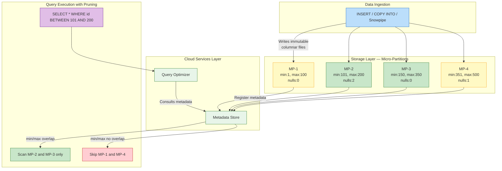

# 1.3 Storage Layer and Micro-Partitions

> **Key Terms:** **Micro-partition** | **Columnar storage** | **Pruning** | **Clustering** | **Compression** | **Clustering depth** | **Natural clustering** | **Immutability**

---

## Overview

The **storage layer** is the foundational tier of Snowflake's three-layer architecture. It is responsible for persisting all table data, query results, and metadata in a format optimized for analytical workloads. Unlike traditional databases that use row-based storage with B-tree indexes, Snowflake stores data in **micro-partitions** — small, immutable, compressed columnar files managed entirely by the Cloud Services layer.

For the COF-C03 exam, the storage layer represents one of the most frequently tested concepts within Domain 1 (31% of the exam). You must understand the physical characteristics of micro-partitions (size ranges, immutability, columnar format), how metadata enables **query pruning** without traditional indexes, and when explicit clustering provides value. Expect questions that test whether you know the difference between natural clustering and CLUSTER BY, how Snowflake achieves compression, and what metrics you can query to evaluate clustering effectiveness.

The storage layer is cloud-managed and decoupled from compute. This means data is stored independently in the cloud provider's object storage (S3, Azure Blob, or GCS), and any virtual warehouse can read from it concurrently. You pay for storage based on compressed data size, not raw data size — making Snowflake's columnar compression directly relevant to cost optimization.

---

## Characteristics

| Feature | Detail | Exam Relevance |
|---------|--------|----------------|
| Partition size | 50–500 MB of uncompressed data per micro-partition | Exact range tested frequently |
| Storage format | Columnar (PAX hybrid) | Enables projection pushdown and pruning |
| Immutability | Micro-partitions are never updated in place | Key to Time Travel and zero-copy clones |
| Compression | Automatic; typically 4:1 to 5:1 ratio | Billing is on compressed size |
| Metadata per partition | Min/max values, null count, distinct count per column | Powers pruning without indexes |
| Metadata size | Up to 16 MB per column section per micro-partition | Occasionally tested |
| Clustering | Natural (insert order) or explicit (CLUSTER BY) | Know when each applies |
| Storage pricing | On-demand ($40/TB/month) or capacity ($23/TB/month) | Varies by edition and region |
| Data retention | Supports Time Travel (1–90 days) + Fail-safe (7 days) | Impacts total storage cost |

---

## Architecture Diagram



---

## Detailed Content

### Micro-Partition Fundamentals

Every table in Snowflake is automatically divided into **micro-partitions**. These are contiguous units of storage containing between **50 and 500 MB of uncompressed data**. After compression, a typical micro-partition is 10–100 MB on disk. Key properties:

- **Immutable**: Once written, a micro-partition is never modified. DML operations (INSERT, UPDATE, DELETE, MERGE) create new micro-partitions and mark old ones as deleted.
- **Automatic**: Snowflake determines partitioning boundaries — users cannot manually define partition boundaries or control partition sizing.
- **Columnar**: Data within each micro-partition is stored in a columnar format, meaning all values for a single column are stored contiguously. This enables highly efficient compression and allows Snowflake to read only the columns referenced in a query (projection pushdown).
- **Self-describing**: Each micro-partition contains a header with metadata about its contents, eliminating the need for external index structures.

The immutability property is essential for understanding Time Travel and cloning. When you clone a table, Snowflake simply creates new metadata pointers to the same micro-partitions — no data is copied. When Time Travel undoes an operation, Snowflake references the previous set of micro-partitions.

### Columnar Storage Benefits

Snowflake's columnar format provides three primary advantages:

1. **Compression**: Values in a single column share a data type and often have similar distributions. Snowflake applies encoding schemes (dictionary encoding, run-length encoding, delta encoding) per column, achieving typical **4:1 to 5:1 compression ratios**. Highly repetitive columns (status codes, boolean flags) can exceed 10:1.

2. **Pruning**: Because metadata tracks min/max values per column per micro-partition, Snowflake can skip entire partitions when a query's WHERE clause has no overlap with a partition's value range. This eliminates I/O at the partition level without requiring indexes.

3. **Projection**: Queries that reference a subset of columns only read those columns from storage. A `SELECT name, email FROM users` reads only the `name` and `email` column sections, ignoring potentially dozens of other columns.

### Metadata Stored Per Micro-Partition

The Cloud Services layer maintains rich metadata for every micro-partition, storing up to **16 MB of metadata per column section per micro-partition**. This metadata includes:

| Metadata Type | Purpose | Used For |
|--------------|---------|----------|
| Min/max values | Range of values in the column | Partition pruning |
| Null count | Number of NULL values | Optimizing NULL predicates |
| Distinct value count | Approximate cardinality | Query optimization |
| Number of rows | Row count in the partition | Aggregation optimization |
| Byte size (compressed/uncompressed) | Storage metrics | Billing and monitoring |

This metadata is maintained automatically by the Cloud Services layer with zero user intervention and no additional cost beyond standard Cloud Services usage.

### Data Pruning

**Pruning** (also called partition elimination) is Snowflake's primary mechanism for reducing I/O. Unlike traditional databases that rely on indexes (B-tree, bitmap), Snowflake uses micro-partition metadata to determine which partitions can be skipped entirely.

The pruning process:
1. The query optimizer examines filter predicates (WHERE, JOIN conditions)
2. It compares predicate values against min/max metadata for each micro-partition
3. Partitions where the predicate range has **no overlap** with the stored range are skipped
4. Only partitions with potential matches are scanned

Pruning is most effective when:
- Filter columns have data that is **naturally ordered** (timestamps, sequential IDs)
- The filter uses range predicates (BETWEEN, <, >, =)
- Data within micro-partitions has **low overlap** across partitions for the filtered column

Pruning is less effective when:
- Data is randomly distributed across partitions for the filtered column
- Predicates use functions that prevent range comparison (e.g., `SUBSTR(col, 1, 3) = 'ABC'`)
- The table has very few micro-partitions (small tables)

### Natural Clustering vs Explicit CLUSTER BY

**Natural clustering** occurs automatically based on the order data is inserted. If you load data chronologically (most common for event/transaction data), the `timestamp` column will naturally have minimal overlap across micro-partitions — early timestamps in early partitions, later timestamps in later partitions. This provides excellent pruning on time-based queries with no additional effort.

**Explicit clustering** using `CLUSTER BY` is a maintenance operation where Snowflake's Automatic Clustering service reorganizes micro-partitions in the background to improve data locality for specified columns. This is only needed when:

- Queries frequently filter on columns that are NOT the natural insertion order
- Tables are very large (multi-TB) with significant overlap in commonly filtered columns
- Query performance analysis shows poor pruning efficiency

Clustering is a **paid service** — Automatic Clustering consumes serverless compute credits. It should only be applied after verifying that natural clustering is insufficient.

### Clustering Depth and Monitoring

**Clustering depth** measures how well data is organized for pruning on a given set of columns. A clustering depth of 1 means each micro-partition's value ranges are perfectly non-overlapping. Higher values indicate more overlap and less effective pruning.

You can monitor clustering using:
- `SYSTEM$CLUSTERING_INFORMATION('table_name', '(column_list)')` — returns clustering depth, overlap metrics, and partition statistics
- `SYSTEM$CLUSTERING_DEPTH('table_name', '(column_list)')` — returns just the average depth number
- Query Profile in Snowsight — shows partitions scanned vs. total partitions

### Storage Costs

Storage billing is based on the **compressed size** of data stored, including:
- Active data in tables
- Time Travel data (retained for 1–90 days depending on edition and configuration)
- Fail-safe data (7 days, not configurable, Enterprise edition and above)

Pricing models:
- **On-demand**: ~$40/TB/month (no upfront commitment)
- **Capacity**: ~$23/TB/month (pre-purchased, varies by region and commitment term)

Because Snowflake bills on compressed size and achieves 4:1 to 5:1 ratios, 1 TB of raw data typically costs the equivalent of 200–250 GB of storage.

---

## SQL Examples

### Example 1: Check Clustering Information for a Table

```sql
-- Returns clustering depth, average overlap, and partition statistics
-- for the specified columns on the given table
SELECT SYSTEM$CLUSTERING_INFORMATION('sales.public.orders', '(order_date)');

-- Example output (JSON):
-- {
--   "cluster_by_keys": "LINEAR(order_date)",
--   "total_partition_count": 1250,
--   "total_constant_partition_count": 980,
--   "average_overlaps": 1.5,
--   "average_depth": 2.1,
--   "partition_depth_histogram": { "00001": 780, "00002": 320, "00003": 150 }
-- }
```

### Example 2: Add Explicit Clustering to a Table

```sql
-- Apply clustering on a large table where queries frequently filter
-- by region and order_date but data was loaded in random order
ALTER TABLE sales.public.orders
  CLUSTER BY (region, order_date);

-- Verify clustering key is set
SHOW TABLES LIKE 'orders' IN SCHEMA sales.public;

-- Note: Automatic Clustering will begin reorganizing in the background.
-- This consumes serverless compute credits.
```

### Example 3: Query Table Storage Metrics

```sql
-- View storage breakdown including active, Time Travel, and Fail-safe bytes
SELECT
    table_name,
    active_bytes / POWER(1024, 3) AS active_gb,
    time_travel_bytes / POWER(1024, 3) AS time_travel_gb,
    failsafe_bytes / POWER(1024, 3) AS failsafe_gb,
    (active_bytes + time_travel_bytes + failsafe_bytes) / POWER(1024, 3) AS total_gb
FROM snowflake.account_usage.table_storage_metrics
WHERE table_name = 'ORDERS'
  AND table_catalog = 'SALES'
ORDER BY total_gb DESC;
```

### Example 4: Evaluate Pruning Efficiency from Query Profile

```sql
-- Run a query and inspect the profile for partition pruning stats
SELECT COUNT(*)
FROM sales.public.orders
WHERE order_date BETWEEN '2024-01-01' AND '2024-01-31';

-- After execution, check:
-- Query Profile > TableScan operator shows:
--   "Partitions scanned: 45"
--   "Partitions total: 1250"
-- This means 96.4% of partitions were pruned (skipped)
```

### Example 5: Check Clustering Depth (Simplified)

```sql
-- Returns a single numeric value representing average clustering depth
SELECT SYSTEM$CLUSTERING_DEPTH('sales.public.orders', '(order_date, region)');

-- A value close to 1 = well-clustered (minimal overlap)
-- A value > 5 for a large table = consider adding CLUSTER BY
```

---

## Comparison: Micro-Partitions vs Traditional Approaches

| Aspect | Snowflake Micro-Partitions | Traditional Partitions (Oracle/Postgres) | Traditional Indexes (B-Tree) |
|--------|---------------------------|----------------------------------------|------------------------------|
| Creation | Automatic — no DDL required | Manual — requires PARTITION BY clause | Manual — CREATE INDEX |
| Maintenance | Zero maintenance (immutable) | Requires rebalancing, splitting | Index rebuilds, bloat management |
| Size control | Snowflake determines (50–500 MB) | User-defined boundaries | Grows with data |
| Pruning mechanism | Min/max metadata per column | Partition elimination by key | Index seek + lookup |
| Column flexibility | Metadata exists for ALL columns | Only the partition key column | Only indexed columns |
| DML overhead | New partitions written (append-only) | In-place updates, lock contention | Index maintenance on every write |
| Storage overhead | Minimal (just metadata) | Partition metadata | Significant (index = ~20-30% of data) |
| Schema changes | No impact on partitions | May require reorganization | May require index rebuilds |
| Concurrency | No contention (immutable files) | Lock-based concurrency | Index lock contention |

---

## Exam Tips

1. **Memorize the size range**: Micro-partitions contain **50–500 MB of uncompressed data**. This is the most commonly tested fact about the storage layer.

2. **Immutability is fundamental**: Every DML creates NEW micro-partitions. No partition is ever modified in place. This enables Time Travel, zero-copy cloning, and lock-free concurrency.

3. **No user-created indexes**: Snowflake does not support B-tree or bitmap indexes. If an exam question mentions creating an index for performance, it is likely a distractor — the correct answer involves clustering or query restructuring.

4. **Pruning works on ALL columns**: Unlike traditional partitions (which only prune on the partition key), Snowflake maintains metadata for every column in every micro-partition. Any column can benefit from pruning.

5. **CLUSTER BY is not partitioning**: CLUSTER BY does NOT create user-defined partitions. It instructs Automatic Clustering to reorganize micro-partitions for better data locality on specified columns. The micro-partition structure remains the same.

6. **Natural clustering first**: Always check if natural insertion order already provides good clustering before adding explicit CLUSTER BY. Use `SYSTEM$CLUSTERING_INFORMATION` to evaluate.

7. **Storage billing**: You are billed on **compressed** data size. Time Travel and Fail-safe storage add to the bill. Transient and temporary tables have reduced Time Travel (0–1 day) and NO Fail-safe.

8. **Metadata size**: Up to **16 MB per column section per micro-partition** for metadata. This is maintained by Cloud Services with no user action.

---

## Common Misconceptions

| Misconception | Reality | Why It Matters |
|--------------|---------|----------------|
| "Micro-partitions are like Oracle partitions" | Micro-partitions are automatic, immutable, and based on file size — not user-defined key ranges | Exam distractors use traditional partition terminology |
| "You can manually control partition boundaries" | Snowflake fully manages partition sizing and boundaries; users have zero control | Eliminates traditional DBA partition management tasks |
| "CLUSTER BY creates partitions on a key" | CLUSTER BY reorganizes existing micro-partitions for better locality; it does not change the partition mechanism | Common trap question comparing to PARTITION BY in other systems |
| "You need indexes for fast queries" | Snowflake uses metadata-driven pruning instead of indexes; no index DDL exists | Any answer mentioning CREATE INDEX is wrong |
| "Larger warehouses improve pruning" | Pruning happens in Cloud Services (metadata check) before compute is involved; warehouse size is irrelevant to pruning | Separates compute optimization from storage optimization |
| "All columns must be in CLUSTER BY for pruning" | Pruning works on ANY column with good natural clustering regardless of CLUSTER BY | CLUSTER BY just improves clustering for specific columns |
| "Compression ratio is configurable" | Compression is automatic; Snowflake selects optimal encoding per column | No user-facing compression settings exist |
| "Updating one row rewrites the whole table" | Only the affected micro-partition(s) are rewritten as new versions | Scope of DML impact is partition-level, not table-level |

---

## Key Takeaways

1. **Micro-partitions are 50–500 MB uncompressed**, automatically created, immutable columnar files — the fundamental unit of Snowflake storage.

2. **Pruning replaces indexes** — Snowflake maintains min/max, null count, and distinct count metadata per column per micro-partition, enabling partition skipping on any column.

3. **Immutability enables Time Travel and cloning** — because partitions are never modified, previous versions remain accessible and clones share partitions without copying data.

4. **Natural clustering is free; explicit clustering costs credits** — data inserted in order (e.g., by timestamp) naturally clusters well. Use `SYSTEM$CLUSTERING_INFORMATION` to assess before adding CLUSTER BY.

5. **Storage is billed on compressed size** — typical 4:1 to 5:1 compression means you pay for roughly 20–25% of raw data volume.

6. **All columns benefit from metadata** — unlike traditional partitioning (one key) or indexes (only indexed columns), Snowflake's metadata covers every column in the table.

7. **Clustering depth measures pruning potential** — values near 1 are optimal; values above 5 on large, frequently-queried tables suggest CLUSTER BY may help.

---

## References

- [Snowflake Documentation: Micro-Partitions & Data Clustering](https://docs.snowflake.com/en/user-guide/tables-clustering-micropartitions)
- [Snowflake Documentation: Automatic Clustering](https://docs.snowflake.com/en/user-guide/tables-auto-reclustering)
- [Snowflake Documentation: SYSTEM$CLUSTERING_INFORMATION](https://docs.snowflake.com/en/sql-reference/functions/system_clustering_information)
- [Snowflake Documentation: Understanding Storage Costs](https://docs.snowflake.com/en/user-guide/cost-understanding-overall#storage-costs)
- [Snowflake Documentation: Table Storage Metrics](https://docs.snowflake.com/en/sql-reference/account-usage/table_storage_metrics)
- [SnowPro Core COF-C03 Study Guide](https://learn.snowflake.com/en/certifications/snowpro-core/)

---

## Additional Exam Scenarios

**Scenario 1:** A table has 1 billion rows. You run a query with a WHERE clause on a non-clustered column. Will partition pruning help?
> **Answer:** It **depends on natural ordering**. If the column's values happen to be naturally ordered (e.g., data was loaded in a sequence that correlates with that column), pruning can still be effective because min/max ranges won't overlap much. However, if the column values are randomly distributed across micro-partitions, pruning will be minimal — the optimizer will see overlapping ranges and must scan most partitions. Check with `SYSTEM$CLUSTERING_INFORMATION` to evaluate.

**Scenario 2:** You run `SYSTEM$CLUSTERING_INFORMATION` and see `average_depth = 50`. Is this good or bad?
> **Answer:** This is **bad** — it indicates very poor clustering. A clustering depth of 50 means that on average, 50 micro-partitions have overlapping value ranges for the clustering key columns. Ideal depth is close to 1 (minimal overlap). A depth of 50 on a frequently-queried table strongly suggests adding an explicit `CLUSTER BY` on the columns used in filter predicates.

**Scenario 3:** After DML operations (INSERT, UPDATE, DELETE), does Snowflake automatically recluster the affected micro-partitions?
> **Answer:** Only if **Automatic Clustering** is enabled (i.e., a `CLUSTER BY` key is defined on the table). DML creates new micro-partitions that may not align with the clustering order. If Automatic Clustering is active, Snowflake's serverless background service will eventually reorganize the new partitions — but this is not instant and consumes serverless credits. Without a defined clustering key, no reclustering occurs; data stays in natural insertion order.

**Scenario 4:** A column has only 2 distinct values (e.g., `is_active = TRUE/FALSE`). Would it make a good clustering key?
> **Answer:** **No** — the cardinality is too low. With only 2 distinct values, Snowflake can at best divide data into 2 groups, but micro-partition min/max metadata already captures this with minimal benefit. Effective clustering keys should have **medium to high cardinality** (hundreds to millions of distinct values) so that min/max ranges within each micro-partition are narrow and non-overlapping. Very low cardinality provides almost no pruning improvement.

**Scenario 5:** Can you directly query or access micro-partition metadata (min/max values, null counts)?
> **Answer:** **No** — micro-partition metadata is internal to Snowflake and not directly queryable as a table. You can only observe its effects through: (1) `SYSTEM$CLUSTERING_INFORMATION` for clustering statistics, (2) Query Profile showing partitions scanned vs. total, and (3) `SYSTEM$CLUSTERING_DEPTH` for depth metrics. The actual min/max values per partition per column are not exposed to users.

**Scenario 6:** Does INSERT vs COPY INTO differ in how they affect table clustering?
> **Answer:** **Both create new micro-partitions** in the same way — there is no fundamental difference in clustering impact. Whether you use INSERT, COPY INTO, or Snowpipe, Snowflake writes data into new immutable micro-partitions based on the order data arrives. The clustering quality depends on the order of the incoming data, not the ingestion method. If data arrives sorted (e.g., chronologically), both methods produce well-clustered partitions.

**Scenario 7:** A table is 100 GB (compressed) and has approximately 500 micro-partitions. Is this a normal ratio?
> **Answer:** **Yes**, this is within normal range. Each micro-partition holds 50–500 MB of uncompressed data, and after compression (typically 4:1 to 5:1), partitions are roughly 10–100 MB on disk. With 500 partitions at 100 GB total = ~200 MB compressed per partition, which implies roughly 800 MB–1 GB uncompressed per partition. This is slightly above the documented 500 MB max — however, the 50–500 MB range is for uncompressed data, so this arithmetic is approximate and falls within expected bounds.

**Scenario 8:** What determines the compression ratio Snowflake achieves on a table?
> **Answer:** Compression ratio depends on: (1) **Data type** — numeric types often compress better than variable-length strings; (2) **Cardinality** — columns with few distinct values (status codes, country codes) achieve higher compression via dictionary encoding; (3) **Repetition patterns** — sorted or repetitive data benefits from run-length encoding and delta encoding; (4) **NULL density** — NULLs compress extremely well. Snowflake automatically selects the optimal encoding per column — users cannot configure compression settings.

---

<p align="center">

**[< Previous: 1.2 Cloud Services Layer](./1.2_Cloud_Services_Layer.md)** | **[Domain 1 README](./README.md)** | **[Next: 1.4 Virtual Warehouses and Compute >](./1.4_Virtual_Warehouses_and_Compute.md)**

</p>

<p align="center">
  <a href="../README.md">Back to Main Study Guide</a>
</p>
