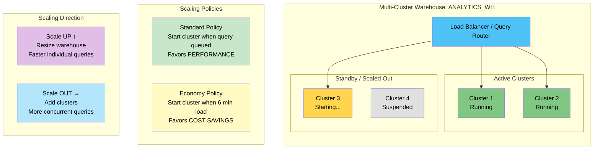

# 1.4 Virtual Warehouses and Compute

> **Key Terms:** **Virtual Warehouse** — an MPP compute cluster that executes queries and DML | **Multi-cluster Warehouse** — a warehouse that can scale out to multiple clusters (Enterprise Edition+) | **Scaling Policy** — rules governing when clusters are started/stopped (Standard or Economy) | **Credit** — the unit of billing for compute resources (1 credit = 1 X-Small cluster/hour) | **Auto-suspend** — automatic shutdown of a warehouse after a period of inactivity | **Auto-resume** — automatic startup of a suspended warehouse when a query is submitted

---

## Overview

The **compute layer** in Snowflake consists of virtual warehouses — independent MPP (Massively Parallel Processing) clusters of compute nodes provisioned from the underlying cloud provider. Unlike traditional databases where compute and storage are tightly coupled, Snowflake's architecture allows warehouses to be created, resized, suspended, and resumed independently of data storage. Multiple warehouses can access the same data simultaneously without contention.

For the COF-C03 exam, virtual warehouses represent one of the most heavily tested areas within Domain 1. You must understand the credit consumption model (doubling pattern), the difference between scaling up (resizing) versus scaling out (multi-cluster), billing mechanics (per-second with a 60-second minimum), and the behavioral differences between Standard and Economy scaling policies.

Expect questions on warehouse parameters (auto-suspend defaults, auto-resume behavior), multi-cluster requirements (Enterprise Edition or higher), and scenarios where you must choose between resizing a warehouse versus adding clusters. The exam also tests your understanding of concurrency, query queuing, and how warehouse operations affect running queries.

---

## Warehouse Sizes and Credit Consumption

| Size | Credits/Hour | Nodes | Relative Performance |
|------|:------------:|:-----:|---------------------|
| X-Small (XS) | 1 | 1 | Baseline |
| Small (S) | 2 | 2 | 2x |
| Medium (M) | 4 | 4 | 4x |
| Large (L) | 8 | 8 | 8x |
| X-Large (XL) | 16 | 16 | 16x |
| 2X-Large (2XL) | 32 | 32 | 32x |
| 3X-Large (3XL) | 64 | 64 | 64x |
| 4X-Large (4XL) | 128 | 128 | 128x |
| 5X-Large (5XL) | 256 | 256 | 256x |
| 6X-Large (6XL) | 512 | 512 | 512x |

> **Exam Pattern:** Each size increase **doubles** the credits per hour and the number of compute nodes. A 2X-Large warehouse costs 32 credits/hour — the same as running 32 X-Small warehouses simultaneously.

---

## Multi-Cluster Warehouse Architecture



---

## Detailed Content

### Warehouse Sizes and Credit Consumption

Every virtual warehouse is assigned a **T-shirt size** that determines its compute capacity and cost. The fundamental rule is that **credits double with each size increase**. An X-Small warehouse consumes 1 credit per hour; a Small consumes 2; a Medium consumes 4, and so on up to 6X-Large at 512 credits per hour.

Larger warehouses do not make queries run faster in all cases. Warehouse size primarily benefits queries that can leverage parallelism — large table scans, complex joins, and aggregations over billions of rows. Simple point lookups or metadata operations gain little from a larger warehouse. The exam may present scenarios asking which size is appropriate for a given workload pattern.

When a warehouse is **resized while running**, the change takes effect for the next query. Running queries continue with their current resources. No queries are cancelled or restarted due to a resize operation.

### Auto-Suspend and Auto-Resume

**Auto-suspend** shuts down a warehouse after a specified period of inactivity (no running or queued queries). The default auto-suspend timeout is **600 seconds (10 minutes)** for warehouses created via the UI and can be set to 0 (immediately suspend when idle) or any value in seconds via SQL.

**Auto-resume** is enabled by default and automatically starts a suspended warehouse when any query is routed to it. The user experiences a brief delay (typically a few seconds) while the warehouse provisions.

Best practices for auto-suspend:
- **ETL/batch warehouses**: Set to 60 seconds (1 minute) or even 0 — these have predictable workloads
- **BI/interactive warehouses**: Set to 300-600 seconds — avoids frequent cold starts during interactive sessions
- **DevOps/CI warehouses**: Set to 60 seconds — minimizes idle costs between pipeline steps

**Billing implication**: A warehouse that auto-suspends and auto-resumes within the same 60-second billing window is charged for one 60-second minimum upon resume, not a continuation of the prior session. This means rapidly toggling a warehouse can waste credits.

### Multi-Cluster Warehouses

**Multi-cluster warehouses** are an **Enterprise Edition** (or higher) feature that allows a single warehouse to automatically scale out to multiple clusters of the same size when concurrency demands increase.

Configuration parameters:
- **MIN_CLUSTER_COUNT**: The minimum number of clusters always running (default: 1)
- **MAX_CLUSTER_COUNT**: The maximum number of clusters the warehouse can scale to (1-10)
- **SCALING_POLICY**: Determines when additional clusters start and stop

When `MIN_CLUSTER_COUNT = MAX_CLUSTER_COUNT`, the warehouse operates in **Maximized mode** — all clusters run constantly. This eliminates cold-start latency but consumes credits continuously.

When `MIN_CLUSTER_COUNT < MAX_CLUSTER_COUNT`, the warehouse operates in **Auto-scale mode** — clusters are added and removed based on load and the chosen scaling policy.

Each cluster in a multi-cluster warehouse consumes the full credit rate for the warehouse size. A Medium multi-cluster warehouse running 3 clusters consumes 4 x 3 = 12 credits/hour.

### Scaling Policies: Standard vs Economy

The **Standard scaling policy** (default) favors performance:
- Starts an additional cluster as soon as a query is queued (or estimated to queue)
- Shuts down a cluster after 2-3 consecutive checks (about 2-3 minutes) showing reduced load
- Best for workloads where response time is critical

The **Economy scaling policy** favors cost reduction:
- Starts an additional cluster only after the system estimates at least 6 minutes of query load waiting
- Shuts down a cluster after 5-6 consecutive checks (about 5-6 minutes) showing reduced load
- Best for workloads that can tolerate brief queuing

### Warehouse Utilization and Concurrency

Snowflake does not impose a hard concurrency limit on a single warehouse cluster. However, when a warehouse has insufficient resources to execute all submitted queries simultaneously, queries enter a **queue**. Queued queries wait until resources free up or (in multi-cluster warehouses) a new cluster starts.

If a query waits longer than the **STATEMENT_QUEUED_TIMEOUT_IN_SECONDS** parameter (default: 0, meaning no timeout), it is cancelled. This parameter can be set at the session or account level.

Key concurrency considerations:
- More complex queries consume more resources, reducing effective concurrency
- Simple queries (small result sets, pruned partitions) have higher natural concurrency
- Multi-cluster warehouses address concurrency by distributing queries across clusters — they do NOT parallelize a single query across clusters

### CREATE WAREHOUSE Syntax and Key Parameters

```sql
CREATE [ OR REPLACE ] WAREHOUSE [ IF NOT EXISTS ] <name>
  [ WITH ]
  WAREHOUSE_SIZE = 'XSMALL' | 'SMALL' | 'MEDIUM' | 'LARGE' | 'XLARGE' |
                   '2XLARGE' | '3XLARGE' | '4XLARGE' | '5XLARGE' | '6XLARGE'
  AUTO_SUSPEND = <seconds>
  AUTO_RESUME = TRUE | FALSE
  MIN_CLUSTER_COUNT = <num>
  MAX_CLUSTER_COUNT = <num>
  SCALING_POLICY = 'STANDARD' | 'ECONOMY'
  INITIALLY_SUSPENDED = TRUE | FALSE
  COMMENT = '<string>';
```

Key default values:
- `WAREHOUSE_SIZE`: X-Small
- `AUTO_SUSPEND`: 600 (seconds)
- `AUTO_RESUME`: TRUE
- `MIN_CLUSTER_COUNT`: 1
- `MAX_CLUSTER_COUNT`: 1 (single cluster by default)
- `SCALING_POLICY`: STANDARD
- `INITIALLY_SUSPENDED`: FALSE

### ALTER WAREHOUSE Operations

You can resize, suspend, and resume warehouses at any time:
- **Resize**: Changes take effect for the next query; running queries are not affected
- **Suspend**: Completes running queries, then shuts down. No new queries are accepted once SUSPEND is issued
- **Resume**: Starts the warehouse, making it available for queries. Happens automatically if AUTO_RESUME = TRUE
- **Abort all queries**: `ALTER WAREHOUSE ... ABORT ALL QUERIES` cancels running statements

### Billing: Per-Second with 60-Second Minimum

Snowflake bills compute on a **per-second basis** with a **60-second minimum** each time a warehouse starts (or resumes). Key billing facts:

- A warehouse running for 61 seconds is billed for 61 seconds
- A warehouse running for 30 seconds is billed for 60 seconds (the minimum)
- Billing starts when the warehouse starts and ends when it fully suspends
- Each cluster in a multi-cluster warehouse is billed independently with its own 60-second minimum
- Resizing does not restart the billing clock; the new rate applies from the resize moment
- Credits are billed at the rate for the cloud provider and region

---

## SQL Examples

### Example 1: Create a Standard Analytics Warehouse

```sql
CREATE OR REPLACE WAREHOUSE analytics_wh
  WAREHOUSE_SIZE = 'LARGE'
  AUTO_SUSPEND = 300
  AUTO_RESUME = TRUE
  INITIALLY_SUSPENDED = TRUE
  COMMENT = 'BI team interactive analytics';
```

### Example 2: Create a Multi-Cluster Warehouse with Economy Scaling

```sql
CREATE OR REPLACE WAREHOUSE reporting_wh
  WAREHOUSE_SIZE = 'MEDIUM'
  MIN_CLUSTER_COUNT = 1
  MAX_CLUSTER_COUNT = 4
  SCALING_POLICY = 'ECONOMY'
  AUTO_SUSPEND = 120
  AUTO_RESUME = TRUE
  COMMENT = 'Reporting with economy scaling - tolerates brief queuing';
```

### Example 3: Resize and Modify a Running Warehouse

```sql
-- Scale up for a heavy ETL job
ALTER WAREHOUSE etl_wh SET WAREHOUSE_SIZE = 'XLARGE';

-- After job completes, scale back down
ALTER WAREHOUSE etl_wh SET WAREHOUSE_SIZE = 'SMALL';

-- Change auto-suspend to be more aggressive
ALTER WAREHOUSE etl_wh SET AUTO_SUSPEND = 60;
```

### Example 4: Suspend, Resume, and Query Warehouse Status

```sql
-- Manually suspend a warehouse
ALTER WAREHOUSE dev_wh SUSPEND;

-- Resume when needed
ALTER WAREHOUSE dev_wh RESUME;

-- Check warehouse state and size
SHOW WAREHOUSES LIKE 'dev_wh';

-- Detailed warehouse usage
SELECT *
FROM SNOWFLAKE.ACCOUNT_USAGE.WAREHOUSE_METERING_HISTORY
WHERE WAREHOUSE_NAME = 'DEV_WH'
  AND START_TIME >= DATEADD('day', -7, CURRENT_TIMESTAMP())
ORDER BY START_TIME DESC;
```

### Example 5: Resource Monitor for Credit Control

```sql
-- Create a resource monitor with credit quota
CREATE OR REPLACE RESOURCE MONITOR monthly_compute_monitor
  WITH CREDIT_QUOTA = 5000
  FREQUENCY = MONTHLY
  START_TIMESTAMP = IMMEDIATELY
  TRIGGERS
    ON 75 PERCENT DO NOTIFY
    ON 90 PERCENT DO NOTIFY
    ON 100 PERCENT DO SUSPEND;

-- Assign to a warehouse
ALTER WAREHOUSE analytics_wh
  SET RESOURCE_MONITOR = monthly_compute_monitor;
```

### Example 6: Multi-Cluster Maximized Mode

```sql
-- All 3 clusters always running (no auto-scale)
CREATE OR REPLACE WAREHOUSE high_concurrency_wh
  WAREHOUSE_SIZE = 'SMALL'
  MIN_CLUSTER_COUNT = 3
  MAX_CLUSTER_COUNT = 3
  AUTO_SUSPEND = 600
  AUTO_RESUME = TRUE
  COMMENT = 'Maximized mode - 3 clusters always active';
```

---

## Comparison Tables

### Standard vs Economy Scaling Policy

| Aspect | Standard (Default) | Economy |
|--------|-------------------|---------|
| Cluster start trigger | Query queued or estimated to queue | ~6 minutes of estimated queuing |
| Cluster shutdown delay | 2-3 minutes of reduced load | 5-6 minutes of reduced load |
| Optimizes for | Performance / low latency | Cost savings |
| Best for | Interactive BI, dashboards | Batch reporting, cost-sensitive |
| Queuing tolerance | Minimal | Moderate (users may wait) |
| Default? | Yes | No |

### Scale Up vs Scale Out

| Decision Factor | Scale UP (Resize) | Scale OUT (Multi-Cluster) |
|----------------|-------------------|---------------------------|
| Problem | Individual queries too slow | Too many concurrent queries |
| Action | Increase warehouse size | Increase MAX_CLUSTER_COUNT |
| Effect | More compute per query | More queries run in parallel |
| Requirement | Any edition | Enterprise Edition+ |
| Single query speed | Improves (more parallelism) | No change (1 query = 1 cluster) |
| Concurrency | No change | Improves |
| Cost pattern | Higher rate, same duration | Same rate per cluster x N clusters |

---

## Exam Tips

1. **60-second minimum billing** is a frequently tested fact. If a warehouse runs for 5 seconds, you are billed for 60 seconds. This applies per startup event.

2. **Multi-cluster warehouses require Enterprise Edition** or higher. Standard Edition warehouses are always single-cluster. The exam tests this distinction.

3. **Default auto-suspend is 600 seconds (10 minutes)** when created via the UI. Know this default value.

4. **Resizing does NOT cancel running queries** — this is a common trap question. Resize takes effect for the *next* query only.

5. **Credits double per size** — memorize the pattern. If a question says "X-Large costs 16 credits/hour," you should immediately know 2X-Large = 32, Large = 8, etc.

6. **Standard scaling policy is the default** and starts clusters proactively. Economy waits until queuing is sustained (~6 minutes).

7. **A single query cannot span multiple clusters** in a multi-cluster warehouse. Multi-cluster helps concurrency, not individual query speed.

8. **Maximized mode**: MIN_CLUSTER_COUNT = MAX_CLUSTER_COUNT. All clusters always run. No auto-scaling occurs.

9. **AUTO_RESUME = TRUE is the default**. A suspended warehouse automatically starts when a query arrives. Know that users experience a brief delay during resume.

10. **INITIALLY_SUSPENDED** creates a warehouse in the suspended state — no credits consumed until the first query arrives.

---

## Common Misconceptions

| Misconception | Reality |
|---------------|---------|
| Resizing a warehouse restarts running queries | **No.** Running queries complete with existing resources. New size applies to next query. |
| Multi-cluster warehouses make individual queries faster | **No.** They increase concurrency by running more queries in parallel across clusters. Scale UP for faster individual queries. |
| Auto-suspend = 0 means the warehouse never suspends | **No.** Auto-suspend = 0 means suspend immediately when idle (no running/queued queries). |
| Larger warehouses always run queries faster | **No.** Only queries that benefit from parallelism improve. Simple metadata operations, small lookups, and queries served from cache see no benefit. |
| Multi-cluster is available on all editions | **No.** Enterprise Edition or higher is required for multi-cluster (MAX_CLUSTER_COUNT > 1). |
| Credits consumed are based on queries running | **No.** Credits are consumed from the moment a warehouse starts until it suspends, regardless of whether queries are active. Idle running warehouses still cost credits. |
| Suspending a warehouse loses its local cache | **Yes, this one is TRUE.** Suspending clears the local SSD cache. This is NOT a misconception — it is correct behavior many candidates get wrong. |

---

## Key Takeaways

1. **Credits double with each warehouse size increase** — X-Small (1) through 6X-Large (512), always powers of 2.

2. **Billing is per-second with a 60-second minimum** per startup event. Each cluster in a multi-cluster warehouse incurs its own 60-second minimum independently.

3. **Scale UP (resize) for faster queries; Scale OUT (multi-cluster) for higher concurrency** — these solve fundamentally different problems.

4. **Multi-cluster warehouses require Enterprise Edition** and support 1-10 clusters with either Standard (performance-first) or Economy (cost-first) scaling policies.

5. **Auto-suspend defaults to 600 seconds; auto-resume defaults to TRUE** — a suspended warehouse starts automatically on query arrival.

6. **Resizing a warehouse never affects running queries** — changes apply only to subsequent queries.

7. **Resource monitors** control credit consumption with notification and suspension triggers, providing governance over warehouse spending.

---

## References

- [Snowflake Documentation: Virtual Warehouses](https://docs.snowflake.com/en/user-guide/warehouses)
- [Snowflake Documentation: Warehouse Considerations](https://docs.snowflake.com/en/user-guide/warehouses-considerations)
- [Snowflake Documentation: Multi-cluster Warehouses](https://docs.snowflake.com/en/user-guide/warehouses-multicluster)
- [Snowflake Documentation: Resource Monitors](https://docs.snowflake.com/en/user-guide/resource-monitors)
- [Snowflake Documentation: CREATE WAREHOUSE](https://docs.snowflake.com/en/sql-reference/sql/create-warehouse)
- [Snowflake Documentation: ALTER WAREHOUSE](https://docs.snowflake.com/en/sql-reference/sql/alter-warehouse)
- [Snowflake Documentation: Credit Usage](https://docs.snowflake.com/en/user-guide/credits)

---

<div align="center">

[Previous: 1.3 Storage Layer and Micro-Partitions](./1.3_Storage_Layer_and_Micro_Partitions.md) | [Domain 1 README](./README.md) | [Next: 1.5 Caching and Query Performance](./1.5_Caching_and_Query_Performance.md)

[Home](../README.md)

</div>
