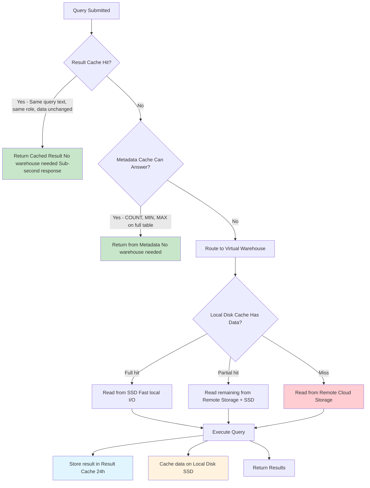

# 1.5 Caching and Query Performance

> **Key Terms:** Result Cache, Metadata Cache, Warehouse Cache (Local Disk Cache), Query Profile, Spilling, Pruning, USE_CACHED_RESULT, Cloud Services Layer, Persisted Query Results, Remote Storage Spilling

---

## Overview

Snowflake employs a **three-tier caching architecture** that dramatically improves query performance while reducing compute costs. Understanding these caches — where they live, how long they persist, what invalidates them, and when they are engaged — is one of the most heavily tested topics on the COF-C03 exam. Expect 4-8 questions directly or indirectly related to caching behavior.

The three caches work in a hierarchical manner: when a query is submitted, Snowflake checks the **Result Cache** first (in Cloud Services), then leverages the **Metadata Cache** for pruning and simple aggregations (also in Cloud Services), and finally uses the **Warehouse Local Disk Cache** (SSD storage on compute nodes) to avoid re-reading data from remote storage. Each layer reduces latency and cost differently, and understanding their distinct behaviors is critical for both exam success and production performance tuning.

From an exam perspective, the most common confusion candidates face is conflating the Result Cache (persisted in Cloud Services, survives warehouse suspension) with the Warehouse Local Disk Cache (lives on compute nodes, lost on suspension). Questions often test this distinction through scenarios involving warehouse suspend/resume cycles, data modification, and billing implications.

---

## Characteristics Comparison

| Cache Type | Location | Duration | Warehouse Needed? | Invalidation Trigger | Billing Impact |
|:-----------|:---------|:---------|:------------------|:---------------------|:---------------|
| **Result Cache** | Cloud Services Layer | 24 hours (resets on reuse) | No — query returns instantly | Underlying data changes (DML); micropartition changes; 24h expiry | No compute cost; minimal Cloud Services cost |
| **Metadata Cache** | Cloud Services Layer | Automatic / continuous | No — answered from metadata | DDL changes to table structure; data modifications update statistics | No compute cost; Cloud Services handles |
| **Warehouse Local Disk Cache** | SSD on compute nodes | Until warehouse suspends | Yes — warehouse must be running | Warehouse suspension; warehouse resize; LRU eviction | Warehouse must be running (credits consumed) |

---

## Query Execution Flow Through Cache Layers



---

## Detailed Content

### Result Cache (Persisted Query Results)

The **Result Cache** stores the complete result sets of previously executed queries in the Cloud Services Layer. This is the fastest cache — when hit, results return in sub-second time with zero warehouse compute required.

**How it works:**
- When a query executes, Snowflake stores the result set in Cloud Services
- If the exact same query is submitted again (within 24 hours, same conditions), the stored result is returned immediately
- The 24-hour window **resets** each time the cached result is reused
- Theoretically, a frequently-run query could remain cached indefinitely

**Conditions for the Result Cache to be used:**
1. The query text must be **exactly identical** (including whitespace and comments)
2. The query must be run by a user with the **same role** (access control check)
3. The **underlying data must not have changed** (no DML on referenced tables)
4. The **micropartitions** must not have been reclustered or modified
5. The `USE_CACHED_RESULT` session parameter must be `TRUE` (default)
6. The query must **not use non-deterministic functions** like `CURRENT_TIMESTAMP()`, `RANDOM()`, or external functions
7. The query must not reference a **volatile table** (e.g., a stream with new data)

**Important exam points:**
- Result Cache survives warehouse suspension — it lives in Cloud Services, not on compute
- Result Cache is **per-account**, not per-warehouse
- Different warehouse sizes can benefit from the same cached result
- LIMIT/OFFSET queries may not use the result cache in all cases

---

### Metadata Cache

The **Metadata Cache** stores statistical information about micro-partitions in the Cloud Services Layer. Snowflake automatically maintains metadata for every micro-partition including row count, min/max values per column, null count, and distinct value estimates.

**Queries answered entirely from metadata (no warehouse needed):**
- `SELECT COUNT(*) FROM table` — row count is maintained in metadata
- `SELECT MIN(col) FROM table` — min value tracked per partition
- `SELECT MAX(col) FROM table` — max value tracked per partition
- `SELECT COUNT(DISTINCT col) FROM table` — approximate distinct tracking
- Schema-level queries (`SHOW TABLES`, `DESCRIBE TABLE`)

**How it enables partition pruning:**
- The optimizer uses min/max metadata to **skip entire micro-partitions** that cannot contain matching data
- Example: `WHERE date = '2024-01-15'` — partitions with max(date) < '2024-01-15' are pruned
- This is why **natural clustering** (data loaded in order) is so powerful
- Pruning effectiveness is visible in the Query Profile

---

### Warehouse Local Disk Cache (SSD Cache)

The **Warehouse Local Disk Cache** (also called the data cache or SSD cache) stores raw table data on the SSD drives attached to each compute node in a virtual warehouse.

**Key characteristics:**
- Data is cached in **columnar format** on local SSD as it is read from remote storage
- Cache **warms up over time** — repeated queries on the same data get faster
- Cache is managed with **LRU (Least Recently Used)** eviction policy
- Cache is **lost entirely** when a warehouse is suspended
- Cache is **not shared** across warehouses — each warehouse has its own
- Resizing a warehouse may partially invalidate the cache (nodes added/removed)

**Performance implications:**
- First query on cold warehouse reads entirely from remote storage (slowest)
- Subsequent queries benefit from locally cached data (significantly faster)
- This is why keeping a warehouse running (at cost) can improve performance for repeated workloads
- Multi-cluster warehouses: each cluster has its own independent cache

---

### When Each Cache Is Used (Decision Tree)

| Scenario | Cache Used | Warehouse Credits? |
|:---------|:-----------|:-------------------|
| Identical query, same role, data unchanged, within 24h | Result Cache | No |
| `SELECT COUNT(*) FROM large_table` | Metadata Cache | No |
| `SELECT MIN(created_at) FROM events` | Metadata Cache | No |
| Query on data recently scanned by same warehouse | Local Disk Cache | Yes (warehouse running) |
| First query on a cold/just-resumed warehouse | None — remote storage read | Yes |
| Query with `CURRENT_TIMESTAMP()` in SELECT | Cannot use Result Cache; may use Local Disk | Yes |
| Same query, different role | Cannot use Result Cache | Yes |

---

### USE_CACHED_RESULT Parameter

The **`USE_CACHED_RESULT`** parameter controls whether the Result Cache is consulted for a session. It is a session-level parameter (can also be set at account level).

- **Default value:** `TRUE`
- **When to disable:** Performance benchmarking, testing query compilation time, ensuring fresh results
- **Does NOT affect** Metadata Cache or Local Disk Cache — only the Result Cache
- Setting to `FALSE` means queries will always go to the warehouse (if not answered by metadata)

---

### Query Profile and Performance Metrics

The **Query Profile** is Snowflake's visual execution plan tool, accessible through the web UI or `QUERY_HISTORY` views. Key metrics for caching and performance:

- **Bytes scanned vs. Bytes sent over network** — large gap indicates good local disk cache usage
- **Partitions scanned vs. Partitions total** — indicates pruning effectiveness (metadata cache)
- **Percentage scanned from cache** — directly shows local disk cache hit ratio
- **Spillage indicators** — bytes spilled to local disk or remote storage
- **Remote vs. Local I/O** — remote reads indicate cache misses

---

### Spilling (Performance Anti-Pattern)

**Spilling** occurs when a query's intermediate results exceed the available memory on warehouse nodes. Data "spills" first to **local SSD**, then to **remote storage** if local disk is also exhausted.

**Spilling hierarchy:**
1. **Memory** — fastest, preferred (no spilling)
2. **Local Disk Spill** — moderate performance impact (visible in Query Profile)
3. **Remote Storage Spill** — severe performance impact (10-100x slower)

**What causes spilling:**
- Warehouse too small for the query workload
- Large JOINs producing massive intermediate results
- Massive `ORDER BY` operations
- Aggregations on very high-cardinality columns
- Exploding joins (many-to-many without proper filtering)

**Resolution:** Scale up the warehouse (more memory per node) or optimize the query to reduce intermediate data volume.

---

## SQL Examples

### Example 1: Disable Result Cache for Benchmarking

```sql
-- Disable result cache for current session (useful for benchmarking)
ALTER SESSION SET USE_CACHED_RESULT = FALSE;

-- Run your benchmark query — will NOT use result cache
SELECT customer_segment, SUM(revenue)
FROM sales_data
WHERE sale_date >= '2024-01-01'
GROUP BY customer_segment;

-- Re-enable result cache
ALTER SESSION SET USE_CACHED_RESULT = TRUE;
```

### Example 2: Identify Queries Using Result Cache via QUERY_HISTORY

```sql
-- Find queries that were served from the result cache
-- (BYTES_SCANNED = 0 and WAREHOUSE_NAME IS NULL indicate result cache hit)
SELECT 
    query_id,
    query_text,
    start_time,
    total_elapsed_time,
    bytes_scanned,
    warehouse_name,
    execution_status
FROM TABLE(INFORMATION_SCHEMA.QUERY_HISTORY(
    DATEADD('hours', -24, CURRENT_TIMESTAMP()),
    CURRENT_TIMESTAMP()
))
WHERE bytes_scanned = 0
  AND execution_status = 'SUCCESS'
  AND warehouse_name IS NULL
ORDER BY start_time DESC
LIMIT 20;
```

### Example 3: Analyze Partition Pruning Effectiveness (Metadata Cache Impact)

```sql
-- Check how well pruning works on a query
-- After running a query, examine its profile:
SELECT 
    query_id,
    query_text,
    partitions_scanned,
    partitions_total,
    ROUND(partitions_scanned / NULLIF(partitions_total, 0) * 100, 2) AS pct_scanned,
    bytes_scanned,
    bytes_spilled_to_local_storage,
    bytes_spilled_to_remote_storage
FROM TABLE(INFORMATION_SCHEMA.QUERY_HISTORY_BY_WAREHOUSE(
    warehouse_name => 'ANALYTICS_WH',
    END_TIME_RANGE_START => DATEADD('hours', -1, CURRENT_TIMESTAMP())
))
WHERE partitions_total > 0
ORDER BY pct_scanned DESC
LIMIT 10;
```

### Example 4: Detect Spilling Queries (Performance Issues)

```sql
-- Find queries that spilled to disk or remote storage
-- These are candidates for warehouse scale-up or query optimization
SELECT 
    query_id,
    query_text,
    warehouse_size,
    total_elapsed_time / 1000 AS elapsed_seconds,
    bytes_spilled_to_local_storage / (1024*1024*1024) AS gb_spilled_local,
    bytes_spilled_to_remote_storage / (1024*1024*1024) AS gb_spilled_remote,
    rows_produced
FROM SNOWFLAKE.ACCOUNT_USAGE.QUERY_HISTORY
WHERE (bytes_spilled_to_local_storage > 0 
       OR bytes_spilled_to_remote_storage > 0)
  AND start_time >= DATEADD('day', -7, CURRENT_TIMESTAMP())
ORDER BY bytes_spilled_to_remote_storage DESC
LIMIT 20;
```

### Example 5: Check Current Cache Setting

```sql
-- View current session setting for result cache
SHOW PARAMETERS LIKE 'USE_CACHED_RESULT' IN SESSION;

-- View account-level default
SHOW PARAMETERS LIKE 'USE_CACHED_RESULT' IN ACCOUNT;
```

---

## Cache Impact on Billing

| Cache Type | Credits Consumed | When Billed | Cost Optimization Strategy |
|:-----------|:-----------------|:------------|:---------------------------|
| **Result Cache** | None (no warehouse) | Only Cloud Services (usually free tier) | Run identical queries — they're free |
| **Metadata Cache** | None (no warehouse) | Cloud Services (free tier) | Use simple aggregations on full tables when possible |
| **Local Disk Cache** | Warehouse credits (running) | While warehouse is active | Keep warehouse running for repeated workloads vs. auto-suspend |
| **No Cache (cold read)** | Warehouse credits | Full scan from remote storage | Cluster data, add search optimization, use pruning |

**Key billing insight:** The auto-suspend timer creates a trade-off. Suspending saves credits but destroys the Local Disk Cache. For workloads with repeated queries on the same data within minutes, a longer auto-suspend timeout (e.g., 5-10 minutes) may be more cost-effective than 1-minute auto-suspend with constant cold starts.

---

## Exam Tips

1. **Result Cache lives in Cloud Services** — it is NOT on the warehouse. Suspending a warehouse does NOT clear the result cache. This is the #1 trick question on this topic.

2. **Result Cache invalidation** — Any DML (INSERT, UPDATE, DELETE, MERGE) on underlying tables invalidates the result cache for all queries referencing those tables. DDL operations like adding a column also invalidate.

3. **Result Cache will NOT work when:**
   - Query contains non-deterministic functions (`CURRENT_TIMESTAMP`, `RANDOM`, `UUID_STRING`)
   - Query references an external table or table with a recently modified stream
   - `USE_CACHED_RESULT` is set to `FALSE`
   - User's role has changed (different role = different access control context)
   - Query text differs in ANY way (even whitespace or comments)
   - 24 hours have passed since last use of the cached result

4. **Metadata Cache questions** often ask: "Which query does NOT require a warehouse?" Answer: simple aggregates on full table scans (`COUNT(*)`, `MIN()`, `MAX()`).

5. **Spilling indicators** in the Query Profile:
   - `Bytes spilled to local storage` = moderate issue, may need larger warehouse
   - `Bytes spilled to remote storage` = severe issue, definitely need larger warehouse or query optimization
   - Spilling means **insufficient memory**, not insufficient disk

6. **Partition pruning** — The exam tests whether you understand that natural ordering of data (e.g., time-series data loaded chronologically) creates effective clustering that the metadata cache can exploit for pruning. Poorly clustered data = more partitions scanned = slower queries.

7. **Multi-cluster warehouses** — Each cluster has its OWN local disk cache. There is no shared cache between clusters.

---

## Common Misconceptions

| Misconception | Reality |
|:--------------|:--------|
| "Suspending a warehouse clears the result cache" | **Wrong.** Result Cache is in Cloud Services — it survives indefinitely (up to 24h). Only Local Disk Cache is lost on suspension. |
| "Result Cache works if the query is logically equivalent" | **Wrong.** Query text must be **character-for-character identical**. `SELECT *` vs `select *` may differ. Extra spaces matter. |
| "A larger warehouse means better caching" | **Partially wrong.** Larger warehouses have more SSD for local disk cache, but the Result Cache is warehouse-size-independent. |
| "Metadata Cache only works for `COUNT(*)`" | **Wrong.** It also covers `MIN()`, `MAX()`, and certain other full-table aggregations where partition-level statistics suffice. |
| "Disabling `USE_CACHED_RESULT` turns off all caching" | **Wrong.** It only disables the Result Cache. Metadata Cache and Local Disk Cache remain active. |
| "Spilling to local disk means the cache is full" | **Wrong.** Spilling is about query processing memory (RAM), not the SSD data cache. They are separate resources. |
| "Two different warehouses share their local disk cache" | **Wrong.** Each warehouse (and each cluster in a multi-cluster warehouse) maintains its own independent local disk cache. |

---

## Key Takeaways

1. **Three distinct caches exist:** Result Cache (Cloud Services, 24h, no warehouse), Metadata Cache (Cloud Services, automatic, no warehouse), and Local Disk Cache (SSD on compute, lost on suspend, warehouse required).

2. **Result Cache is free** — no warehouse credits consumed. It returns persisted results for identical queries within 24 hours, as long as underlying data has not changed.

3. **Metadata Cache enables zero-compute answers** for simple full-table aggregations (COUNT, MIN, MAX) and powers partition pruning for all queries.

4. **Local Disk Cache warms up over time** and is destroyed on warehouse suspension — this creates a cost/performance trade-off with auto-suspend settings.

5. **Spilling indicates undersized warehouses** — local disk spill is a warning, remote storage spill is critical. Scale up the warehouse or optimize the query.

6. **`USE_CACHED_RESULT = FALSE`** disables only the Result Cache, not metadata or local disk caching. Use it for benchmarking.

7. **For the exam:** Always identify WHICH cache is being discussed. The three caches have different locations, lifetimes, dependencies, and billing impacts. Most wrong answers exploit confusion between Result Cache (Cloud Services) and Local Disk Cache (compute nodes).

---

## References

- [Snowflake Documentation — Understanding Query Caching](https://docs.snowflake.com/en/user-guide/querying-persisted-results)
- [Snowflake Documentation — Query Profile](https://docs.snowflake.com/en/user-guide/ui-query-profile)
- [Snowflake Documentation — USE_CACHED_RESULT Parameter](https://docs.snowflake.com/en/sql-reference/parameters#use-cached-result)
- [Snowflake Documentation — Warehouse Considerations](https://docs.snowflake.com/en/user-guide/warehouses-considerations)
- [Snowflake Documentation — Query History](https://docs.snowflake.com/en/sql-reference/functions/query_history)
- [Snowflake Documentation — Clustering and Micro-Partitions](https://docs.snowflake.com/en/user-guide/tables-clustering-micropartitions)

---

## Additional Exam Scenarios

### Scenario 1: Same Query Returns in 200ms Second Time — Which Cache?

**Situation:** A user runs `SELECT region, SUM(sales) FROM orders GROUP BY region`. First execution takes 4.2 seconds. Running the exact same query again returns in 200ms with no warehouse activity.

**Answer:** **Result Cache.** The indicators are:
- Sub-second response (200ms) — too fast for even a cached disk read
- No warehouse activity — the warehouse didn't resume or do any work
- The query text is identical to the first execution

The Result Cache in Cloud Services stores the entire result set and returns it without needing any compute. The 200ms latency is just network round-trip to Cloud Services.

**Key insight:** If the answer comes back in under 1 second AND no warehouse credits are consumed, it's the Result Cache. Local Disk Cache still requires the warehouse to be running and executing the query (just faster I/O).

---

### Scenario 2: Query on Updated Table Doesn't Use Result Cache — Why?

**Situation:** At 9:00 AM, a user runs a query and it gets cached. At 9:05 AM, an ETL job runs `INSERT INTO orders SELECT ...` on the referenced table. At 9:10 AM, the user runs the exact same query but it takes 3 seconds instead of being instant.

**Answer:** Any DML operation (INSERT, UPDATE, DELETE, MERGE) on the underlying table **invalidates all Result Cache entries** referencing that table. The INSERT at 9:05 invalidated the cached result, so the 9:10 execution must recompute from scratch.

**Key insight:** Result Cache invalidation is at the **table level**, not the row level. Even if the INSERT added data that has nothing to do with the query's WHERE clause, the cache is still invalidated. This is conservative but ensures correctness.

---

### Scenario 3: Warehouse Suspended Then Resumed — What's in Cache?

**Situation:** A Medium warehouse runs several queries over 20 minutes, warming its local disk cache. It then auto-suspends after 10 minutes of inactivity. When a user queries it again and it auto-resumes, which caches are available?

**Answer:**
- **Result Cache:** ✅ Still available (lives in Cloud Services, unaffected by warehouse suspension)
- **Metadata Cache:** ✅ Still available (lives in Cloud Services)
- **Local Disk Cache:** ❌ **Completely lost.** Suspension deallocates compute nodes and their SSDs

The resumed warehouse starts "cold" — all data must be re-read from remote storage. The first queries after resume will be slower than the later ones as the cache warms back up.

**Key insight:** This is the #1 most-tested distinction. Result Cache survives suspension. Local Disk Cache does NOT. If an exam question mentions "suspend and resume," the local disk cache is gone.

---

### Scenario 4: Two Users Run Same Query — Does Second User Get Result Cache?

**Situation:** User A (role: ANALYST) runs a complex report query at 10:00 AM. User B (role: ANALYST) runs the exact same query at 10:05 AM. Does User B get the cached result?

**Answer:** **Yes** — if ALL conditions are met:
1. ✅ Same query text (character-for-character identical)
2. ✅ Same role (both use ANALYST role)
3. ✅ Underlying data unchanged (no DML between 10:00 and 10:05)
4. ✅ Within 24-hour window
5. ✅ `USE_CACHED_RESULT = TRUE` for User B's session

If User B had a different role (e.g., MANAGER), the Result Cache would NOT be used — even with identical query text. The role is checked for access control purposes.

**Key insight:** Result Cache is shared across users with the same role. It is NOT per-user or per-warehouse. Different roles cannot share cached results.

---

### Scenario 5: COUNT(*) Returns Instantly — Which Cache/Feature?

**Situation:** A user runs `SELECT COUNT(*) FROM sales_data` on a table with 2 billion rows. The result returns in 150ms with no warehouse credits consumed.

**Answer:** **Metadata Cache.** Snowflake maintains row count metadata for every table as part of its micro-partition statistics. `COUNT(*)` on a full table (no WHERE clause) is answered directly from metadata without scanning any data or requiring a warehouse.

Other queries answered from metadata:
- `SELECT MIN(col) FROM table` (partition-level min tracked)
- `SELECT MAX(col) FROM table` (partition-level max tracked)
- `SHOW TABLES` / `DESCRIBE TABLE` (schema metadata)

**Key insight:** If `COUNT(*)` has a WHERE clause (e.g., `COUNT(*) WHERE region = 'US'`), it CANNOT use metadata alone — it needs a warehouse to scan partitions. Only full-table aggregates use metadata cache.

---

### Scenario 6: Query Profile Shows "Percentage Scanned from Cache"

**Situation:** In the Query Profile, you see "Percentage scanned from cache: 72%". What does this tell you?

**Answer:** This metric refers to the **Local Disk Cache (SSD Cache)** on the warehouse nodes. It means 72% of the data needed for this query was found on local SSD (cached from previous queries on the same warehouse) and 28% had to be read from remote cloud storage.

This metric indicates:
- The warehouse has been running and scanning similar data recently (cache is warm)
- Query performance would improve if more data were cached (100% = best case)
- If you see 0%, the warehouse likely just resumed or this is a new data set

**Key insight:** "Percentage scanned from cache" is ALWAYS about Local Disk Cache, never about Result Cache. Result Cache queries don't show a Query Profile at all (they return before the query is "executed").

---

### Scenario 7: Dev Environment — Should You Disable Result Cache for Testing?

**Situation:** A developer is performance-testing a query and wants accurate execution time. The first run takes 8 seconds, the second run takes 0.2 seconds. They want consistent timing.

**Answer:** Yes, disable the Result Cache for the benchmarking session:

```sql
ALTER SESSION SET USE_CACHED_RESULT = FALSE;
```

This ensures every execution goes through the full query pipeline. However, note:
- **Metadata Cache** is still active (cannot be disabled) — affects pruning and simple aggregates
- **Local Disk Cache** is still active — the second run may still be faster due to warm SSD cache
- To truly test "cold" performance, you would need to suspend and resume the warehouse between runs (clears local disk cache)

**Key insight:** `USE_CACHED_RESULT = FALSE` disables ONLY the Result Cache. For true cold-performance benchmarking, you must also account for local disk cache (suspend/resume between tests).

---

### Scenario 8: Cloned Table — Does It Share Result Cache with Original?

**Situation:** You create a zero-copy clone: `CREATE TABLE orders_clone CLONE orders`. A user previously queried `orders` and the result is cached. If they now run the exact same query against `orders_clone`, will it use the Result Cache?

**Answer:** **No.** The Result Cache requires the query text to be **character-for-character identical**, including table names. A query on `orders_clone` is a different query text from a query on `orders`, so the cache will NOT be used.

Additionally, even if the clone points to the same underlying micro-partitions (zero-copy), Snowflake treats it as a distinct table object for cache purposes.

**Key insight:** Result Cache matching is **text-based**, not **data-based**. Even though the data is physically identical (zero-copy clone), different table names = different query text = no cache hit.

---

## Deep Dive: Cache Invalidation Rules

Understanding exactly when each cache is invalidated is critical for exam scenarios. The table below provides exhaustive invalidation triggers with examples.

### Result Cache Invalidation

| Trigger | Example | Cache Invalidated? | Notes |
|:--------|:--------|:------------------:|:------|
| DML on underlying table | `INSERT INTO orders VALUES (...)` | ✅ Yes | ANY DML on any table in the query invalidates ALL cached results referencing that table |
| DDL on underlying table | `ALTER TABLE orders ADD COLUMN notes VARCHAR` | ✅ Yes | Schema change invalidates cache |
| TRUNCATE TABLE | `TRUNCATE TABLE orders` | ✅ Yes | Treated as DML/DDL |
| Reclustering occurs | Automatic or manual recluster | ✅ Yes | Micro-partition changes invalidate cache |
| 24 hours since last use | Cached result unused for 24h | ✅ Yes | Timer resets each time the result IS used |
| `USE_CACHED_RESULT = FALSE` | Session setting | ⚠️ Bypassed | Cache still exists but is not consulted |
| Non-deterministic function in query | `SELECT *, CURRENT_TIMESTAMP() FROM t` | ⚠️ Never cached | These queries are never written to Result Cache in the first place |
| Different role executes same query | User switches from ANALYST to ADMIN | ⚠️ Not accessible | Cache entry exists but role mismatch prevents access |
| DML on UNRELATED table | `INSERT INTO customers VALUES (...)` | ❌ No | Only tables referenced in the cached query matter |
| Warehouse suspended/resumed | `ALTER WAREHOUSE wh SUSPEND` | ❌ No | Result Cache lives in Cloud Services, not on warehouse |
| Warehouse resized | `ALTER WAREHOUSE wh SET SIZE = 'LARGE'` | ❌ No | Result Cache is warehouse-independent |
| Another user runs different query on same table | Different query text | ❌ No | Unrelated queries don't affect each other's cache |

### Metadata Cache Invalidation

| Trigger | Example | Impact | Notes |
|:--------|:--------|:------:|:------|
| DML on table | `INSERT INTO orders VALUES (...)` | 🔄 Updated | Metadata is refreshed automatically (not invalidated — updated with new stats) |
| DDL on table | `ALTER TABLE orders ADD COLUMN ...` | 🔄 Updated | Schema metadata refreshed |
| DROP TABLE | `DROP TABLE orders` | ✅ Removed | No table = no metadata |
| Time Stream advances | New data appears in stream | 🔄 Updated | Metadata reflects current table state |

**Key insight:** Metadata Cache is not truly "invalidated" — it is **continuously updated** by the Cloud Services Layer whenever data changes. It always reflects the current state of the table.

### Local Disk Cache (SSD Cache) Invalidation

| Trigger | Example | Cache Cleared? | Notes |
|:--------|:--------|:--------------:|:------|
| Warehouse suspended | `ALTER WAREHOUSE wh SUSPEND` or auto-suspend | ✅ Completely | All SSD data lost — nodes are deallocated |
| Warehouse resized | `ALTER WAREHOUSE wh SET SIZE = 'XLARGE'` | ⚠️ Partially | New nodes have empty cache; some existing nodes may be removed |
| LRU eviction | Cache full, new data needed | ⚠️ Partially | Least-recently-used data evicted to make room |
| Node failure | Hardware issue | ⚠️ Partially | Only the failed node's cache is lost |
| DML on cached data | `UPDATE orders SET ...` | ⚠️ Stale entries | Stale cached data is not served; fresh data re-read from storage |
| Warehouse running idle | No queries for 30 minutes | ❌ No | Cache persists as long as warehouse is running |
| Query from different user on same warehouse | Another user queries | ❌ No | Cache is shared across all users on the same warehouse |
| Time passing (no TTL) | Hours of inactivity | ❌ No | No time-based expiry — only LRU eviction or suspension |

### Quick Reference: Cache Survival Matrix

| Event | Result Cache | Metadata Cache | Local Disk Cache |
|:------|:------------|:--------------|:----------------|
| Warehouse suspended | ✅ Survives | ✅ Survives | ❌ **Lost** |
| Warehouse resumed | ✅ Available | ✅ Available | ❌ Empty (cold) |
| Warehouse resized | ✅ Survives | ✅ Survives | ⚠️ Partially lost |
| DML on table | ❌ Invalidated | 🔄 Updated | ⚠️ Stale entries skipped |
| DDL on table | ❌ Invalidated | 🔄 Updated | ❌ Stale entries skipped |
| 24 hours pass (unused) | ❌ Expires | ✅ Survives | ✅ Survives (if running) |
| Different role queries | ⚠️ Not accessible | ✅ Available | ✅ Available |
| `USE_CACHED_RESULT = FALSE` | ⚠️ Bypassed | ✅ Available | ✅ Available |
| Account-level event | ✅ Survives | ✅ Survives | ✅ Survives |

---

<p align="center">

| [← 1.4 Virtual Warehouses and Compute](./1.4_Virtual_Warehouses_and_Compute.md) | [Domain 1 README](./README.md) | [1.6 Snowflake Editions and Cloud Platforms →](./1.6_Snowflake_Editions_and_Cloud_Platforms.md) |
|:---|:---:|---:|

</p>

<p align="center">
  <a href="../README.md">🏠 Back to Main Study Guide</a>
</p>
