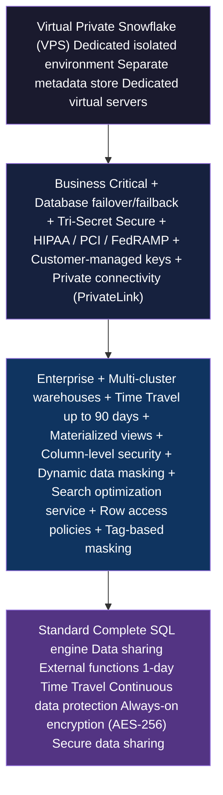

# 1.6 Snowflake Editions and Cloud Platforms

> **Key Terms:** Standard Edition, Enterprise Edition, Business Critical Edition, Virtual Private Snowflake (VPS), Multi-Cloud Strategy, AWS, Azure, GCP, Tri-Secret Secure, HIPAA/PCI/FedRAMP, Customer-Managed Keys, Private Connectivity

---

## Overview

Snowflake offers four distinct **editions** — Standard, Enterprise, Business Critical, and Virtual Private Snowflake (VPS) — each building on the one below it with additional features for security, compliance, and governance. The COF-C03 exam heavily tests your ability to identify which features require which minimum edition. Getting these mappings wrong is one of the most common reasons candidates fail questions in this domain.

Snowflake runs natively on three major **cloud platforms**: Amazon Web Services (AWS), Microsoft Azure, and Google Cloud Platform (GCP). While the Snowflake experience is consistent across all three, there are nuances in region availability, data sharing, and replication that the exam tests. Understanding both the vertical (edition) and horizontal (cloud platform) dimensions is critical for architecture questions.

Credit costs increase with each higher edition. A single credit on Business Critical costs more than on Enterprise, which costs more than Standard. This cost dimension factors into exam scenarios that ask you to recommend the most cost-effective edition that meets a set of requirements.

---

## Edition Characteristics Comparison

| Feature | Standard | Enterprise | Business Critical | VPS |
|---------|:--------:|:----------:|:-----------------:|:---:|
| Multi-cluster warehouses | - | Yes | Yes | Yes |
| Time Travel (up to 90 days) | - (1 day max) | Yes | Yes | Yes |
| Materialized views | - | Yes | Yes | Yes |
| Column-level security | - | Yes | Yes | Yes |
| Dynamic data masking | - | Yes | Yes | Yes |
| Search optimization service | - | Yes | Yes | Yes |
| External functions | Yes | Yes | Yes | Yes |
| Data sharing | Yes | Yes | Yes | Yes |
| Database failover/failback | - | - | Yes | Yes |
| Tri-Secret Secure | - | - | Yes | Yes |
| HIPAA/PCI/FedRAMP/HITRUST | - | - | Yes | Yes |
| Customer-managed encryption keys | - | - | Yes | Yes |
| Private connectivity (AWS PrivateLink / Azure Private Link / GCP Private Service Connect) | - | - | Yes | Yes |
| Dedicated metadata store | - | - | - | Yes |
| Dedicated, isolated virtual servers | - | - | - | Yes |

> **Exam Tip:** Standard includes 1-day Time Travel. Enterprise extends this to **up to** 90 days — it does not default to 90 days; you must configure it.

---

## Edition Feature Hierarchy



Each edition **includes all features** of the editions below it. VPS includes everything in Business Critical, which includes everything in Enterprise, which includes everything in Standard.

---

## Detailed Content

### Standard Edition

**Standard Edition** provides the full Snowflake SQL engine and core platform capabilities. It is suitable for organizations that do not require advanced security features or extended data protection.

Key capabilities included:
- Complete SQL data warehouse functionality
- Automatic encryption at rest (AES-256) and in transit
- **Secure data sharing** across accounts
- **External functions** (calling external APIs)
- **Time Travel** up to 1 day (configurable 0-1 days)
- **Fail-safe** (7 days, non-configurable)
- Continuous data protection
- Standard MFA and federated authentication

Standard Edition is the most cost-effective option per credit but lacks governance and compliance features needed by regulated industries.

### Enterprise Edition

**Enterprise Edition** adds critical governance, performance, and data protection features. This is the most commonly tested edition on the exam because many features that candidates assume require Business Critical actually only require Enterprise.

Key additions over Standard:
- **Multi-cluster warehouses** — automatic scale-out for concurrency
- **Time Travel up to 90 days** — extended recovery window (must be configured per database/schema/table via `DATA_RETENTION_TIME_IN_DAYS`)
- **Materialized views** — precomputed query results for performance
- **Column-level security** — restrict access to specific columns
- **Dynamic data masking** — masking policies applied at query time
- **Search optimization service** — accelerates selective point-lookup queries
- **Row access policies** — row-level security
- **Tag-based masking** — apply masking via object tags
- **Object tagging** — governance metadata

### Business Critical Edition

**Business Critical Edition** (formerly called "Enterprise for Sensitive Data") adds enhanced security, compliance certifications, and disaster recovery capabilities for organizations handling regulated or highly sensitive data.

Key additions over Enterprise:
- **Database failover and failback** — cross-region/cross-cloud disaster recovery for databases
- **Tri-Secret Secure** — composite encryption combining Snowflake-managed key + customer-managed key (CMK)
- **HIPAA compliance support** — required for protected health information (PHI)
- **PCI DSS compliance** — required for payment card data
- **FedRAMP** and **HITRUST** certifications
- **Customer-managed encryption keys** (via AWS KMS, Azure Key Vault, or GCP Cloud KMS)
- **Private connectivity** — AWS PrivateLink, Azure Private Link, or GCP Private Service Connect (traffic never traverses the public internet)
- Enhanced replication and failover capabilities
- Support for PHI data under signed BAA

### Virtual Private Snowflake (VPS)

**Virtual Private Snowflake (VPS)** provides the highest level of isolation and security. It is a completely dedicated Snowflake environment where compute and metadata services are physically separated from all other Snowflake customers.

Key additions over Business Critical:
- **Dedicated metadata store** — separate from shared cloud services layer
- **Dedicated virtual servers** — no resource sharing at any level
- Complete **network isolation** from other Snowflake accounts
- Designed for organizations with the strictest security requirements (government, financial services, defense)

VPS is the most expensive edition and is relatively rare on the exam, but you must know it exists as the top of the hierarchy.

### Cloud Platform Support

Snowflake operates natively on all three major cloud providers:

| Cloud Provider | Regions | Private Connectivity |
|---|---|---|
| **AWS** | 20+ regions globally | AWS PrivateLink |
| **Microsoft Azure** | 15+ regions globally | Azure Private Link |
| **Google Cloud Platform** | 10+ regions globally | GCP Private Service Connect |

Key cross-cloud facts for the exam:
- The Snowflake **experience and SQL syntax are identical** across all clouds
- An account resides in **one cloud and one region** — you choose at provisioning time
- **Data sharing** within the same cloud and region is instant (no data copy)
- **Data sharing across clouds/regions** requires replication (data must be copied)
- **Snowgrid** enables cross-cloud data sharing and replication

### Cross-Cloud Features and Limitations

- **Replication** can be cross-region and cross-cloud (Business Critical or higher)
- **Failover** can target a different cloud provider (Business Critical or higher)
- **Secure data sharing** works instantly only within the same region and cloud; cross-region/cross-cloud sharing uses **listings** or database replication
- **Snowflake Marketplace** listings are region-specific but can replicate to other regions
- **Credit pricing** varies by cloud provider and region (slightly different rates)

### Credit Costs by Edition

Credit pricing follows a hierarchy — each higher edition costs more per credit:

| Edition | Relative Cost per Credit |
|---------|--------------------------|
| Standard | Base (lowest) |
| Enterprise | ~1.25x Standard |
| Business Critical | ~1.5-2x Standard |
| VPS | Highest (custom pricing) |

Actual pricing varies by cloud provider, region, and contract. The exam does not test exact dollar amounts but does expect you to know that higher editions cost more per credit.

---

## SQL Examples

### 1. Check Current Account Edition

```sql
-- Returns the edition of the current account
SELECT CURRENT_ACCOUNT() AS account,
       SYSTEM$GET_SNOWFLAKE_PLATFORM_INFO() AS platform_info;

-- More direct method using ACCOUNT_USAGE
SELECT *
FROM SNOWFLAKE.ORGANIZATION_USAGE.ACCOUNTS
WHERE ACCOUNT_NAME = CURRENT_ACCOUNT();
```

### 2. View Allowed IPs for Private Connectivity (Business Critical+)

```sql
-- Returns the list of allowed IPs/hostnames for your account
-- Useful for configuring PrivateLink endpoints
SELECT SYSTEM$ALLOWLIST();

-- Returns allowed list for private connectivity specifically
SELECT SYSTEM$ALLOWLIST_PRIVATELINK();
```

### 3. Check Account Parameters Related to Edition Features

```sql
-- Check Time Travel retention (Enterprise: up to 90 days)
SHOW PARAMETERS LIKE 'DATA_RETENTION_TIME_IN_DAYS' IN ACCOUNT;

-- Check if Tri-Secret Secure is enabled (Business Critical+)
SHOW PARAMETERS LIKE 'PERIODIC_DATA_REKEYING' IN ACCOUNT;

-- View replication configuration (Business Critical+ for failover)
SHOW REPLICATION ACCOUNTS;
SHOW REPLICATION DATABASES;
```

### 4. Configure Enterprise Edition Features

```sql
-- Set extended Time Travel to 90 days (Enterprise+)
ALTER DATABASE my_db SET DATA_RETENTION_TIME_IN_DAYS = 90;

-- Create a masking policy (Enterprise+)
CREATE OR REPLACE MASKING POLICY email_mask AS (val STRING)
RETURNS STRING ->
  CASE
    WHEN CURRENT_ROLE() IN ('ANALYST') THEN val
    ELSE '***MASKED***'
  END;

-- Apply masking policy to a column
ALTER TABLE customers MODIFY COLUMN email
  SET MASKING POLICY email_mask;
```

---

## When to Choose Each Edition

| Requirement | Minimum Edition |
|-------------|-----------------|
| Basic data warehousing and analytics | Standard |
| Secure data sharing (same region) | Standard |
| External functions | Standard |
| Multi-cluster warehouses (auto-scale) | **Enterprise** |
| Time Travel beyond 1 day (up to 90) | **Enterprise** |
| Materialized views | **Enterprise** |
| Dynamic data masking | **Enterprise** |
| Column-level security | **Enterprise** |
| Row access policies | **Enterprise** |
| Search optimization service | **Enterprise** |
| Tag-based masking | **Enterprise** |
| HIPAA / PCI DSS compliance | **Business Critical** |
| Tri-Secret Secure (customer + Snowflake keys) | **Business Critical** |
| Database failover/failback | **Business Critical** |
| AWS PrivateLink / Azure Private Link | **Business Critical** |
| Customer-managed encryption keys | **Business Critical** |
| Dedicated isolated environment | **VPS** |
| Dedicated metadata store | **VPS** |

---

## Exam Tips

1. **Most governance features are Enterprise, NOT Business Critical.** Dynamic data masking, column-level security, row access policies, and tag-based masking all require Enterprise as the minimum. The exam loves to test this distinction.

2. **Multi-cluster warehouses require Enterprise.** Standard Edition only supports single-cluster warehouses. If a question mentions auto-scaling concurrency, the answer involves Enterprise.

3. **Time Travel defaults:** Standard = 1 day max. Enterprise+ = up to 90 days (but you must configure it — it does not default to 90).

4. **Private connectivity and failover = Business Critical.** Anything involving PrivateLink, network isolation from the internet, or cross-region failover requires Business Critical minimum.

5. **Tri-Secret Secure vs. standard encryption:** All editions have AES-256 encryption. Tri-Secret Secure (Business Critical+) adds a customer-managed key wrapped with a Snowflake key — neither party alone can decrypt the data.

6. **Cross-cloud sharing:** Data sharing within the same cloud/region requires no replication. Cross-region or cross-cloud sharing requires database replication (Business Critical for failover, Enterprise for basic replication).

7. **VPS questions are rare** but know it exists as the highest isolation tier with dedicated infrastructure.

8. **Credit costs increase with edition.** If a scenario asks for the most cost-effective solution that meets requirements, choose the lowest edition that satisfies all stated needs.

---

## Common Misconceptions

| Misconception | Reality |
|---------------|---------|
| "You need Business Critical for data masking" | **Wrong.** Dynamic data masking and column-level security require only **Enterprise**. |
| "All editions support 90-day Time Travel" | **Wrong.** Standard Edition supports only 0-1 days. Enterprise+ supports up to 90 days. |
| "Standard Edition has no encryption" | **Wrong.** ALL editions include AES-256 encryption at rest and in transit. Business Critical adds **Tri-Secret Secure** (customer-managed key). |
| "Multi-cluster warehouses work on Standard" | **Wrong.** Multi-cluster warehouses require **Enterprise** minimum. |
| "VPS means you run Snowflake on-premises" | **Wrong.** VPS still runs in the cloud — it is a dedicated, isolated deployment within the cloud provider's infrastructure. |
| "Data sharing requires Business Critical" | **Wrong.** Secure data sharing is available on ALL editions, including Standard. |
| "Materialized views are available on all editions" | **Wrong.** Materialized views require **Enterprise** minimum. |
| "PrivateLink works on Enterprise" | **Wrong.** Private connectivity (PrivateLink/Private Link/Private Service Connect) requires **Business Critical** minimum. |

---

## Key Takeaways

1. **Edition hierarchy is additive**: Standard < Enterprise < Business Critical < VPS. Each includes all features of lower editions.

2. **Enterprise is the governance edition**: Multi-cluster warehouses, 90-day Time Travel, materialized views, dynamic masking, column-level security, row access policies, and search optimization all land here.

3. **Business Critical is the compliance/DR edition**: HIPAA, PCI, FedRAMP, failover/failback, Tri-Secret Secure, customer-managed keys, and private connectivity all require this tier.

4. **VPS is maximum isolation**: Dedicated compute, metadata, and network — never shared with other customers.

5. **All clouds are functionally equivalent**: Same SQL, same features, same interface across AWS, Azure, and GCP. Differences are in region count and private connectivity mechanism names.

6. **Cross-cloud sharing requires replication**: Instant sharing only works within the same cloud and region. Everything else needs data replication.

7. **Higher editions cost more per credit**: Always recommend the lowest edition that meets all stated requirements — this is the cost-efficient answer the exam expects.

---

## References

- [Snowflake Editions Overview](https://docs.snowflake.com/en/user-guide/intro-editions)
- [Feature Comparison by Edition](https://docs.snowflake.com/en/user-guide/intro-editions#feature-edition-matrix)
- [Snowflake Supported Cloud Regions](https://docs.snowflake.com/en/user-guide/intro-regions)
- [Tri-Secret Secure](https://docs.snowflake.com/en/user-guide/security-encryption-manage)
- [Private Connectivity](https://docs.snowflake.com/en/user-guide/admin-security-privatelink)
- [Database Replication and Failover](https://docs.snowflake.com/en/user-guide/db-replication-intro)
- [COF-C03 Exam Guide](https://learn.snowflake.com/en/certifications/snowpro-core/)

---

## Additional Exam Scenarios

**Scenario 1:** A healthcare organization needs to store Protected Health Information (PHI) and requires HIPAA compliance. What is the minimum Snowflake edition?
> **Answer:** **Business Critical**. HIPAA compliance support (with a signed BAA) is only available on Business Critical and VPS editions. Enterprise and Standard do not support HIPAA. This is one of the most commonly tested edition questions — many candidates incorrectly assume Enterprise is sufficient for compliance certifications.

**Scenario 2:** A team requires 90-day Time Travel retention for audit purposes. What is the minimum edition?
> **Answer:** **Enterprise**. Standard Edition supports only 0–1 day Time Travel. Enterprise and above support configuring `DATA_RETENTION_TIME_IN_DAYS` up to 90 days. Note: Enterprise does not default to 90 days — you must explicitly configure it per database, schema, or table.

**Scenario 3:** An organization experiences concurrency bottlenecks and wants automatic scale-out using multi-cluster warehouses. What is the minimum edition?
> **Answer:** **Enterprise**. Multi-cluster warehouses (auto-scaling clusters to handle concurrent query load) require Enterprise edition minimum. Standard Edition only supports single-cluster warehouses. If a question mentions concurrency scaling or auto-scale-out, the answer is Enterprise.

**Scenario 4:** A financial services company wants Tri-Secret Secure (customer-managed encryption keys combined with Snowflake-managed keys). What is the minimum edition?
> **Answer:** **Business Critical**. Tri-Secret Secure creates a composite encryption model where neither Snowflake nor the customer can decrypt data alone — both keys are required. This is exclusively a Business Critical (and VPS) feature. Standard and Enterprise use only Snowflake-managed AES-256 encryption.

**Scenario 5:** A company wants to implement dynamic data masking to hide sensitive columns from unauthorized roles. What is the minimum edition?
> **Answer:** **Enterprise**. Dynamic data masking (masking policies applied at query time based on the executing role) is an Enterprise feature. This is a common exam trap — many candidates assume governance features like masking require Business Critical, but they only require Enterprise.

**Scenario 6:** An organization requires that all traffic between their applications and Snowflake never traverses the public internet (AWS PrivateLink / Azure Private Link). What is the minimum edition?
> **Answer:** **Business Critical**. Private connectivity (AWS PrivateLink, Azure Private Link, GCP Private Service Connect) requires Business Critical minimum. This ensures network traffic stays within the cloud provider's private backbone. Enterprise and Standard do not support private connectivity endpoints.

**Scenario 7:** A team wants to use the Search Optimization Service to accelerate selective point-lookup queries on large tables. What is the minimum edition?
> **Answer:** **Enterprise**. The Search Optimization Service (which creates search access paths for equality and IN predicates) requires Enterprise edition minimum. It is not available on Standard. This is frequently tested alongside other Enterprise features like materialized views and multi-cluster warehouses.

**Scenario 8:** Does cross-cloud replication (e.g., AWS to Azure) require a different edition than cross-region replication (e.g., AWS us-east-1 to AWS eu-west-1)?
> **Answer:** **Same requirement** — both cross-cloud and cross-region replication require **Business Critical** for failover/failback capabilities. Basic database replication (without failover) is available on Enterprise, but enabling account or database failover/failback to a secondary deployment (whether same cloud different region OR different cloud entirely) requires Business Critical. The edition requirement is based on the failover capability, not the geographic distance.

---

| [< 1.5 Caching and Query Performance](./1.5_Caching_and_Query_Performance.md) | [Domain 1 README](./README.md) | [Home](../README.md) |
|:---|:---:|---:|
