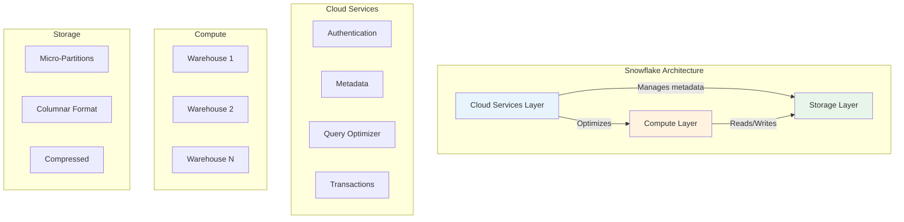

<h1 align="center">🏗️ Domain 1: Snowflake AI Data Cloud Features and Architecture</h1>

  
  
  

---

## 📋 Domain Overview

This is the **heaviest domain** on the COF-C03 exam. It tests your understanding of Snowflake's unique multi-cluster shared data architecture, how the three layers work together, and the implications for performance, scalability, and cost.

## 🎯 Official Exam Objectives

- Outline key features of the Snowflake AI Data Cloud
- Outline key Snowflake tools and user interfaces
- Outline Snowflake's catalog and objects
- Outline Snowflake storage concepts
- Outline Snowflake compute concepts
- Outline Snowflake's Cloud Services layer

---

## 📚 Topics

| # | Topic | Exam Focus | Key Concepts |
|---|-------|-----------|--------------|
| 1.1 | [Architecture Overview](./1.1_Snowflake_Architecture_Overview.md) | Multi-cluster shared data | 3 layers, separation of concerns, elasticity |
| 1.2 | [Cloud Services Layer](./1.2_Cloud_Services_Layer.md) | Always-on services | Metadata, optimization, security, transactions |
| 1.3 | [Storage Layer & Micro-Partitions](./1.3_Storage_Layer_and_Micro_Partitions.md) | Data organization | Columnar storage, compression, pruning |
| 1.4 | [Virtual Warehouses & Compute](./1.4_Virtual_Warehouses_and_Compute.md) | Compute management | Sizing, scaling, multi-cluster, concurrency |
| 1.5 | [Caching & Query Performance](./1.5_Caching_and_Query_Performance.md) | Performance optimization | 3 cache tiers, invalidation, best practices |
| 1.6 | [Editions & Cloud Platforms](./1.6_Snowflake_Editions_and_Cloud_Platforms.md) | Feature availability | Edition comparison, cross-cloud features |

---

## 🎯 Scenarios & Practice

| Resource | Description |
|----------|-------------|
| [📎 Scenario Decision Guides](./Scenarios_Domain1.md) | Real-world architecture decisions with reasoning |
| [✅ Practice Quiz](./quiz/Questions_Domain1.md) | 60+ exam-style questions with explanations |

---

## 💡 Key Exam Tips for Domain 1

- **Architecture is #1 priority** — at 31%, this domain alone determines pass/fail for many candidates
- **Know the 3 layers cold** — Storage, Compute, Cloud Services and what each handles
- **Caching questions are frequent** — understand which cache serves what and when it's invalidated
- **Warehouse sizing** — credits double with each size increase, know the scaling policies
- **Editions** — know which features require Enterprise vs Business Critical vs VPS
- **Micro-partitions** — understand immutability, size range (50-500MB), and columnar metadata

---

## 📊 Concept Map

---

  <a href="../README.md">🏠 Back to Main Study Guide</a>

