# Scenarios Decision Guide: Domain 1 — Snowflake AI Data Cloud Features and Architecture

> **How to use this guide:** Each scenario presents a realistic business situation requiring a decision. Work through the decision flow *before* reading the answer. The "Exam Trap" callouts highlight the exact misconceptions Snowflake exploits in multiple-choice questions. Train yourself to recognize these patterns — the exam rewards decision-making skills, not memorization.

---

## Scenario 1: Scale Up vs Scale Out — The Dashboard Rush

**Situation:** Every Monday at 9 AM, your BI team of 40 analysts simultaneously launches their weekly dashboards. Queries queue up, many wait 30+ seconds before execution begins, but once running they complete in 2-3 seconds each. The warehouse is XL size.

**Decision Flow:**
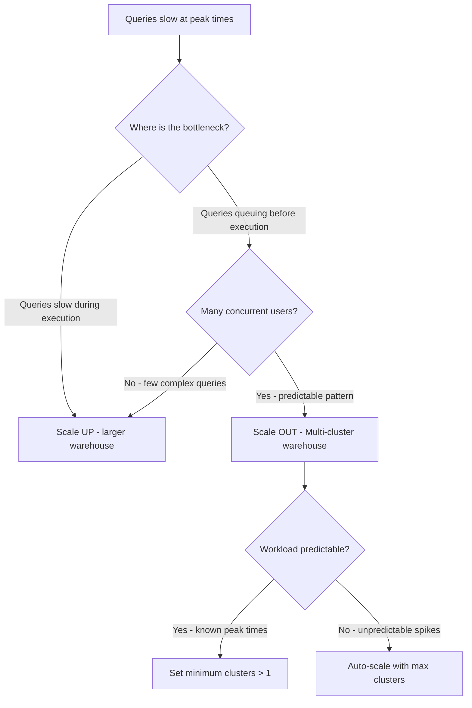

**Answer:** Scale OUT with a multi-cluster warehouse. The queries execute quickly (2-3 seconds) but queue because all 40 analysts hit the warehouse simultaneously. Multi-cluster warehouses spin up additional clusters to handle concurrency. Scaling UP (to 2XL, 3XL) would make individual queries faster but would NOT reduce queueing — a single cluster still has a concurrency limit.

**Why Not the Others:**
| Option | Why It's Wrong |
|--------|---------------|
| Scale up to 2XL | Queries already run fast (2-3s). The problem is concurrency, not query complexity |
| Add result caching | Dashboards likely have different parameters per user — cache hit rate would be low |
| Create multiple separate warehouses | Management overhead; multi-cluster solves this natively |

**Exam Trap:** The exam loves testing whether you know that scaling UP adds compute power per query while scaling OUT adds parallel capacity. If the scenario mentions queueing or concurrency — think multi-cluster. If it mentions slow individual queries — think larger size.

---

## Scenario 2: Choosing the Right Snowflake Edition

**Situation:** A healthcare company needs to store patient data with HIPAA compliance. They require column-level masking so that analysts can query tables without seeing SSN or diagnosis fields, and they need to track all data access for audit purposes. Budget is a concern, but compliance is non-negotiable.

**Decision Flow:**
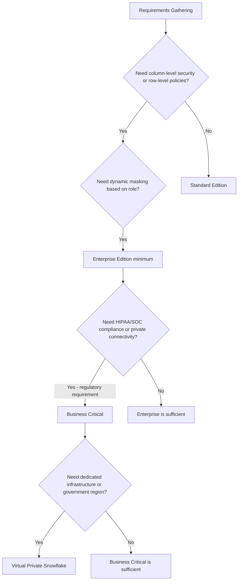

**Answer:** Business Critical edition. Dynamic data masking requires Enterprise, but HIPAA compliance and enhanced security features (including PHI protection guarantees) require Business Critical. The edition choice is driven by the *highest* requirement.

**Why Not the Others:**
| Option | Why It's Wrong |
|--------|---------------|
| Standard | No dynamic data masking, no compliance certifications |
| Enterprise | Has masking but lacks HIPAA compliance certification and enhanced security |
| VPS | Overkill — needed only for complete isolation or government workloads (FedRAMP) |

**Exam Trap:** Enterprise has dynamic data masking and column-level security. But compliance certifications (HIPAA, PCI-DSS, SOC 1/2) and features like Tri-Secret Secure encryption require Business Critical. The exam tests whether you confuse "security feature availability" with "compliance certification."

---

## Scenario 3: Which Cache Is Serving My Query?

**Situation:** A data engineer runs a query at 10:00 AM that takes 45 seconds. She runs the exact same query at 10:02 AM and it returns in 200 milliseconds. She modifies the WHERE clause slightly and runs again — it takes 8 seconds instead of 45. She's confused about why each run performed differently.

**Decision Flow:**
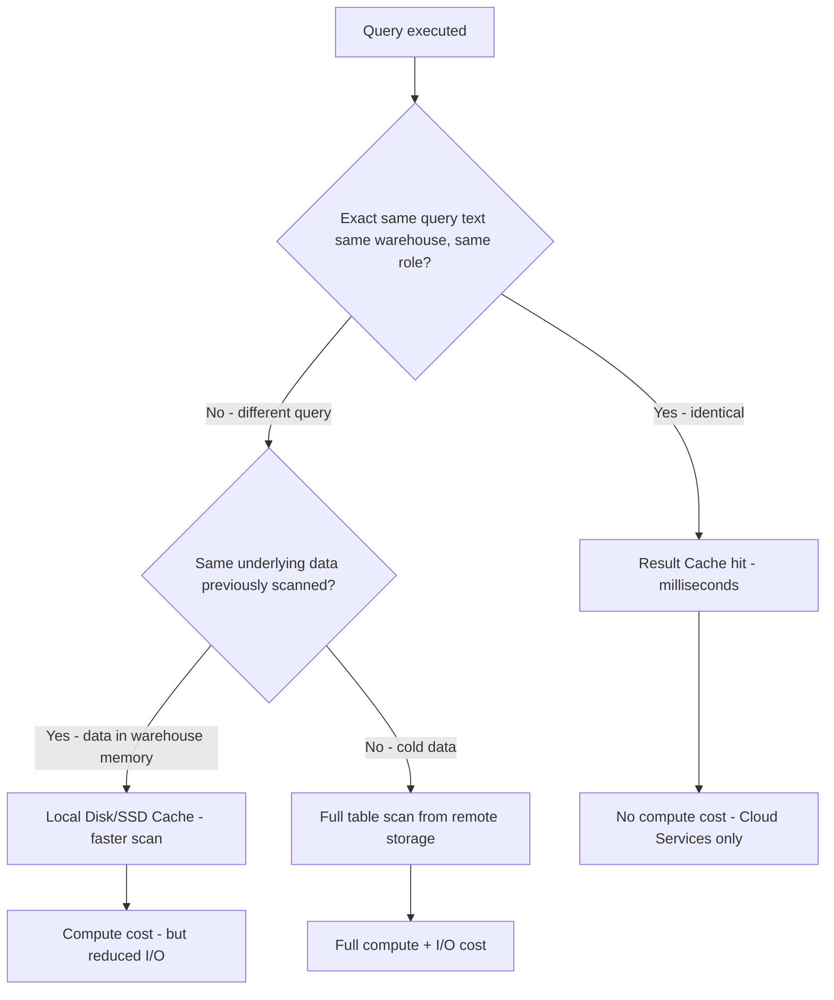

**Answer:**
- Run 2 (200ms): **Result cache** — identical SQL, same role, data unchanged, within 24 hours
- Run 3 (8s vs 45s): **Local disk cache (SSD)** — different SQL so result cache misses, but the micro-partitions are still cached on the warehouse's local SSD from Run 1

**Why Not the Others:**
| Option | Why It's Wrong |
|--------|---------------|
| "Run 2 used local disk cache" | Local disk cache still requires query execution — it wouldn't return in 200ms for a 45s query |
| "Run 3 used result cache" | Modified WHERE clause = different query = result cache miss |
| "Run 2 was faster because warehouse was warmed up" | Warm warehouse helps with SSD cache, not millisecond returns |

**Exam Trap:** Three caches exist — Result Cache (24hr, no compute cost, requires identical SQL + unchanged data), Local Disk/SSD Cache (warehouse-specific, survives across queries but lost on suspend), and Metadata Cache (for MIN/MAX/COUNT on metadata). The exam tests whether you know result cache requires the *exact same query text* and produces *no warehouse credit charges*.

---

## Scenario 4: When to Add Explicit Clustering

**Situation:** A 4TB fact table is heavily queried by `order_date` (90% of queries filter on date ranges). Query performance has degraded over months of continuous DML operations (inserts, updates, deletes). The table originally performed well with natural clustering from date-ordered inserts. Query profile shows significant partition pruning is NOT occurring.

**Decision Flow:**
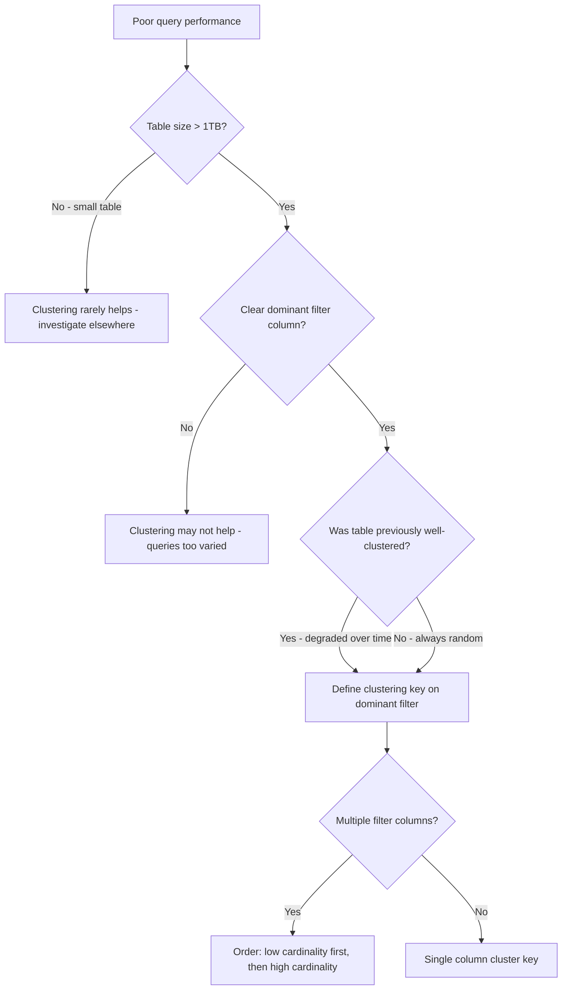

**Answer:** Define a clustering key on `order_date`. The table is large (4TB), has a dominant query pattern (date filtering), and has degraded from DML churn. Automatic reclustering will restore and maintain partition pruning efficiency.

**Why Not the Others:**
| Option | Why It's Wrong |
|--------|---------------|
| Increase warehouse size | Brute-force approach — pruning is the real fix |
| Create materialized view | Doesn't fix the underlying clustering degradation |
| Rebuild table with CTAS | One-time fix but degradation will recur without a clustering key |
| Cluster on high-cardinality ID column | Clustering works best on columns used in WHERE with range filters, not unique IDs |

**Exam Trap:** Snowflake's automatic micro-partition clustering works well for *most* tables. The exam wants you to know clustering keys are only needed for very large tables (multi-TB) with heavy DML and clear filter patterns. Don't cluster small tables or tables without dominant query patterns — it wastes credits on reclustering.

---

## Scenario 5: Diagnosing Performance Using Query Profile

**Situation:** A query that normally runs in 30 seconds is now taking 12 minutes. You open the Query Profile and see the following: one TableScan node shows "Bytes Scanned: 50GB" and "Percentage Scanned from Cache: 2%". The Aggregate node above it shows significant "Bytes Spilled to Local Storage" and "Bytes Spilled to Remote Storage."

**Decision Flow:**
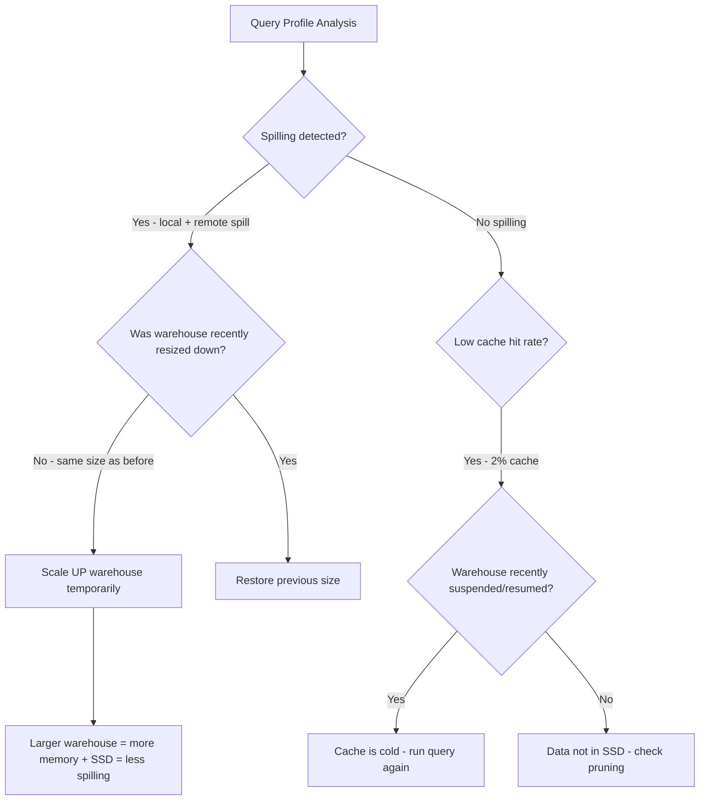

**Answer:** Scale UP the warehouse. Spilling to remote storage is the critical red flag — it means the warehouse doesn't have enough memory/SSD to hold intermediate results. The low cache hit (2%) compounds the issue (cold cache after suspend). The primary fix is a larger warehouse size which provides more memory to avoid spilling.

**Why Not the Others:**
| Option | Why It's Wrong |
|--------|---------------|
| Add multi-cluster | Multi-cluster helps concurrency, not individual query memory pressure |
| Add clustering key | Clustering helps pruning, but the Profile shows spilling as the bottleneck |
| Wait for cache to warm | Helps with the 2% cache rate but doesn't fix the spilling problem |
| Rewrite the query | Possible optimization, but Profile points to resource constraints, not bad SQL |

**Exam Trap:** Spilling = scale UP. Queueing = scale OUT. The exam specifically tests this distinction. Also know: spilling to *local* disk is concerning; spilling to *remote* storage is a severe performance problem because it uses slow S3/Blob reads for intermediate data.

---

## Scenario 6: Cloud Services Billing Spike Investigation

**Situation:** Your January invoice shows Cloud Services charges at 18% of total compute — well above the typical 10% included allowance. The account has 200 warehouses, heavy use of SHOW/DESCRIBE commands via automation, frequent cloning operations, and metadata-only queries. No change in warehouse sizes.

**Decision Flow:**
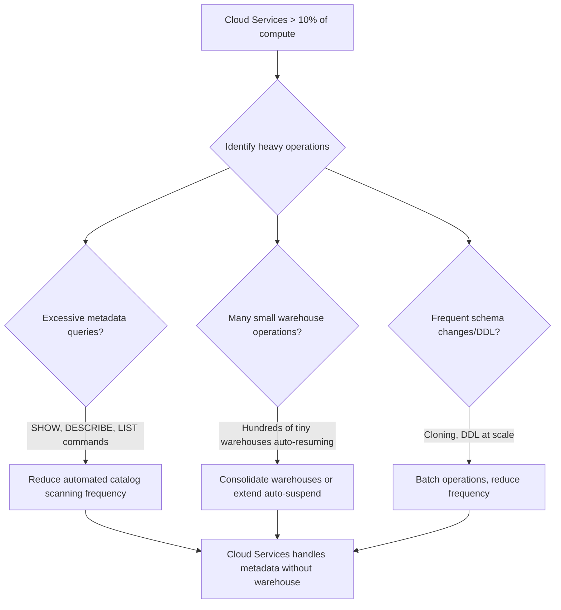

**Answer:** The automation running SHOW/DESCRIBE commands is the likely culprit. Cloud Services handles authentication, metadata operations, query parsing/optimization, and access control *without* using warehouse compute. When these operations exceed 10% of your daily warehouse consumption, you get billed for the excess. High-frequency automation hitting metadata endpoints drives this up.

**Why Not the Others:**
| Option | Why It's Wrong |
|--------|---------------|
| "Reduce warehouse size" | Smaller warehouses mean less total compute credit burn, making the 10% threshold *easier* to exceed |
| "Use larger warehouses" | Doesn't reduce Cloud Services usage — it just raises the 10% baseline |
| "Turn off result caching" | Result cache is free and doesn't contribute to Cloud Services charges |

**Exam Trap:** Cloud Services billing is confusing by design. Know these facts: (1) You only pay for Cloud Services that exceed 10% of your daily warehouse compute. (2) Metadata queries, authentication, and query compilation all consume Cloud Services. (3) A suspended warehouse with heavy metadata automation can still generate Cloud Services charges. The exam may describe a scenario where Cloud Services charges seem to come from "nowhere" — look for automation and metadata patterns.

---

## Scenario 7: Warehouse Size Selection for Workloads

**Situation:** You need to set up three warehouses: one for a nightly ETL that processes 500GB of raw data through complex transformations, one for an interactive BI tool used by 5 analysts running ad-hoc queries on summarized data (~50GB), and one for a data science team running ML feature engineering on 2TB datasets.

**Decision Flow:**

| Workload | Data Volume | Concurrency | Complexity | Recommended Size |
|----------|-------------|-------------|------------|-----------------|
| Nightly ETL | 500GB | Low (sequential jobs) | High (complex transforms) | XL or 2XL |
| Interactive BI | 50GB (summarized) | Medium (5 users) | Low-Medium (simple queries) | Medium or Large |
| ML Feature Eng. | 2TB | Low (few heavy queries) | Very High (joins, aggregation) | 2XL or 3XL |

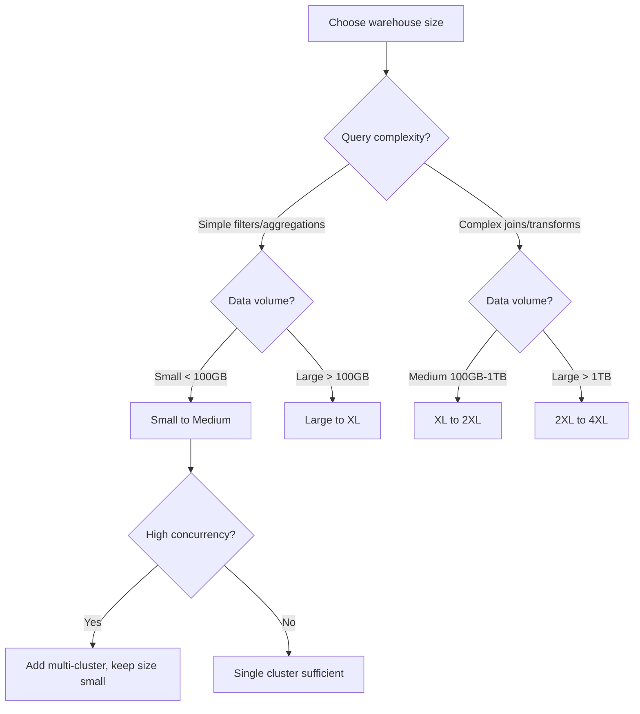

**Answer:** ETL → XL (complex transforms, large data, low concurrency), BI → Medium with multi-cluster (simple queries, small data, multiple users), ML → 2XL+ (heavy computation, massive data, few users). The key principle: size for complexity and volume, multi-cluster for concurrency.

**Why Not the Others:**
| Option | Why It's Wrong |
|--------|---------------|
| 4XL for everything | Wastes credits on BI queries that don't need the compute |
| XS for BI with more clusters | XS may not have enough memory/SSD for reasonable response times even on summarized data |
| Same size for ETL and ML | ML workload is 4x the data with higher complexity — needs more resources |

**Exam Trap:** Doubling warehouse size doubles cost AND doubles compute resources. The exam tests whether you know that a query running in 60 seconds on Medium will likely run in ~30 seconds on Large (linear scaling for well-optimized queries). Also: bigger is not always better — if the query is I/O bound on small data, a larger warehouse won't help.

---

## Scenario 8: Auto-Suspend vs Always-On Decision

**Situation:** Your company has three workload patterns: (A) a customer-facing API warehouse that receives 2-5 queries per second 24/7 with strict latency SLAs, (B) an analyst warehouse used 9 AM - 5 PM with gaps of 15-30 minutes between sessions, and (C) a batch ETL warehouse that runs for 2 hours at midnight then is idle for 22 hours.

**Decision Flow:**
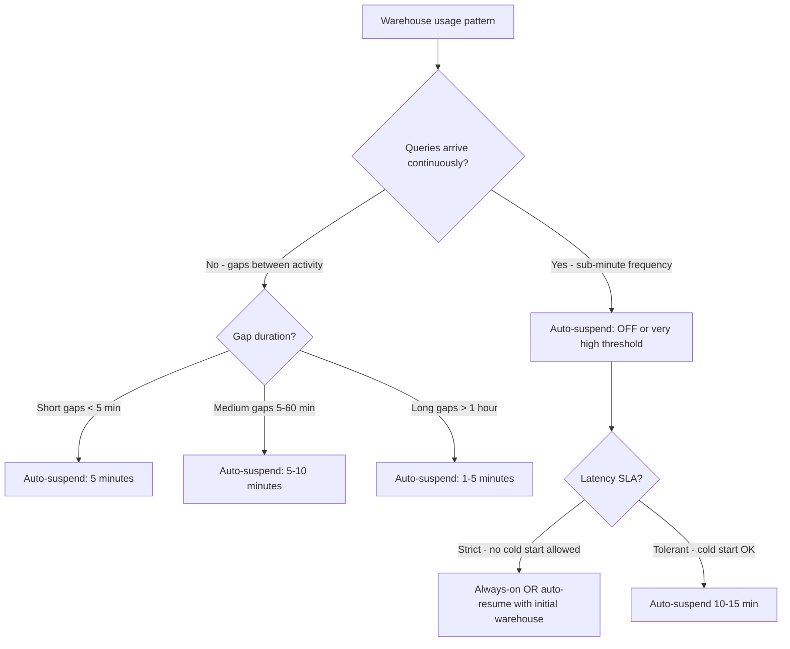

**Answer:**
- Warehouse A (API): Auto-suspend disabled or set very high (300+ seconds). Cold starts would violate SLA, and queries arrive constantly anyway.
- Warehouse B (Analysts): Auto-suspend at 5-10 minutes. Gaps are short enough that cold starts are annoying but tolerable; saves credits during lunch/meetings.
- Warehouse C (ETL): Auto-suspend at 60 seconds (minimum). Idle 22 hours/day — every extra minute costs money with zero benefit.

**Why Not the Others:**
| Option | Why It's Wrong |
|--------|---------------|
| Always-on for all three | Warehouse C would run 22 idle hours/day — pure waste |
| 1-minute suspend for API warehouse | Cold start latency (~1-3 seconds) violates SLA with continuous traffic |
| 60-minute suspend for ETL | ETL runs 2 hours then stops. 60 min extra idle = 50% wasted spend on that warehouse |

**Exam Trap:** Auto-suspend minimum is 60 seconds (1 minute) via SQL, or 5 minutes in the UI (older versions). The exam tests whether you know that a suspended warehouse *still retains its local SSD cache* when it resumes (as of recent Snowflake behavior). Also: auto-resume is instantaneous for provisioned compute — but the *first query* may still be slower if the cache is cold.

---

## Scenario 9: Standard vs Economy Scaling Policy

**Situation:** A retail company has two multi-cluster warehouses. Warehouse A powers a real-time inventory dashboard where speed is critical — every second of delay costs revenue during flash sales. Warehouse B handles overnight reporting where jobs are submitted in bulk and a few minutes of queueing is acceptable as long as all reports finish by 6 AM.

**Decision Flow:**
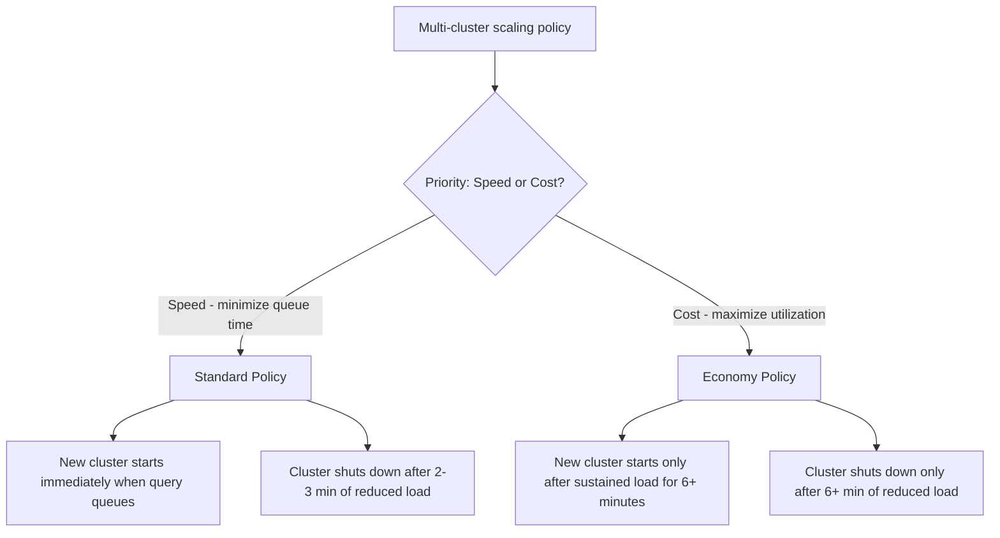

**Answer:**
- Warehouse A (real-time dashboard): **Standard** policy. Start clusters immediately when queueing is detected. Flash sale traffic spikes are sudden — 6 minutes of queueing would mean lost sales.
- Warehouse B (overnight reporting): **Economy** policy. Tolerate up to 6 minutes of queueing before scaling out. Saves credits by not spinning up clusters for brief load spikes. Reports have until 6 AM anyway.

**Why Not the Others:**
| Option | Why It's Wrong |
|--------|---------------|
| Economy for dashboard | 6-minute scale-out delay is unacceptable for real-time SLA |
| Standard for overnight batch | Wastes credits by scaling out for every brief spike — batch jobs can wait |
| Auto-scale to max for both | Over-provisioning is expensive; Economy exists specifically for cost-tolerant workloads |

**Exam Trap:** Standard = starts clusters aggressively (1 query queuing triggers scale-out), shuts down conservatively (2-3 min idle). Economy = starts clusters conservatively (6 min queuing threshold), shuts down aggressively (also checks if load has sustained). The exam tests whether you confuse which policy is "aggressive" about startup vs shutdown timing.

---

## Scenario 10: Architecture Layer Troubleshooting

**Situation:** A user complains: "I can log in to Snowflake, I can see all my databases, but when I run a query it says the warehouse is suspended and takes 5 seconds to start. Once running, the query scans way more data than expected." Three different issues — each maps to a different architecture layer.

**Decision Flow:**
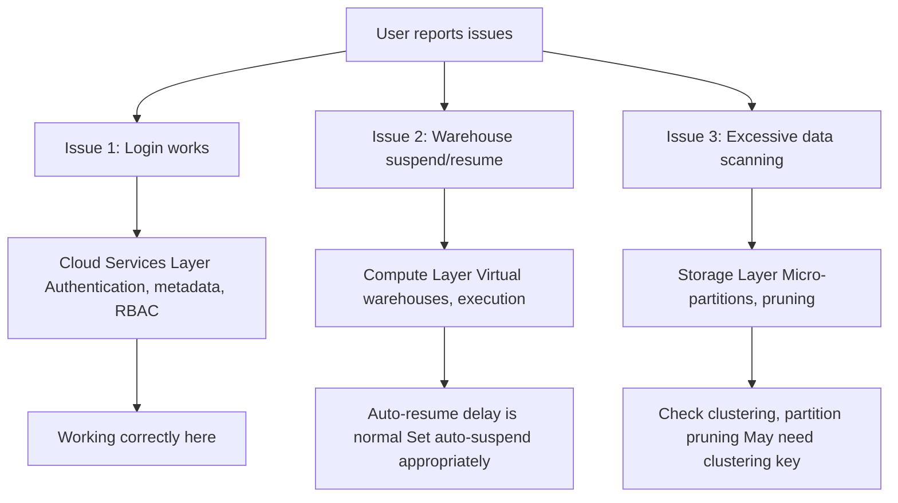

**Snowflake Three-Layer Architecture:**

| Layer | Responsibilities | Issues Mapped Here |
|-------|-----------------|-------------------|
| **Cloud Services** | Authentication, access control, metadata, query optimization, transaction management | Login failures, permission errors, billing anomalies, slow query compilation |
| **Compute (Query Processing)** | Virtual warehouses, query execution, caching (SSD) | Warehouse suspend/resume, query speed, spilling, concurrency queueing |
| **Storage** | Micro-partitions, data files, Time Travel, cloning | Excessive scanning, storage costs, Time Travel/Fail-safe, data organization |

**Answer:** The three issues map to all three layers: Cloud Services (login/metadata — working fine), Compute (warehouse resume — normal behavior, adjust auto-suspend settings), and Storage (excessive scanning — poor partition pruning, consider clustering key). Understanding which layer owns which behavior is critical for troubleshooting.

**Why Not the Others:**
| Option | Why It's Wrong |
|--------|---------------|
| "All issues are compute layer" | Login/metadata and data scanning efficiency are NOT warehouse responsibilities |
| "Storage layer handles caching" | Local SSD cache is part of the Compute layer (attached to warehouses) |
| "Cloud Services runs queries" | Cloud Services optimizes and compiles queries but does NOT execute them |

**Exam Trap:** The most common confusion: result cache is managed by Cloud Services (persisted for 24 hours regardless of warehouse state), but local disk/SSD cache belongs to the Compute layer (lost when warehouse suspends). The exam LOVES testing which layer owns which cache. Also: metadata cache (for COUNT, MIN, MAX) is Cloud Services — no warehouse needed.

---

## Scenario 11: Micro-Partitions and Data Loading Strategy

**Situation:** You're loading 100 million rows into a table daily. The data arrives sorted by `customer_id`, but 95% of analyst queries filter on `transaction_date`. After two weeks, queries filtering by date are scanning 80% of all partitions despite date ranges covering only 5% of the data.

**Decision Flow:**
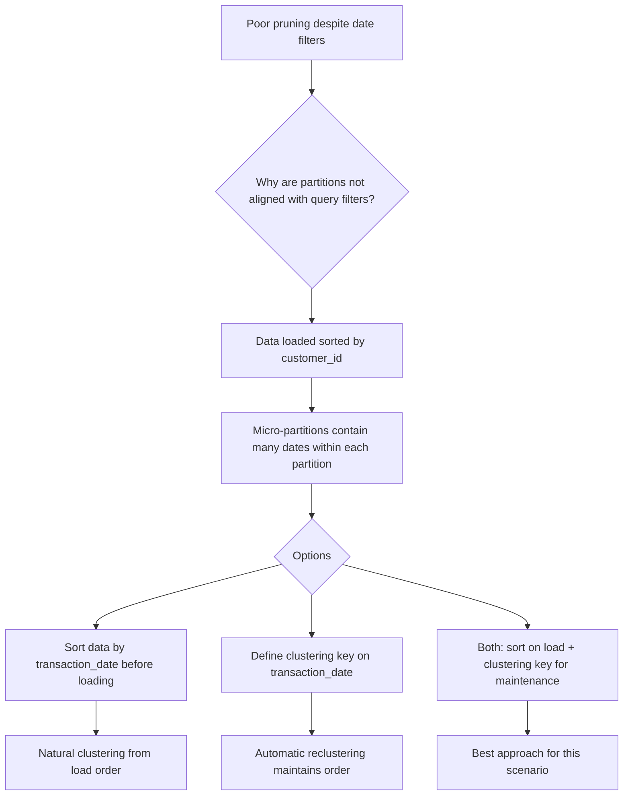

**Answer:** Define a clustering key on `transaction_date` AND consider pre-sorting data before loading. Since data arrives sorted by `customer_id`, micro-partitions contain random date ranges — making date-based pruning impossible. A clustering key will reorganize existing data and maintain date-aligned partitions as new data arrives. For a 100M-row-per-day table, this is large enough to benefit from explicit clustering.

**Why Not the Others:**
| Option | Why It's Wrong |
|--------|---------------|
| Just increase warehouse size | Scans 80% of partitions regardless of compute power — wasteful |
| Create a materialized view | MV grouped by date would help but adds storage cost and maintenance overhead |
| Partition the table manually | Snowflake doesn't support user-defined partitions — micro-partitioning is automatic |

**Exam Trap:** Snowflake micro-partitions are created automatically based on *insertion order*. If you load data sorted by Column A, the table is naturally clustered on Column A. The exam tests whether you understand that natural clustering degrades with DML and that data load order directly impacts pruning efficiency for different query patterns.

---

## Scenario 12: Virtual Warehouse Credits and Billing Mechanics

**Situation:** A team spins up a Large warehouse at 10:00:00, runs a query that completes at 10:00:45, and the warehouse auto-suspends at 10:01:00 (60-second minimum). At 10:05:00, the warehouse auto-resumes for another 30-second query, then auto-suspends at 10:06:00. The team asks: "Did we get billed for 6 minutes of Large warehouse?"

**Decision Flow:**
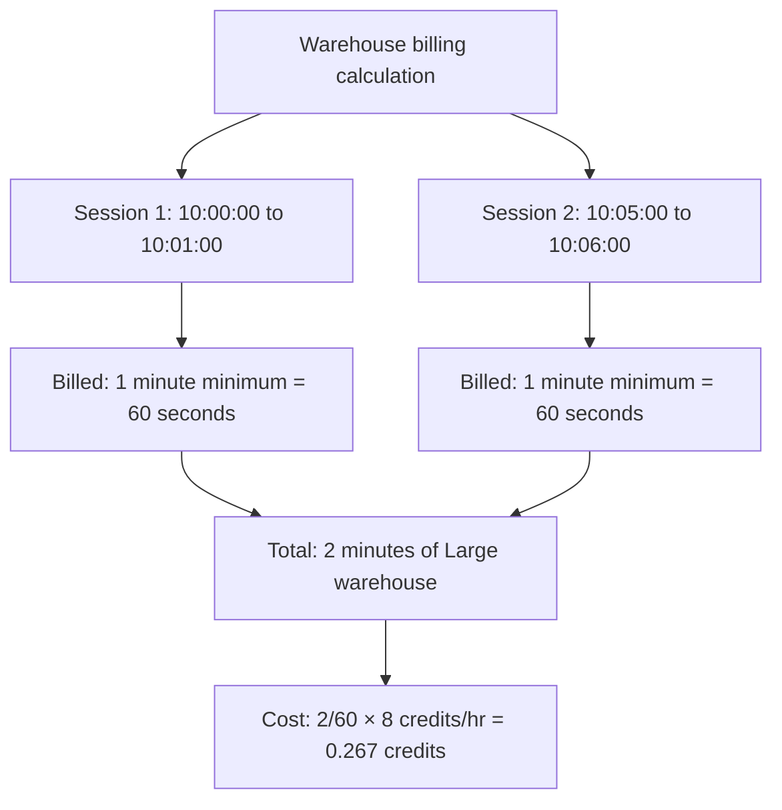

**Answer:** Billed for 2 minutes total (not 6). Snowflake bills per-second with a 60-second minimum per resume event. Session 1: warehouse ran for 60 seconds (min threshold). Gap: 4 minutes suspended = no charge. Session 2: warehouse ran for 60 seconds (min threshold). Total billed time = 120 seconds of Large warehouse.

**Why Not the Others:**
| Option | Why It's Wrong |
|--------|---------------|
| "Billed for 6 minutes" | Suspended time is not billed |
| "Billed for 45 + 30 = 75 seconds" | 60-second minimum applies per resume event, not actual runtime |
| "Billed for 1 minute total" | Each resume event independently triggers the 60-second minimum |

**Exam Trap:** Per-second billing with 60-second minimum *per start/resume event*. This means rapid suspend/resume cycles (say, every 90 seconds) can be MORE expensive than just leaving the warehouse running. If a warehouse resumes 60 times in an hour for 10-second queries, you're billed for 60 minutes — same as always-on. The exam tests whether you understand that the minimum billing applies *per resume event*, not per day.

---

## Quick Reference: Decision Cheat Sheet

| If the scenario mentions... | Think... |
|-----------------------------|----------|
| Queries queueing / high concurrency | Scale OUT (multi-cluster) |
| Queries individually slow / spilling | Scale UP (larger warehouse) |
| Dynamic data masking needed | Enterprise edition minimum |
| HIPAA / PCI compliance | Business Critical edition |
| Query returns in milliseconds | Result cache (Cloud Services) |
| Same data scanned faster second time | Local disk/SSD cache (Compute) |
| COUNT(*) returns instantly | Metadata cache (Cloud Services) |
| Table > 1TB with degraded pruning | Add clustering key |
| Cloud Services billing spike | Check automated metadata operations |
| Latency SLA with bursty traffic | Standard scaling policy |
| Cost savings on tolerant workloads | Economy scaling policy |

---

[← Back to Domain 1 README](./README.md) | [← Back to Main README](../README.md)

