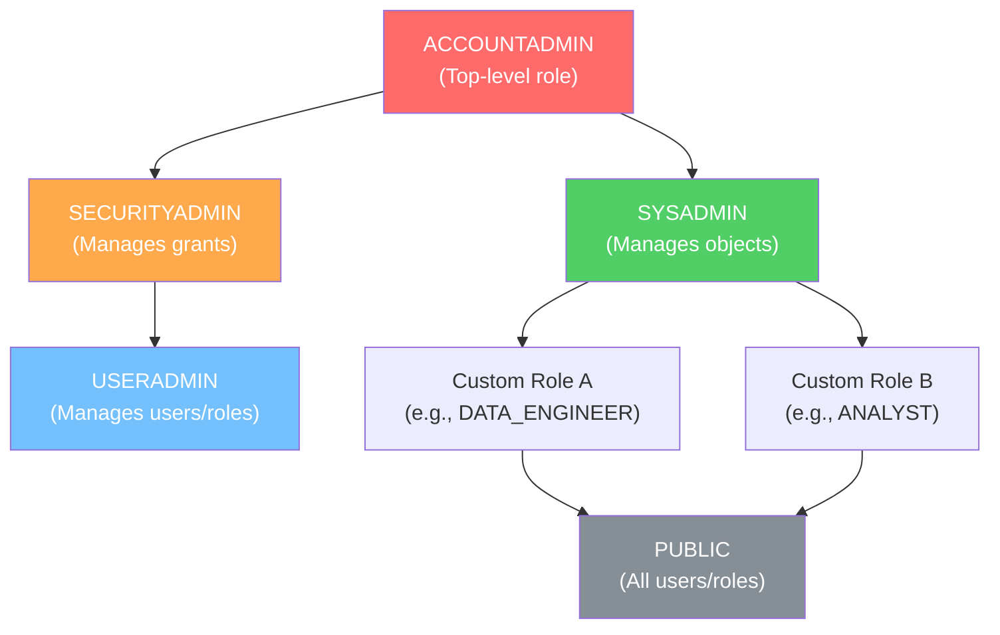

# 2.1 Access Control and RBAC

## Key Terms

| Term | Definition |
|------|-----------|
| **RBAC** | Role-Based Access Control — privileges are assigned to roles, and roles are granted to users |
| **DAC** | Discretionary Access Control — each object has an owner who can grant access to others |
| **Role** | A named entity to which privileges can be granted; roles are then granted to users or other roles |
| **Privilege** | A defined level of access to an object (e.g., SELECT, INSERT, USAGE) |
| **ACCOUNTADMIN** | Top-level system role combining SECURITYADMIN and SYSADMIN; most powerful role in an account |
| **SECURITYADMIN** | System role that manages grants and can manage any role in the account (via MANAGE GRANTS) |
| **SYSADMIN** | System role designated for creating and managing objects (warehouses, databases, schemas) |
| **USERADMIN** | System role dedicated to user and role management (CREATE USER, CREATE ROLE) |
| **PUBLIC** | Automatically granted to every user and every role in the account; lowest in the hierarchy |

---

## Overview

Access Control and RBAC is one of the most heavily tested topics in the SnowPro Core (COF-C03) exam, appearing across multiple question types. Snowflake implements a hybrid access control model combining **Role-Based Access Control (RBAC)** and **Discretionary Access Control (DAC)**. Understanding the role hierarchy, privilege inheritance direction, system-defined roles, and grant mechanics is essential for passing the exam.

Expect questions on:
- Which system role should perform a given action
- How privileges flow through the role hierarchy
- GRANT/REVOKE syntax and behavior
- Ownership transfer and managed access schemas
- Future grants and their scope

---

## System-Defined Roles

| Role | Purpose | Key Privileges | Best Practice |
|------|---------|---------------|---------------|
| ACCOUNTADMIN | Account-level administration | All privileges (superset of SECURITYADMIN + SYSADMIN) | Use sparingly; enable MFA; do NOT use for daily tasks |
| SECURITYADMIN | Security and grant management | MANAGE GRANTS globally; inherits USERADMIN | Manage all grants; monitor access |
| SYSADMIN | Object creation and management | CREATE WAREHOUSE, DATABASE, etc. | Own all custom roles (grant custom roles to SYSADMIN) |
| USERADMIN | User and role lifecycle | CREATE USER, CREATE ROLE | Create users and roles; grant roles to SECURITYADMIN |
| PUBLIC | Base role for all users | Minimal; auto-granted to every user and role | Never grant sensitive privileges to PUBLIC |

---

## Role Hierarchy Diagram



> **Privilege inheritance flows UP the hierarchy.** A parent role inherits all privileges of its child roles. In the diagram above, SYSADMIN inherits all privileges granted to CUSTOM_A, CUSTOM_B, and PUBLIC.

---

## Detailed Content

### RBAC vs DAC in Snowflake

Snowflake implements both access control models simultaneously:

**Role-Based Access Control (RBAC)** is the primary model. Privileges on securable objects are granted to roles, and roles are granted to users. Users can only perform actions allowed by their currently active role (or roles, when using secondary roles).

**Discretionary Access Control (DAC)** complements RBAC through the ownership concept. Every securable object has a single owning role. The owner has full control over the object, including the ability to grant privileges on it to other roles. Ownership is a special privilege that conveys all other privileges on the object.

The combination means:
- Objects are owned by roles (DAC)
- Access is controlled through role grants (RBAC)
- Privilege inheritance follows the role hierarchy (RBAC)

### System-Defined Roles

#### ACCOUNTADMIN

The most powerful role in any Snowflake account. It encapsulates both SECURITYADMIN and SYSADMIN, meaning it inherits all their privileges plus has account-level administrative capabilities:

- View and manage billing and credit usage
- Create resource monitors
- Manage account-level parameters
- Access Account Usage and Organization Usage data
- Create network policies (at account level)

**Best practices:** Assign to a minimum number of users (at least two for recovery), require MFA, never use as a default role, never create objects directly with ACCOUNTADMIN.

#### SECURITYADMIN

Designed for managing security across the account:

- Has the global MANAGE GRANTS privilege — can grant or revoke privileges on any object, regardless of ownership
- Inherits USERADMIN, so it can also create/manage users and roles
- Can modify any grant in the account

#### SYSADMIN

The recommended owner of all databases, warehouses, and other objects:

- CREATE WAREHOUSE, CREATE DATABASE at the account level
- All custom roles should be granted to SYSADMIN (directly or through a hierarchy) so it can manage all objects
- If a custom role is NOT in the SYSADMIN hierarchy, SYSADMIN cannot manage objects owned by that role

#### USERADMIN

Focused exclusively on identity management:

- CREATE USER and CREATE ROLE privileges
- Does NOT have MANAGE GRANTS — can create roles but not grant privileges on objects to them
- Inherits PUBLIC only

#### PUBLIC

A pseudo-role automatically granted to every user and every role:

- Any privilege granted to PUBLIC is available to all users in the account
- Cannot be dropped or revoked from users
- Use extreme caution when granting to PUBLIC

### Role Hierarchy and Privilege Inheritance

The role hierarchy is the most critical concept for the exam:

1. **Privileges flow UP** — A parent role automatically inherits all privileges of its child roles
2. **Role grants are cumulative** — If Role A is granted to Role B, then Role B has all privileges of Role A plus its own
3. **Users activate roles** — A user can only exercise privileges of their current active role (and its descendants)
4. **Secondary roles** — When enabled (`USE SECONDARY ROLES ALL`), a user can leverage privileges from all granted roles simultaneously

Example: If CUSTOM_ANALYST has SELECT on a table, and CUSTOM_ANALYST is granted to SYSADMIN, then SYSADMIN also has SELECT on that table through inheritance.

### Custom Roles and Best Practices

Custom roles should be created for specific business functions:

- **Always grant custom roles to SYSADMIN** (or to a role in the SYSADMIN hierarchy) so that system administrators can manage objects owned by custom roles
- **Use a layered hierarchy** — create access roles (object-level grants) and functional roles (granted to users), then grant access roles to functional roles
- **Principle of least privilege** — grant only the minimum privileges needed
- **Never grant custom roles directly to ACCOUNTADMIN** without also including them in the SYSADMIN path

### GRANT/REVOKE Syntax and Patterns

The core syntax:

```sql
-- Grant a privilege on an object to a role
GRANT <privilege> ON <object_type> <object_name> TO ROLE <role_name>;

-- Revoke a privilege
REVOKE <privilege> ON <object_type> <object_name> FROM ROLE <role_name>;

-- Grant a role to another role (hierarchy)
GRANT ROLE <child_role> TO ROLE <parent_role>;

-- Grant a role to a user
GRANT ROLE <role_name> TO USER <user_name>;
```

The `CASCADE` and `RESTRICT` options control behavior when revoking:
- `REVOKE ... CASCADE` — also revokes from any roles that received the privilege through the target role
- `REVOKE ... RESTRICT` (default) — fails if other roles depend on this grant

### Ownership and MANAGED ACCESS Schemas

**Ownership** is a special privilege:
- Every object has exactly one owning role
- The owner can perform all operations on the object, including granting privileges to other roles
- Ownership can be transferred using `GRANT OWNERSHIP`

**MANAGED ACCESS schemas** override the DAC model within a schema:
- Created with `CREATE SCHEMA ... WITH MANAGED ACCESS`
- In a managed access schema, the schema owner (or a role with MANAGE GRANTS) controls all privilege grants — NOT the individual object owners
- Object owners lose the ability to grant privileges on their own objects
- This centralizes access control and prevents privilege sprawl

### Future Grants

**Future grants** define privileges that will be automatically applied to objects created in the future within a specified scope:

- Scoped to a database or schema
- Apply to a specific object type (e.g., all future tables in schema X)
- Do NOT apply retroactively to existing objects
- Useful for automation and consistent access patterns

Important behaviors:
- Future grants on a schema take precedence over future grants on the parent database
- When an object is created, future grants are evaluated and applied at creation time
- If ownership is transferred after creation, future grants from the original scope remain

### Securable Objects and Privilege Types

Key privilege categories:

| Privilege | Applies To | Allows |
|-----------|-----------|--------|
| USAGE | Warehouses, Databases, Schemas, Roles | Access/use the object |
| SELECT | Tables, Views, Streams | Read data |
| INSERT, UPDATE, DELETE | Tables | Modify data |
| CREATE <object> | Databases, Schemas | Create child objects |
| OWNERSHIP | All objects | Full control including granting |
| OPERATE | Warehouses, Tasks | Start/stop/suspend |
| MONITOR | Warehouses, Tasks, Databases | View metadata and execution state |
| MANAGE GRANTS | Global | Grant/revoke any privilege globally |

---

## SQL Examples

### Example 1: Creating a Custom Role and Granting to SYSADMIN

```sql
-- Create a custom role
USE ROLE USERADMIN;
CREATE ROLE DATA_ENGINEER;

-- Grant it into the SYSADMIN hierarchy (best practice)
USE ROLE SECURITYADMIN;
GRANT ROLE DATA_ENGINEER TO ROLE SYSADMIN;

-- Grant to a user
GRANT ROLE DATA_ENGINEER TO USER jane_doe;
```

### Example 2: Granting Privileges on Objects

```sql
USE ROLE SECURITYADMIN;

-- Grant usage on warehouse and database
GRANT USAGE ON WAREHOUSE COMPUTE_WH TO ROLE DATA_ENGINEER;
GRANT USAGE ON DATABASE ANALYTICS_DB TO ROLE DATA_ENGINEER;
GRANT USAGE ON SCHEMA ANALYTICS_DB.PUBLIC TO ROLE DATA_ENGINEER;

-- Grant SELECT on all existing tables in a schema
GRANT SELECT ON ALL TABLES IN SCHEMA ANALYTICS_DB.PUBLIC TO ROLE DATA_ENGINEER;
```

### Example 3: Future Grants

```sql
USE ROLE SECURITYADMIN;

-- Grant SELECT on all FUTURE tables in a schema
GRANT SELECT ON FUTURE TABLES IN SCHEMA ANALYTICS_DB.PUBLIC TO ROLE DATA_ENGINEER;

-- Grant USAGE on all FUTURE schemas in a database
GRANT USAGE ON FUTURE SCHEMAS IN DATABASE ANALYTICS_DB TO ROLE DATA_ENGINEER;
```

### Example 4: Viewing Grants

```sql
-- Show all privileges granted to a role
SHOW GRANTS TO ROLE DATA_ENGINEER;

-- Show all privileges granted on a specific object
SHOW GRANTS ON DATABASE ANALYTICS_DB;

-- Show all roles granted to a user
SHOW GRANTS TO USER jane_doe;

-- Show future grants in a schema
SHOW FUTURE GRANTS IN SCHEMA ANALYTICS_DB.PUBLIC;
```

### Example 5: Managed Access Schema

```sql
USE ROLE SYSADMIN;

-- Create a managed access schema
CREATE SCHEMA ANALYTICS_DB.SECURE_SCHEMA WITH MANAGED ACCESS;

-- In managed access schemas, only the schema owner or SECURITYADMIN
-- can grant privileges, NOT individual object owners
USE ROLE SECURITYADMIN;
GRANT SELECT ON ALL TABLES IN SCHEMA ANALYTICS_DB.SECURE_SCHEMA TO ROLE ANALYST;
```

### Example 6: Ownership Transfer

```sql
USE ROLE SECURITYADMIN;

-- Transfer ownership of a table to a different role
GRANT OWNERSHIP ON TABLE ANALYTICS_DB.PUBLIC.SALES
  TO ROLE DATA_ENGINEER
  COPY CURRENT GRANTS;

-- Transfer ownership of all tables in a schema
GRANT OWNERSHIP ON ALL TABLES IN SCHEMA ANALYTICS_DB.PUBLIC
  TO ROLE DATA_ENGINEER
  COPY CURRENT GRANTS;
```

---

## Comparison Tables

### System Roles vs Custom Roles

| Aspect | System-Defined Roles | Custom Roles |
|--------|---------------------|--------------|
| Created by | Snowflake (automatically) | Users (via CREATE ROLE) |
| Can be dropped | No | Yes |
| Can be renamed | No | Yes |
| Default privileges | Pre-defined per role | None (must be explicitly granted) |
| Hierarchy position | Fixed relative to each other | Flexible; should be under SYSADMIN |
| Examples | ACCOUNTADMIN, SYSADMIN, PUBLIC | DATA_ENGINEER, ANALYST, ETL_ROLE |

### DAC vs RBAC in Snowflake

| Aspect | DAC | RBAC |
|--------|-----|------|
| Access determined by | Object owner | Role membership |
| Who grants access | Object owner (or role with MANAGE GRANTS) | Administrators via role hierarchy |
| Snowflake implementation | Ownership model | Role grants and hierarchy |
| Override mechanism | MANAGED ACCESS schemas | N/A |
| Primary model in Snowflake | Secondary | Primary |

---

## Exam Tips

1. **Privilege inheritance direction** — Privileges flow UP the hierarchy. A parent role inherits all privileges of its children. This is counter-intuitive and frequently tested.

2. **ACCOUNTADMIN warnings** — Never use as default role. Always require MFA. Assign to at least 2 users. Never create objects owned by ACCOUNTADMIN directly.

3. **SECURITYADMIN vs USERADMIN** — USERADMIN can CREATE users and roles but CANNOT grant privileges on objects. SECURITYADMIN can do both because it has MANAGE GRANTS and inherits USERADMIN.

4. **Custom role orphans** — If a custom role is NOT granted to SYSADMIN (or a role under SYSADMIN), then SYSADMIN cannot manage objects owned by that custom role. This is a common exam scenario.

5. **Future grants scope** — Schema-level future grants take precedence over database-level future grants for the same object type.

6. **MANAGED ACCESS** — In these schemas, object owners cannot grant privileges on their objects. Only the schema owner or roles with MANAGE GRANTS can.

7. **PUBLIC role** — Granting to PUBLIC means ALL users get that privilege. This is often a distractor in exam questions about least privilege.

8. **Active role vs granted roles** — A user can only exercise privileges from their currently active role and its descendants, unless secondary roles are enabled.

---

## Common Misconceptions

| Misconception | Reality |
|---------------|---------|
| "Privileges flow DOWN the hierarchy" | Privileges flow UP — parent roles inherit from children |
| "ACCOUNTADMIN should own all objects" | SYSADMIN (or custom roles under it) should own objects |
| "Object owners can always grant privileges" | Not in MANAGED ACCESS schemas — only schema owner or MANAGE GRANTS role can |
| "USERADMIN can grant privileges on tables" | USERADMIN can only CREATE USER and CREATE ROLE; it needs MANAGE GRANTS for object privileges |
| "Future grants apply to existing objects" | Future grants only apply to objects created AFTER the grant is made |
| "Revoking a role from a user deletes it" | The role still exists; the user just loses access to its privileges |
| "SYSADMIN automatically manages all objects" | Only if the owning role is in SYSADMIN's hierarchy |
| "Granting SELECT to PUBLIC is safe for internal data" | PUBLIC includes every user in the account, now and in the future |

---

## Key Takeaways

1. Snowflake uses a **hybrid RBAC + DAC** model, with RBAC as the primary mechanism
2. **Five system-defined roles** exist: ACCOUNTADMIN > SECURITYADMIN > USERADMIN, SYSADMIN (parallel), and PUBLIC (bottom)
3. **Privileges inherit upward** — parent roles accumulate all privileges of their child roles
4. **Custom roles should always roll up to SYSADMIN** to prevent orphaned object ownership
5. **MANAGED ACCESS schemas** centralize grant control, overriding DAC for objects within
6. **Future grants** automate privilege assignment for objects not yet created but do not apply retroactively
7. **SECURITYADMIN** is the go-to role for managing grants; **USERADMIN** is limited to identity management
8. **ACCOUNTADMIN** should be reserved for account-level administration, not daily use

---

## References

- [Snowflake Documentation: Access Control Framework](https://docs.snowflake.com/en/user-guide/security-access-control)
- [Snowflake Documentation: System-Defined Roles](https://docs.snowflake.com/en/user-guide/security-access-control-overview#system-defined-roles)
- [Snowflake Documentation: Role Hierarchy and Privilege Inheritance](https://docs.snowflake.com/en/user-guide/security-access-control-overview#role-hierarchy-and-privilege-inheritance)
- [Snowflake Documentation: Discretionary Access Control](https://docs.snowflake.com/en/user-guide/security-access-control-overview#discretionary-access-control)
- [Snowflake Documentation: Future Grants](https://docs.snowflake.com/en/sql-reference/sql/grant-privilege#future-grants-on-database-or-schema-objects)
- [Snowflake Documentation: Managed Access Schemas](https://docs.snowflake.com/en/user-guide/security-access-control-overview#managed-access-schemas)

---

*Previous: None (first in domain)* | *Next: [2.2 Data Protection and Security](./2.2_Data_Protection_and_Security.md)* | *[Domain 2 README](./README.md)* | *[Home](../README.md)*
