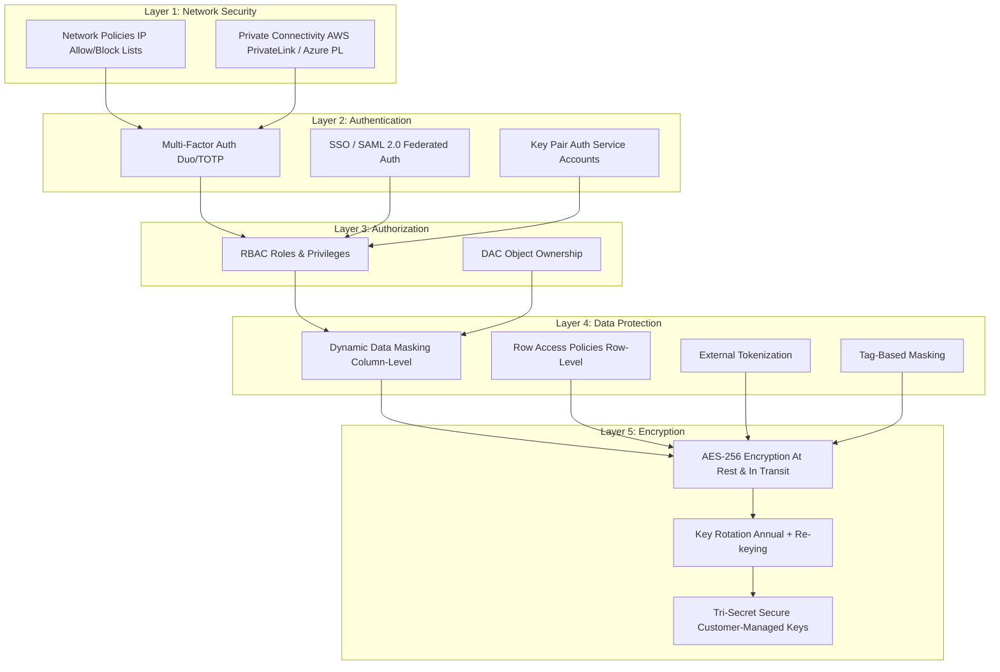

# 2.2 Data Protection and Security

---

> **Key Terms:** Dynamic Data Masking, Row Access Policy, Network Policy, Encryption, Tri-Secret Secure, MFA, SSO, Column-Level Security, External Tokenization, Key Rotation, SCIM, Tag-Based Masking

---

## Overview

Snowflake provides a comprehensive, defense-in-depth security architecture that protects data at every layer — from network access through authentication, authorization, and data-level protection. Unlike traditional databases where security is bolted on, Snowflake's security is built into the platform and is always active. Understanding which features are available in each edition is critical for the SnowPro Core exam, as many questions test whether a feature requires Standard, Enterprise, or Business Critical edition.

Snowflake's security model operates on the principle that **all data is encrypted at rest and in transit by default** — no configuration required. Additional security features layer on top to provide granular control over who can see what data, how they authenticate, and from where they can connect.

---

## Characteristics Table

| Feature | Edition Required | Scope | Key Behavior |
|---------|-----------------|-------|--------------|
| End-to-End Encryption (AES-256) | **Standard** (all editions) | All data | Always on, automatic, cannot be disabled |
| Automatic Key Rotation | **Standard** (all editions) | Encryption keys | Annual rotation (every 30 days for re-keying) |
| Periodic Re-keying | **Enterprise+** | Encryption keys | Re-encrypts data with new keys annually |
| Tri-Secret Secure | **Business Critical+** | Account | Customer-managed key + Snowflake key = composite key |
| Dynamic Data Masking | **Enterprise+** | Column | Masks data based on querying role |
| External Tokenization | **Enterprise+** | Column | Replaces sensitive data with tokens via external function |
| Row Access Policies | **Enterprise+** | Row | Filters rows based on querying context |
| Tag-Based Masking | **Enterprise+** | Column (via tags) | Applies masking policies through object tags |
| Network Policies | **Standard** (all editions) | Account/User | IP allow/block lists for connection control |
| MFA (Multi-Factor Authentication) | **Standard** (all editions) | User | TOTP-based second factor via Duo |
| Federated Authentication (SSO/SAML) | **Standard** (all editions) | Account | SAML 2.0 integration with IdPs |
| SCIM | **Standard** (all editions) | Account | Automated user/role provisioning |
| Private Connectivity (AWS PrivateLink, Azure Private Link, GCP Private Service Connect) | **Business Critical+** | Account | Network-level isolation |

---

## Security Layers Diagram



---

## Detailed Content

### End-to-End Encryption

**Encryption** in Snowflake is always on and requires zero configuration. All data is encrypted using AES-256 (Advanced Encryption Standard with 256-bit keys), which is the strongest commercially available encryption standard.

**Key facts for the exam:**
- Data is encrypted **at rest** (in storage) and **in transit** (TLS 1.2 minimum)
- Encryption is **automatic** — it cannot be disabled
- Snowflake uses a hierarchical key model: root key → account key → table key → file key
- **Key rotation** occurs automatically every 30 days (key versions are rotated)
- **Periodic re-keying** (Enterprise+) re-encrypts all data with a new key annually, retiring old key versions entirely

The distinction between key rotation and re-keying is important: rotation creates a new version of a key (old data stays encrypted with old version), while re-keying actually re-encrypts the data with the new key.

### Tri-Secret Secure

**Tri-Secret Secure** is a Business Critical+ feature that provides customer-controlled encryption. It combines:

1. A **Snowflake-maintained key** (managed by Snowflake)
2. A **customer-managed key** (maintained in the customer's cloud provider KMS — AWS KMS, Azure Key Vault, or GCP Cloud KMS)
3. A **composite master key** derived from both

The critical exam point: if the customer revokes their key, Snowflake **cannot** decrypt the data. This gives customers ultimate control — they can effectively "lock out" Snowflake from accessing their data at any time.

**Requirements:**
- Business Critical edition or higher
- Cloud provider KMS (AWS KMS, Azure Key Vault, GCP Cloud KMS)
- Configuration through Snowflake Support

### Dynamic Data Masking

**Dynamic Data Masking** (Enterprise+) applies a masking function to column data at query time based on the role of the user executing the query. The underlying data is never modified — masking is applied on-the-fly during query execution.

Key characteristics:
- Defined as a **masking policy** (schema-level object)
- Applied to columns, not tables
- Uses **conditional logic** based on the executing role
- Multiple columns can share the same policy
- Data type of input and output must match (or be compatible)
- A column can have only **one** masking policy at a time
- Policies are evaluated at query time, not write time

### Row Access Policies

A **Row Access Policy** (Enterprise+) controls which rows are visible to a given query based on the context of execution (role, user, session attributes). Unlike views that filter data statically, row access policies are dynamic and centrally managed.

Key characteristics:
- Applied to a table or view (not a column)
- Returns a boolean expression: `TRUE` = row is visible, `FALSE` = row is filtered out
- A table can have only **one** row access policy at a time
- Can reference **mapping tables** to determine access (e.g., a table of which roles can see which regions)
- Does NOT change data — it filters result sets
- Cannot be applied alongside a masking policy on the same column simultaneously as policy condition (but both can exist on the same table)

### External Tokenization

**External Tokenization** (Enterprise+) replaces sensitive data with tokens by calling an external function (backed by a cloud service like AWS Lambda, Azure Functions, or a third-party tokenization vault). Unlike masking, tokenization physically stores the tokenized value.

Key differences from dynamic masking:
- Tokenization **replaces** stored data; masking only affects query output
- De-tokenization requires an external call to the vault
- Used for compliance scenarios (PCI-DSS) where sensitive data cannot reside in the database at all
- Implemented via external functions called within masking policies

### Network Policies

A **Network Policy** restricts access to Snowflake based on IP addresses. It defines allowed and blocked IP ranges.

Key characteristics:
- Available in **all editions** (Standard and above)
- Can be applied at the **account level** (affects all users) or **individual user level**
- Uses an **allow list** (ALLOWED_IP_LIST) and optional **block list** (BLOCKED_IP_LIST)
- If only an allow list is specified, all other IPs are implicitly blocked
- If a block list is specified, it takes priority over the allow list for overlapping ranges
- User-level policies take precedence over account-level policies
- At least one IP must always be able to connect (prevents lockout)

### MFA and Federated Authentication

**Multi-Factor Authentication (MFA)** provides a second factor of authentication using Duo Security (TOTP-based). It is available in all editions and can be enforced at the user level.

**Federated Authentication (SSO)** integrates Snowflake with SAML 2.0 identity providers (Okta, Azure AD, ADFS, PingFederate, etc.). Key points:
- Snowflake acts as the **Service Provider (SP)**
- The customer's IdP acts as the **Identity Provider**
- Supports both IdP-initiated and SP-initiated SSO
- Can be configured to require SSO (disable password-based login)

**SCIM** (System for Cross-domain Identity Management) automates user and role provisioning from an IdP to Snowflake.

### Column-Level Security with Tag-Based Masking

**Tag-based masking** (Enterprise+) combines object tagging with masking policies for scalable **column-level security**. Instead of applying masking policies individually to each column, you:

1. Create a tag (e.g., `PII_TYPE`)
2. Assign a masking policy to the tag
3. Apply the tag to columns

When a tagged column is queried, the associated masking policy is automatically applied. This allows governance teams to protect hundreds of columns by managing tags rather than individual policy assignments.

---

## SQL Examples

### Example 1: Create a Dynamic Data Masking Policy

```sql
-- Enterprise+ feature
-- Mask SSN: full value for ANALYST role, masked for others
CREATE OR REPLACE MASKING POLICY ssn_mask AS (val STRING)
RETURNS STRING ->
  CASE
    WHEN CURRENT_ROLE() IN ('ANALYST', 'SYSADMIN') THEN val
    ELSE '***-**-' || RIGHT(val, 4)
  END;

-- Apply the policy to a column
ALTER TABLE hr.employees
  MODIFY COLUMN ssn
  SET MASKING POLICY ssn_mask;
```

### Example 2: Create a Row Access Policy

```sql
-- Enterprise+ feature
-- Only show rows where the user's role matches the region_access mapping table
CREATE OR REPLACE ROW ACCESS POLICY region_filter AS (region_col VARCHAR)
RETURNS BOOLEAN ->
  EXISTS (
    SELECT 1 FROM governance.region_access_mapping
    WHERE role_name = CURRENT_ROLE()
      AND allowed_region = region_col
  )
  OR CURRENT_ROLE() IN ('SYSADMIN', 'ACCOUNTADMIN');

-- Apply to a table
ALTER TABLE sales.orders
  ADD ROW ACCESS POLICY region_filter ON (ship_region);
```

### Example 3: Create and Apply a Network Policy

```sql
-- Available in ALL editions
-- Allow only corporate IP range, block a specific IP within that range
CREATE OR REPLACE NETWORK POLICY corp_network_policy
  ALLOWED_IP_LIST = ('192.168.1.0/24', '10.0.0.0/8')
  BLOCKED_IP_LIST = ('192.168.1.99');

-- Apply at account level
ALTER ACCOUNT SET NETWORK_POLICY = corp_network_policy;

-- Apply to a specific user instead
ALTER USER service_user SET NETWORK_POLICY = corp_network_policy;
```

### Example 4: Enforce MFA for a User

```sql
-- Available in ALL editions
-- Require MFA for a specific user
ALTER USER john_doe SET MINS_TO_BYPASS_MFA = 0;

-- Check MFA enrollment status
SELECT name, has_mfa
FROM TABLE(RESULT_SCAN(LAST_QUERY_ID()))
WHERE has_mfa = 'false';

-- Disable MFA bypass (enforce MFA at every login)
ALTER ACCOUNT SET ENABLE_MFA_REQUIREMENT = TRUE;  -- Account-level enforcement
```

### Example 5: Tag-Based Masking Policy

```sql
-- Enterprise+ feature
-- Step 1: Create a tag
CREATE OR REPLACE TAG governance.tags.pii_type ALLOWED_VALUES 'EMAIL', 'PHONE', 'SSN';

-- Step 2: Create masking policy
CREATE OR REPLACE MASKING POLICY governance.policies.pii_string_mask AS (val STRING)
RETURNS STRING ->
  CASE
    WHEN CURRENT_ROLE() IN ('DATA_STEWARD') THEN val
    ELSE '*** MASKED ***'
  END;

-- Step 3: Assign masking policy to the tag
ALTER TAG governance.tags.pii_type
  SET MASKING POLICY governance.policies.pii_string_mask;

-- Step 4: Tag columns — masking is automatically applied
ALTER TABLE customers MODIFY COLUMN email SET TAG governance.tags.pii_type = 'EMAIL';
ALTER TABLE customers MODIFY COLUMN phone SET TAG governance.tags.pii_type = 'PHONE';
```

### Example 6: Unset Policies and View Policy References

```sql
-- Remove a masking policy from a column
ALTER TABLE hr.employees
  MODIFY COLUMN ssn
  UNSET MASKING POLICY;

-- Remove a row access policy from a table
ALTER TABLE sales.orders
  DROP ROW ACCESS POLICY region_filter;

-- View all policy references in the account
SELECT *
FROM TABLE(INFORMATION_SCHEMA.POLICY_REFERENCES(
  POLICY_NAME => 'ssn_mask'
));

-- Drop a network policy (must unset from account/user first)
ALTER ACCOUNT UNSET NETWORK_POLICY;
DROP NETWORK POLICY corp_network_policy;
```

---

## Comparison Table

| Aspect | Dynamic Data Masking | Row Access Policy | External Tokenization |
|--------|---------------------|-------------------|----------------------|
| **Scope** | Column values | Entire rows | Column values |
| **Data modified?** | No (query-time only) | No (query-time filter) | Yes (stored as tokens) |
| **Edition** | Enterprise+ | Enterprise+ | Enterprise+ |
| **Applied to** | Column | Table/View | Column (via masking + external function) |
| **Return type** | Same data type as column | Boolean (TRUE/FALSE) | Same data type as column |
| **Multiple per table?** | One per column | One per table | One per column |
| **Reversible?** | N/A (data unchanged) | N/A (data unchanged) | Requires de-tokenization call |
| **Use case** | Hide PII from analysts | Restrict row visibility by region/dept | PCI-DSS compliance, data never in Snowflake |
| **Performance impact** | Minimal | Can impact if mapping table is large | Higher (external call latency) |

---

## Exam Tips

1. **Edition requirements are heavily tested.** Memorize: Encryption + Network Policies + MFA = Standard; Masking + Row Access + Tokenization + Re-keying = Enterprise; Tri-Secret Secure + Private Connectivity = Business Critical.

2. **One policy per object rule:** A column can have only ONE masking policy. A table can have only ONE row access policy. Know this distinction.

3. **Network policy precedence:** User-level network policy overrides account-level. If both exist, the user-level policy is evaluated.

4. **Masking policy data types:** The return type must match (or be castable to) the column's data type. You cannot mask a NUMBER column and return a STRING.

5. **Key rotation vs. re-keying:** Rotation changes the key used for NEW writes. Re-keying (Enterprise+) re-encrypts ALL existing data with the new key. Both happen automatically.

6. **Tri-Secret Secure consequence:** If the customer revokes their CMK, ALL data becomes inaccessible — even to Snowflake. This is by design.

7. **CURRENT_ROLE() vs IS_ROLE_IN_SESSION():** Masking policies often use `CURRENT_ROLE()`, but `IS_ROLE_IN_SESSION()` checks the role hierarchy (recommended for policies that should respect inheritance).

8. **Tag-based masking scales governance:** Instead of applying policies to 500 columns individually, tag them and let the tag carry the policy. Expect questions about this approach.

---

## Common Misconceptions

| Misconception | Reality |
|---------------|---------|
| "Encryption must be enabled in Snowflake" | Encryption is always on and cannot be disabled |
| "Dynamic masking modifies the stored data" | Masking is applied at query time only — underlying data is unchanged |
| "Network policies require Enterprise edition" | Network policies are available in **Standard** (all editions) |
| "You can apply multiple masking policies to one column" | Only ONE masking policy per column is allowed |
| "Tri-Secret Secure is available in Enterprise" | It requires **Business Critical** or higher |
| "Row access policies go on columns" | Row access policies are applied to **tables or views**, not columns |
| "MFA is automatic for all users" | MFA must be enrolled per user; it can be encouraged but is user-initiated (unless policy enforced) |
| "Key rotation and re-keying are the same" | Rotation changes the active key; re-keying re-encrypts existing data with the new key |
| "SSO replaces Snowflake authentication entirely" | SSO can coexist with password auth unless explicitly disabled |

---

## Key Takeaways

- Snowflake encryption is **always on** (AES-256, at rest and in transit) — this is not optional
- **Dynamic Data Masking** and **Row Access Policies** are Enterprise+ features that protect data without modifying it
- **Network Policies** (all editions) control WHERE users connect from; **MFA/SSO** control HOW they authenticate
- **Tri-Secret Secure** (Business Critical+) gives customers a "kill switch" via customer-managed encryption keys
- **Tag-based masking** is the scalable approach to column-level security across large data estates
- The exam frequently tests **edition requirements** — know which features require Standard, Enterprise, or Business Critical
- One masking policy per column, one row access policy per table — these limits are testable facts
- Masking policies return the same data type; row access policies return a boolean

---

## References

- [Snowflake Documentation: End-to-End Encryption](https://docs.snowflake.com/en/user-guide/security-encryption)
- [Snowflake Documentation: Tri-Secret Secure](https://docs.snowflake.com/en/user-guide/security-encryption-manage)
- [Snowflake Documentation: Dynamic Data Masking](https://docs.snowflake.com/en/user-guide/security-column-ddm-intro)
- [Snowflake Documentation: Row Access Policies](https://docs.snowflake.com/en/user-guide/security-row-intro)
- [Snowflake Documentation: Network Policies](https://docs.snowflake.com/en/user-guide/network-policies)
- [Snowflake Documentation: Tag-Based Masking](https://docs.snowflake.com/en/user-guide/tag-based-masking-policies)
- [Snowflake Documentation: MFA](https://docs.snowflake.com/en/user-guide/security-mfa)
- [Snowflake Documentation: Federated Authentication](https://docs.snowflake.com/en/user-guide/admin-security-fed-auth-overview)

---

## Additional Exam Scenarios

### Scenario 1: Dynamic Masking — Different Results by Role

**Question:** An analyst queries `SELECT ssn FROM hr.employees` and sees `***-**-1234` for every row. An admin runs the same query and sees full SSN values like `123-45-1234`. No views are involved. How is this configured?

**Answer:** A **dynamic data masking policy** is applied to the `ssn` column. The policy uses `CURRENT_ROLE()` (or `IS_ROLE_IN_SESSION()`) in a CASE expression: if the querying role is a privileged role (e.g., `HR_ADMIN`), return the actual value; otherwise, return a masked version. The underlying data is never modified — masking is applied at query time based on the executing role. The analyst's role doesn't match the privileged condition, so they see the masked output.

---

### Scenario 2: Network Policy — User Blocked Despite Allow List

**Question:** A user's IP address `10.0.1.50` is in the allowed IP list of their user-level network policy. However, they still cannot connect. What could cause this?

**Answer:** If an **account-level network policy** exists and the user's IP is NOT in that account-level allow list, the connection is blocked before the user-level policy is evaluated. Wait — actually, **user-level policies take precedence over account-level policies**. The more likely scenario: the user's IP is in the allow list but ALSO matches an entry in the **BLOCKED_IP_LIST**, which takes priority over the allow list for overlapping ranges. Another possibility: the IP the user is actually connecting from differs from what they think (e.g., NAT, VPN, or proxy is changing their source IP).

---

### Scenario 3: Row Access Policy vs Secure View

**Question:** A company needs to restrict which rows different departments can see in a shared table. Should they use a row access policy or secure views?

**Answer:** Use a **row access policy** when: (1) you want a single centralized policy on the base table that applies regardless of how the table is queried, (2) multiple roles/applications query the same table, and (3) you want to manage access rules independently from query logic. Use a **secure view** when: (1) you need to hide the underlying table structure and query logic from users, (2) you want to combine row filtering with column filtering and transformations, or (3) you need to prevent users from reverse-engineering filter logic through EXPLAIN plans. Row access policies are more scalable for pure row-level security; secure views are better for combined transformations and access control.

---

### Scenario 4: Key Rotation vs Re-keying

**Question:** What is the difference between Snowflake's automatic key rotation and periodic re-keying? Which requires Enterprise edition?

**Answer:** **Key rotation** (all editions) creates a new version of the encryption key approximately every 30 days. New data is encrypted with the new key version, but existing data remains encrypted with the old version — the old key version is retained to decrypt it. **Periodic re-keying** (Enterprise+ only) goes further: it re-encrypts ALL existing data with the current key version, then retires the old key version entirely. Re-keying happens approximately annually. The distinction: rotation protects future data; re-keying protects existing data by eliminating old key versions.

---

### Scenario 5: MFA Required for ACCOUNTADMIN

**Question:** Is MFA automatically enforced for all users with the ACCOUNTADMIN role?

**Answer:** **No**, MFA is not automatically enforced by default. MFA enrollment in Snowflake is user-initiated — users must enroll themselves via the Snowflake UI. However, it is a **strong best practice** (and Snowflake recommends) that all users with ACCOUNTADMIN must have MFA enabled. Administrators can encourage this by monitoring MFA status and can enforce MFA at the account level using authentication policies. The exam expects you to know that MFA for ACCOUNTADMIN is a best practice recommendation, not a system-enforced default.

---

### Scenario 6: External Tokenization vs Dynamic Masking — PCI Compliance

**Question:** A company must achieve PCI-DSS compliance and is told that credit card numbers cannot be stored in readable form anywhere in the database, even encrypted. Should they use dynamic masking or external tokenization?

**Answer:** **External tokenization** is the correct choice. Dynamic masking only hides data at query time — the actual credit card numbers still exist in storage (encrypted, but present). For PCI-DSS, the requirement is that sensitive data must not reside in the database at all. External tokenization replaces the actual values with meaningless tokens before storage, with the real values held in a separate tokenization vault (e.g., AWS Lambda-backed vault, Protegrity, Voltage). De-tokenization requires a call to the external service. This satisfies PCI-DSS because the cardholder data never exists in Snowflake's storage.

---

### Scenario 7: Tag-Based Masking — Data Classification Scenario

**Question:** A governance team needs to apply masking to 200+ columns across 50 tables that contain email addresses. What is the most scalable approach?

**Answer:** Use **tag-based masking**: (1) Create a tag like `PII_TYPE` with allowed value `'EMAIL'`. (2) Create a masking policy that masks email values for non-privileged roles. (3) Attach the masking policy to the tag. (4) Apply the tag to all 200+ email columns. When any tagged column is queried, the masking policy is automatically enforced. This is far more scalable than applying individual masking policies to each column — if the masking logic needs to change, update the single policy and it applies everywhere the tag exists. This also works with Snowflake's data classification feature, which can automatically detect and tag PII columns.

---

### Scenario 8: Tri-Secret Secure — Edition Requirement

**Question:** A financial services company requires that they maintain a "kill switch" to make all their Snowflake data inaccessible, even to Snowflake employees. What feature and edition do they need?

**Answer:** They need **Tri-Secret Secure**, which requires **Business Critical edition** (or higher). Tri-Secret Secure creates a composite master key from a Snowflake-managed key and a customer-managed key (held in their own cloud KMS — AWS KMS, Azure Key Vault, or GCP Cloud KMS). If the customer revokes their key from the KMS, the composite key cannot be reconstituted and ALL data becomes permanently inaccessible — even Snowflake cannot decrypt it. This is the "kill switch" for data sovereignty and compliance scenarios. Enterprise edition is NOT sufficient.

---

| Previous | Domain | Next |
|----------|--------|------|
| [2.1 Access Control and RBAC](./2.1_Access_Control_and_RBAC.md) | [Domain 2](./README.md) | [2.3 Resource Monitors and Account Management](./2.3_Resource_Monitors_and_Account_Management.md) |

[Home](../README.md)
