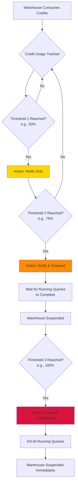

# 2.3 Resource Monitors and Account Management

> **Key Terms:** Resource Monitor, Credit Quota, Session Parameters, Account Parameters, ACCOUNT_USAGE, INFORMATION_SCHEMA, Organization, Account Identifier

---

## Overview

Resource monitors and account management are critical components of Snowflake's cost governance and operational visibility framework. Resource monitors provide proactive credit consumption controls at the warehouse or account level, while the metadata schemas (ACCOUNT_USAGE and INFORMATION_SCHEMA) deliver the observability needed to audit usage, troubleshoot issues, and optimize costs. Understanding the parameter hierarchy and organizational structure completes the picture of how Snowflake accounts are configured and managed.

This topic is heavily tested on the SnowPro Core exam, particularly the behavioral differences between ACCOUNT_USAGE and INFORMATION_SCHEMA, resource monitor trigger actions, and the parameter hierarchy.

---

## Characteristics

| Feature | Details |
|---------|---------|
| Resource Monitor Scope | Account-level or warehouse-level |
| Trigger Thresholds | Percentage of credit quota (e.g., 50%, 75%, 100%) |
| Actions | Notify, Notify & Suspend, Notify & Suspend Immediately |
| Suspend Behavior | Waits for running queries to complete before suspending |
| Suspend Immediately Behavior | Kills all running queries and suspends immediately |
| Monitor Frequency | Daily, Weekly, Monthly, Yearly, or Never (no reset) |
| Who Can Create | ACCOUNTADMIN only (by default) |
| Credit Quota Reset | Resets at the start of each monitoring interval |

---

## Resource Monitor Trigger Flow



---

## Resource Monitors

A **resource monitor** is a Snowflake object that controls credit consumption by imposing limits on warehouses or the entire account. Only users with the **ACCOUNTADMIN** role can create resource monitors by default.

### Creating and Assigning Resource Monitors

Resource monitors are defined with a **credit quota** (the maximum number of credits allowed), a monitoring interval (frequency), and one or more trigger thresholds with associated actions.

A single resource monitor can be assigned to:
- **One or more warehouses** — controls credits consumed by those specific warehouses
- **The account** — controls total credit consumption across all warehouses in the account

A warehouse can only have **one** resource monitor assigned to it at a time. However, if an account-level monitor exists, both the account-level and warehouse-level monitors apply simultaneously.

### Actions and Trigger Behaviors

| Action | Behavior | Impact on Running Queries |
|--------|----------|--------------------------|
| **Notify** | Sends notification only | None — queries continue |
| **Notify & Suspend** | Sends notification and suspends warehouse | Running queries complete; new queries are blocked |
| **Notify & Suspend Immediately** | Sends notification and immediately suspends | All running queries are killed; new queries are blocked |

The distinction between Suspend and Suspend Immediately is exam-critical:
- **Suspend** is graceful — it allows all currently executing statements to finish, then suspends the warehouse
- **Suspend Immediately** is forceful — it cancels all running statements and suspends the warehouse immediately

### Monitoring Interval and Credit Quota Reset

The **credit quota** resets at the beginning of each monitoring interval. Available frequencies:
- **Daily** — resets every day at midnight (account timezone)
- **Weekly** — resets every Monday
- **Monthly** — resets on the first of each month
- **Yearly** — resets on January 1
- **Never** — quota never resets; tracks cumulative usage from the start date

---

## Parameter Hierarchy

Snowflake parameters exist at three levels, forming a hierarchy where lower levels override higher levels:

| Level | Scope | Set By | Example Parameters |
|-------|-------|--------|-------------------|
| **Account Parameters** | Entire account | ACCOUNTADMIN | NETWORK_POLICY, PERIODIC_DATA_REKEYING |
| **Session Parameters** | Current user session | Any user (for their own session) | QUERY_TAG, TIMESTAMP_OUTPUT_FORMAT |
| **Object Parameters** | Specific object (warehouse, database, schema) | Object owner | STATEMENT_TIMEOUT_IN_SECONDS, DATA_RETENTION_TIME_IN_DAYS |

Key rules:
- Object parameters override account parameters for that object
- Session parameters override account parameters for that session
- Some parameters exist at multiple levels (e.g., STATEMENT_TIMEOUT_IN_SECONDS)
- Account parameters apply as defaults when no lower-level override exists

---

## ACCOUNT_USAGE Schema

The **ACCOUNT_USAGE** schema resides in the shared `SNOWFLAKE` database and provides comprehensive historical metadata about your account.

Key characteristics:
- **Data latency**: 45 minutes to 3 hours (not real-time)
- **Retention**: Up to **365 days** of historical data
- **Scope**: All objects across the entire account (including dropped objects)
- **Access**: Requires ACCOUNTADMIN role or granted IMPORTED PRIVILEGES on SNOWFLAKE database
- **Location**: `SNOWFLAKE.ACCOUNT_USAGE`

Important views:
- `WAREHOUSE_METERING_HISTORY` — credit consumption per warehouse
- `LOGIN_HISTORY` — authentication events and failures
- `QUERY_HISTORY` — all queries executed in the account
- `STORAGE_USAGE` — daily storage consumption
- `ACCESS_HISTORY` — data access audit trail
- `TABLES` / `COLUMNS` — metadata for all tables including dropped ones

---

## INFORMATION_SCHEMA

The **INFORMATION_SCHEMA** is an ANSI-standard schema present in every database, providing real-time metadata about objects within that specific database.

Key characteristics:
- **Data latency**: Real-time (no latency)
- **Retention**: Limited — 7 days to 6 months depending on view/function
- **Scope**: Current database only (cannot see objects in other databases)
- **Access**: Based on user's privileges on the underlying objects
- **Location**: `<database_name>.INFORMATION_SCHEMA`

Table functions (require explicit time range):
- `QUERY_HISTORY()` — last 7 days
- `WAREHOUSE_METERING_HISTORY()` — last 6 months
- `LOGIN_HISTORY()` — last 7 days
- `TASK_HISTORY()` — last 7 days

---

## Organizations and Accounts

An **organization** is the top-level Snowflake entity that groups one or more accounts. Key concepts:

- **Account Identifier**: Two forms — `<org_name>.<account_name>` (preferred) or legacy `<account_locator>`
- **Account Locator**: A system-assigned alphanumeric identifier (e.g., `xy12345`)
- **Organization Name**: Chosen during setup, globally unique
- **ORGADMIN role**: Manages organization-level operations (creating accounts, enabling replication)

Account URLs follow the pattern: `https://<org_name>-<account_name>.snowflakecomputing.com`

---

## SQL Examples

### 1. Create a Resource Monitor

```sql
CREATE RESOURCE MONITOR monthly_monitor
  WITH CREDIT_QUOTA = 1000
  FREQUENCY = MONTHLY
  START_TIMESTAMP = IMMEDIATELY
  TRIGGERS
    ON 50 PERCENT DO NOTIFY
    ON 75 PERCENT DO NOTIFY
    ON 90 PERCENT DO SUSPEND
    ON 100 PERCENT DO SUSPEND_IMMEDIATELY;
```

### 2. Assign Resource Monitor to a Warehouse

```sql
ALTER WAREHOUSE analytics_wh
  SET RESOURCE_MONITOR = monthly_monitor;
```

### 3. Assign Resource Monitor at Account Level

```sql
ALTER ACCOUNT SET RESOURCE_MONITOR = monthly_monitor;
```

### 4. View Resource Monitors

```sql
SHOW RESOURCE MONITORS;
```

### 5. Query ACCOUNT_USAGE for Credit Consumption

```sql
SELECT warehouse_name,
       SUM(credits_used) AS total_credits,
       SUM(credits_used_cloud_services) AS cloud_credits
FROM SNOWFLAKE.ACCOUNT_USAGE.WAREHOUSE_METERING_HISTORY
WHERE start_time >= DATEADD('day', -30, CURRENT_TIMESTAMP())
GROUP BY warehouse_name
ORDER BY total_credits DESC;
```

### 6. Query ACCOUNT_USAGE for Login History

```sql
SELECT user_name,
       event_type,
       is_success,
       error_message,
       client_ip
FROM SNOWFLAKE.ACCOUNT_USAGE.LOGIN_HISTORY
WHERE event_timestamp >= DATEADD('hour', -24, CURRENT_TIMESTAMP())
  AND is_success = 'NO'
ORDER BY event_timestamp DESC;
```

### 7. Query INFORMATION_SCHEMA Table Function

```sql
SELECT *
FROM TABLE(INFORMATION_SCHEMA.WAREHOUSE_METERING_HISTORY(
  DATE_RANGE_START => DATEADD('day', -7, CURRENT_DATE())
));
```

### 8. Manage Parameters

```sql
-- View account-level parameters
SHOW PARAMETERS IN ACCOUNT;

-- Set a session parameter
ALTER SESSION SET QUERY_TAG = 'finance_team_report';

-- Set an object parameter
ALTER WAREHOUSE analytics_wh
  SET STATEMENT_TIMEOUT_IN_SECONDS = 3600;

-- View parameters for a specific warehouse
SHOW PARAMETERS IN WAREHOUSE analytics_wh;
```

---

## ACCOUNT_USAGE vs INFORMATION_SCHEMA Comparison

| Dimension | ACCOUNT_USAGE | INFORMATION_SCHEMA |
|-----------|--------------|-------------------|
| **Location** | `SNOWFLAKE.ACCOUNT_USAGE` | `<db>.INFORMATION_SCHEMA` |
| **Latency** | 45 min to 3 hours | Real-time (no latency) |
| **Data Retention** | Up to 365 days | 7 days to 6 months |
| **Scope** | Entire account | Current database only |
| **Dropped Objects** | Includes dropped objects | Does not show dropped objects |
| **Access Control** | ACCOUNTADMIN or IMPORTED PRIVILEGES | Based on object privileges |
| **Views vs Functions** | Views (direct SELECT) | Mix of views and table functions |
| **Use Case** | Historical analysis, auditing, billing | Real-time troubleshooting, object discovery |
| **Object Count** | All objects ever created | Only existing objects in current DB |
| **Query Syntax** | Standard SELECT from views | Table functions require parameters |

> **Exam Tip**: If a question mentions "real-time" or "no latency," the answer is INFORMATION_SCHEMA. If it mentions "365 days," "dropped objects," or "entire account," the answer is ACCOUNT_USAGE.

---

## Exam Tips

1. **Resource monitor creation** requires ACCOUNTADMIN — this is a common trick question
2. **Suspend vs Suspend Immediately**: Suspend is graceful (waits); Suspend Immediately kills queries
3. **One warehouse = one resource monitor** (but account-level monitors also apply)
4. **ACCOUNT_USAGE latency** is 45 minutes to 3 hours — never real-time
5. **INFORMATION_SCHEMA** cannot see objects in other databases — it is database-scoped
6. **Credit quota resets** at the start of each monitoring interval — unused credits do not roll over
7. **Account-level resource monitor** monitors ALL warehouses collectively, not individually
8. **Parameters cascade**: Account → Object → Session (lower overrides higher)
9. **ACCOUNT_USAGE shows dropped objects** — INFORMATION_SCHEMA does not
10. **ORGADMIN** manages organization; ACCOUNTADMIN manages the individual account

---

## Common Misconceptions

| Misconception | Reality |
|---------------|---------|
| Resource monitors can prevent all overspending | There is a lag in credit tracking; minor overage is possible |
| Suspend action immediately stops all queries | Suspend waits for queries to finish; only Suspend Immediately kills them |
| Any role can create resource monitors | Only ACCOUNTADMIN can create them by default |
| INFORMATION_SCHEMA has 365 days of history | INFORMATION_SCHEMA has limited retention (7 days to 6 months); ACCOUNT_USAGE has 365 days |
| ACCOUNT_USAGE provides real-time data | ACCOUNT_USAGE has 45-minute to 3-hour latency |
| A warehouse can have multiple resource monitors | A warehouse can only have ONE resource monitor assigned |
| INFORMATION_SCHEMA shows all objects in the account | It only shows objects in the current database |
| Unused credits from a quota period carry forward | Credits reset completely at each interval start |

---

## Key Takeaways

- Resource monitors are the primary mechanism for controlling credit consumption with configurable thresholds and actions
- The Suspend action is graceful (waits for running queries); Suspend Immediately is forceful (kills queries)
- ACCOUNT_USAGE provides account-wide historical data (365 days, 45-min+ latency, includes dropped objects)
- INFORMATION_SCHEMA provides real-time, database-scoped metadata (limited retention, no dropped objects)
- Parameters follow a hierarchy: Account → Object → Session, with lower levels overriding higher
- Only ACCOUNTADMIN can create resource monitors and access ACCOUNT_USAGE by default
- Organizations group accounts; ORGADMIN manages org-level operations

---

## References

- [Snowflake Documentation: Resource Monitors](https://docs.snowflake.com/en/user-guide/resource-monitors)
- [Snowflake Documentation: ACCOUNT_USAGE Schema](https://docs.snowflake.com/en/sql-reference/account-usage)
- [Snowflake Documentation: INFORMATION_SCHEMA](https://docs.snowflake.com/en/sql-reference/info-schema)
- [Snowflake Documentation: Parameters](https://docs.snowflake.com/en/sql-reference/parameters)
- [Snowflake Documentation: Organizations](https://docs.snowflake.com/en/user-guide/organization-accounts)

---

## Additional Exam Scenarios

### Scenario 1: Resource Monitor Suspend — Running Query Behavior

**Question:** A resource monitor is configured with `ON 100 PERCENT DO SUSPEND`. A long-running query is executing when the 100% threshold is reached. Is the query killed or does it finish?

**Answer:** The query **finishes**. The `SUSPEND` action is graceful — it waits for all currently running queries to complete before suspending the warehouse. Only new queries are blocked from starting. If you need running queries to be killed immediately, you must use `SUSPEND_IMMEDIATELY`. This distinction between Suspend (graceful) and Suspend Immediately (forceful) is one of the most tested resource monitor concepts.

---

### Scenario 2: Notification Thresholds at Multiple Levels

**Question:** A resource monitor has triggers at 75% (Notify), 90% (Notify & Suspend), and 100% (Suspend Immediately). The warehouse reaches 80% usage. What has happened so far?

**Answer:** At 80%, the **75% threshold has been triggered** — a notification was sent (email to account administrators). The 90% and 100% thresholds have NOT yet triggered. The warehouse is still running normally because the 75% trigger is Notify-only (no suspension). Queries continue to execute. When usage reaches 90%, the warehouse will be suspended gracefully (after running queries finish). If usage somehow reaches 100% before suspension takes effect, running queries will be killed immediately.

---

### Scenario 3: ACCOUNT_USAGE vs INFORMATION_SCHEMA — 7-Day-Old Query

**Question:** You need to find details about a query that ran 7 days ago. Should you use ACCOUNT_USAGE or INFORMATION_SCHEMA?

**Answer:** **Both can work**, but with caveats. `INFORMATION_SCHEMA.QUERY_HISTORY()` table function retains data for up to 7 days, so a query from exactly 7 days ago may be at the boundary. `SNOWFLAKE.ACCOUNT_USAGE.QUERY_HISTORY` retains data for up to **365 days**, making it the safer choice. However, ACCOUNT_USAGE has 45-minute to 3-hour latency. For a 7-day-old query, latency is irrelevant, so **ACCOUNT_USAGE is the better answer**. The exam rule of thumb: if the time window is beyond 7 days, ACCOUNT_USAGE is the only option. At exactly 7 days, ACCOUNT_USAGE is more reliable.

---

### Scenario 4: Session Parameter Overrides Account Parameter

**Question:** The account-level parameter `STATEMENT_TIMEOUT_IN_SECONDS` is set to 3600 (1 hour). A user sets `ALTER SESSION SET STATEMENT_TIMEOUT_IN_SECONDS = 600`. What timeout applies to that user's queries?

**Answer:** **600 seconds** (10 minutes) applies for that session. Session parameters override account parameters for the duration of the session. The parameter hierarchy is: Account → Object → Session, with lower levels (more specific) overriding higher levels (more general). When the session ends, the override disappears and the account default (3600) applies to future sessions. Note: some parameters can only be set at certain levels — not all parameters support session-level override.

---

### Scenario 5: Account Identifier Formats

**Question:** What are the two formats for identifying a Snowflake account, and which is preferred?

**Answer:** The two formats are: (1) **Organization-based**: `<org_name>.<account_name>` (e.g., `myorg.analytics_prod`) — this is the **preferred** format. (2) **Legacy account locator**: a system-assigned alphanumeric string (e.g., `xy12345`) that may also require a cloud region suffix (e.g., `xy12345.us-east-1`). The organization-based format is preferred because it is human-readable, globally unique without region suffixes, and aligns with Snowflake's organizational structure. The account URL format is: `https://<org_name>-<account_name>.snowflakecomputing.com`.

---

### Scenario 6: SHOW PARAMETERS IN ACCOUNT vs IN SESSION

**Question:** What is the difference between `SHOW PARAMETERS IN ACCOUNT` and `SHOW PARAMETERS IN SESSION`?

**Answer:** `SHOW PARAMETERS IN ACCOUNT` displays account-level parameter settings — these are the defaults that apply to all users and sessions unless overridden. `SHOW PARAMETERS IN SESSION` displays the effective parameter values for the current session, which may include session-level overrides. If a user has set `ALTER SESSION SET QUERY_TAG = 'my_tag'`, then `SHOW PARAMETERS IN SESSION` will show `QUERY_TAG = 'my_tag'`, while `SHOW PARAMETERS IN ACCOUNT` will show the account default (empty string). Use IN SESSION to see what's actually active; use IN ACCOUNT to see the baseline defaults.

---

### Scenario 7: Account-Level vs Warehouse-Level Resource Monitor Precedence

**Question:** An account-level resource monitor has a 5,000 credit quota. A warehouse-level resource monitor on `ANALYTICS_WH` has a 1,000 credit quota. Both are set to suspend at 100%. If `ANALYTICS_WH` uses 1,000 credits, what happens?

**Answer:** **Both monitors apply simultaneously.** When `ANALYTICS_WH` hits 1,000 credits, the warehouse-level monitor triggers and suspends the warehouse. The account-level monitor has consumed 1,000 of its 5,000 quota — it has not triggered yet. The key point: a warehouse can be affected by both monitors, and **whichever triggers first takes effect for that warehouse**. The account-level monitor tracks ALL warehouses collectively. If another warehouse uses the remaining 4,000 credits, the account-level monitor would trigger and suspend all remaining warehouses.

---

### Scenario 8: LOGIN_HISTORY View — Which Schema?

**Question:** You need to query login history to investigate failed authentication attempts over the past 30 days. Where is this data available?

**Answer:** Use `SNOWFLAKE.ACCOUNT_USAGE.LOGIN_HISTORY` — this is a view in the **ACCOUNT_USAGE** schema with up to 365 days of retention. While `INFORMATION_SCHEMA.LOGIN_HISTORY()` also exists, it is a table function limited to the **last 7 days** and scoped to the current database context. For a 30-day lookback, only ACCOUNT_USAGE works. Access requires the ACCOUNTADMIN role or IMPORTED PRIVILEGES on the SNOWFLAKE database. The query: `SELECT * FROM SNOWFLAKE.ACCOUNT_USAGE.LOGIN_HISTORY WHERE event_timestamp >= DATEADD('day', -30, CURRENT_TIMESTAMP()) AND is_success = 'NO'`.

---

[← 2.2 Data Protection and Security](./2.2_Data_Protection_and_Security.md) | [Domain 2 →](./README.md) | [Home](../README.md)
