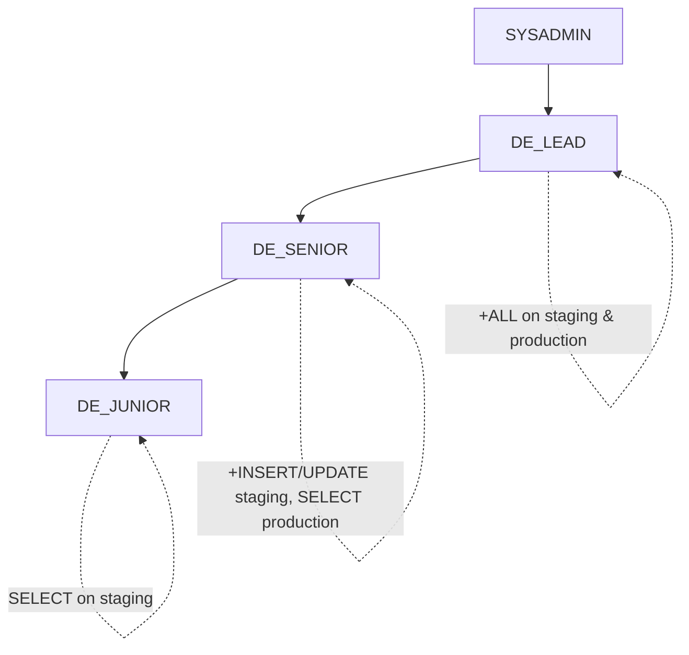
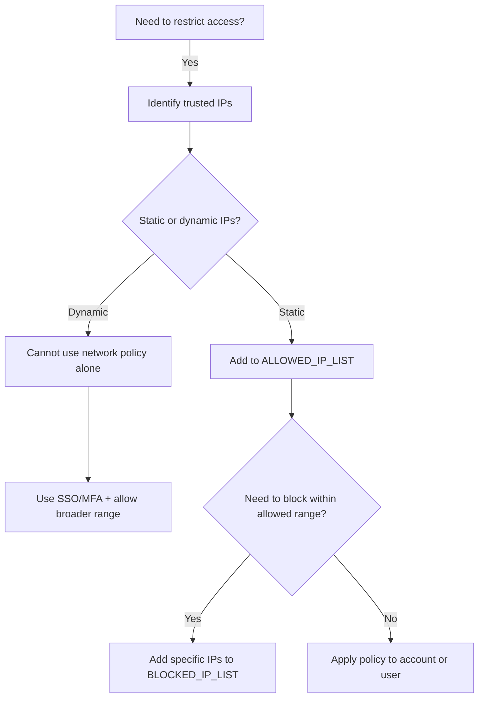
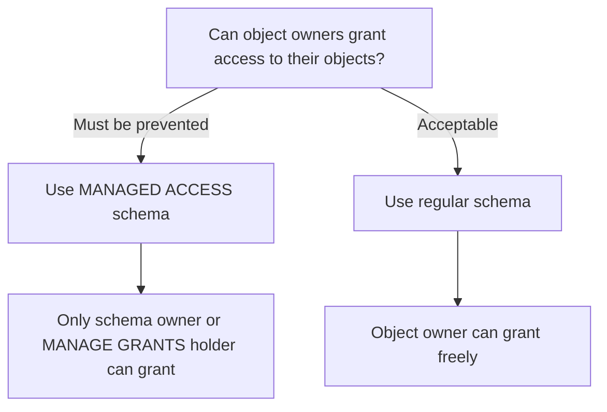
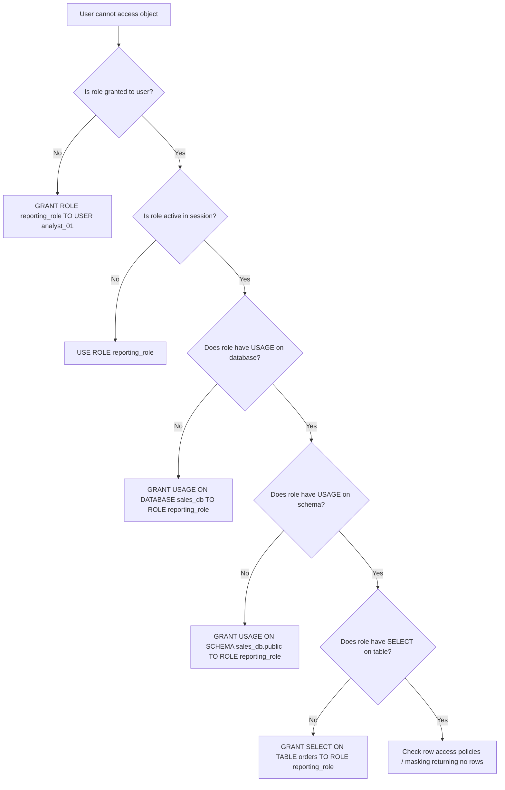

# Scenarios Decision Guide — Domain 2: Account Management and Data Governance

This guide presents 10 realistic exam-style scenarios covering the key decision points in Domain 2 (20%) of the SnowPro Core COF-C03 certification. Each scenario walks through the situation, decision logic, correct answer, why alternatives fail, and common exam traps.

---

## Scenario 1: Choosing Between System-Defined Roles for a Task

### Situation

A database administrator needs to create a new warehouse and grant usage on it to several teams. They currently hold the SYSADMIN role. The security team says only designated personnel should manage access control. Which system-defined role should create the warehouse, and which should manage the grants?

### Decision Flow

| Question | If Yes | If No |
|----------|--------|-------|
| Does the task involve creating databases/warehouses/other objects? | → SYSADMIN | Continue ↓ |
| Does the task involve creating/managing roles and users? | → USERADMIN | Continue ↓ |
| Does the task involve granting privileges on objects? | → SECURITYADMIN | Continue ↓ |
| Does the task require full account control (billing, parameters)? | → ACCOUNTADMIN | Re-evaluate need |

### Answer

- **SYSADMIN** creates the warehouse.
- **SECURITYADMIN** manages the grants (GRANT USAGE ON WAREHOUSE to roles).

### Why Not Others

| Role | Why Not |
|------|---------|
| ACCOUNTADMIN | Overprivileged for routine object creation; violates least privilege |
| USERADMIN | Creates users/roles only; cannot create warehouses or grant object privileges |
| PUBLIC | Has no administrative capabilities whatsoever |

### Exam Trap

> SECURITYADMIN can grant privileges because it inherits USERADMIN and owns the system privilege MANAGE GRANTS. The exam tests whether you confuse USERADMIN (user/role creation) with SECURITYADMIN (privilege grants). Remember: **SECURITY**admin = **security** (access control). **USER**admin = **user** lifecycle.

---

## Scenario 2: Designing a Custom Role Hierarchy for a Team

### Situation

A data engineering team needs three access tiers:
- **Tier 1 (Junior):** Read-only on staging tables
- **Tier 2 (Senior):** Read/write on staging, read on production
- **Tier 3 (Lead):** Full control on staging and production

All custom roles must ultimately be accessible to SYSADMIN. How do you design this?

### Decision Flow



### Answer

```sql
-- Create bottom-up hierarchy
CREATE ROLE DE_JUNIOR;
CREATE ROLE DE_SENIOR;
CREATE ROLE DE_LEAD;

-- Build inheritance chain
GRANT ROLE DE_JUNIOR TO ROLE DE_SENIOR;
GRANT ROLE DE_SENIOR TO ROLE DE_LEAD;
GRANT ROLE DE_LEAD TO ROLE SYSADMIN;  -- Critical!

-- Assign privileges at each tier
GRANT SELECT ON ALL TABLES IN SCHEMA staging TO ROLE DE_JUNIOR;
GRANT INSERT, UPDATE ON ALL TABLES IN SCHEMA staging TO ROLE DE_SENIOR;
GRANT SELECT ON ALL TABLES IN SCHEMA production TO ROLE DE_SENIOR;
GRANT ALL PRIVILEGES ON ALL TABLES IN SCHEMA staging TO ROLE DE_LEAD;
GRANT ALL PRIVILEGES ON ALL TABLES IN SCHEMA production TO ROLE DE_LEAD;
```

### Why Not Others

| Alternative | Why Not |
|-------------|---------|
| Flat roles (no hierarchy) | Duplicates privileges; harder to maintain; no inheritance |
| Grant all roles directly to ACCOUNTADMIN | Bypasses SYSADMIN; creates governance blind spot |
| Single role with conditional access | Snowflake has no conditional privilege model within a role |

### Exam Trap

> If custom roles are NOT granted to SYSADMIN (directly or through a chain), ACCOUNTADMIN must be used to manage their objects — creating an "orphaned" role hierarchy. The exam frequently asks: "What happens if a custom role is not granted to any system role?" Answer: Only ACCOUNTADMIN can access objects owned by that role.

---

## Scenario 3: When to Use Dynamic Data Masking vs Row Access Policies

### Situation

A healthcare company has a `PATIENTS` table with columns `SSN`, `DIAGNOSIS`, and `DEPARTMENT`. Requirements:
- Call center agents should see masked SSN (last 4 digits only)
- Only the treating department should see their own patients' rows
- Compliance auditors need full access to everything

Which features do you use?

### Decision Flow

| Requirement | Feature | Reason |
|-------------|---------|--------|
| Hide/mask column values based on role | **Dynamic Data Masking** (Column-level Security) | Controls what data looks like per column |
| Restrict which rows are visible based on context | **Row Access Policy** | Controls which rows are returned |
| Full access for specific role | Policy conditions with exemption | Both policies support `CURRENT_ROLE()` conditions |

### Answer

- **Masking Policy** on `SSN` column: Returns `'XXX-XX-' || RIGHT(SSN, 4)` for CALL_CENTER role, full value for AUDITOR role.
- **Row Access Policy** on the table: Filters rows where `DEPARTMENT = CURRENT_ROLE()` context OR `CURRENT_ROLE() = 'AUDITOR'`.

### Why Not Others

| Alternative | Why Not |
|-------------|---------|
| Secure Views only | Cannot apply different masking per role dynamically; one view per audience needed |
| Row Access Policy for column masking | RAP filters rows, cannot transform column values |
| Masking Policy for row filtering | Masking policies operate on columns, not row visibility |
| RBAC alone (no policies) | Would require separate views/tables per audience; unscalable |

### Exam Trap

> A masking policy is applied to a **column**. A row access policy is applied to a **table/view**. The exam will present a scenario requiring BOTH and test whether you incorrectly try to solve row-level filtering with masking or vice versa. Key differentiator: "Who can see which **rows**?" = Row Access Policy. "What does a **column value** look like?" = Masking Policy.

---

## Scenario 4: Network Policy Configuration Decisions

### Situation

Your company has:
- Corporate office IP range: `10.100.0.0/16` (via VPN appears as `203.0.113.0/24`)
- Remote developers on dynamic IPs
- A partner ETL tool with static IP `198.51.100.50`
- Requirement: Block all other access

How do you configure network policies?

### Decision Flow



### Answer

```sql
CREATE NETWORK POLICY corp_access
  ALLOWED_IP_LIST = ('203.0.113.0/24', '198.51.100.50/32')
  BLOCKED_IP_LIST = ();

-- Apply at account level
ALTER ACCOUNT SET NETWORK_POLICY = corp_access;

-- For remote devs: separate user-level policy or MFA requirement
```

### Why Not Others

| Alternative | Why Not |
|-------------|---------|
| Only BLOCKED_IP_LIST (block bad IPs) | Allowlist model is more secure; you'd never enumerate all bad IPs |
| VPN-only with no network policy | Doesn't protect against credential theft from outside VPN |
| One policy with `0.0.0.0/0` allowed | Effectively disables the policy; allows everything |

### Exam Trap

> Network policies use an **allowlist model**: if ALLOWED_IP_LIST is populated, ONLY those IPs can connect. BLOCKED_IP_LIST is evaluated WITHIN the allowed range (to carve out exceptions). The exam tests: "If both lists are populated, which takes precedence?" Answer: A request must match ALLOWED and NOT match BLOCKED. Also remember: network policies can be set at **account** level OR **user** level (user-level overrides account-level).

---

## Scenario 5: Resource Monitor Action Selection

### Situation

Your finance team runs month-end reports on a shared warehouse. Last month, a runaway query consumed 200% of the expected credits before anyone noticed. Management wants:
- Warning at 75% of monthly budget
- Hard stop before exceeding budget
- But month-end jobs must not be killed mid-execution

Which resource monitor actions do you configure?

### Decision Flow

| Threshold | Action | Behavior |
|-----------|--------|----------|
| 75% | **Notify** | Sends alert; no impact on running/new queries |
| 90% | **Suspend** | Running queries finish; no NEW queries start |
| 100% | **Suspend Immediately** | Running queries are cancelled; warehouse suspends |

### Answer

```sql
CREATE RESOURCE MONITOR finance_monitor
  WITH CREDIT_QUOTA = 1000
  FREQUENCY = MONTHLY
  START_TIMESTAMP = IMMEDIATELY
  TRIGGERS
    ON 75 PERCENT DO NOTIFY
    ON 90 PERCENT DO SUSPEND
    ON 100 PERCENT DO SUSPEND_IMMEDIATELY;

ALTER WAREHOUSE FINANCE_WH SET RESOURCE_MONITOR = finance_monitor;
```

For the month-end requirement: Set **SUSPEND at 90%** (not SUSPEND_IMMEDIATELY) so running month-end jobs complete. The SUSPEND_IMMEDIATELY at 100% is the absolute safety net.

### Why Not Others

| Alternative | Why Not |
|-------------|---------|
| Only Notify at all thresholds | No enforcement; runaway queries continue indefinitely |
| Suspend Immediately at 90% | Kills month-end jobs mid-execution; data corruption risk |
| Only Suspend (no Notify) | Team has no early warning; reactive instead of proactive |

### Exam Trap

> **SUSPEND** allows currently running queries to complete but blocks new ones. **SUSPEND_IMMEDIATELY** kills everything. The exam tests the difference with scenarios like: "A critical 4-hour ETL job is at 92% budget. Which action lets it finish?" Answer: SUSPEND (not SUSPEND_IMMEDIATELY). Also note: Resource monitors can only be created by ACCOUNTADMIN.

---

## Scenario 6: ACCOUNT_USAGE vs INFORMATION_SCHEMA for a Monitoring Task

### Situation

A security analyst needs to:
1. Check who logged into the account in the last 60 days
2. Immediately verify current grants on a sensitive table
3. Track warehouse credit usage over the past 6 months

Which data source (ACCOUNT_USAGE or INFORMATION_SCHEMA) should they use for each?

### Decision Flow

| Factor | ACCOUNT_USAGE | INFORMATION_SCHEMA |
|--------|---------------|-------------------|
| Latency | 45 min to 3 hours | Real-time |
| Retention | 1 year (365 days) | 14 days to none |
| Scope | Entire account | Current database/context |
| Dropped objects | Included | Excluded |
| Requires role | ACCOUNTADMIN (or granted) | Any role with access |

### Answer

| Task | Source | Reason |
|------|--------|--------|
| Login history (60 days) | **ACCOUNT_USAGE.LOGIN_HISTORY** | Needs >14 day history; only ACCOUNT_USAGE retains this |
| Current grants on a table | **INFORMATION_SCHEMA.TABLE_PRIVILEGES** | Needs real-time data; ACCOUNT_USAGE has latency |
| Credit usage (6 months) | **ACCOUNT_USAGE.WAREHOUSE_METERING_HISTORY** | Needs >14 day history; INFORMATION_SCHEMA doesn't store this |

### Why Not Others

| Alternative | Why Not |
|-------------|---------|
| INFORMATION_SCHEMA for login history | No LOGIN_HISTORY view in INFORMATION_SCHEMA; even if there were, max 14-day retention |
| ACCOUNT_USAGE for immediate grant check | Up to 3-hour latency means recently changed grants may not appear |
| Query history tables for credit usage | QUERY_HISTORY shows queries, not aggregated credit consumption |

### Exam Trap

> The exam loves pairing a time requirement with a latency constraint. Pattern: "Need data from 3 months ago?" → ACCOUNT_USAGE (INFORMATION_SCHEMA only keeps 14 days). "Need data from right now?" → INFORMATION_SCHEMA (ACCOUNT_USAGE has 45-min to 3-hour lag). Also: ACCOUNT_USAGE is in the shared **SNOWFLAKE** database and requires privileges to access.

---

## Scenario 7: Managed Access Schema Decisions

### Situation

A compliance officer requires that:
- Only designated administrators can grant access to objects in the `FINANCIAL_DATA` schema
- Object owners should NOT be able to grant access to their own objects
- The schema contains tables created by multiple ETL roles

Should you use a managed access schema?

### Decision Flow



### Answer

```sql
-- Convert existing schema
ALTER SCHEMA FINANCIAL_DATA SET IS_MANAGED_ACCESS = TRUE;

-- Or create new
CREATE SCHEMA FINANCIAL_DATA WITH MANAGED ACCESS;
```

With managed access:
- The **schema owner** controls all grants on objects within the schema
- Individual object owners **cannot** grant privileges on their own objects
- SECURITYADMIN (via MANAGE GRANTS) can also manage access

### Why Not Others

| Alternative | Why Not |
|-------------|---------|
| Revoking GRANT privileges manually | Tedious, error-prone; new objects still inherit owner grant ability |
| Future grants only | Controls future objects but doesn't restrict current object owners |
| Row access policies | Solves row-level filtering, not privilege management governance |
| Separate databases per team | Overly complex; doesn't solve the ownership-grant problem |

### Exam Trap

> In a **regular** schema, the object owner can grant privileges on that object to any role. In a **managed access** schema, ONLY the schema owner (or a role with MANAGE GRANTS) can grant privileges — even the object creator cannot. The exam tests: "Who can grant SELECT on a table in a managed access schema?" Answer: The schema owner or SECURITYADMIN, NOT the table creator/owner.

---

## Scenario 8: MFA vs SSO Requirements

### Situation

A company is evaluating authentication security. They have:
- 500 employees using Okta as identity provider
- 10 service accounts running automated ETL pipelines
- A requirement for ACCOUNTADMIN users to have the strongest authentication
- Compliance requires centralized identity management

What authentication approach do you recommend for each group?

### Decision Flow

| User Type | SSO (SAML/Federated) | MFA (Built-in) | Key Pair Auth |
|-----------|---------------------|-----------------|---------------|
| Regular employees (500) | ✅ Best fit | Optional addition | Not practical |
| Service accounts (10) | ❌ No human to authenticate | ❌ No human for second factor | ✅ Best fit |
| ACCOUNTADMIN users | ✅ Via SSO | ✅ **Required** as additional layer | Not for interactive |

### Answer

- **Employees:** Federated authentication (SAML 2.0) via Okta for centralized management
- **Service accounts:** Key pair authentication (no passwords, no MFA prompts)
- **ACCOUNTADMIN:** SSO + MFA enforced (Snowflake strongly recommends MFA for all ACCOUNTADMIN users)

```sql
-- Enforce MFA for ACCOUNTADMIN users
ALTER USER admin_user SET MINS_TO_BYPASS_MFA = 0;

-- Configure key pair for service account
ALTER USER etl_service_user SET RSA_PUBLIC_KEY = '...';
```

### Why Not Others

| Alternative | Why Not |
|-------------|---------|
| MFA only (no SSO) for 500 users | Loses centralized identity management; password sprawl |
| SSO for service accounts | SSO requires interactive browser redirect; breaks automation |
| Password-only for ACCOUNTADMIN | Highest-privilege role with weakest auth; compliance failure |
| Key pair for all employees | Impractical key distribution; no centralized revocation |

### Exam Trap

> The exam tests whether you know that **key pair authentication** is the correct choice for service accounts (not MFA, not SSO). Also tested: MFA in Snowflake is powered by the **Duo** service and is enrolled per-user. SSO is configured at the **account** level via a SAML 2.0 security integration. A user can have BOTH SSO and MFA — they are not mutually exclusive.

---

## Scenario 9: Privilege Inheritance Troubleshooting

### Situation

A user `ANALYST_01` is assigned the role `REPORTING_ROLE`. The hierarchy is:

```
SYSADMIN → DATA_ADMIN → REPORTING_ROLE
```

`REPORTING_ROLE` has SELECT on `SALES_DB.PUBLIC.ORDERS`. However, `ANALYST_01` reports: "I can't query the ORDERS table." What do you check?

### Decision Flow



### Answer

The most common issue is **missing USAGE on the database or schema**. Even if SELECT is granted on the table, the user needs the full chain:

1. ✅ Role granted to user
2. ✅ Role is active (USE ROLE)
3. ✅ USAGE on DATABASE
4. ✅ USAGE on SCHEMA
5. ✅ SELECT on TABLE

```sql
-- Verify grants
SHOW GRANTS TO ROLE REPORTING_ROLE;
SHOW GRANTS ON DATABASE SALES_DB;
SHOW GRANTS ON SCHEMA SALES_DB.PUBLIC;
SHOW GRANTS ON TABLE SALES_DB.PUBLIC.ORDERS;
```

### Why Not Others

| Common Misconception | Reality |
|---------------------|---------|
| "Higher roles inherit downward" | Inheritance flows UPWARD — SYSADMIN inherits REPORTING_ROLE's privileges, not the other way |
| "USAGE on database implies USAGE on schema" | Each level requires explicit grants |
| "Object ownership means the owner's role is always active" | User must USE ROLE or have it as default/secondary |

### Exam Trap

> Privilege inheritance flows **UP** the hierarchy (parent roles inherit children's privileges). A user must have their role ACTIVE to use its privileges. The exam tests the "missing USAGE" scenario frequently: granting SELECT on a table without USAGE on the containing database/schema results in access denied. Required chain: **DATABASE USAGE → SCHEMA USAGE → OBJECT PRIVILEGE**.

---

## Scenario 10: Data Governance Compliance (HIPAA/PCI Feature Selection)

### Situation

A healthcare payment processor must comply with both HIPAA (patient health data) and PCI-DSS (credit card data). They need to:
- Encrypt data at rest and in transit
- Restrict access to PHI to authorized roles only
- Mask credit card numbers for support staff
- Audit all access to sensitive data
- Ensure data residency in the US
- Classify and tag sensitive columns

Which Snowflake features satisfy each requirement?

### Decision Flow

| Compliance Requirement | Snowflake Feature | Notes |
|----------------------|-------------------|-------|
| Encryption at rest | **Automatic (AES-256)** | Always on; Tri-Secret Secure for customer-managed keys |
| Encryption in transit | **Automatic (TLS 1.2)** | Always on; no configuration needed |
| Restrict PHI access | **Row Access Policies + RBAC** | Role-based row filtering |
| Mask credit card numbers | **Dynamic Data Masking** | Returns masked values per role |
| Audit access | **ACCESS_HISTORY (ACCOUNT_USAGE)** | Tracks who queried what, when |
| US data residency | **Account region selection** | Choose US region at account creation |
| Classify sensitive columns | **Data Classification** + **Object Tagging** | SYSTEM$CLASSIFY + tag-based policies |
| Annual compliance attestation | **Snowflake SOC 2 Type II, HITRUST** | Shared responsibility model |

### Answer

```sql
-- 1. Tag sensitive columns
ALTER TABLE PATIENTS MODIFY COLUMN SSN 
  SET TAG GOVERNANCE.PII = 'SSN';
ALTER TABLE PAYMENTS MODIFY COLUMN CARD_NUMBER 
  SET TAG GOVERNANCE.PCI = 'PAN';

-- 2. Masking policy for PCI data
CREATE MASKING POLICY mask_card_number AS (val STRING) 
  RETURNS STRING ->
  CASE 
    WHEN CURRENT_ROLE() IN ('PCI_ADMIN') THEN val
    ELSE CONCAT('XXXX-XXXX-XXXX-', RIGHT(val, 4))
  END;

ALTER TABLE PAYMENTS MODIFY COLUMN CARD_NUMBER 
  SET MASKING POLICY mask_card_number;

-- 3. Row access policy for PHI
CREATE ROW ACCESS POLICY phi_access AS (dept VARCHAR) 
  RETURNS BOOLEAN ->
  CURRENT_ROLE() IN ('HIPAA_ADMIN', 'TREATING_PHYSICIAN')
  OR dept = CURRENT_ROLE();

ALTER TABLE PATIENTS ADD ROW ACCESS POLICY phi_access ON (department);

-- 4. Verify audit trail
SELECT * FROM SNOWFLAKE.ACCOUNT_USAGE.ACCESS_HISTORY
WHERE query_start_time > DATEADD('day', -30, CURRENT_TIMESTAMP());
```

### Why Not Others

| Alternative | Why Not |
|-------------|---------|
| External encryption (client-side only) | Snowflake already encrypts; double encryption adds complexity without compliance benefit |
| Views for masking | Static; doesn't adapt per role dynamically; maintenance nightmare |
| VPN-only for access control | Network ≠ data-level control; doesn't satisfy column/row-level requirements |
| Third-party audit tools only | ACCESS_HISTORY is native, lower latency, and sufficient for most audits |
| Manual column tagging without classification | Error-prone; SYSTEM$CLASSIFY automates PII/PHI detection |

### Exam Trap

> The exam tests whether you know that Snowflake provides **automatic encryption** (at rest AND in transit) with no user action required. Tri-Secret Secure is an add-on for customer-managed keys, NOT a requirement for baseline compliance. Also tested: **Data Classification** (SYSTEM$CLASSIFY) is Snowflake's built-in feature to automatically detect and tag sensitive data — different from manual object tagging. ACCESS_HISTORY in ACCOUNT_USAGE provides column-level access auditing (which columns were accessed, not just which tables).

---

## Quick Reference: Domain 2 Decision Matrix

| Scenario Type | Key Decision Factor | Common Exam Trap |
|---------------|-------------------|------------------|
| System roles | Task type (objects vs users vs grants vs account) | Confusing USERADMIN with SECURITYADMIN |
| Custom hierarchy | Grant chain must reach SYSADMIN | Orphaned roles only accessible to ACCOUNTADMIN |
| Masking vs RAP | Columns (masking) vs Rows (RAP) | Using wrong policy type for the requirement |
| Network policies | Allowlist model; user-level overrides account | Thinking BLOCKED_IP_LIST alone is sufficient |
| Resource monitors | Suspend vs Suspend Immediately behavior | Not knowing Suspend lets queries finish |
| ACCOUNT_USAGE vs INFO_SCHEMA | Time range + latency needs | Using INFORMATION_SCHEMA for >14 day queries |
| Managed access | Who should control grants | Object owner CAN'T grant in managed access |
| MFA/SSO/Key pair | Human vs machine; centralized vs individual | Key pair for service accounts, not MFA |
| Privilege inheritance | Flows UP; full chain needed | Missing USAGE on database or schema |
| Compliance features | Automatic vs configured; native vs add-on | Thinking encryption requires manual setup |

---

[← Back to Domain 2 Main](./README.md) | [Study Notes →](./Study_Notes_Domain2.md) | [Practice Questions →](./Practice_Questions_Domain2.md)
