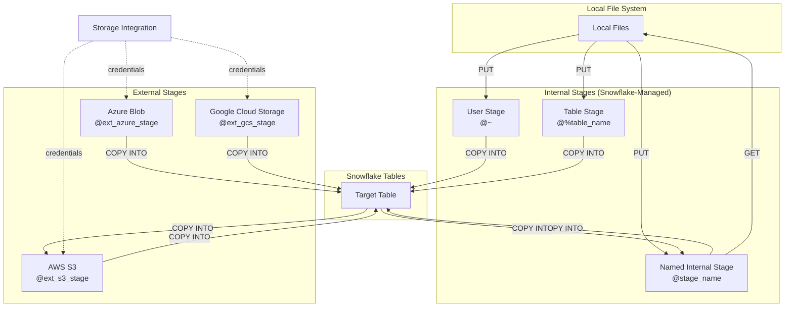

# 3.1 Stages and File Formats

## Key Terms

| Term | Definition |
|------|-----------|
| **Stage** | A named location where data files are stored for loading into or unloading from Snowflake tables |
| **Internal Stage** | A stage that stores files within Snowflake's managed cloud storage |
| **External Stage** | A stage that references files in an external cloud storage location (S3, Azure Blob, GCS) |
| **User Stage** | A personal internal stage automatically allocated to each Snowflake user (`@~`) |
| **Table Stage** | An internal stage automatically associated with each table (`@%tablename`) |
| **Named Stage** | A database object explicitly created to store files (`@stagename`) |
| **File Format** | A named object that defines the format and parsing rules for data files |
| **Storage Integration** | An account-level object that stores cloud credentials, eliminating inline secrets in SQL |
| **PUT** | A SQL command to upload local files to an internal stage |
| **GET** | A SQL command to download files from an internal stage to a local directory |

---

## Overview

Stages are the intermediary between external data sources and Snowflake tables. Every data loading or unloading operation in Snowflake passes through a stage—whether internal (managed by Snowflake) or external (managed by you in your own cloud storage). Understanding the three types of internal stages, how external stages leverage storage integrations, and how file formats define parsing behavior is essential for both the exam and real-world implementations.

This topic covers approximately 18% of the SnowPro Core exam under Domain 3: Data Loading, Unloading, and Connectivity. Expect questions on stage syntax, PUT/GET semantics, file format options, and storage integration architecture.

---

## Characteristics Table

| Stage Type | Syntax | Scope | Supports COPY INTO | Supports PUT/GET | Can Grant Access | Drop Behavior |
|-----------|--------|-------|-------------------|-----------------|-----------------|---------------|
| User Stage | `@~` | User | Yes | Yes | No (user-only) | Cannot be dropped |
| Table Stage | `@%table_name` | Table | Yes | Yes | No (table-only) | Dropped with table |
| Named Internal Stage | `@stage_name` | Schema | Yes | Yes | Yes (via GRANT) | Explicit DROP |
| Named External Stage | `@stage_name` | Schema | Yes | No | Yes (via GRANT) | Explicit DROP |

---

## Stage Architecture Diagram



---

## Detailed Content

### Internal Stage Types

#### User Stage (`@~`)

Every Snowflake user is automatically allocated a **user stage**. It cannot be altered, dropped, or shared with other users. Referenced using the tilde syntax:

- `@~` — refers to the current user's stage
- Cannot specify a different user's stage
- Files staged here are only accessible by that user
- No database or schema context required

#### Table Stage (`@%table_name`)

Every table has an associated **table stage**. It is automatically created and dropped with the table. Referenced using the percent sign:

- `@%my_table` — refers to the stage for `my_table`
- Files can only be loaded into the associated table (not other tables)
- Cannot be shared via GRANT
- Does not support transformations during COPY (no column reordering)

#### Named Internal Stage (`@stage_name`)

A **named stage** is an explicit database object created with `CREATE STAGE`. It provides the most flexibility:

- Can be granted to roles (USAGE privilege)
- Supports file format association at the stage level
- Allows loading into any table
- Supports transformations and column reordering during COPY
- Lives within a schema (fully qualified: `db.schema.stage_name`)

### External Stages

External stages point to data stored in cloud object storage outside Snowflake. They require authentication via either:

1. **Storage Integration** (recommended) — an account-level object storing IAM role/service principal credentials
2. **Direct credentials** — inline `AWS_KEY_ID`/`AWS_SECRET_KEY` or SAS tokens (not recommended for production)

Supported cloud platforms:
- **Amazon S3** — uses `s3://bucket/path/` URL format
- **Azure Blob Storage** — uses `azure://account.blob.core.windows.net/container/path/` format
- **Google Cloud Storage** — uses `gcs://bucket/path/` format

### PUT Command

The **PUT** command uploads files from a local file system to an internal stage. Key behaviors:

- Automatically compresses files with **gzip** by default (`AUTO_COMPRESS = TRUE`)
- Supports parallel upload threads (`PARALLEL = 4` by default, max 99)
- Only works with internal stages (user, table, or named internal)
- Cannot PUT to external stages
- Files are encrypted during transfer and at rest
- Supports wildcards for multiple files (`PUT file:///data/*.csv @my_stage`)

Syntax: `PUT file://<local_path> @<stage> [options]`

### GET Command

The **GET** command downloads files from an internal stage to a local directory:

- Only works with internal stages
- Cannot GET from external stages (use cloud-native tools instead)
- Supports parallel download threads
- Files are decrypted on download

Syntax: `GET @<stage>/<path> file://<local_path> [options]`

### File Formats

A **file format** defines how Snowflake parses data files. Supported types:

| Format | Type | Key Characteristics |
|--------|------|-------------------|
| CSV | Structured | Delimited text; most configurable options |
| JSON | Semi-structured | Loaded into VARIANT columns; supports nesting |
| Avro | Semi-structured | Binary format; schema embedded in file |
| Parquet | Semi-structured | Columnar binary; widely used in data lakes |
| ORC | Semi-structured | Optimized Row Columnar; Hadoop ecosystem |
| XML | Semi-structured | Tag-based; loaded into VARIANT |

### CREATE FILE FORMAT Key Options

Common options tested on the exam:

| Option | Applies To | Description |
|--------|-----------|-------------|
| `FIELD_DELIMITER` | CSV | Column separator (default: `,`) |
| `RECORD_DELIMITER` | CSV | Row separator (default: `\n`) |
| `SKIP_HEADER` | CSV | Number of header rows to skip (default: 0) |
| `FIELD_OPTIONALLY_ENCLOSED_BY` | CSV | Character enclosing fields (e.g., `'"'`) |
| `ERROR_ON_COLUMN_COUNT_MISMATCH` | CSV | Fail if file columns ≠ table columns (default: TRUE) |
| `COMPRESSION` | All | AUTO, GZIP, BZ2, DEFLATE, ZSTD, SNAPPY, NONE |
| `STRIP_OUTER_ARRAY` | JSON | Removes outer `[ ]` to load each element as a row |
| `STRIP_NULL_VALUES` | JSON | Omits keys with null values from VARIANT |
| `NULL_IF` | CSV/JSON | Strings interpreted as SQL NULL |
| `TRIM_SPACE` | CSV | Removes leading/trailing whitespace |

### Storage Integrations

A **storage integration** is an account-level Snowflake object that:

- Stores cloud provider credentials (IAM Role ARN, Azure Tenant ID, GCS Service Account)
- Eliminates the need to embed secrets in SQL statements
- Can restrict allowed/blocked storage locations
- Requires ACCOUNTADMIN to create
- Can be granted to other roles via `GRANT USAGE ON INTEGRATION`

### Directory Tables

**Directory tables** provide metadata about files stored in a stage:

- Automatically maintained for external and internal named stages
- Enabled with `DIRECTORY = (ENABLE = TRUE)` on stage creation
- Queried using `SELECT * FROM DIRECTORY(@stage_name)`
- Returns file path, size, last modified date, MD5 hash, and ETag
- Must be manually refreshed for external stages (`ALTER STAGE ... REFRESH`)
- Auto-refreshed for internal stages

---

## SQL Examples

### Example 1: Create a Named Internal Stage

```sql
CREATE OR REPLACE STAGE my_internal_stage
  ENCRYPTION = (TYPE = 'SNOWFLAKE_SSE')
  DIRECTORY = (ENABLE = TRUE)
  COMMENT = 'Stage for sales data ingestion';
```

### Example 2: PUT Files to a Stage

```sql
-- Upload a single file with default gzip compression
PUT file:///tmp/data/sales_2024.csv @my_internal_stage/sales/;

-- Upload multiple files with explicit options
PUT file:///tmp/data/*.csv @my_internal_stage/sales/
  PARALLEL = 8
  AUTO_COMPRESS = TRUE
  OVERWRITE = TRUE;

-- Upload to user stage
PUT file:///tmp/data/report.csv @~;
```

### Example 3: GET Files from a Stage

```sql
-- Download files to local directory
GET @my_internal_stage/sales/ file:///tmp/downloads/;

-- Download with pattern matching
GET @my_internal_stage/sales/ file:///tmp/downloads/
  PATTERN = '.*2024.*';
```

### Example 4: Create File Formats

```sql
-- CSV file format with common exam-relevant options
CREATE OR REPLACE FILE FORMAT my_csv_format
  TYPE = 'CSV'
  FIELD_DELIMITER = '|'
  SKIP_HEADER = 1
  NULL_IF = ('NULL', 'null', '')
  FIELD_OPTIONALLY_ENCLOSED_BY = '"'
  ERROR_ON_COLUMN_COUNT_MISMATCH = FALSE
  COMPRESSION = 'AUTO';

-- JSON file format
CREATE OR REPLACE FILE FORMAT my_json_format
  TYPE = 'JSON'
  STRIP_OUTER_ARRAY = TRUE
  STRIP_NULL_VALUES = TRUE
  COMPRESSION = 'AUTO';

-- Parquet file format
CREATE OR REPLACE FILE FORMAT my_parquet_format
  TYPE = 'PARQUET'
  COMPRESSION = 'SNAPPY';
```

### Example 5: Create External Stage with Storage Integration

```sql
-- First create storage integration (requires ACCOUNTADMIN)
CREATE OR REPLACE STORAGE INTEGRATION s3_integration
  TYPE = EXTERNAL_STAGE
  STORAGE_PROVIDER = 'S3'
  STORAGE_AWS_ROLE_ARN = 'arn:aws:iam::123456789012:role/snowflake-role'
  ENABLED = TRUE
  STORAGE_ALLOWED_LOCATIONS = ('s3://my-bucket/data/', 's3://my-bucket/archive/')
  STORAGE_BLOCKED_LOCATIONS = ('s3://my-bucket/data/sensitive/');

-- Then create external stage using the integration
CREATE OR REPLACE STAGE my_s3_stage
  STORAGE_INTEGRATION = s3_integration
  URL = 's3://my-bucket/data/'
  FILE_FORMAT = my_csv_format
  DIRECTORY = (ENABLE = TRUE);
```

### Example 6: List Stage Contents and Query Directory Table

```sql
-- List files in a stage
LIST @my_internal_stage/sales/;
-- Shorthand
LS @my_s3_stage;

-- Query directory table for metadata
SELECT
  RELATIVE_PATH,
  SIZE,
  LAST_MODIFIED,
  MD5
FROM DIRECTORY(@my_s3_stage)
WHERE RELATIVE_PATH LIKE '%.parquet';

-- Refresh external stage directory table
ALTER STAGE my_s3_stage REFRESH;
```

---

## Comparison Tables

### Internal vs. External Stages

| Feature | Internal Stage | External Stage |
|---------|---------------|----------------|
| Storage location | Snowflake-managed | Customer's cloud account |
| PUT/GET support | Yes | No |
| Encryption | Automatic (Snowflake-managed keys) | Customer-managed or cloud-native |
| Cost | Included in Snowflake storage costs | Customer pays cloud provider directly |
| Credential management | Not needed | Storage integration or inline |
| Auto-refresh directory | Yes | No (manual REFRESH required) |
| Data residency control | Snowflake region | Customer-controlled |

### Internal Stage Type Comparison

| Feature | User Stage (`@~`) | Table Stage (`@%t`) | Named Stage (`@s`) |
|---------|------------------|--------------------|--------------------|
| Created by | Automatic (per user) | Automatic (per table) | Explicit CREATE STAGE |
| Dropped by | Cannot drop | Drops with table | Explicit DROP STAGE |
| Grantable | No | No | Yes |
| Load to any table | Yes | No (associated table only) | Yes |
| File format association | No | No | Yes |
| Supports transformations in COPY | Yes | No | Yes |
| Clone behavior | N/A | Not cloned with table | Cloned (empty) |

---

## Exam Tips

1. **PUT/GET are client-side only** — they run via SnowSQL, JDBC/ODBC drivers, or connectors. They do NOT work in the Snowflake web UI (Snowsight worksheets).

2. **External stages do NOT support PUT/GET** — use cloud-native tools (AWS CLI, az copy, gsutil) to manage files in external stages.

3. **Table stages cannot load into other tables** — files in `@%orders` can ONLY be loaded into the `orders` table.

4. **STRIP_OUTER_ARRAY** is essential for loading JSON arrays — without it, an entire array `[{...},{...}]` loads as one row; with it, each element becomes a separate row.

5. **Storage integrations require ACCOUNTADMIN** to create but can be granted to other roles for usage.

6. **Compression defaults** — PUT auto-compresses with gzip. Snowflake auto-detects compression during COPY INTO.

7. **LIST vs DIRECTORY** — `LIST @stage` shows files; `SELECT FROM DIRECTORY(@stage)` provides richer metadata including MD5 and requires directory tables to be enabled.

8. **Stage file encryption** — internal stages use 256-bit AES encryption. Files are encrypted in transit and at rest.

9. **Know the URL prefixes** — `s3://`, `azure://account.blob.core.windows.net/container/`, `gcs://`.

10. **OVERWRITE in PUT** — by default, PUT does NOT overwrite existing files with the same name. Set `OVERWRITE = TRUE` explicitly.

---

## Common Misconceptions

| Misconception | Reality |
|--------------|---------|
| "PUT works in Snowsight worksheets" | PUT/GET only work via SnowSQL, drivers, or connectors — not the web UI |
| "You can PUT files to an external stage" | PUT only works with internal stages; use cloud tools for external |
| "Table stages can load into any table" | Table stages are bound to their specific table only |
| "User stages can be shared with GRANT" | User stages are private to the user and cannot be granted |
| "STRIP_OUTER_ARRAY works with CSV" | STRIP_OUTER_ARRAY is a JSON-only file format option |
| "Directory tables auto-refresh on external stages" | External stage directories require manual `ALTER STAGE ... REFRESH` or event notifications |
| "Named stages are lost when cloned" | Named stages are cloned, but their files are NOT copied (stage is empty in clone) |
| "ERROR_ON_COLUMN_COUNT_MISMATCH defaults to FALSE" | It defaults to TRUE for CSV — set to FALSE if your files have variable column counts |

---

## Key Takeaways

- Three internal stage types exist: **User** (`@~`), **Table** (`@%table`), **Named** (`@stage`) — each with different scope and capabilities
- **Named stages** offer the most flexibility: grantable, support file format association, and allow loading into any table
- **PUT** uploads to internal stages with auto-gzip; **GET** downloads from internal stages — neither works with external stages or the web UI
- **External stages** reference S3/Azure/GCS and should use **storage integrations** instead of inline credentials
- **File formats** are reusable named objects; know the key options: `SKIP_HEADER`, `STRIP_OUTER_ARRAY`, `ERROR_ON_COLUMN_COUNT_MISMATCH`, `COMPRESSION`
- **Directory tables** provide file metadata via SQL queries and must be manually refreshed for external stages
- Storage integrations are **account-level** objects requiring ACCOUNTADMIN and support `STORAGE_ALLOWED_LOCATIONS` / `STORAGE_BLOCKED_LOCATIONS`

---

## References

- [Snowflake Documentation — Stages](https://docs.snowflake.com/en/user-guide/data-load-overview)
- [Snowflake Documentation — PUT Command](https://docs.snowflake.com/en/sql-reference/sql/put)
- [Snowflake Documentation — GET Command](https://docs.snowflake.com/en/sql-reference/sql/get)
- [Snowflake Documentation — CREATE STAGE](https://docs.snowflake.com/en/sql-reference/sql/create-stage)
- [Snowflake Documentation — CREATE FILE FORMAT](https://docs.snowflake.com/en/sql-reference/sql/create-file-format)
- [Snowflake Documentation — Storage Integrations](https://docs.snowflake.com/en/sql-reference/sql/create-storage-integration)
- [Snowflake Documentation — Directory Tables](https://docs.snowflake.com/en/user-guide/data-load-dirtables)

---

## Additional Exam Scenarios

### Scenario 1: PUT from Windows Path — What Syntax?

**Question:** A developer on Windows wants to PUT a file from `C:\Users\data\sales.csv` to an internal stage. What is the correct syntax?

**Answer:** Use forward slashes or the `file://` protocol with forward slashes:
```sql
-- Correct: Use forward slashes
PUT file://C:/Users/data/sales.csv @my_stage;

-- Also correct: Use file:// with Unix-style path
PUT file:///C:/Users/data/sales.csv @my_stage;
```
**Exam trap:** Backslashes (`C:\Users\...`) are NOT valid in PUT syntax. Always convert to forward slashes. The `file://` prefix is mandatory on all platforms.

---

### Scenario 2: User Stage @~ — Can Another User Access It?

**Question:** User A stages a file at `@~/shared_report.csv`. Can User B query or load from User A's stage?

**Answer:** **No.** User stages are strictly private. There is no syntax to reference another user's stage — `@~` always resolves to the current session user's stage. You cannot GRANT access, and there's no `@~user_a` syntax.

**Best practice:** If files need to be shared between users, use a **named internal stage** with appropriate GRANT USAGE privileges.

---

### Scenario 3: Table Stage — When Is It Useful vs Named Stage?

**Question:** When would you use a table stage (`@%my_table`) instead of a named stage?

**Answer:** Table stages are useful for:
- **Quick, single-table loads** where you don't need to share the stage or load into other tables
- **Simplicity** — no CREATE STAGE statement needed; it exists automatically
- **Isolation** — files are logically tied to one table

**Limitations that push you to named stages:**
- Cannot load into a different table
- Cannot GRANT access to other roles
- Does NOT support transformations (column reordering) during COPY
- Cannot associate a file format object with it

---

### Scenario 4: External Stage with STORAGE_INTEGRATION vs Direct Credentials

**Question:** What are the differences between using a storage integration versus inline credentials for an external stage?

**Answer:**

| Approach | Security | Maintenance | Exam Preference |
|----------|----------|-------------|-----------------|
| **STORAGE_INTEGRATION** | No secrets in SQL; IAM role-based | Centralized credential rotation | **Recommended** |
| **Direct credentials** | AWS keys/SAS tokens in SQL text | Must update each stage on rotation | Discouraged for production |

**Key point:** Storage integrations require ACCOUNTADMIN to create but can be granted to other roles. They support `STORAGE_ALLOWED_LOCATIONS` to restrict which paths can be accessed — a security best practice tested on the exam.

---

### Scenario 5: LIST Shows Files but COPY Doesn't Load Them

**Question:** `LIST @my_stage` shows 20 files, but `COPY INTO my_table FROM @my_stage` reports "0 files loaded." Why?

**Answer:** Common causes:
1. **PATTERN mismatch** — If a PATTERN is specified, it must regex-match the filenames shown by LIST
2. **Already loaded (14-day metadata)** — Files were previously loaded and the load metadata hasn't expired
3. **File format mismatch** — Files exist but don't match the expected format (wrong extension filtering)
4. **Path mismatch** — COPY path includes a subdirectory that doesn't match LIST results

**Debugging:**
```sql
-- Check what COPY would match
LIST @my_stage PATTERN = '.*[.]csv';

-- Force reload if metadata is the issue
COPY INTO my_table FROM @my_stage FORCE = TRUE;
```

---

### Scenario 6: File Format Object vs Inline FORMAT_OPTIONS — Precedence

**Question:** A stage has a file format assigned. The COPY INTO statement also specifies inline format options. Which wins?

**Answer:** **Inline options in the COPY INTO statement override the stage's file format.** The precedence order (highest to lowest):
1. Inline `FILE_FORMAT` options in the COPY INTO statement
2. File format object referenced in the COPY INTO statement
3. File format object associated with the stage (via CREATE STAGE ... FILE_FORMAT = ...)

**Exam tip:** If you specify `FILE_FORMAT = (TYPE = CSV SKIP_HEADER = 1)` in COPY INTO, it completely overrides the stage-level format — it does NOT merge individual options.

---

### Scenario 7: Directory Table Enabled — What Additional Metadata?

**Question:** What metadata is available when directory tables are enabled on a stage?

**Answer:** Directory tables (enabled with `DIRECTORY = (ENABLE = TRUE)`) expose:

| Column | Description |
|--------|-------------|
| `RELATIVE_PATH` | File path within the stage |
| `SIZE` | File size in bytes |
| `LAST_MODIFIED` | Timestamp of last modification |
| `MD5` | MD5 hash of the file content |
| `ETAG` | Entity tag (cloud provider identifier) |
| `FILE_URL` | Scoped URL for the file (can be used with file functions) |

**Key difference from LIST:** Directory tables support full SQL (JOIN, WHERE, aggregation) while LIST is a simple command returning results to the client.

---

### Scenario 8: Stage Types and Snowpipe Auto-Ingest Compatibility

**Question:** Which stage types support Snowpipe with auto-ingest?

**Answer:**

| Stage Type | Snowpipe Support | Auto-Ingest Support |
|------------|-----------------|---------------------|
| User Stage (`@~`) | Yes (REST API only) | **No** |
| Table Stage (`@%t`) | Yes (REST API only) | **No** |
| Named Internal Stage | Yes (REST API only) | **No** — no cloud event source |
| Named External Stage (S3/Azure/GCS) | Yes | **Yes** — cloud events trigger loading |

**Key insight:** Auto-ingest requires cloud event notifications (SQS, Event Grid, Pub/Sub), which only fire when files land in external cloud storage. Internal stages don't generate these events, so auto-ingest only works with **external stages**.

For internal stages, you must use the Snowpipe **REST API** (`insertFiles` endpoint) to trigger loading manually.

---

[← Previous: None (First in Domain)] | [Domain 3 README](./README.md) | [Next: 3.2 Data Loading Methods →](./3.2_Data_Loading_Methods.md)

[↑ Back to Main README](../README.md)
