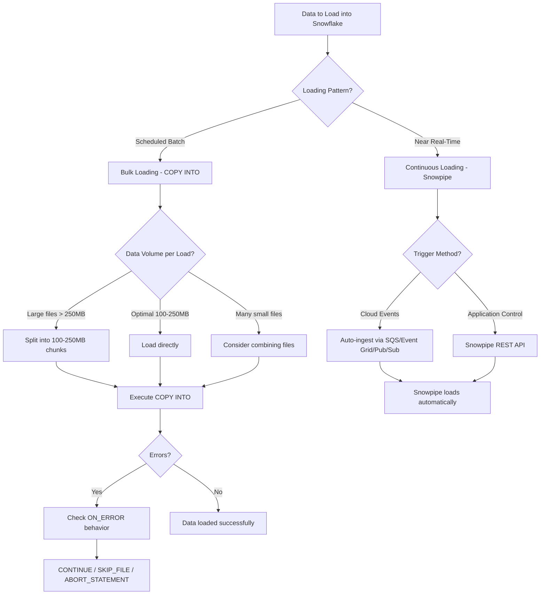

# 3.2 Data Loading Methods

> **SnowPro Core (COF-C03)** — Domain 3: Data Loading, Unloading, and Connectivity (18%)

---

## Key Terms

| Term | Definition |
|------|-----------|
| **COPY INTO** | SQL command for bulk loading data from staged files into Snowflake tables |
| **Snowpipe** | Serverless, continuous data ingestion service that loads data within minutes of file arrival |
| **Bulk Loading** | Batch-oriented loading using COPY INTO, executed by user-managed virtual warehouses |
| **Continuous Loading** | Event-driven loading via Snowpipe that processes files as they arrive in a stage |
| **VALIDATION_MODE** | COPY INTO parameter that validates data WITHOUT loading it — returns errors or sample rows |
| **ON_ERROR** | COPY INTO parameter controlling behavior when errors are encountered during loading |
| **PURGE** | COPY INTO option to automatically delete staged files after successful loading |
| **Auto-ingest** | Snowpipe feature using cloud event notifications (SQS, Event Grid, Pub/Sub) to trigger loading |

---

## Overview

Snowflake provides two primary methods for loading data: **bulk loading** with the COPY INTO command and **continuous loading** with Snowpipe. Bulk loading is ideal for scheduled batch operations where a virtual warehouse processes large volumes of staged data. Continuous loading with Snowpipe is designed for near-real-time ingestion, automatically loading data as files arrive in a stage.

Understanding the differences between these methods — their billing models, latency characteristics, error handling options, and best practices — is essential for the SnowPro Core exam and for designing efficient data pipelines.

---

## Characteristics Comparison

| Characteristic | Bulk Loading (COPY INTO) | Continuous Loading (Snowpipe) |
|---|---|---|
| **Trigger** | User-executed SQL or scheduled task | Cloud event notification or REST API call |
| **Compute** | User-managed virtual warehouse | Snowflake-managed serverless compute |
| **Billing** | Warehouse credit consumption | Per-second compute + per-file overhead (≈0.06 credits/file) |
| **Latency** | Minutes to hours (batch schedule) | Typically within 1 minute of file arrival |
| **Error Handling** | ON_ERROR, VALIDATION_MODE | Limited — errors logged to COPY_HISTORY |
| **Best For** | Large batch loads, initial migrations, scheduled ETL | Streaming/micro-batch, event-driven pipelines |
| **Load History** | 64 days in COPY_HISTORY | 64 days in COPY_HISTORY |
| **Duplicate Prevention** | 14-day metadata window per table | 14-day metadata window per pipe |
| **Transformations** | Full support (SELECT, FLATTEN, CAST) | Full support (SELECT in pipe definition) |

---

## Decision Flow Diagram



---

## COPY INTO Table Command

The COPY INTO command is the primary mechanism for bulk loading data from internal or external stages into Snowflake tables.

### Basic Syntax

```sql
COPY INTO <table_name>
FROM { @<stage_name> | @<stage_name>/<path> | '<external_location>' }
[ FILES = ( '<file1>', '<file2>', ... ) ]
[ PATTERN = '<regex_pattern>' ]
[ FILE_FORMAT = ( FORMAT_NAME = '<name>' | TYPE = <type> <format_options> ) ]
[ ON_ERROR = { CONTINUE | SKIP_FILE | SKIP_FILE_<num> | ABORT_STATEMENT } ]
[ SIZE_LIMIT = <bytes> ]
[ PURGE = TRUE | FALSE ]
[ VALIDATION_MODE = RETURN_ERRORS | RETURN_<n>_ROWS | RETURN_ALL_ERRORS ]
[ FORCE = TRUE | FALSE ]
[ MATCH_BY_COLUMN_NAME = CASE_SENSITIVE | CASE_INSENSITIVE | NONE ]
;
```

### ON_ERROR Options

The **ON_ERROR** parameter controls how COPY INTO handles data errors:

| Option | Behavior |
|--------|----------|
| `CONTINUE` | Skip rows with errors, continue loading remaining rows |
| `SKIP_FILE` | Skip any file that contains one or more errors |
| `SKIP_FILE_<num>` | Skip file if number of errors reaches `<num>` (e.g., `SKIP_FILE_3`) |
| `SKIP_FILE_<num>%` | Skip file if error percentage reaches threshold (e.g., `SKIP_FILE_10%`) |
| `ABORT_STATEMENT` | Abort the entire COPY statement on first error (**default**) |

### VALIDATION_MODE — Exam Trap

> **CRITICAL FOR EXAM**: VALIDATION_MODE does **NOT** load any data. It only validates the staged files and returns information about errors or sample rows. This is one of the most commonly tested misconceptions.

| Option | Behavior |
|--------|----------|
| `RETURN_ERRORS` | Returns all errors found across all files (no data loaded) |
| `RETURN_<n>_ROWS` | Returns the first `n` rows that would be loaded (no data loaded) |
| `RETURN_ALL_ERRORS` | Returns all errors for all files (no data loaded) |

VALIDATION_MODE and a full load are mutually exclusive — you cannot load data and validate in the same statement.

### PURGE Option

Setting **PURGE = TRUE** instructs Snowflake to delete staged files after they are successfully loaded. Files that failed to load (due to errors) are not purged. This eliminates the need for a separate cleanup step but makes recovery more difficult if issues are discovered post-load.

### SIZE_LIMIT, FILES, and PATTERN

- **SIZE_LIMIT**: Maximum total size (in bytes) of files to load in a single COPY statement. Loading stops after the threshold is reached (the file that causes the threshold to be exceeded is still fully loaded).
- **FILES**: Explicit list of filenames to load (max 1000 files per statement).
- **PATTERN**: Regex pattern to match filenames for loading (e.g., `'.*sales.*[.]csv'`).

---

## Snowpipe

**Snowpipe** is Snowflake's serverless, continuous data ingestion service. It uses a pipe object that defines the COPY INTO statement to execute when new files are detected.

### Architecture

Snowpipe uses Snowflake-managed compute resources (serverless) rather than a user's virtual warehouse. When triggered, Snowpipe queues file load requests and processes them using a serverless execution model with automatic scaling.

### Auto-Ingest

**Auto-ingest** leverages cloud provider event notifications to automatically detect and load new files:

- **AWS**: S3 event notifications → SQS queue → Snowpipe
- **Azure**: Blob Storage events → Event Grid → Storage Queue → Snowpipe
- **GCP**: GCS notifications → Pub/Sub subscription → Snowpipe

When `AUTO_INGEST = TRUE`, Snowflake creates or uses a notification integration to listen for file arrival events.

### REST API Ingest

Applications can call the Snowpipe REST API (`insertFiles` endpoint) to explicitly notify Snowpipe about files ready for loading. This provides programmatic control without relying on cloud event notifications.

### Snowpipe Billing

Snowpipe billing differs significantly from bulk loading:

- **Serverless compute**: Billed per-second for compute time used to load files
- **Per-file overhead**: Approximately **0.06 credits per file** in overhead charges
- **No warehouse required**: No virtual warehouse costs, but the per-file overhead means many small files are expensive
- **Billing visible**: Charges appear in the `PIPE_USAGE_HISTORY` view

---

## Best Practices for Data Loading

### File Sizing

- **Optimal size**: **100–250 MB compressed** per file for both COPY INTO and Snowpipe
- Files smaller than 100 MB create excessive overhead (especially with Snowpipe's per-file cost)
- Files larger than 250 MB reduce parallelism and increase load time
- Split large files before staging for maximum parallel throughput

### Parallel Loading

- Snowflake automatically parallelizes loading across the nodes in a warehouse cluster
- More files (of optimal size) = more parallelism = faster loads
- Number of files should ideally be a multiple of the warehouse node count
- Each warehouse size doubles the node count (XS=1, S=2, M=4, L=8, XL=16)

### Avoiding Re-loading

Snowflake maintains **load metadata for 14 days** per table. Within this window, COPY INTO automatically skips files that have already been successfully loaded (based on filename and checksum). After 14 days, files may be re-loaded unless you use `FORCE = FALSE` (default) and manage your staged files.

To force re-loading a file within the 14-day window, set `FORCE = TRUE`.

---

## Transforming Data During Load

COPY INTO supports a SELECT statement to transform data as it is loaded, including:

- Column reordering and omission
- Data type casting
- String functions and expressions
- FLATTEN for semi-structured data
- Metadata columns (`METADATA$FILENAME`, `METADATA$FILE_ROW_NUMBER`)

---

## SQL Examples

### Example 1: Basic COPY INTO with Error Handling

```sql
-- Load CSV data, skip files with more than 5 errors
COPY INTO sales.transactions
FROM @my_stage/daily/
FILE_FORMAT = (FORMAT_NAME = 'csv_format')
ON_ERROR = SKIP_FILE_5
PURGE = TRUE;
```

### Example 2: VALIDATION_MODE — Check for Errors Without Loading

```sql
-- Validate files and return all errors (NO DATA IS LOADED)
COPY INTO sales.transactions
FROM @my_stage/daily/
FILE_FORMAT = (FORMAT_NAME = 'csv_format')
VALIDATION_MODE = RETURN_ALL_ERRORS;
```

### Example 3: Using PATTERN and SIZE_LIMIT

```sql
-- Load only files matching pattern, up to 5GB total
COPY INTO analytics.events
FROM @ext_stage/2024/
PATTERN = '.*events_[0-9]+[.]parquet'
FILE_FORMAT = (TYPE = PARQUET)
SIZE_LIMIT = 5368709120
ON_ERROR = CONTINUE;
```

### Example 4: Creating a Snowpipe with Auto-Ingest

```sql
-- Create a pipe with auto-ingest enabled
CREATE OR REPLACE PIPE sales_pipe
  AUTO_INGEST = TRUE
AS
  COPY INTO sales.raw_events
  FROM @my_s3_stage/incoming/
  FILE_FORMAT = (FORMAT_NAME = 'json_format')
  MATCH_BY_COLUMN_NAME = CASE_INSENSITIVE;

-- Check pipe status
SELECT SYSTEM$PIPE_STATUS('sales_pipe');
```

### Example 5: Transform During Load (Column Reorder, Cast, Metadata)

```sql
-- Load with transformations: select specific columns, cast types, add metadata
COPY INTO customers.profiles (
    customer_id, full_name, signup_date, source_file, row_number
)
FROM (
    SELECT
        $1::INTEGER,                    -- customer_id
        $2 || ' ' || $3,               -- concatenate first + last name
        TO_DATE($4, 'YYYY-MM-DD'),     -- parse date
        METADATA$FILENAME,              -- track source file
        METADATA$FILE_ROW_NUMBER        -- track row position
    FROM @my_stage/customers/
)
FILE_FORMAT = (TYPE = CSV SKIP_HEADER = 1)
ON_ERROR = CONTINUE;
```

### Example 6: FLATTEN Semi-Structured Data During Load

```sql
-- Load and flatten JSON array data
COPY INTO orders.line_items (order_id, product_id, quantity, price)
FROM (
    SELECT
        $1:order_id::VARCHAR,
        f.value:product_id::VARCHAR,
        f.value:quantity::INTEGER,
        f.value:price::DECIMAL(10,2)
    FROM @json_stage/orders/ (FILE_FORMAT => 'json_fmt') AS t,
    LATERAL FLATTEN(input => $1:items) AS f
);
```

### Example 7: VALIDATE Function After Load

```sql
-- After a COPY INTO with ON_ERROR = CONTINUE, check what was rejected
-- Uses the last COPY INTO execution's job ID
SELECT * FROM TABLE(VALIDATE(sales.transactions, JOB_ID => '_last'));
```

---

## COPY INTO vs Snowpipe Comparison

| Dimension | COPY INTO (Bulk) | Snowpipe (Continuous) |
|-----------|-----------------|----------------------|
| **Billing Model** | Virtual warehouse credits | Serverless compute + ~0.06 credits/file overhead |
| **Typical Latency** | Minutes (depends on schedule) | < 1 minute from file arrival |
| **Trigger** | Manual SQL, Tasks, external scheduler | Cloud notifications or REST API |
| **Warehouse** | Required (user-managed) | Not required (serverless) |
| **Use Case** | Batch ETL, migrations, large scheduled loads | Streaming, event-driven, near-real-time |
| **Error Handling** | ON_ERROR, VALIDATION_MODE, VALIDATE() | Errors in COPY_HISTORY only |
| **FORCE Reload** | Supported (FORCE = TRUE) | Not directly supported |
| **File Ordering** | Not guaranteed | Not guaranteed |
| **Scale Control** | Warehouse size | Automatic (serverless) |

---

## Exam Tips

1. **VALIDATION_MODE is the #1 trap**: It does NOT load data. If a question asks "which option validates AND loads," VALIDATION_MODE is never the answer.

2. **Default ON_ERROR is ABORT_STATEMENT**: If not specified, one error aborts the entire load.

3. **14-day load metadata**: Snowflake prevents re-loading the same file for 14 days. After 14 days, the file could be re-loaded unless removed from the stage.

4. **Snowpipe billing**: Know that it's serverless (no warehouse) with per-file overhead. Many tiny files = expensive.

5. **File size best practice**: 100–250 MB compressed. This appears frequently in exam questions.

6. **PURGE only deletes successful files**: Files with errors remain on the stage.

7. **Auto-ingest requires cloud notification setup**: SQS (AWS), Event Grid (Azure), Pub/Sub (GCP).

8. **COPY INTO supports transforms**: You can use a SELECT with column operations, FLATTEN, and metadata columns.

9. **MATCH_BY_COLUMN_NAME**: Useful for Parquet/JSON where column order may differ from table definition.

10. **SIZE_LIMIT completes the in-progress file**: It doesn't stop mid-file; the file that crosses the threshold is fully loaded.

---

## Common Misconceptions

| Misconception | Reality |
|---|---|
| "VALIDATION_MODE validates AND loads data" | VALIDATION_MODE **only validates** — zero rows are loaded |
| "Snowpipe uses a virtual warehouse" | Snowpipe uses **serverless** compute — no warehouse needed |
| "COPY INTO guarantees file load order" | Load order is **not guaranteed** — files are processed in parallel |
| "PURGE deletes all staged files" | PURGE only deletes files that were **successfully loaded** |
| "FORCE = TRUE bypasses file format errors" | FORCE only bypasses the **14-day duplicate detection** — errors still fail |
| "Snowpipe is always cheaper than COPY INTO" | For many small files, Snowpipe's per-file overhead can be **more expensive** |
| "COPY history lasts forever" | Load metadata for duplicate prevention is retained for **14 days** |
| "ON_ERROR = CONTINUE skips entire files" | CONTINUE skips **individual rows** with errors, not files |

---

## Key Takeaways

1. **Two loading methods**: COPY INTO (bulk/batch) and Snowpipe (continuous/real-time) serve different use cases.

2. **VALIDATION_MODE does NOT load data** — it only returns errors or sample rows for validation purposes.

3. **ON_ERROR defaults to ABORT_STATEMENT** — one error kills the entire load unless you specify otherwise.

4. **Optimal file size is 100–250 MB compressed** — smaller files waste resources, larger files reduce parallelism.

5. **Snowpipe is serverless** with per-file overhead (~0.06 credits/file) — efficient for moderate file counts, expensive for many tiny files.

6. **14-day load metadata** prevents accidental re-loading of the same files.

7. **Transformations during load** are fully supported — column selection, casting, FLATTEN, and metadata columns.

8. **Auto-ingest** uses cloud-native event notifications (SQS, Event Grid, Pub/Sub) to trigger Snowpipe automatically.

---

## References

- [Snowflake Documentation: COPY INTO <table>](https://docs.snowflake.com/en/sql-reference/sql/copy-into-table)
- [Snowflake Documentation: Snowpipe Overview](https://docs.snowflake.com/en/user-guide/data-load-snowpipe-intro)
- [Snowflake Documentation: Data Loading Best Practices](https://docs.snowflake.com/en/user-guide/data-load-considerations-prepare)
- [Snowflake Documentation: Transforming Data During Load](https://docs.snowflake.com/en/user-guide/data-load-transform)
- [Snowflake Documentation: VALIDATE Function](https://docs.snowflake.com/en/sql-reference/functions/validate)
- [Snowflake Documentation: Snowpipe Billing](https://docs.snowflake.com/en/user-guide/data-load-snowpipe-billing)

---

*[← 3.1 Stages and File Formats](./3.1_Stages_and_File_Formats.md) | [Domain 3](./README.md) | [3.3 Data Unloading and Connectivity →](./3.3_Data_Unloading_and_Connectivity.md)*

*[← Back to Home](../README.md)*
