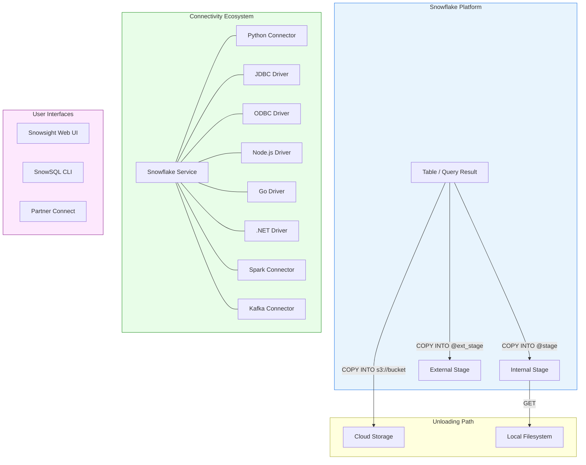

# 3.3 Data Unloading and Connectivity

> **Domain 3: Data Loading, Unloading, and Connectivity (18%)**
> **Certification:** SnowPro Core (COF-C03)

---

## Key Terms

| Term | Definition |
|------|-----------|
| **COPY INTO \<location\>** | SQL command that exports data from a Snowflake table into files in a stage or external location |
| **GET** | Command to download files from an internal (named, table, or user) stage to a local directory |
| **Connector** | A driver or library that enables programmatic access to Snowflake from applications |
| **Driver** | Low-level interface (JDBC, ODBC) for connecting applications and tools to Snowflake |
| **Partner Connect** | Snowflake feature that automates setup of third-party tool integrations |
| **SnowSQL** | Snowflake's official command-line client for executing SQL and scripting operations |
| **Snowsight** | Snowflake's modern web-based user interface for querying, visualization, and administration |

---

## Overview

Data unloading is the process of exporting data from Snowflake tables into files stored in stages or cloud storage. Snowflake provides the `COPY INTO <location>` command for bulk exports and supports a wide ecosystem of connectors, drivers, and tools for application connectivity. Understanding the full connectivity landscape — from bulk unloading to real-time integrations — is essential for the SnowPro Core exam.

---

## Characteristics

| Feature | Details |
|---------|---------|
| Unload command | `COPY INTO <location>` exports query results to stage files |
| Supported formats | CSV, JSON, Parquet, ORC, Avro |
| Compression | Auto-compressed (gzip for CSV, Snappy for Parquet) by default |
| Parallelism | Automatically splits output into multiple files for performance |
| Internal download | GET command retrieves files from internal stages to local filesystem |
| Connectivity | Native connectors for Python, Java, Node.js, Go, .NET, Spark, Kafka |
| Web interface | Snowsight (modern) and Classic Console (legacy, deprecated) |
| CLI tool | SnowSQL for scripting and automation |
| Partner integrations | Partner Connect for one-click third-party tool setup |
| Data transfer costs | Cross-region and cross-cloud transfers incur charges |

---

## Diagram: Data Unloading Flow and Connectivity Ecosystem



---

## Detailed Content

### COPY INTO \<location\> Syntax

The **COPY INTO \<location\>** command unloads data from a table or query into one or more files in a stage or external cloud storage location. Unlike `COPY INTO <table>` (loading), this variant writes data out of Snowflake.

Basic syntax:

```sql
COPY INTO <location>
FROM { <table_name> | ( <query> ) }
[ FILE_FORMAT = ( <format_options> ) ]
[ COPY_OPTIONS ]
[ HEADER ]
```

The location can be:
- An internal named stage (`@my_stage`)
- A table stage (`@%my_table`)
- A user stage (`@~`)
- An external stage (`@my_ext_stage/path/`)
- A direct cloud storage URL (`s3://bucket/path/`)

### Unloading Options

| Option | Description | Default |
|--------|-------------|---------|
| **SINGLE** | When TRUE, produces exactly one output file | FALSE |
| **MAX_FILE_SIZE** | Maximum size (bytes) of each output file | 16 MB |
| **HEADER** | Include column headers in the first row (CSV) | FALSE |
| **OVERWRITE** | Overwrite existing files in the target location | FALSE |
| **FILE_FORMAT** | Specifies output format (CSV, JSON, Parquet) | CSV |
| PARTITION BY | Partition output files into separate paths by expression | None |
| INCLUDE_QUERY_ID | Append query ID to filename prefix | TRUE |

Key behaviors:
- By default, unloading produces multiple compressed files for parallel throughput
- Setting `SINGLE = TRUE` forces one file but may be slower for large datasets
- `MAX_FILE_SIZE` controls file splitting; larger values mean fewer, bigger files
- **OVERWRITE** must be TRUE to replace existing files; otherwise the command fails if files exist
- The **PARTITION BY** option organizes output into a directory structure (useful for data lake patterns)

### GET Command

The **GET** command downloads staged files from an internal stage to the local filesystem. It is only available through SnowSQL or connectors — not through the web UI.

```
GET @<stage_name>/<path> file://<local_directory>
```

Key points:
- Works only with **internal stages** (named, table, user)
- Cannot download from external stages (use cloud-native tools instead)
- Files are automatically decrypted during download
- Supports pattern matching with `PATTERN` parameter
- Parallel download is the default behavior

### Snowflake Connectors

Snowflake provides native connectors for multiple programming languages and platforms:

**Python Connector** — The most popular connector for data science and scripting. Supports `cursor.execute()`, pandas DataFrames via `fetch_pandas_all()`, and async queries. Includes an optional `snowflake-connector-python[pandas]` extension.

**JDBC Driver** — Standard Java Database Connectivity driver for Java/JVM applications. Used by many BI tools (Tableau, DBeaver) and ETL platforms.

**ODBC Driver** — Open Database Connectivity driver for C/C++ applications and tools that use ODBC (Excel, Power BI on Windows). Requires a driver manager on Linux/macOS.

**Node.js Driver** — Native JavaScript/TypeScript connector for web applications and serverless functions.

**Go Driver (gosnowflake)** — Native driver following Go's `database/sql` interface.

**.NET Driver** — For C# and .NET applications, supports both .NET Framework and .NET Core.

**Spark Connector** — Enables bidirectional data transfer between Spark clusters and Snowflake. Pushes query processing to Snowflake for performance.

### SnowSQL CLI

**SnowSQL** is Snowflake's command-line interface for executing SQL, managing stages, and automating workflows. Key features:

- Supports PUT/GET commands (not available in web UI)
- Variable substitution and scripting with `!define`
- Output formatting (CSV, TSV, table, JSON)
- Auto-upgrade mechanism for version management
- Configuration via `~/.snowsql/config` file
- Supports all SQL commands plus client-specific commands

### Snowsight vs Classic Console

**Snowsight** is Snowflake's modern web interface that replaced the **Classic Console** (deprecated). Differences:

| Feature | Snowsight | Classic Console |
|---------|-----------|-----------------|
| Query editor | Advanced with autocomplete | Basic |
| Dashboards | Built-in charting and dashboards | Limited |
| PUT/GET | Not supported | Not supported |
| Data preview | Yes, with profiling | Basic preview |
| Worksheets | Folders, sharing, versioning | Flat list |
| Status | Active, primary UI | Deprecated |

Neither web interface supports PUT/GET — these require SnowSQL or a connector.

### Partner Connect

**Partner Connect** provides one-click integration setup with certified third-party tools. When activated, it automatically:

1. Creates a dedicated database, warehouse, and role for the partner
2. Generates a service user with appropriate permissions
3. Passes connection credentials to the partner platform
4. Launches the partner's interface with the connection pre-configured

Supported partner categories: BI tools, ETL/ELT, data science, security, and data governance.

### Snowflake Ecosystem Tools

**Kafka Connector** — Streams data from Apache Kafka topics into Snowflake tables using Snowpipe. Supports both key and value deserialization (Avro, JSON, plain text). Runs as a Kafka Connect sink connector.

**Spark Connector** — Bidirectional data movement between Apache Spark and Snowflake. Pushes SQL operations to Snowflake's engine rather than pulling all data into Spark. Configured via Spark DataSource API (`format("snowflake")`).

### Data Transfer Costs

Snowflake charges for data transferred out of the platform:

| Transfer Type | Cost |
|---------------|------|
| Same region, same cloud | Free |
| Cross-region, same cloud | Per-TB charge |
| Cross-cloud | Per-TB charge (higher) |
| Unloading to stage (same region) | Free (storage costs apply) |
| Replication (cross-region) | Transfer + compute charges |

Data ingestion (loading) into Snowflake is always free of transfer charges.

---

## SQL Examples

### Example 1: Basic Unload to Internal Stage

```sql
-- Unload all data from a table to a named internal stage
COPY INTO @my_export_stage/sales/
FROM sales_data
FILE_FORMAT = (TYPE = CSV COMPRESSION = GZIP)
HEADER = TRUE;
```

### Example 2: Unload Query Results with Partitioning

```sql
-- Unload filtered query results, partitioned by date
COPY INTO @my_export_stage/partitioned/
FROM (
    SELECT customer_id, order_date, amount
    FROM orders
    WHERE order_date >= '2024-01-01'
)
PARTITION BY (TO_VARCHAR(order_date, 'YYYY/MM'))
FILE_FORMAT = (TYPE = PARQUET)
MAX_FILE_SIZE = 67108864;  -- 64 MB per file
```

### Example 3: Unload to External Stage (S3) as Single File

```sql
-- Unload to an external S3 stage as a single JSON file
COPY INTO @my_s3_stage/reports/daily_summary.json
FROM (
    SELECT object_construct(
        'date', report_date,
        'total_revenue', revenue,
        'order_count', orders
    ) AS data
    FROM daily_summary
)
FILE_FORMAT = (TYPE = JSON)
SINGLE = TRUE
OVERWRITE = TRUE;
```

### Example 4: Unload with COPY Options and Overwrite

```sql
-- Unload CSV with custom delimiter, no header, overwriting existing
COPY INTO @~/user_exports/accounts_
FROM accounts
FILE_FORMAT = (
    TYPE = CSV
    FIELD_DELIMITER = '|'
    NULL_IF = ('NULL', '')
    COMPRESSION = NONE
)
SINGLE = FALSE
MAX_FILE_SIZE = 52428800  -- 50 MB
OVERWRITE = TRUE;
```

### Example 5: GET Command to Download Files

```sql
-- Download unloaded files from internal stage to local directory
-- (SnowSQL or connector only — not available in Snowsight)
GET @my_export_stage/sales/ file://C:/exports/sales/
    PATTERN = '.*[.]csv[.]gz';
```

### Example 6: Python Connector Usage

```python
# Python connector example for querying and fetching data
import snowflake.connector

conn = snowflake.connector.connect(
    user='my_user',
    password='my_password',
    account='myorg-myaccount',
    warehouse='COMPUTE_WH',
    database='ANALYTICS',
    schema='PUBLIC'
)

cursor = conn.cursor()
cursor.execute("SELECT * FROM sales_data LIMIT 1000")

# Fetch as pandas DataFrame
import pandas as pd
df = cursor.fetch_pandas_all()

cursor.close()
conn.close()
```

---

## Comparison: Connectors and Use Cases

| Connector | Language/Platform | Primary Use Case | Key Feature |
|-----------|-------------------|------------------|-------------|
| Python Connector | Python | Data science, scripting, ETL | Pandas integration, async queries |
| JDBC Driver | Java/JVM | Enterprise apps, BI tools | Standard JDBC interface |
| ODBC Driver | C/C++, Windows apps | Legacy tools, Excel, Power BI | Universal compatibility |
| Node.js Driver | JavaScript | Web apps, serverless | Async/streaming support |
| Go Driver | Go | Microservices, CLIs | Native `database/sql` |
| .NET Driver | C#/.NET | Windows enterprise apps | .NET Core + Framework |
| Spark Connector | Scala/Java/Python | Big data pipelines | Pushdown optimization |
| Kafka Connector | JVM (Kafka Connect) | Real-time streaming | Snowpipe integration |
| SnowSQL | CLI (any OS) | Automation, scripting | PUT/GET, variable substitution |
| Snowsight | Web browser | Ad-hoc queries, dashboards | No install required |

---

## Exam Tips

1. **COPY INTO direction** — Remember there are two forms: `COPY INTO <table>` (loading) and `COPY INTO <location>` (unloading). The exam tests whether you know the difference.
2. **GET limitations** — GET works only with internal stages and only through SnowSQL or connectors, never through the web UI.
3. **SINGLE = TRUE** — Know that this produces exactly one file and is useful for small exports but sacrifices parallel performance.
4. **OVERWRITE behavior** — Default is FALSE. If files already exist and OVERWRITE is not TRUE, the command fails.
5. **Partner Connect** — Know that it creates a database, warehouse, role, and user automatically.
6. **Data transfer costs** — Same-region is free; cross-region and cross-cloud incur charges. Loading is always free.
7. **PUT/GET availability** — These are NOT available in Snowsight or Classic Console. Only SnowSQL and connectors support them.
8. **Snowsight vs Classic Console** — Classic Console is deprecated. Snowsight is the current standard web UI.

---

## Common Misconceptions

| Misconception | Reality |
|---------------|---------|
| "COPY INTO unloads always create one file" | Default behavior splits into multiple parallel files (~16 MB each); use SINGLE = TRUE for one file |
| "GET works with external stages" | GET only works with internal stages; for external stages, use cloud-native tools (aws s3 cp, gsutil, az storage) |
| "You can PUT/GET from Snowsight" | PUT and GET require SnowSQL or a connector; neither web UI supports them |
| "Unloading data is free" | Unloading to a same-region stage has no transfer cost, but cross-region/cross-cloud transfers are charged |
| "Partner Connect requires manual credential setup" | Partner Connect automates the entire process: creates objects, generates credentials, and passes them to the partner |
| "HEADER works with all file formats" | HEADER applies primarily to CSV; Parquet/ORC have embedded schema metadata instead |
| "The Kafka connector loads data directly" | The Kafka connector uses Snowpipe internally for ingestion, not direct INSERT |

---

## Key Takeaways

- **COPY INTO \<location\>** is the primary command for bulk data unloading from Snowflake
- Default unloading produces multiple compressed files optimized for parallel throughput
- **GET** downloads from internal stages only and requires SnowSQL or a connector
- Snowflake offers native connectors for Python, Java (JDBC), ODBC, Node.js, Go, .NET, Spark, and Kafka
- **SnowSQL** is the only interface supporting both PUT and GET commands
- **Snowsight** is the modern web UI; Classic Console is deprecated
- **Partner Connect** automates third-party integration setup with one click
- Data transfer is free within the same region; cross-region and cross-cloud transfers incur costs
- The **PARTITION BY** option enables data lake-style directory organization during unloading
- Use **OVERWRITE = TRUE** explicitly when you need to replace existing staged files

---

## References

- [Snowflake Documentation: Unloading Data](https://docs.snowflake.com/en/user-guide/data-unload-overview)
- [Snowflake Documentation: COPY INTO \<location\>](https://docs.snowflake.com/en/sql-reference/sql/copy-into-location)
- [Snowflake Documentation: GET Command](https://docs.snowflake.com/en/sql-reference/sql/get)
- [Snowflake Documentation: Snowflake Connectors](https://docs.snowflake.com/en/developer-guide/drivers)
- [Snowflake Documentation: SnowSQL](https://docs.snowflake.com/en/user-guide/snowsql)
- [Snowflake Documentation: Partner Connect](https://docs.snowflake.com/en/user-guide/ecosystem-partner-connect)
- [Snowflake Documentation: Data Transfer Billing](https://docs.snowflake.com/en/user-guide/cost-understanding-data-transfer)

---

## Additional Exam Scenarios

### Scenario 1: COPY INTO @stage with PARTITION BY — What Does It Create?

**Question:** You run:
```sql
COPY INTO @my_stage/output/
FROM orders
PARTITION BY (TO_VARCHAR(order_date, 'YYYY/MM'))
FILE_FORMAT = (TYPE = PARQUET);
```
What is the result in the stage?

**Answer:** Snowflake creates a **subdirectory structure** based on the partition expression values:
```
@my_stage/output/2024/01/data_0_0_0.parquet
@my_stage/output/2024/01/data_0_0_1.parquet
@my_stage/output/2024/02/data_0_0_0.parquet
@my_stage/output/2024/03/data_0_0_0.parquet
...
```

Each unique value of the PARTITION BY expression becomes a directory. Within each directory, files are split according to MAX_FILE_SIZE. This is the standard **data lake partitioning pattern** — useful for tools like Spark, Hive, or Snowflake external tables that leverage partition pruning.

---

### Scenario 2: MAX_FILE_SIZE for Parallel Unload — Good Value?

**Question:** You're unloading a 10 GB table. What MAX_FILE_SIZE should you set for optimal parallelism?

**Answer:** The default is **16 MB**, which creates many small files (good parallelism but many files to manage). Common production choices:

| Scenario | Recommended MAX_FILE_SIZE | Result for 10 GB |
|----------|--------------------------|------------------|
| Maximum parallelism | 16 MB (default) | ~640 files |
| Balanced | 64 MB | ~160 files |
| Fewer files (data lake landing) | 256 MB | ~40 files |
| Single consumer downstream | Use SINGLE=TRUE | 1 file |

**Best practice:** 64–256 MB is typical for data lake patterns where downstream tools (Spark, external tables) benefit from fewer, larger files. The 100–250 MB sweet spot that applies to loading also applies to unloaded files that will later be re-loaded elsewhere.

---

### Scenario 3: SINGLE=TRUE — When to Use vs Parallel Files?

**Question:** When should you use `SINGLE = TRUE` in COPY INTO (unload)?

**Answer:**

| Use SINGLE=TRUE | Use Parallel (default) |
|-----------------|----------------------|
| Small datasets (< 100 MB) | Large datasets |
| Downstream tool requires one file | Data lake / distributed processing |
| Human-readable reports | Performance-critical exports |
| API consumption (single payload) | Reloading into another Snowflake account |
| File must have a specific name | Parallel throughput needed |

**Limitations of SINGLE=TRUE:**
- Cannot be used with PARTITION BY
- Much slower for large datasets (no parallelism)
- Output file can be very large (no splitting)
- Still compressed by default (add `COMPRESSION = NONE` if needed uncompressed)

---

### Scenario 4: Unloading to External Stage — Who Pays for Storage?

**Question:** You unload data to an external stage pointing to your company's S3 bucket. Who pays for the storage?

**Answer:** **The customer (you) pays the cloud provider directly** for storage in the external location. Snowflake is not involved in external storage billing.

Cost breakdown:
| Cost Component | Who Pays |
|----------------|----------|
| Snowflake compute (warehouse for COPY INTO) | You → Snowflake credits |
| Storage in external S3/Azure/GCS | You → Cloud provider (AWS/Azure/GCP bill) |
| Data transfer (same region) | **Free** |
| Data transfer (cross-region) | You → Snowflake egress charges |
| Data transfer (cross-cloud) | You → Snowflake egress charges (highest) |

**Key point:** Unloading to a stage in the **same region** as your Snowflake account incurs no data transfer charges — only compute and storage costs.

---

### Scenario 5: Connector Choice — Python vs JDBC vs ODBC

**Question:** Match the scenario to the correct connector:
- (A) Data scientist building a model in Jupyter notebook
- (B) Java Spring Boot application querying Snowflake
- (C) Power BI connecting to Snowflake on Windows

**Answer:**

| Scenario | Connector | Reason |
|----------|-----------|--------|
| (A) Data science in Jupyter | **Python Connector** | Native pandas integration (`fetch_pandas_all()`), familiar Python ecosystem |
| (B) Java enterprise app | **JDBC Driver** | Standard Java database interface, connection pooling, Spring Data compatible |
| (C) Power BI on Windows | **ODBC Driver** | Power BI uses ODBC for database connectivity; native Windows driver |

**Additional connectors to know:**
- **Node.js** → Web applications and serverless (Lambda/Cloud Functions)
- **Spark Connector** → Big data pipelines with pushdown optimization
- **Kafka Connector** → Real-time streaming ingestion (uses Snowpipe internally)
- **Go Driver** → Microservices following `database/sql` interface

---

### Scenario 6: SnowSQL PUT Can Only Go to Internal Stages — True or False?

**Question:** "SnowSQL's PUT command can upload files to both internal and external stages." True or false?

**Answer:** **False.** PUT can **only** upload to internal stages (user stage, table stage, or named internal stage). You cannot PUT to an external stage.

For external stages, use cloud-native tools:
- **AWS:** `aws s3 cp` or `aws s3 sync`
- **Azure:** `az storage blob upload` or AzCopy
- **GCP:** `gsutil cp`

**Similarly:** GET can only download from internal stages. For external stages, use the same cloud-native tools to download files.

---

### Scenario 7: Data Transfer Costs — When Do They Apply?

**Question:** In which scenarios does Snowflake charge data transfer fees?

**Answer:**

| Scenario | Transfer Cost? |
|----------|---------------|
| Load data FROM same-region S3 into Snowflake | **Free** (ingestion is always free) |
| Unload TO same-region S3 | **Free** |
| Unload TO different region (same cloud) | **Yes** — per-TB cross-region charge |
| Unload TO different cloud provider | **Yes** — higher per-TB cross-cloud charge |
| Database replication (cross-region) | **Yes** — transfer + compute |
| Data sharing (same region) | **Free** (no data movement) |
| Data sharing (cross-region/cross-cloud) | **Yes** — replication charges |
| Query results returned to client | **Free** |
| Time Travel / Fail-safe storage | No transfer (storage charges only) |

**Exam key:** "Same region, same cloud = free transfer." This applies to both loading and unloading. Charges only apply when data crosses region or cloud boundaries.

---

### Scenario 8: GET Command — Can You GET from External Stage?

**Question:** Can you run `GET @my_external_stage/file.csv file:///tmp/` to download a file from an external stage?

**Answer:** **No.** GET only works with **internal stages** (user, table, named internal). Attempting GET from an external stage produces an error.

**Why?** GET is a Snowflake-managed file transfer operation. External stage files reside in the customer's own cloud storage, so Snowflake directs you to use cloud-native tools instead:

```bash
# AWS
aws s3 cp s3://my-bucket/path/file.csv /tmp/

# Azure
az storage blob download --container my-container --name file.csv --file /tmp/file.csv

# GCP
gsutil cp gs://my-bucket/path/file.csv /tmp/
```

**Complete PUT/GET compatibility matrix:**

| Operation | User Stage | Table Stage | Named Internal | Named External |
|-----------|-----------|-------------|----------------|----------------|
| PUT | Yes | Yes | Yes | **No** |
| GET | Yes | Yes | Yes | **No** |
| COPY INTO (load) | Yes | Yes | Yes | Yes |
| COPY INTO (unload) | Yes | Yes | Yes | Yes |

---

[← 3.2 Data Loading Methods](./3.2_Data_Loading_Methods.md) | [Domain 3 README](./README.md) | [Home](../README.md)
