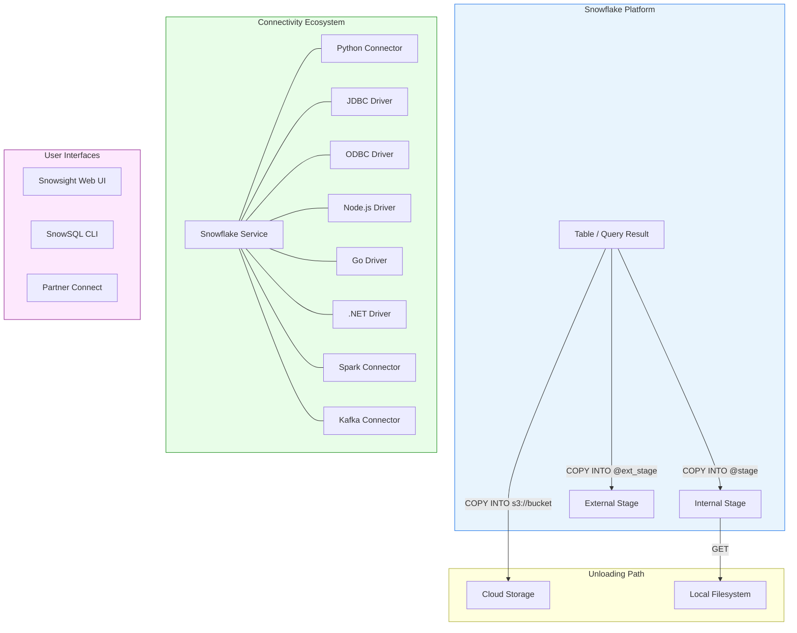

# 3.3 Data Unloading and Connectivity

> **Domain 3: Data Loading, Unloading, and Connectivity (18%)**
> **Certification:** SnowPro Core (COF-C03)

---

## Key Terms

| Term | Definition |
|------|-----------|
| **COPY INTO \<location\>** | SQL command that exports data from a Snowflake table into files in a stage or external location |
| **GET** | Command to download files from an internal (named, table, or user) stage to a local directory |
| **Connector** | A driver or library that enables programmatic access to Snowflake from applications |
| **Driver** | Low-level interface (JDBC, ODBC) for connecting applications and tools to Snowflake |
| **Partner Connect** | Snowflake feature that automates setup of third-party tool integrations |
| **SnowSQL** | Snowflake's official command-line client for executing SQL and scripting operations |
| **Snowsight** | Snowflake's modern web-based user interface for querying, visualization, and administration |

---

## Overview

Data unloading is the process of exporting data from Snowflake tables into files stored in stages or cloud storage. Snowflake provides the `COPY INTO <location>` command for bulk exports and supports a wide ecosystem of connectors, drivers, and tools for application connectivity. Understanding the full connectivity landscape — from bulk unloading to real-time integrations — is essential for the SnowPro Core exam.

---

## Characteristics

| Feature | Details |
|---------|---------|
| Unload command | `COPY INTO <location>` exports query results to stage files |
| Supported formats | CSV, JSON, Parquet, ORC, Avro |
| Compression | Auto-compressed (gzip for CSV, Snappy for Parquet) by default |
| Parallelism | Automatically splits output into multiple files for performance |
| Internal download | GET command retrieves files from internal stages to local filesystem |
| Connectivity | Native connectors for Python, Java, Node.js, Go, .NET, Spark, Kafka |
| Web interface | Snowsight (modern) and Classic Console (legacy, deprecated) |
| CLI tool | SnowSQL for scripting and automation |
| Partner integrations | Partner Connect for one-click third-party tool setup |
| Data transfer costs | Cross-region and cross-cloud transfers incur charges |

---

## Diagram: Data Unloading Flow and Connectivity Ecosystem



---

## Detailed Content

### COPY INTO \<location\> Syntax

The **COPY INTO \<location\>** command unloads data from a table or query into one or more files in a stage or external cloud storage location. Unlike `COPY INTO <table>` (loading), this variant writes data out of Snowflake.

Basic syntax:

```sql
COPY INTO <location>
FROM { <table_name> | ( <query> ) }
[ FILE_FORMAT = ( <format_options> ) ]
[ COPY_OPTIONS ]
[ HEADER ]
```

The location can be:
- An internal named stage (`@my_stage`)
- A table stage (`@%my_table`)
- A user stage (`@~`)
- An external stage (`@my_ext_stage/path/`)
- A direct cloud storage URL (`s3://bucket/path/`)

### Unloading Options

| Option | Description | Default |
|--------|-------------|---------|
| **SINGLE** | When TRUE, produces exactly one output file | FALSE |
| **MAX_FILE_SIZE** | Maximum size (bytes) of each output file | 16 MB |
| **HEADER** | Include column headers in the first row (CSV) | FALSE |
| **OVERWRITE** | Overwrite existing files in the target location | FALSE |
| **FILE_FORMAT** | Specifies output format (CSV, JSON, Parquet) | CSV |
| PARTITION BY | Partition output files into separate paths by expression | None |
| INCLUDE_QUERY_ID | Append query ID to filename prefix | TRUE |

Key behaviors:
- By default, unloading produces multiple compressed files for parallel throughput
- Setting `SINGLE = TRUE` forces one file but may be slower for large datasets
- `MAX_FILE_SIZE` controls file splitting; larger values mean fewer, bigger files
- **OVERWRITE** must be TRUE to replace existing files; otherwise the command fails if files exist
- The **PARTITION BY** option organizes output into a directory structure (useful for data lake patterns)

### GET Command

The **GET** command downloads staged files from an internal stage to the local filesystem. It is only available through SnowSQL or connectors — not through the web UI.

```
GET @<stage_name>/<path> file://<local_directory>
```

Key points:
- Works only with **internal stages** (named, table, user)
- Cannot download from external stages (use cloud-native tools instead)
- Files are automatically decrypted during download
- Supports pattern matching with `PATTERN` parameter
- Parallel download is the default behavior

### Snowflake Connectors

Snowflake provides native connectors for multiple programming languages and platforms:

**Python Connector** — The most popular connector for data science and scripting. Supports `cursor.execute()`, pandas DataFrames via `fetch_pandas_all()`, and async queries. Includes an optional `snowflake-connector-python[pandas]` extension.

**JDBC Driver** — Standard Java Database Connectivity driver for Java/JVM applications. Used by many BI tools (Tableau, DBeaver) and ETL platforms.

**ODBC Driver** — Open Database Connectivity driver for C/C++ applications and tools that use ODBC (Excel, Power BI on Windows). Requires a driver manager on Linux/macOS.

**Node.js Driver** — Native JavaScript/TypeScript connector for web applications and serverless functions.

**Go Driver (gosnowflake)** — Native driver following Go's `database/sql` interface.

**.NET Driver** — For C# and .NET applications, supports both .NET Framework and .NET Core.

**Spark Connector** — Enables bidirectional data transfer between Spark clusters and Snowflake. Pushes query processing to Snowflake for performance.

### SnowSQL CLI

**SnowSQL** is Snowflake's command-line interface for executing SQL, managing stages, and automating workflows. Key features:

- Supports PUT/GET commands (not available in web UI)
- Variable substitution and scripting with `!define`
- Output formatting (CSV, TSV, table, JSON)
- Auto-upgrade mechanism for version management
- Configuration via `~/.snowsql/config` file
- Supports all SQL commands plus client-specific commands

### Snowsight vs Classic Console

**Snowsight** is Snowflake's modern web interface that replaced the **Classic Console** (deprecated). Differences:

| Feature | Snowsight | Classic Console |
|---------|-----------|-----------------|
| Query editor | Advanced with autocomplete | Basic |
| Dashboards | Built-in charting and dashboards | Limited |
| PUT/GET | Not supported | Not supported |
| Data preview | Yes, with profiling | Basic preview |
| Worksheets | Folders, sharing, versioning | Flat list |
| Status | Active, primary UI | Deprecated |

Neither web interface supports PUT/GET — these require SnowSQL or a connector.

### Partner Connect

**Partner Connect** provides one-click integration setup with certified third-party tools. When activated, it automatically:

1. Creates a dedicated database, warehouse, and role for the partner
2. Generates a service user with appropriate permissions
3. Passes connection credentials to the partner platform
4. Launches the partner's interface with the connection pre-configured

Supported partner categories: BI tools, ETL/ELT, data science, security, and data governance.

### Snowflake Ecosystem Tools

**Kafka Connector** — Streams data from Apache Kafka topics into Snowflake tables using Snowpipe. Supports both key and value deserialization (Avro, JSON, plain text). Runs as a Kafka Connect sink connector.

**Spark Connector** — Bidirectional data movement between Apache Spark and Snowflake. Pushes SQL operations to Snowflake's engine rather than pulling all data into Spark. Configured via Spark DataSource API (`format("snowflake")`).

### Data Transfer Costs

Snowflake charges for data transferred out of the platform:

| Transfer Type | Cost |
|---------------|------|
| Same region, same cloud | Free |
| Cross-region, same cloud | Per-TB charge |
| Cross-cloud | Per-TB charge (higher) |
| Unloading to stage (same region) | Free (storage costs apply) |
| Replication (cross-region) | Transfer + compute charges |

Data ingestion (loading) into Snowflake is always free of transfer charges.

---

## SQL Examples

### Example 1: Basic Unload to Internal Stage

```sql
-- Unload all data from a table to a named internal stage
COPY INTO @my_export_stage/sales/
FROM sales_data
FILE_FORMAT = (TYPE = CSV COMPRESSION = GZIP)
HEADER = TRUE;
```

### Example 2: Unload Query Results with Partitioning

```sql
-- Unload filtered query results, partitioned by date
COPY INTO @my_export_stage/partitioned/
FROM (
    SELECT customer_id, order_date, amount
    FROM orders
    WHERE order_date >= '2024-01-01'
)
PARTITION BY (TO_VARCHAR(order_date, 'YYYY/MM'))
FILE_FORMAT = (TYPE = PARQUET)
MAX_FILE_SIZE = 67108864;  -- 64 MB per file
```

### Example 3: Unload to External Stage (S3) as Single File

```sql
-- Unload to an external S3 stage as a single JSON file
COPY INTO @my_s3_stage/reports/daily_summary.json
FROM (
    SELECT object_construct(
        'date', report_date,
        'total_revenue', revenue,
        'order_count', orders
    ) AS data
    FROM daily_summary
)
FILE_FORMAT = (TYPE = JSON)
SINGLE = TRUE
OVERWRITE = TRUE;
```

### Example 4: Unload with COPY Options and Overwrite

```sql
-- Unload CSV with custom delimiter, no header, overwriting existing
COPY INTO @~/user_exports/accounts_
FROM accounts
FILE_FORMAT = (
    TYPE = CSV
    FIELD_DELIMITER = '|'
    NULL_IF = ('NULL', '')
    COMPRESSION = NONE
)
SINGLE = FALSE
MAX_FILE_SIZE = 52428800  -- 50 MB
OVERWRITE = TRUE;
```

### Example 5: GET Command to Download Files

```sql
-- Download unloaded files from internal stage to local directory
-- (SnowSQL or connector only — not available in Snowsight)
GET @my_export_stage/sales/ file://C:/exports/sales/
    PATTERN = '.*[.]csv[.]gz';
```

### Example 6: Python Connector Usage

```python
# Python connector example for querying and fetching data
import snowflake.connector

conn = snowflake.connector.connect(
    user='my_user',
    password='my_password',
    account='myorg-myaccount',
    warehouse='COMPUTE_WH',
    database='ANALYTICS',
    schema='PUBLIC'
)

cursor = conn.cursor()
cursor.execute("SELECT * FROM sales_data LIMIT 1000")

# Fetch as pandas DataFrame
import pandas as pd
df = cursor.fetch_pandas_all()

cursor.close()
conn.close()
```

---

## Comparison: Connectors and Use Cases

| Connector | Language/Platform | Primary Use Case | Key Feature |
|-----------|-------------------|------------------|-------------|
| Python Connector | Python | Data science, scripting, ETL | Pandas integration, async queries |
| JDBC Driver | Java/JVM | Enterprise apps, BI tools | Standard JDBC interface |
| ODBC Driver | C/C++, Windows apps | Legacy tools, Excel, Power BI | Universal compatibility |
| Node.js Driver | JavaScript | Web apps, serverless | Async/streaming support |
| Go Driver | Go | Microservices, CLIs | Native `database/sql` |
| .NET Driver | C#/.NET | Windows enterprise apps | .NET Core + Framework |
| Spark Connector | Scala/Java/Python | Big data pipelines | Pushdown optimization |
| Kafka Connector | JVM (Kafka Connect) | Real-time streaming | Snowpipe integration |
| SnowSQL | CLI (any OS) | Automation, scripting | PUT/GET, variable substitution |
| Snowsight | Web browser | Ad-hoc queries, dashboards | No install required |

---

## Exam Tips

1. **COPY INTO direction** — Remember there are two forms: `COPY INTO <table>` (loading) and `COPY INTO <location>` (unloading). The exam tests whether you know the difference.
2. **GET limitations** — GET works only with internal stages and only through SnowSQL or connectors, never through the web UI.
3. **SINGLE = TRUE** — Know that this produces exactly one file and is useful for small exports but sacrifices parallel performance.
4. **OVERWRITE behavior** — Default is FALSE. If files already exist and OVERWRITE is not TRUE, the command fails.
5. **Partner Connect** — Know that it creates a database, warehouse, role, and user automatically.
6. **Data transfer costs** — Same-region is free; cross-region and cross-cloud incur charges. Loading is always free.
7. **PUT/GET availability** — These are NOT available in Snowsight or Classic Console. Only SnowSQL and connectors support them.
8. **Snowsight vs Classic Console** — Classic Console is deprecated. Snowsight is the current standard web UI.

---

## Common Misconceptions

| Misconception | Reality |
|---------------|---------|
| "COPY INTO unloads always create one file" | Default behavior splits into multiple parallel files (~16 MB each); use SINGLE = TRUE for one file |
| "GET works with external stages" | GET only works with internal stages; for external stages, use cloud-native tools (aws s3 cp, gsutil, az storage) |
| "You can PUT/GET from Snowsight" | PUT and GET require SnowSQL or a connector; neither web UI supports them |
| "Unloading data is free" | Unloading to a same-region stage has no transfer cost, but cross-region/cross-cloud transfers are charged |
| "Partner Connect requires manual credential setup" | Partner Connect automates the entire process: creates objects, generates credentials, and passes them to the partner |
| "HEADER works with all file formats" | HEADER applies primarily to CSV; Parquet/ORC have embedded schema metadata instead |
| "The Kafka connector loads data directly" | The Kafka connector uses Snowpipe internally for ingestion, not direct INSERT |

---

## Key Takeaways

- **COPY INTO \<location\>** is the primary command for bulk data unloading from Snowflake
- Default unloading produces multiple compressed files optimized for parallel throughput
- **GET** downloads from internal stages only and requires SnowSQL or a connector
- Snowflake offers native connectors for Python, Java (JDBC), ODBC, Node.js, Go, .NET, Spark, and Kafka
- **SnowSQL** is the only interface supporting both PUT and GET commands
- **Snowsight** is the modern web UI; Classic Console is deprecated
- **Partner Connect** automates third-party integration setup with one click
- Data transfer is free within the same region; cross-region and cross-cloud transfers incur costs
- The **PARTITION BY** option enables data lake-style directory organization during unloading
- Use **OVERWRITE = TRUE** explicitly when you need to replace existing staged files

---

## References

- [Snowflake Documentation: Unloading Data](https://docs.snowflake.com/en/user-guide/data-unload-overview)
- [Snowflake Documentation: COPY INTO \<location\>](https://docs.snowflake.com/en/sql-reference/sql/copy-into-location)
- [Snowflake Documentation: GET Command](https://docs.snowflake.com/en/sql-reference/sql/get)
- [Snowflake Documentation: Snowflake Connectors](https://docs.snowflake.com/en/developer-guide/drivers)
- [Snowflake Documentation: SnowSQL](https://docs.snowflake.com/en/user-guide/snowsql)
- [Snowflake Documentation: Partner Connect](https://docs.snowflake.com/en/user-guide/ecosystem-partner-connect)
- [Snowflake Documentation: Data Transfer Billing](https://docs.snowflake.com/en/user-guide/cost-understanding-data-transfer)

---

[← 3.2 Data Loading Methods](./3.2_Data_Loading_Methods.md) | [Domain 3 README](./README.md) | [Home](../README.md)
