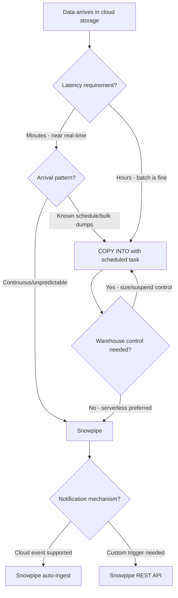
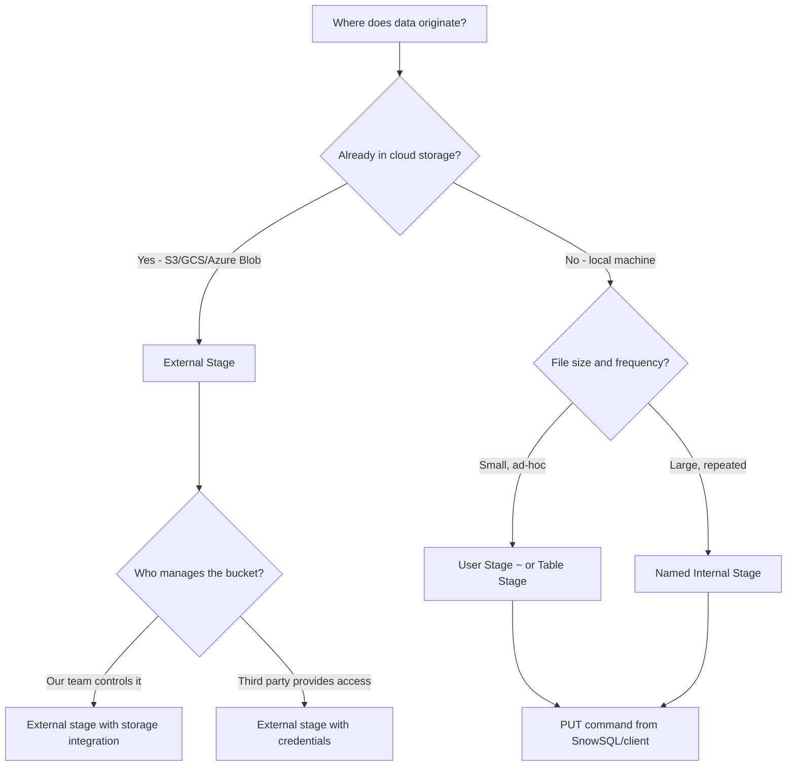
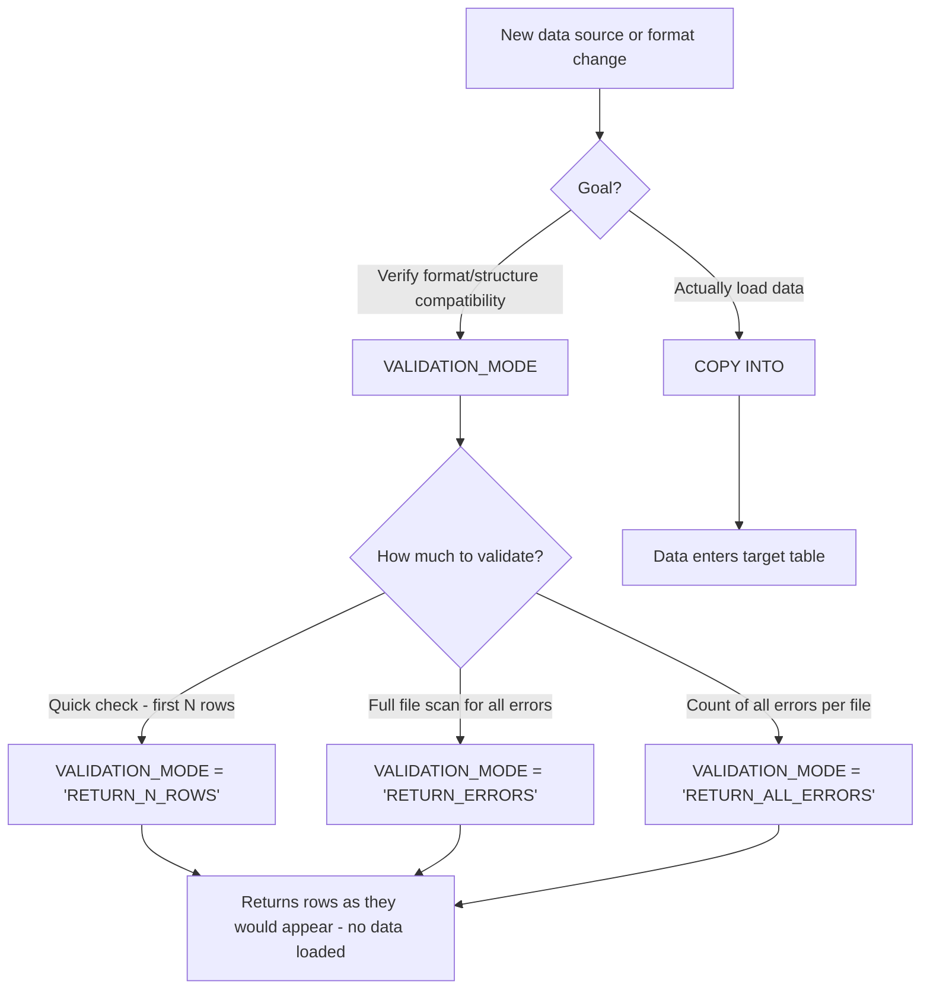
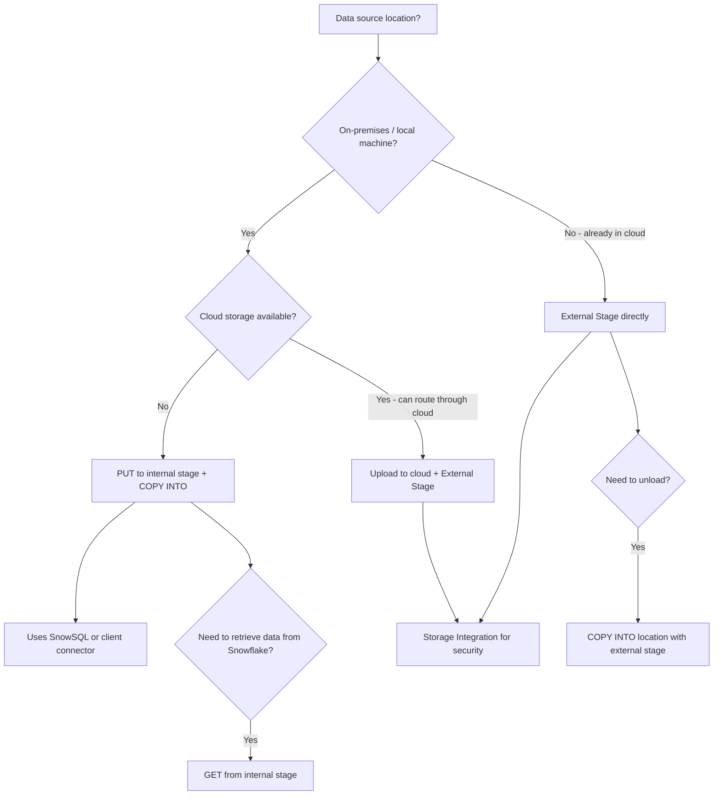
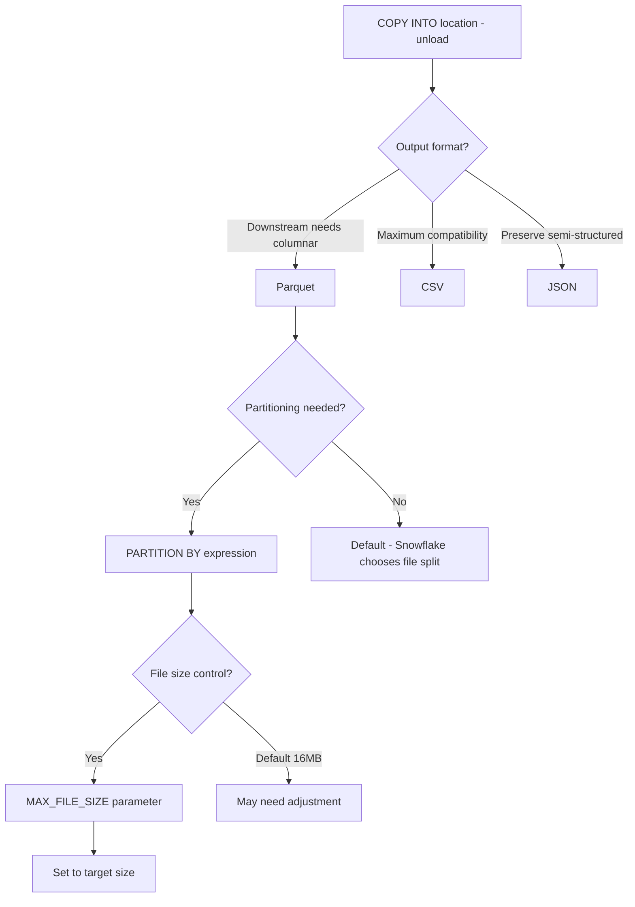

# Scenarios Decision Guide — Domain 3: Data Loading, Unloading, and Connectivity

This guide presents 10 scenario-based decision problems covering Domain 3 (18%) of the SnowPro Core (COF-C03) certification. Each scenario mirrors the style of exam questions that require you to choose the best option given a specific business situation, then explains the reasoning and common traps.

---

## Table of Contents

| # | Scenario |
|---|----------|
| 1 | [Bulk Load (COPY INTO) vs Snowpipe](#scenario-1-bulk-load-copy-into-vs-snowpipe) |
| 2 | [ON_ERROR Strategy Selection](#scenario-2-on_error-strategy-selection) |
| 3 | [Internal vs External Stage](#scenario-3-internal-vs-external-stage) |
| 4 | [File Format Decisions](#scenario-4-file-format-decisions) |
| 5 | [VALIDATION_MODE vs Actual Loading](#scenario-5-validation_mode-vs-actual-loading) |
| 6 | [Optimal File Sizing Strategy](#scenario-6-optimal-file-sizing-strategy) |
| 7 | [PUT/GET vs External Stage Approaches](#scenario-7-putget-vs-external-stage-approaches) |
| 8 | [Snowpipe Auto-Ingest vs REST API](#scenario-8-snowpipe-auto-ingest-vs-rest-api) |
| 9 | [Data Unloading Format and Partitioning](#scenario-9-data-unloading-format-and-partitioning) |
| 10 | [Connector Selection for Client Applications](#scenario-10-connector-selection-for-client-applications) |

---

## Scenario 1: Bulk Load (COPY INTO) vs Snowpipe

### Situation

A retail company receives sales transaction files from 200 stores. Stores upload files to an S3 bucket at unpredictable intervals throughout the day. The analytics team needs data available within 1–2 minutes of arrival. The company wants to minimize operational overhead and avoid scheduling batch jobs.

### Decision Flow



### Answer

**Snowpipe with auto-ingest** is the correct choice.

### Why Not Others

| Option | Why Not |
|--------|---------|
| COPY INTO with TASK | Requires a warehouse to be running or resumed on schedule; unpredictable arrival means either wasted credits (always-on warehouse) or delayed loading (long task interval) |
| COPY INTO manual | Requires orchestration tooling and human/scheduled triggers; adds operational overhead |
| Snowpipe REST API | Works but adds unnecessary complexity when S3 event notifications can trigger auto-ingest natively |

### Exam Trap

The exam may describe a scenario with "continuous, event-driven loading" and offer COPY INTO with a 1-minute TASK schedule as an option. While this achieves similar latency, it requires a **dedicated warehouse running continuously**, making it more expensive than Snowpipe's per-file serverless billing. Snowpipe uses a serverless compute model — you do not manage a warehouse.

---

## Scenario 2: ON_ERROR Strategy Selection

### Situation

A healthcare data pipeline loads patient lab results from a third-party laboratory system. Regulatory requirements mandate that **no records may be silently dropped** — every record must either load successfully or be accounted for in an error log. The source files occasionally contain malformed rows (approximately 2–5 per 10,000-row file). The team needs loading to continue despite errors.

### Decision Flow

| Requirement | Recommended ON_ERROR | Behavior |
|-------------|---------------------|----------|
| Abort on any error — zero tolerance | `ABORT_STATEMENT` (default) | Entire COPY fails on first error |
| Skip bad rows, load the rest | `SKIP_FILE_<n>%` or `CONTINUE` | Skips files exceeding threshold or skips individual rows |
| Load everything possible, track all errors | `CONTINUE` | Loads all valid rows, skips invalid ones |
| Never lose data, audit every rejection | `SKIP_FILE` + VALIDATION_MODE pre-check | Validate first, then load clean files |

### Answer

**ON_ERROR = CONTINUE** combined with querying the `VALIDATE()` function or `COPY_HISTORY` after loading.

With `CONTINUE`, Snowflake loads all valid rows and skips only the malformed ones. After loading, call:
```sql
SELECT * FROM TABLE(VALIDATE(my_table, JOB_ID => '_last'));
```
This returns all rejected rows with error details, satisfying the audit requirement.

### Why Not Others

| Option | Why Not |
|--------|---------|
| `ABORT_STATEMENT` | Fails the entire load on first bad row — 9,995 valid records would not load |
| `SKIP_FILE` | Skips the entire file if any error exists — too aggressive for 2–5 bad rows in 10,000 |
| `SKIP_FILE_5%` | Might work numerically (0.05% < 5%) but the requirement is explicit: no silent drops. `CONTINUE` + VALIDATE provides the audit trail |

### Exam Trap

`ABORT_STATEMENT` is the **default** ON_ERROR behavior. If the exam question does not mention setting ON_ERROR, the default applies and the entire statement fails on the first error. Also note: `VALIDATE()` only works after a COPY command — it cannot be used with Snowpipe loads.

---

## Scenario 3: Internal vs External Stage

### Situation

A startup's data engineering team uses AWS for their application infrastructure. They already have raw event data landing in an S3 bucket via their application's Kinesis Firehose pipeline. They want to load this data into Snowflake. They also have a separate use case where analysts upload small CSV files from their laptops for ad-hoc analysis.

### Decision Flow



### Answer

- **Use case 1 (Kinesis data in S3):** External stage pointing to the existing S3 bucket with a storage integration object.
- **Use case 2 (analyst CSV uploads):** User stage (`@~`) with PUT command from SnowSQL.

### Why Not Others

| Option | Why Not |
|--------|---------|
| Internal stage for Kinesis data | Would require copying data from S3 into Snowflake's managed storage first — redundant, adds latency and cost |
| External stage for analyst uploads | Analysts would need S3 credentials and tooling to upload; PUT to user stage is simpler |
| Table stage for Kinesis data | Table stages cannot be shared or referenced by Snowpipe; they are per-table and limited |

### Exam Trap

Remember the three types of internal stages and their scope:
- **User stage (`@~`):** One per user, cannot be altered or dropped, no file format options at stage level
- **Table stage (`@%table_name`):** One per table, accessible only to the table owner
- **Named internal stage (`@my_stage`):** Most flexible — supports file formats, directory tables, and can be used with Snowpipe

External stages **never store data inside Snowflake** — they are just pointers to cloud storage locations.

---

## Scenario 4: File Format Decisions

### Situation

A data platform team needs to standardize on a format for loading data into Snowflake. The source systems produce:
- **System A:** Nested JSON documents with arrays (IoT sensor readings)
- **System B:** Flat tabular data exported from a legacy Oracle database (100M+ rows)
- **System C:** Analytics output from Spark jobs that needs to preserve schema and data types precisely

### Decision Flow

| Data Characteristic | Best Format | Reason |
|--------------------:|:-----------:|--------|
| Flat, tabular, high volume | **CSV** | Simple, splittable, fast parallel loading |
| Nested/semi-structured | **JSON** or **Parquet** | Preserves hierarchy; JSON for raw ingest into VARIANT, Parquet for typed columnar |
| Schema preservation + types | **Parquet** | Self-describing schema with typed columns, no parsing ambiguity |
| Human-readable, debugging | **CSV** or **JSON** | Text-based, inspectable without tools |
| Columnar analytics output | **Parquet** or **ORC** | Compressed columnar format, efficient for Snowflake to load |

### Answer

- **System A (nested JSON):** Load as JSON into a VARIANT column, then flatten with views/transforms
- **System B (flat Oracle export):** CSV with GZIP compression — maximizes parallel loading performance for flat data
- **System C (Spark output):** Parquet — preserves schema, data types, and columnar compression from Spark

### Why Not Others

| Option | Why Not |
|--------|---------|
| Parquet for System B (Oracle) | Adds conversion complexity from Oracle export; CSV is native to most database export tools |
| CSV for System A (IoT JSON) | Would require flattening before export, losing the nested structure that's natural for sensor data |
| JSON for System C (Spark) | JSON loses Spark's typed schema and columnar benefits; Spark natively writes Parquet efficiently |
| Avro for all | Valid format but less common in exam scenarios; Parquet is Snowflake's preferred columnar format |

### Exam Trap

Snowflake can load semi-structured data (JSON, Avro, Parquet, ORC, XML) into **VARIANT** columns. When loading Parquet, Snowflake can also **auto-detect schema** using `INFER_SCHEMA` and create typed columns directly — this is a newer capability frequently tested. CSV files **cannot** be loaded into VARIANT columns without transformation.

---

## Scenario 5: VALIDATION_MODE vs Actual Loading

### Situation

A financial services company is onboarding a new data vendor. They received a sample batch of 500 files for the first time and need to verify that their Snowflake table structure, file format definitions, and COPY options will work correctly before committing to production loading. They do not want any data to actually enter production tables during this validation.

### Decision Flow



### Answer

Use `VALIDATION_MODE = 'RETURN_ERRORS'` to scan the files and return all errors without loading any data.

```sql
COPY INTO production_table
  FROM @vendor_stage
  FILE_FORMAT = (TYPE = 'CSV' ...)
  VALIDATION_MODE = 'RETURN_ERRORS';
```

### Why Not Others

| Option | Why Not |
|--------|---------|
| `RETURN_N_ROWS` | Only validates and returns the first N rows — does not scan all files for errors |
| `RETURN_ALL_ERRORS` | Returns all errors across all files (use when you need a comprehensive error report); similar to RETURN_ERRORS but guarantees all files are scanned |
| Loading to a test table | Actually loads data, consumes credits, and doesn't purely validate format compatibility |
| DRY_RUN (does not exist) | Common distractor — there is no DRY_RUN option in Snowflake |

### Exam Trap

Key distinctions the exam tests:
1. **VALIDATION_MODE prevents any data from being loaded** — it is purely diagnostic
2. **VALIDATION_MODE cannot be used with Snowpipe** — only with COPY INTO
3. `RETURN_N_ROWS` returns data as SELECT results (what the rows would look like); `RETURN_ERRORS` and `RETURN_ALL_ERRORS` return error information
4. After a real COPY load, use `VALIDATE()` table function to retrieve errors — this is **different** from VALIDATION_MODE

---

## Scenario 6: Optimal File Sizing Strategy

### Situation

A streaming pipeline aggregates clickstream events and writes them to S3 before loading into Snowflake. The team can configure the output buffer size. Currently, the pipeline writes one file per second (~2KB each), resulting in thousands of tiny files per hour. Loading is slow and the team wants to optimize.

### Decision Flow

| File Size | Impact | Recommendation |
|-----------|--------|----------------|
| < 1 MB | Overhead per file exceeds processing benefit; poor parallelism utilization | Too small — aggregate |
| 1–10 MB | Acceptable for streaming but suboptimal | Consider batching |
| **100–250 MB compressed** | **Optimal range** — balances parallel processing across warehouse nodes | **Target this** |
| 250 MB – 1 GB | Still efficient but fewer parallel threads possible | Acceptable |
| > 5 GB | Cannot split across nodes efficiently; single-thread bottleneck | Too large — split |

### Answer

Reconfigure the pipeline to buffer events and produce files in the **100–250 MB compressed** range. This is Snowflake's documented recommendation for optimal COPY performance.

Concrete actions:
1. Increase buffer flush interval or byte threshold to accumulate ~100–250 MB before writing
2. Use GZIP or LZ4 compression (or let Snowflake auto-compress on PUT)
3. If files must be written frequently (latency requirement), enable Snowpipe which handles small files better than COPY batches

### Why Not Others

| Option | Why Not |
|--------|---------|
| Keep tiny files, load more often | Thousands of micro-files create excessive metadata overhead and serialize what should be parallel operations |
| One massive file per hour | A single 5 GB file cannot be split across micro-partitions in parallel during load — one node does all the work |
| Compress to reduce file count | Compression reduces size but doesn't aggregate files; you'd still have thousands of small compressed files |

### Exam Trap

The exam specifically tests the **100–250 MB compressed** recommendation. Common distractors include "1 GB or larger for maximum throughput" (wrong — too large to parallelize) and "as small as possible for fastest per-file loading" (wrong — overhead dominates). Also remember: Snowflake can split large **CSV** files across nodes using record delimiters, but **cannot split** semi-structured files (JSON, Parquet, Avro) — making proper sizing even more critical for those formats.

---

## Scenario 7: PUT/GET vs External Stage Approaches

### Situation

Two teams at the same company have different data loading needs:
- **Team A:** A data engineer runs a nightly Python script on an on-premises Linux server that produces a 2 GB CSV export from a legacy system. No cloud storage exists in their architecture.
- **Team B:** A data platform team manages a multi-cloud architecture with data already residing in Azure Blob Storage. They need ongoing automated loads.

### Decision Flow



### Answer

- **Team A:** `PUT` command via SnowSQL to a named internal stage, followed by `COPY INTO` table
- **Team B:** External stage on Azure Blob Storage with a storage integration object

### Why Not Others

| Option | Why Not |
|--------|---------|
| External stage for Team A | They have no cloud storage — PUT is the only way to get local files into Snowflake |
| PUT for Team B | Data is already in Azure Blob; PUT would mean downloading it locally first then re-uploading — wasteful |
| Direct INSERT for Team A | 2 GB of data via INSERT statements is extremely slow and impractical |
| SnowSQL `!load` for Team B | This is just a wrapper around PUT — same limitation applies |

### Exam Trap

- `PUT` command is **only available via SnowSQL, JDBC, ODBC, or Python connector** — NOT through the Snowflake web UI (Snowsight)
- `PUT` automatically **compresses files with GZIP** by default (AUTO_COMPRESS = TRUE)
- `PUT` uploads to **internal stages only** — you cannot PUT directly to an external stage
- `GET` downloads from **internal stages only** — to retrieve from external, use your cloud provider's tools

---

## Scenario 8: Snowpipe Auto-Ingest vs REST API

### Situation

Two departments need continuous loading:
- **Department A:** Raw application logs land in a GCS bucket via a Google Cloud Dataflow pipeline. Loading should be fully automated with zero custom code.
- **Department B:** A custom microservice processes and validates records before deciding which ones should be loaded. The service needs programmatic control over exactly when and which files get loaded.

### Decision Flow

| Characteristic | Auto-Ingest | REST API |
|----------------|:-----------:|:--------:|
| Trigger mechanism | Cloud event notification (S3 SQS, GCS Pub/Sub, Azure Event Grid) | Application calls `insertFiles` endpoint |
| Custom logic before load | No | Yes — app decides what/when to load |
| Setup complexity | Low — configure notification, create pipe | Medium — requires token management, API calls |
| File selection control | Loads all new files matching pipe definition | App specifies exact file list |
| Cloud provider dependency | Requires supported notification service | Cloud-agnostic (HTTP calls) |

### Answer

- **Department A:** Snowpipe **auto-ingest** with GCS Pub/Sub notification
- **Department B:** Snowpipe **REST API** called from the microservice after validation

### Why Not Others

| Option | Why Not |
|--------|---------|
| REST API for Dept A | Adds unnecessary custom code when auto-ingest handles the same scenario with zero code |
| Auto-ingest for Dept B | Cannot inject custom validation logic between file arrival and load trigger |
| COPY INTO with TASK for both | Higher cost (dedicated warehouse), less reactive than Snowpipe's serverless model |
| Kafka connector | Valid for streaming but overkill when files already land in cloud storage |

### Exam Trap

Both auto-ingest and REST API use the **same serverless compute** (Snowpipe compute, not a customer warehouse). The billing model is identical — per-file overhead charge. The only difference is the trigger mechanism. Also remember: Snowpipe loads are **not guaranteed to be in order** — if ordering matters, use metadata columns (`METADATA$FILE_ROW_NUMBER`) or post-load processing.

---

## Scenario 9: Data Unloading Format and Partitioning

### Situation

A data science team needs to export 500 million rows from a Snowflake fact table to their data lake (S3) for training ML models in SageMaker. Requirements:
- SageMaker reads Parquet natively
- Data should be partitioned by `event_date` for efficient access
- Downstream systems need compressed output
- Individual files should not exceed 256 MB for Spark to parallelize

### Decision Flow



### Answer

```sql
COPY INTO @my_external_stage/ml_export/
  FROM (SELECT * FROM fact_events)
  FILE_FORMAT = (TYPE = 'PARQUET')
  PARTITION BY ('event_date=' || TO_VARCHAR(event_date, 'YYYY-MM-DD'))
  MAX_FILE_SIZE = 268435456  -- 256 MB
  HEADER = TRUE
  OVERWRITE = TRUE;
```

### Why Not Others

| Option | Why Not |
|--------|---------|
| CSV output | SageMaker handles Parquet natively with schema; CSV requires schema definition and type inference |
| No partitioning | 500M rows in one prefix forces SageMaker to scan everything — partition pruning is critical |
| Default MAX_FILE_SIZE (16 MB) | Creates too many small files; 256 MB better matches Spark/SageMaker parallelism |
| JSON output | Poor compression ratio for tabular data; not columnar; slower for analytical reads |
| Single large file | Spark cannot parallelize reading a single file efficiently |

### Exam Trap

Key unloading facts the exam tests:
1. `PARTITION BY` in unload creates a **Hive-style directory structure** — this is different from table partitioning
2. Default `MAX_FILE_SIZE` for unload is **16 MB** — much smaller than the loading recommendation
3. Parquet unload **always produces Snappy-compressed** output (you cannot change the compression codec for Parquet unload)
4. `SINGLE = TRUE` forces one output file — never use for large exports
5. The `OVERWRITE` option must be TRUE to replace existing files in the stage location

---

## Scenario 10: Connector Selection for Client Applications

### Situation

A company has multiple teams connecting to Snowflake:
- **Web app team:** Building a Node.js REST API that serves dashboard data
- **Data science team:** Running exploratory analysis in Jupyter notebooks with pandas
- **BI team:** Connecting Tableau and Power BI for executive reporting
- **ETL team:** Running complex ELT pipelines with heavy SQL orchestration
- **Legacy team:** A Java enterprise application needs Snowflake access through standard database interfaces

### Decision Flow

| Use Case | Recommended Connector | Reason |
|----------|----------------------|--------|
| Node.js application | **Node.js Driver** | Native async, JavaScript ecosystem |
| Python / Jupyter / pandas | **Python Connector** (with pandas integration) | `write_pandas()`, `fetch_pandas_all()` native methods |
| Tableau / Power BI | **ODBC Driver** or **native partner connector** | Standard BI tool integration path |
| SQL orchestration / scripting | **SnowSQL** (CLI) | Scriptable, supports PUT/GET, variable substitution |
| Java enterprise app | **JDBC Driver** | Standard Java database connectivity |
| Spark / big data | **Spark Connector** | Pushdown optimization, DataFrame integration |
| Go application | **Go Snowflake Driver** | Native Go database/sql interface |
| .NET application | **.NET Driver** | ADO.NET compatible |
| Kafka streaming | **Kafka Connector** | Direct streaming ingestion to Snowflake tables |

### Answer

- **Web app team:** Snowflake Node.js Driver
- **Data science team:** Snowflake Python Connector (with `snowflake-connector-python[pandas]`)
- **BI team:** Native Tableau/Power BI connectors (use ODBC for other BI tools)
- **ETL team:** SnowSQL CLI for scripted pipelines
- **Legacy Java team:** Snowflake JDBC Driver

### Why Not Others

| Option | Why Not |
|--------|---------|
| ODBC for Node.js | Adds unnecessary native dependency; Node.js driver is purpose-built |
| JDBC for Python | Python connector provides pandas integration that JDBC cannot |
| REST API directly | Lower-level, requires manual session management, auth handling, pagination |
| Python connector for Java app | Language mismatch; JDBC is the Java standard |
| Generic ODBC for Tableau | Tableau has a native Snowflake connector with optimizations; generic ODBC loses features |

### Exam Trap

Important connector facts:
1. **SnowSQL** is the **only** interface that supports `PUT` and `GET` commands natively (along with JDBC, ODBC, and Python/Node.js connectors — but NOT the web UI)
2. The **Snowflake Python Connector** is different from the **Snowpark Python** library — the connector is for running SQL; Snowpark is for DataFrame-style programming that executes in Snowflake
3. **Key pair authentication** is supported across all connectors and is required for service accounts / Snowpipe REST API
4. The **Kafka connector** can load data **without Snowpipe** (it uses its own ingestion mechanism) or **with Snowpipe** (Snowpipe mode vs Snowflake Ingestion mode)
5. All connectors support **MFA** and **OAuth** — the exam may test which authentication methods are available

---

## Quick Reference: Decision Summary Table

| Scenario | Key Decision Factor | Best Choice |
|----------|-------------------|-------------|
| Bulk vs continuous | Arrival pattern + latency | Continuous/unpredictable → Snowpipe |
| ON_ERROR | Tolerance for rejected rows | Must audit all → CONTINUE + VALIDATE() |
| Stage type | Data location | Already in cloud → External; local → Internal |
| File format | Structure + downstream use | Flat → CSV; Nested → JSON; Typed/columnar → Parquet |
| Validate vs load | Need to test without loading | First-time/new format → VALIDATION_MODE |
| File sizing | Throughput optimization | Target 100–250 MB compressed |
| PUT/GET vs external | Infrastructure availability | No cloud storage → PUT; cloud exists → External |
| Auto-ingest vs REST | Control over trigger | Automated → auto-ingest; Programmatic → REST |
| Unload format | Downstream consumer | ML/Spark → Parquet; Universal → CSV |
| Connector | Language + use case | Match the programming language and workload type |

---

## Navigation

| Previous | Up | Next |
|:---------|:--:|-----:|
| [Domain 3 Study Notes](./Study_Notes_Domain3.md) | [README](../README.md) | [Domain 3 Practice Quiz](./Practice_Quiz_Domain3.md) |
