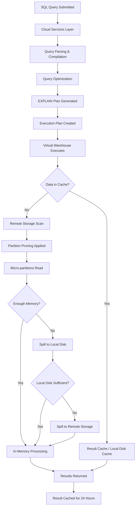

# 4.1 Query Optimization and Profiling

[< Previous: None (First in Domain)](./README.md) | [Next: 4.2 DML, DDL and Data Transformation >](./4.2_DML_DDL_and_Data_Transformation.md)

[Domain 4 README](./README.md) | [Home](../README.md)

---

## Table of Contents

1. [Overview](#1-overview)
2. [Key Concepts](#2-key-concepts)
3. [Query Profile](#3-query-profile)
4. [Spilling](#4-spilling)
5. [Partition Pruning](#5-partition-pruning)
6. [Clustering Keys](#6-clustering-keys)
7. [EXPLAIN Plan](#7-explain-plan)
8. [Materialized Views for Optimization](#8-materialized-views-for-optimization)
9. [Search Optimization Service](#9-search-optimization-service)
10. [Query Optimization Best Practices](#10-query-optimization-best-practices)
11. [Exam Tips](#11-exam-tips)
12. [Common Misconceptions](#12-common-misconceptions)
13. [Review Questions](#13-review-questions)

---

## 1. Overview

**Query optimization and profiling** is a critical domain for the SnowPro Core exam, representing a significant portion of Domain 4 (21% of the total exam). This topic covers how Snowflake executes queries, the tools available to analyze performance, and the strategies to improve query efficiency. Understanding how to read the **Query Profile**, identify **spilling**, leverage **partition pruning**, and apply **clustering keys** is essential for both the exam and real-world Snowflake administration.

Snowflake's architecture separates compute from storage, meaning optimization focuses on efficient data scanning, minimizing data movement, and right-sizing warehouses rather than traditional index tuning.

---

## 2. Key Concepts



| Term | Definition |
|------|-----------|
| **Query Profile** | A graphical and statistical breakdown of query execution in Snowflake |
| **Operator** | A discrete processing step in the execution plan (e.g., TableScan, Filter, Join) |
| **Spilling** | When intermediate results exceed available memory and overflow to disk or remote storage |
| **Partition Pruning** | Skipping micro-partitions that cannot contain relevant data based on metadata |
| **Clustering Key** | A user-defined column ordering that controls how data is organized in micro-partitions |
| **Micro-partition** | Snowflake's fundamental storage unit (50-500 MB compressed, immutable) |
| **Search Optimization Service** | A serverless feature that improves point-lookup and equality-predicate query performance |

---

## 3. Query Profile

The **Query Profile** is Snowflake's primary tool for understanding query execution. It is accessible through the Snowsight UI after a query completes (or while running).

### Accessing the Query Profile

- **Snowsight**: Click on a completed query → select "Query Profile" tab
- **Classic Console**: History → click the query → Profile tab
- **Programmatic**: Use `SYSTEM$GET_QUERY_PROFILE_INFO('<query_id>')` (limited)

### Operator Types

The Query Profile displays execution as a **DAG (Directed Acyclic Graph)** of operators:

| Operator | Description |
|----------|-------------|
| **TableScan** | Reads micro-partitions from storage |
| **Filter** | Applies WHERE conditions |
| **Join** (Hash/Merge/Nested Loop) | Combines data from multiple sources |
| **Aggregate** | GROUP BY, COUNT, SUM operations |
| **Sort** | ORDER BY processing |
| **WindowFunction** | OVER() clause processing |
| **Result** | Final output preparation |
| **WithReference / WithClause** | CTE materializations |

### Key Statistics to Monitor

| Statistic | What It Tells You |
|-----------|------------------|
| **Partitions scanned vs. total** | Effectiveness of partition pruning |
| **Bytes scanned** | Total data read from storage |
| **Percentage scanned from cache** | How much came from the warehouse cache |
| **Spillage (local/remote)** | Whether the warehouse is undersized |
| **Rows produced vs. rows scanned** | Filter selectivity |
| **Execution time per operator** | Bottleneck identification |

### Reading the Graph

- **Thicker lines** between operators indicate more data flowing
- **Percentage labels** show relative time spent in each operator
- **Most expensive node** (by time or data) is the optimization target
- Operators execute in a **pipeline** — data streams between operators without full materialization when possible

---

## 4. Spilling

**Spilling** occurs when a query's intermediate results exceed the memory available in the virtual warehouse. Snowflake handles spilling automatically but it degrades performance significantly.

### Spilling Hierarchy

1. **In-memory processing** — fastest, no spilling
2. **Spill to local disk (SSD)** — moderate performance impact (10-100x slower than memory)
3. **Spill to remote storage** — severe performance impact (100-1000x slower than memory)

### Identifying Spilling

In the Query Profile, check the **Statistics** panel for:
- `Bytes spilled to local storage`
- `Bytes spilled to remote storage`

```sql
-- Check for spilling in query history
SELECT query_id, query_text,
       bytes_spilled_to_local_storage,
       bytes_spilled_to_remote_storage
FROM snowflake.account_usage.query_history
WHERE bytes_spilled_to_local_storage > 0
   OR bytes_spilled_to_remote_storage > 0
ORDER BY start_time DESC
LIMIT 20;
```

### Resolving Spilling

| Solution | When to Use |
|----------|------------|
| **Scale up** the warehouse (larger size) | Spilling to local or remote consistently |
| **Reduce data volume** with better filters | Query is scanning too much data |
| **Break into smaller queries** | Complex multi-join queries |
| **Use temporary tables** for intermediate steps | Complex transformations |

> **Exam Key Point**: Spilling to local disk indicates the warehouse *may* be undersized. Spilling to remote storage *definitely* indicates an undersized warehouse or an inefficient query.

---

## 5. Partition Pruning

**Partition pruning** is Snowflake's most important automatic optimization. Each micro-partition stores metadata (min/max values, distinct count, NULL count) for every column. Snowflake uses this metadata to skip irrelevant partitions entirely.

### How Pruning Works

Snowflake maintains **zone maps** (min/max metadata) on every micro-partition. When a query has a `WHERE` clause, the optimizer checks whether a partition could possibly contain matching rows.

### Verifying Pruning Effectiveness

```sql
-- Check pruning in Query Profile statistics:
-- "Partitions scanned" vs "Partitions total"
-- Ideal: scanned << total

-- Use SYSTEM$CLUSTERING_INFORMATION to check data organization
SELECT SYSTEM$CLUSTERING_INFORMATION('my_table', '(order_date)');
```

The function returns:
- **average_depth**: Average overlap of micro-partitions (lower = better, 1 = perfect)
- **average_overlap**: How many partitions share value ranges
- **total_partition_count**: Total micro-partitions
- **total_constant_partition_count**: Partitions with a single distinct value for the key

```sql
-- Check clustering depth for multiple columns
SELECT SYSTEM$CLUSTERING_INFORMATION('sales', '(region, sale_date)');
```

### Conditions That Enable Pruning

| Enables Pruning | Does NOT Enable Pruning |
|----------------|------------------------|
| Equality filters (`=`) | Functions on columns (`UPPER(col) = 'X'`) |
| Range filters (`BETWEEN`, `<`, `>`) | `OR` with unrelated columns |
| `IN` lists | `LIKE` with leading wildcard (`%value`) |
| `IS NULL` / `IS NOT NULL` | Filters on expressions |
| Joins on clustered keys | Non-deterministic functions |

---

## 6. Clustering Keys

While Snowflake automatically organizes data during ingestion (natural clustering by insert order), **clustering keys** allow you to explicitly define how data is physically organized within micro-partitions.

### When to Use Clustering Keys

- Tables larger than **1 TB** (or hundreds of millions of rows)
- Queries frequently filter on specific columns but pruning is poor
- `SYSTEM$CLUSTERING_INFORMATION` shows high `average_depth` values
- Natural clustering has degraded over time due to DML operations

### Defining Clustering Keys

```sql
-- Define clustering key on an existing table
ALTER TABLE sales CLUSTER BY (region, sale_date);

-- Create table with clustering key
CREATE TABLE events (
    event_id   NUMBER,
    event_date DATE,
    event_type VARCHAR,
    payload    VARIANT
) CLUSTER BY (event_date, event_type);

-- Remove clustering key
ALTER TABLE sales DROP CLUSTERING KEY;
```

### Best Practices for Clustering Keys

1. **Limit to 3-4 columns maximum** — more columns reduce effectiveness
2. **Place low-cardinality columns first** — `(region, date)` not `(date, region)` if region has few values
3. **Use columns from frequent WHERE/JOIN clauses**
4. **Avoid clustering on** columns that are already naturally ordered (like auto-increment IDs if queries filter by ID ranges)
5. **Consider expressions**: `CLUSTER BY (TO_DATE(timestamp_col))` truncates timestamps to dates

### Automatic Reclustering

- Snowflake **Automatic Clustering** is a serverless background process
- Triggered when DML degrades clustering beyond a threshold
- Consumes **serverless compute credits** (not warehouse credits)
- Can be suspended/resumed: `ALTER TABLE t SUSPEND/RESUME RECLUSTER`

> **Exam Key Point**: Clustering keys are a **maintenance cost** — Automatic Clustering runs as a serverless background service and consumes credits. Only cluster tables that genuinely need it.

---

## 7. EXPLAIN Plan

The `EXPLAIN` command shows the **logical execution plan** without running the query. It reveals which operations Snowflake will perform but does not provide runtime statistics.

```sql
-- Basic EXPLAIN
EXPLAIN
SELECT c.customer_name, SUM(o.amount) AS total_spent
FROM customers c
JOIN orders o ON c.customer_id = o.customer_id
WHERE o.order_date >= '2024-01-01'
GROUP BY c.customer_name
ORDER BY total_spent DESC;
```

### EXPLAIN Output Columns

| Column | Description |
|--------|-------------|
| **step** | Execution step number |
| **id** | Operator ID |
| **parent** | Parent operator in the tree |
| **operation** | Type of operation (Scan, Join, Sort, etc.) |
| **objects** | Tables/views referenced |
| **expressions** | Columns and expressions used |
| **partitionsTotal** | Total partitions in the table |
| **partitionsAssigned** | Partitions that will be scanned (after pruning) |

```sql
-- EXPLAIN with USING TABULAR (more readable format)
EXPLAIN USING TABULAR
SELECT * FROM orders WHERE order_date = '2024-06-15';

-- EXPLAIN with USING JSON (programmatic parsing)
EXPLAIN USING JSON
SELECT * FROM orders WHERE order_date = '2024-06-15';
```

> **Exam Key Point**: `EXPLAIN` shows **estimated** partition counts and plan structure. The **Query Profile** shows **actual** runtime statistics. Use EXPLAIN for pre-execution validation; use Query Profile for post-execution analysis.

---

## 8. Materialized Views for Optimization

**Materialized views** store precomputed results and are automatically maintained by Snowflake. They serve as a transparent optimization layer — the optimizer can rewrite queries to use materialized views even when the query references the base table.

### When Materialized Views Help

- Frequently executed expensive aggregations
- Complex subqueries that rarely change
- Queries on a subset of columns from wide tables
- Enterprise Edition or higher required

```sql
-- Create a materialized view for a common aggregation
CREATE MATERIALIZED VIEW mv_daily_sales AS
SELECT
    sale_date,
    region,
    SUM(amount) AS total_amount,
    COUNT(*) AS transaction_count
FROM sales
GROUP BY sale_date, region;

-- Queries against the base table MAY automatically use the MV
-- The optimizer decides transparently
SELECT region, SUM(amount)
FROM sales
WHERE sale_date >= '2024-01-01'
GROUP BY region;
-- ^ Snowflake may rewrite this to scan mv_daily_sales instead
```

### Limitations

- Cannot contain: JOINs, UDFs, HAVING, ORDER BY, LIMIT, window functions
- Must query a **single table**
- Maintenance cost: serverless background credits for refresh
- **Enterprise Edition** minimum requirement

---

## 9. Search Optimization Service

The **Search Optimization Service (SOS)** is a serverless feature that accelerates **point-lookup queries** and selective equality/IN predicates, especially on high-cardinality columns.

### How It Works

- Creates a persistent **search access path** (data structure maintained in the background)
- Optimized for queries that return a small number of rows from large tables
- Works on equality predicates (`=`), `IN` lists, and substring/regex searches on strings
- Also supports VARIANT, GEOGRAPHY, and ARRAY lookups

### Enabling Search Optimization

```sql
-- Enable on entire table
ALTER TABLE customers ADD SEARCH OPTIMIZATION;

-- Enable on specific columns (more targeted, lower cost)
ALTER TABLE customers ADD SEARCH OPTIMIZATION
  ON EQUALITY(email),
  ON EQUALITY(phone_number),
  ON SUBSTRING(address);

-- Check search optimization status
SHOW TABLES LIKE 'customers';
-- Look for SEARCH_OPTIMIZATION = ON

-- Remove search optimization
ALTER TABLE customers DROP SEARCH OPTIMIZATION;
```

### When to Use

| Good Candidate | Not a Good Candidate |
|---------------|---------------------|
| Point lookups on high-cardinality columns | Full table scans or wide range queries |
| Tables with millions+ rows | Small tables (< few thousand rows) |
| Queries returning < 1% of rows | Queries returning large result sets |
| VARIANT field access patterns | Already well-clustered data for those predicates |

> **Exam Key Point**: Search Optimization Service is **Enterprise Edition+** and incurs **serverless compute costs** for maintenance. It complements (does not replace) clustering keys.

---

## 10. Query Optimization Best Practices

### Filter Early, Project Minimally

```sql
-- BAD: SELECT * pulls all columns, filtering happens late
SELECT *
FROM large_table lt
JOIN dimension_table dt ON lt.dim_id = dt.id
WHERE lt.event_date = CURRENT_DATE();

-- GOOD: Select only needed columns, filter on the scan
SELECT lt.event_id, lt.metric_value, dt.dimension_name
FROM large_table lt
JOIN dimension_table dt ON lt.dim_id = dt.id
WHERE lt.event_date = CURRENT_DATE();
```

### Key Optimization Strategies

| Strategy | Rationale |
|----------|-----------|
| **Avoid SELECT \*** | Reduces I/O; Snowflake is columnar — unused columns are free to skip |
| **Filter early** (push predicates down) | Reduces data flowing through operators |
| **Use appropriate JOIN types** | INNER vs LEFT impacts result size |
| **Leverage result caching** | Identical queries return in milliseconds for 24 hours |
| **Avoid ORDER BY without LIMIT** | Sorting full result sets is expensive |
| **Use approximate functions** | `APPROX_COUNT_DISTINCT` vs `COUNT(DISTINCT)` for large datasets |
| **Replace correlated subqueries with JOINs** | Correlated subqueries execute row-by-row |
| **Use LIMIT during development** | Prevents accidental full scans |
| **Prefer date/timestamp filters** | Natural clustering on time columns enables pruning |

### Caching Layers

1. **Result Cache** (Cloud Services) — 24-hour exact-match cache, no warehouse needed
2. **Local Disk Cache** (Warehouse SSD) — warm data from recent queries on the same warehouse
3. **Remote Storage** — full scan from cloud storage (coldest path)

---

## 11. Exam Tips

- **Query Profile vs. EXPLAIN**: Profile = actual runtime stats (post-execution); EXPLAIN = estimated plan (pre-execution). The exam tests this distinction.
- **Spilling**: If a question mentions "spilling to remote storage," the answer almost always involves **scaling up** the warehouse (not scaling out).
- **Clustering keys**: Remember they incur ongoing **serverless maintenance costs**. Only appropriate for large tables (1 TB+) with poor natural clustering.
- **Partition pruning**: Functions applied to filter columns **prevent** pruning. `WHERE YEAR(date_col) = 2024` is worse than `WHERE date_col BETWEEN '2024-01-01' AND '2024-12-31'`.
- **Search Optimization Service**: Enterprise Edition+, serverless cost, best for point lookups on high-cardinality columns.
- **Materialized Views**: Single-table only, no JOINs, Enterprise Edition+, automatic query rewrite by optimizer.
- **Result Cache**: Persists 24 hours, invalidated by underlying DML, requires identical query text and same role context.
- **SYSTEM$CLUSTERING_INFORMATION**: Returns clustering quality metrics; `average_depth` close to 1 means well-clustered.
- **Scale UP vs. Scale OUT**: Spilling → scale up (more memory per node). Concurrency queuing → scale out (multi-cluster warehouse).

---

## 12. Common Misconceptions

| Misconception | Reality |
|---------------|---------|
| "Clustering keys work like indexes" | Clustering keys reorganize physical storage; Snowflake has no traditional B-tree indexes |
| "More clustering key columns = better" | More columns dilute effectiveness; 3-4 max is recommended |
| "EXPLAIN shows actual performance" | EXPLAIN shows the **plan**, not actual runtime metrics — use Query Profile for that |
| "Spilling always means the query is wrong" | Some large queries will spill; the question is whether it's **excessive** relative to the task |
| "SELECT * is fine because Snowflake is columnar" | Columnar storage means unused columns have zero I/O cost at the storage level, but SELECT * still impacts metadata, result caching, and network transfer |
| "Materialized views can contain JOINs" | MV definitions are limited to a single base table with no JOINs |
| "Search Optimization replaces clustering" | They are complementary; SOS targets point lookups while clustering targets range scans |
| "Larger warehouse = faster query (always)" | Only helps if the query is memory-bound or if parallelism improves scan time; some queries are bottlenecked on compilation or single-threaded operations |
| "Automatic Clustering is free" | It consumes serverless compute credits in the background |
| "Query results are cached indefinitely" | Result cache expires after **24 hours** or upon underlying data change |

---

## 13. Review Questions

### Question 1
A query scanning a 2 TB table shows "Partitions scanned: 8,500" and "Partitions total: 8,500" in the Query Profile. Which action would most likely improve performance?

**A)** Scale up the warehouse  
**B)** Add a clustering key aligned with the WHERE clause columns  
**C)** Enable Search Optimization Service  
**D)** Use a materialized view  

<details>
<summary>Answer</summary>

**B)** — Scanning 100% of partitions means no pruning is occurring. A clustering key aligned with the filter columns will organize data so that partition pruning can eliminate irrelevant micro-partitions. Scaling up (A) doesn't reduce scan volume. SOS (C) is for point lookups, not broad scans. A materialized view (D) might help but doesn't address the root pruning problem.

</details>

---

### Question 2
A data engineer notices `bytes_spilled_to_remote_storage` is consistently high for a nightly aggregation job. What is the recommended first action?

**A)** Add a clustering key to the source table  
**B)** Scale up the virtual warehouse to a larger size  
**C)** Scale out using a multi-cluster warehouse  
**D)** Rewrite the query to use APPROX_COUNT_DISTINCT  

<details>
<summary>Answer</summary>

**B)** — Spilling to remote storage indicates the warehouse does not have enough memory for intermediate results. Scaling up (larger T-shirt size) provides more memory per node. Scaling out (C) adds concurrency but doesn't increase per-query memory. Clustering (A) helps pruning, not memory pressure. Approximate functions (D) may help but only if the aggregation involves COUNT DISTINCT.

</details>

---

### Question 3
Which statement about the EXPLAIN command is TRUE?

**A)** EXPLAIN executes the query and shows actual runtime statistics  
**B)** EXPLAIN shows the estimated execution plan including expected partition counts  
**C)** EXPLAIN requires a running warehouse to execute  
**D)** EXPLAIN output includes bytes spilled to local storage  

<details>
<summary>Answer</summary>

**B)** — EXPLAIN shows the logical plan with estimated partition assignments without executing the query. It does not show actual runtime stats (A/D). EXPLAIN is processed by the Cloud Services layer and does not require an active warehouse (C).

</details>

---

### Question 4
A table uses `CLUSTER BY (event_date)`. Which query will benefit MOST from this clustering?

**A)** `SELECT * FROM events WHERE event_type = 'login'`  
**B)** `SELECT * FROM events WHERE YEAR(event_date) = 2024`  
**C)** `SELECT * FROM events WHERE event_date BETWEEN '2024-06-01' AND '2024-06-30'`  
**D)** `SELECT * FROM events ORDER BY event_id`  

<details>
<summary>Answer</summary>

**C)** — A direct range filter on the clustering key column enables maximum partition pruning. Option A filters on a non-clustered column. Option B wraps the clustered column in a function, preventing pruning. Option D is an ORDER BY on an unrelated column.

</details>

---

### Question 5
Which feature requires Enterprise Edition or higher? (Select TWO)

**A)** Query Profile  
**B)** Materialized Views  
**C)** Clustering Keys  
**D)** Search Optimization Service  
**E)** EXPLAIN command  

<details>
<summary>Answer</summary>

**B and D** — Materialized Views and Search Optimization Service both require Enterprise Edition or higher. Query Profile (A), Clustering Keys (C), and EXPLAIN (E) are available on all editions including Standard.

</details>

---

[< Previous: None (First in Domain)](./README.md) | [Next: 4.2 DML, DDL and Data Transformation >](./4.2_DML_DDL_and_Data_Transformation.md)
