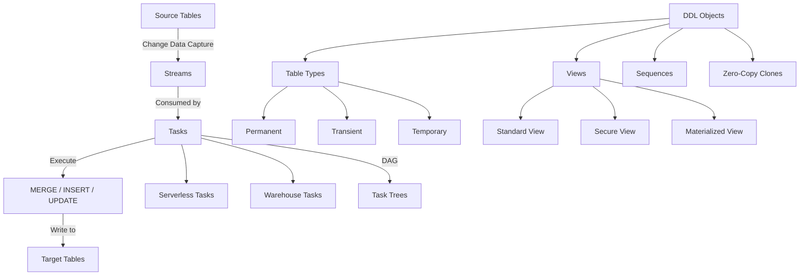

# 4.2 DML, DDL, and Data Transformation

[< Previous: 4.1 Query Optimization and Profiling](./4.1_Query_Optimization_and_Profiling.md) | [Domain 4 README](./README.md) | [Next: 4.3 Semi-Structured Data >](./4.3_Semi_Structured_Data.md)

---

## 1. Introduction and Exam Relevance

This topic covers the core SQL operations and object types that power data pipelines in Snowflake. The exam tests your understanding of **MERGE** semantics, **Streams** and **Tasks** for change data capture (CDC) pipelines, **Sequences**, **Zero-Copy Cloning**, **Table Types**, **Views**, and programmability constructs (UDFs/Stored Procedures). Expect 3-5 questions directly from this sub-domain, often scenario-based asking you to choose the correct approach for a given pipeline requirement.

**Key exam weight**: Domain 4 overall is 21% of the exam. DML/DDL/Transformation is a significant portion given its breadth.

---

## 2. Core Concepts Overview



---

## 3. MERGE Statement

The **MERGE** statement combines INSERT, UPDATE, and DELETE into a single atomic operation. It is the primary mechanism for **upsert** patterns in Snowflake.

### Syntax and Behavior

```sql
MERGE INTO target_table t
USING source_table s
ON t.id = s.id
WHEN MATCHED AND s.deleted = TRUE THEN DELETE
WHEN MATCHED THEN UPDATE SET
    t.name = s.name,
    t.updated_at = CURRENT_TIMESTAMP()
WHEN NOT MATCHED THEN INSERT (id, name, updated_at)
    VALUES (s.id, s.name, CURRENT_TIMESTAMP());
```

**Key rules for the exam:**
- **Multiple WHEN MATCHED clauses** are allowed (max 2) — the first must have an AND condition
- **One WHEN NOT MATCHED clause** is allowed (with optional AND condition)
- MERGE is **deterministic** — if multiple source rows match one target row, Snowflake raises an error (unlike some other databases that silently pick one)
- The operation is **atomic** — either all changes apply or none do
- MERGE **does not support** non-deterministic matches unless you add a qualifying clause or deduplicate the source first

---

## 4. Streams (Change Data Capture)

A **Stream** records DML changes (inserts, updates, deletes) made to a table. It acts as a **change tracking pointer** between two transactional points in time.

### Stream Types

| Stream Type | Tracks | Use Case |
|-------------|--------|----------|
| **Standard** (default) | INSERT, UPDATE, DELETE | Full CDC pipelines |
| **Append-only** | INSERT only | Staging/landing tables where rows are never updated |
| **Insert-only** | INSERT only (external tables) | External table change tracking |

### How Streams Work

- A stream stores an **offset** (not the data itself) pointing to a position in the table's change history
- Querying a stream shows all changes **since the last DML transaction that consumed the stream**
- Streams leverage **Time Travel** metadata — no additional storage cost for tracking
- Each row in a stream has metadata columns: **METADATA$ACTION** (INSERT/DELETE), **METADATA$ISUPDATE** (TRUE/FALSE), **METADATA$ROW_ID**

```sql
-- Create a standard stream
CREATE OR REPLACE STREAM orders_stream ON TABLE orders;

-- Create an append-only stream
CREATE OR REPLACE STREAM landing_stream ON TABLE landing_zone
    APPEND_ONLY = TRUE;

-- Query stream for changes
SELECT * FROM orders_stream WHERE METADATA$ACTION = 'INSERT';
```

### Staleness

A stream becomes **stale** if its offset falls outside the table's **Time Travel retention period**. A stale stream cannot be queried and must be recreated. The staleness window equals the table's `DATA_RETENTION_TIME_IN_DAYS` setting (default 1 day, max 90 for Enterprise+).

**Exam tip**: A stream is consumed (offset advances) only when the DML statement that reads from it **commits successfully**. If the transaction rolls back, the offset does not advance.

---

## 5. Tasks (Scheduling and Automation)

A **Task** executes a single SQL statement or calls a stored procedure on a defined schedule. Tasks are Snowflake's native scheduler.

### Task Types

| Feature | **User-Managed Warehouse** | **Serverless** |
|---------|---------------------------|----------------|
| Compute | You specify warehouse | Snowflake manages compute |
| Cost model | Warehouse credits | Per-second serverless credits |
| Setup | `WAREHOUSE = my_wh` | Omit warehouse clause |
| Best for | Predictable, heavy workloads | Lightweight, sporadic tasks |

### Task Trees (DAGs)

Tasks can form **Directed Acyclic Graphs (DAGs)** where a root task triggers child tasks upon completion:

```sql
-- Root task (scheduled)
CREATE OR REPLACE TASK root_task
    WAREHOUSE = compute_wh
    SCHEDULE = 'USING CRON 0 */2 * * * America/New_York'
AS
    CALL ingest_raw_data();

-- Child task (triggered by root)
CREATE OR REPLACE TASK transform_task
    WAREHOUSE = compute_wh
    AFTER root_task
AS
    MERGE INTO dim_customer t USING stg_customer_stream s
    ON t.customer_id = s.customer_id
    WHEN MATCHED THEN UPDATE SET t.name = s.name
    WHEN NOT MATCHED THEN INSERT VALUES (s.customer_id, s.name);

-- Enable tasks (must enable in reverse order: children first, then root)
ALTER TASK transform_task RESUME;
ALTER TASK root_task RESUME;
```

### CRON Syntax

Format: `USING CRON <min> <hour> <day-of-month> <month> <day-of-week> <timezone>`

| Expression | Meaning |
|-----------|---------|
| `0 9 * * MON-FRI America/Chicago` | 9 AM weekdays CT |
| `*/5 * * * * UTC` | Every 5 minutes UTC |
| `0 0 1 * * UTC` | First of every month midnight |

### Stream + Task Pattern (Exam Favorite)

```sql
CREATE OR REPLACE TASK process_orders
    WAREHOUSE = etl_wh
    SCHEDULE = '5 MINUTE'
    WHEN SYSTEM$STREAM_HAS_DATA('orders_stream')
AS
    INSERT INTO orders_fact
    SELECT * FROM orders_stream WHERE METADATA$ACTION = 'INSERT';
```

The **WHEN** clause with `SYSTEM$STREAM_HAS_DATA()` prevents the task from consuming warehouse credits when there are no changes to process.

---

## 6. Sequences

A **Sequence** generates unique, incrementing numbers. Used primarily for **surrogate keys**.

```sql
CREATE OR REPLACE SEQUENCE customer_seq START = 1 INCREMENT = 1;

-- Use in INSERT
INSERT INTO dim_customer (customer_key, customer_name)
VALUES (customer_seq.NEXTVAL, 'Acme Corp');
```

**Critical exam points:**
- Sequences are **NOT guaranteed to be gap-free** — gaps occur from rollbacks, multi-node execution, and caching
- Sequences **do not guarantee ordering** across concurrent sessions
- Each call to `NEXTVAL` within a single SQL statement returns the **same value per row** (not a single value for the whole statement)
- For gap-free surrogate keys, use `ROW_NUMBER()` window functions instead
- The `ORDER` keyword does NOT eliminate gaps; it only ensures monotonically increasing values within a single query

---

## 7. Zero-Copy Cloning

**Zero-copy cloning** creates a duplicate of a database, schema, or table instantly by copying only **metadata pointers**, not the underlying data.

```sql
-- Clone a table
CREATE TABLE orders_dev CLONE orders;

-- Clone a schema
CREATE SCHEMA analytics_dev CLONE analytics;

-- Clone a database
CREATE DATABASE prod_snapshot CLONE production;

-- Clone at a point in time (Time Travel)
CREATE TABLE orders_backup CLONE orders AT (TIMESTAMP => '2024-01-15 08:00:00');
```

**Storage implications:**
- At creation, a clone uses **zero additional storage**
- Storage diverges as either the source or clone is modified — only the **changed micro-partitions** incur new storage costs
- Cloning copies **granted privileges** on tables (but not future grants)
- Cloning a database/schema also clones all child objects (tables, views, stages, sequences, etc.)

**What is NOT cloned:**
- External tables' underlying data (only metadata)
- Internal stage files
- Load history metadata

---

## 8. Table Types

| Property | **Permanent** | **Transient** | **Temporary** |
|----------|:---:|:---:|:---:|
| Time Travel | 0-90 days (Enterprise) | 0-1 day | 0-1 day |
| Fail-Safe | 7 days | **None** | **None** |
| Visible to other sessions | Yes | Yes | **No** |
| Persists after session ends | Yes | Yes | **No** |
| Storage cost | Highest | Medium | Lowest |
| Use case | Production data | ETL staging, disposable | Session-scoped temp work |

```sql
-- Transient table
CREATE TRANSIENT TABLE stg_orders (id INT, data VARIANT);

-- Temporary table
CREATE TEMPORARY TABLE session_results (metric VARCHAR, value FLOAT);
```

**Exam tip**: A **transient table** saves storage costs by eliminating Fail-Safe, but unlike temporary tables, it persists across sessions and is visible to all users with access. Choose transient for staging/intermediate data that can be recreated.

---

## 9. Views

### Standard Views

- Store a SQL definition only (no data)
- Query is executed fresh each time
- Underlying SQL is visible to users with sufficient privileges

### Secure Views

- SQL definition is **hidden** from non-owner roles (even ACCOUNTADMIN cannot see it via `GET_DDL()` unless they own it)
- The optimizer **cannot push predicates** from the outer query into the view — this can impact performance
- Required for **data sharing** scenarios and row-level security patterns

### Materialized Views

- Store **precomputed results** physically
- Snowflake **automatically maintains** them as base data changes (background refresh)
- Incur **storage and compute costs** (serverless background maintenance)
- Support limited SQL (no JOINs, no UDFs, no HAVING, limited aggregations)
- Best for expensive aggregations on large tables queried frequently with the same filters

```sql
-- Secure view
CREATE SECURE VIEW customer_view AS
SELECT customer_id, name, email FROM customers WHERE region = CURRENT_ROLE();

-- Materialized view
CREATE MATERIALIZED VIEW daily_revenue AS
SELECT order_date, SUM(amount) AS total_revenue
FROM orders
GROUP BY order_date;
```

---

## 10. UDFs and Stored Procedures

| Feature | **UDF** | **Stored Procedure** |
|---------|---------|---------------------|
| Purpose | Return a value (scalar/tabular) | Execute procedural logic |
| Called from | SELECT, WHERE, etc. | CALL statement |
| Can perform DML | No | Yes |
| Languages | SQL, JavaScript, Python, Java, Scala | SQL, JavaScript, Python, Java, Scala, Snowpark |
| Return type | Scalar or TABLE | Single value |
| Caller's rights | Runs with owner's or caller's rights | Same options |

**Exam focus**: Know that UDFs cannot perform DML (INSERT/UPDATE/DELETE) — only stored procedures can. UDFs are used in expressions; procedures are used for orchestration.

---

## 11. Exam Tips and Question Patterns

1. **MERGE determinism**: If a question describes multiple source rows matching one target row, the answer is "error" — not "last write wins"
2. **Stream staleness**: Calculate based on `DATA_RETENTION_TIME_IN_DAYS` — if a stream is not consumed within this window, it becomes stale
3. **Task suspension**: Tasks are created in a **suspended** state by default — you must `ALTER TASK ... RESUME`
4. **Clone privileges**: Cloning a table copies existing grants; cloning a database does NOT clone role assignments
5. **Sequence gaps**: Never select "sequences guarantee gap-free" — that's always wrong
6. **Materialized views vs. tables**: MVs auto-refresh; if asked about "automatic maintenance," MV is the answer
7. **Temporary vs. Transient**: If the question mentions "visible to other sessions" or "persists after disconnect," it's transient, not temporary

---

## 12. Common Misconceptions

| Misconception | Reality |
|--------------|---------|
| Streams store change data | Streams store **offsets/pointers** only — no additional storage |
| Sequences are gap-free | Gaps are normal and expected; use `ROW_NUMBER()` for contiguous numbers |
| Clones double storage immediately | Zero additional storage at clone time; diverges over time |
| Temporary tables persist across sessions | They are **dropped automatically** when the session ends |
| Tasks require a warehouse | Serverless tasks have no warehouse; Snowflake manages compute |
| Secure views perform the same as standard views | Secure views disable predicate pushdown, potentially reducing performance |
| MERGE can handle duplicate source matches | Snowflake raises an error on non-deterministic matches |
| Materialized views support JOINs | MVs are limited to single-table queries with restricted SQL |

---

## 13. Key Takeaways

- **MERGE** is the go-to for upsert operations — atomic, deterministic, supports INSERT + UPDATE + DELETE in one statement
- **Streams + Tasks** form Snowflake's native CDC/ELT pipeline — streams track changes, tasks schedule consumption
- **Sequences** generate unique IDs but are **not gap-free** — critical exam distinction
- **Zero-copy cloning** is metadata-only at creation, with storage divergence on modification — perfect for dev/test environments
- **Table types** trade off durability (Time Travel + Fail-Safe) against storage cost — permanent > transient > temporary
- **Views** range from simple definitions (standard) to security-enforcing (secure) to pre-computed (materialized)
- **Stored procedures** handle DML and procedural logic; **UDFs** compute values within queries

---

[< Previous: 4.1 Query Optimization and Profiling](./4.1_Query_Optimization_and_Profiling.md) | [Home](../README.md) | [Next: 4.3 Semi-Structured Data >](./4.3_Semi_Structured_Data.md)
