# 4.3 Semi-Structured Data

## Additional Exam Scenarios

### Scenario 1: JSON null vs SQL NULL
**Q:** A VARIANT column stores `{"status": null}`. How do you distinguish this from a missing key?
**A:** They are different! JSON `null` is a stored value; a missing key returns SQL NULL. Use `IS_NULL_VALUE(src:status)` to detect JSON null (returns TRUE). Use `src:missing_key IS NULL` to detect a missing key (returns TRUE). Both look like NULL when cast, but `IS_NULL_VALUE()` only returns TRUE for explicit JSON null values.

### Scenario 2: FLATTEN on Empty Array
**Q:** A row has `{"tags": []}` (empty array). What happens when you FLATTEN on `src:tags`?
**A:** FLATTEN returns **0 rows** for that parent, effectively dropping the parent row from results. To preserve the parent row even when the array is empty or NULL, use `OUTER => TRUE`: `LATERAL FLATTEN(input => src:tags, OUTER => TRUE)`.

### Scenario 3: Dot Notation Returns NULL Unexpectedly
**Q:** `SELECT src:name FROM events` returns NULL, but the data clearly has a "Name" field. Why?
**A:** Case sensitivity! Dot notation is **case-sensitive** by default. The data stores `"Name"` (uppercase N) but the query uses `src:name` (lowercase n). Fix with: `src:"Name"::STRING` or bracket notation `src['Name']::STRING`.

### Scenario 4: Typed View over VARIANT
**Q:** Can you create a view that extracts and types specific paths from a VARIANT column?
**A:** Yes — this is a common pattern. Create a view with explicit casts: `CREATE VIEW typed_events AS SELECT src:id::NUMBER AS id, src:name::STRING AS name, src:ts::TIMESTAMP AS event_time FROM raw_events;`. This provides a relational interface over semi-structured data with full type safety.

### Scenario 5: Parquet Schema Auto-Detection
**Q:** When loading Parquet files, does Snowflake auto-detect the schema?
**A:** Yes. Use `INFER_SCHEMA(LOCATION => '@stage/path/', FILE_FORMAT => 'parquet_format')` to discover column names and types. You can then create a table using the `USING TEMPLATE` syntax to match the inferred schema automatically. Note: `INFER_SCHEMA` works with Parquet, Avro, ORC, and CSV — but NOT JSON.

### Scenario 6: Nested FLATTEN for Arrays Within Arrays
**Q:** How do you handle an object with an array of items, where each item has a nested array of sub-items?
**A:** Use multiple FLATTEN operations chained together:
```sql
SELECT o.src:id::NUMBER AS order_id,
       items.value:name::STRING AS item,
       sub.value::STRING AS sub_item
FROM orders o,
    LATERAL FLATTEN(input => o.src:items) items,
    LATERAL FLATTEN(input => items.value:sub_items) sub;
```
Each FLATTEN expands one level. Add `OUTER => TRUE` on any level where the nested array might be empty.

### Scenario 7: VARIANT 16 MB Limit
**Q:** What happens if a single JSON document exceeds 16 MB compressed during loading?
**A:** The COPY INTO command returns an **error** for that row/file. The 16 MB limit is per VARIANT value (per row). To handle oversized documents, you must split them before loading, or use `STRIP_OUTER_ARRAY` if the file is a large array, or restructure the data into multiple rows.

### Scenario 8: When to Flatten vs Keep VARIANT
**Q:** When should you flatten semi-structured data into relational columns versus keeping it as VARIANT?
**A:** **Flatten into columns** when: queries frequently filter/join on specific fields, you need clustering keys on those fields, the schema is stable, or performance is critical. **Keep as VARIANT** when: the schema evolves frequently, access patterns are exploratory, many fields are accessed rarely, or you need to preserve the original structure. Snowflake's auto-columnarization helps VARIANT performance for frequently accessed paths, but explicit columns still enable clustering and direct pruning.

---

## Navigation
- **Previous**: [4.2 DML, DDL and Data Transformation](./4.2_DML_DDL_and_Data_Transformation.md)
- **Next**: [4.4 Time Travel and Fail-Safe](./4.4_Time_Travel_and_Fail_Safe.md)
- **Domain README**: [Domain 4](./README.md)
- **Main README**: [Home](../README.md)

---

## 1. Introduction

Semi-structured data is one of Snowflake's key differentiators. Unlike traditional databases that require schema definitions before loading, Snowflake natively stores and queries JSON, Avro, Parquet, ORC, and XML data without transformation. The VARIANT data type serves as the universal container, enabling schema-on-read patterns while maintaining query performance through automatic columnarization.

This topic covers approximately 5-7% of the COF-C03 exam and tests your ability to load, query, flatten, and cast semi-structured data.

---

## 2. Architecture Overview

```mermaid
graph TD
    A[Semi-Structured Data Sources] --> B[JSON]
    A --> C[Avro]
    A --> D[Parquet]
    A --> E[ORC]
    A --> F[XML]

    B --> G[VARIANT Column]
    C --> G
    D --> G
    E --> G
    F --> G

    G --> H{Query Access Patterns}
    H --> I[Dot Notation data:key::type]
    H --> J[Bracket Notation data&#91;'key'&#93;]
    H --> K[FLATTEN Arrays/Objects to Rows]

    G --> L[Auto-Columnarization]
    L --> M[Frequently Accessed Paths Stored Columnar]
    M --> N[Near-Relational Query Performance]

    style G fill:#4a90d9,color:#fff
    style L fill:#50c878,color:#fff
    style N fill:#50c878,color:#fff
```



---

## 3. Core Data Types

### VARIANT

The VARIANT type is a tagged universal type that can store any value: scalars, arrays, or objects up to **16 MB compressed** per row.

| Property | Detail |
|----------|--------|
| Max size | 16 MB compressed per row |
| Supported formats | JSON, Avro, Parquet, ORC, XML |
| NULL handling | SQL NULL differs from JSON null (`PARSE_JSON('null')`) |
| Storage | Columnar micro-partitions with auto-optimization |

### OBJECT

An OBJECT is a collection of key-value pairs (analogous to a JSON object). Keys are always strings; values can be any VARIANT type.

```sql
-- Creating an OBJECT literal
SELECT OBJECT_CONSTRUCT('name', 'Alice', 'age', 30, 'active', TRUE) AS obj;
```

### ARRAY

An ARRAY is an ordered sequence of VARIANT values (analogous to a JSON array). Elements can be heterogeneous.

```sql
-- Creating an ARRAY literal
SELECT ARRAY_CONSTRUCT(1, 'two', 3.0, NULL) AS arr;
```

---

## 4. Loading Semi-Structured Data

### Direct Load into VARIANT

```sql
-- Table with a single VARIANT column (common pattern)
CREATE TABLE raw_events (
    src VARIANT
);

-- Load JSON from a stage
COPY INTO raw_events
FROM @my_stage/events/
FILE_FORMAT = (TYPE = 'JSON');
```

### STRIP_OUTER_ARRAY

When a JSON file contains an outer array wrapping multiple records, use `STRIP_OUTER_ARRAY` to load each array element as a separate row:

```sql
-- Input file: [{"id":1},{"id":2},{"id":3}]
COPY INTO raw_events
FROM @my_stage/events.json
FILE_FORMAT = (
    TYPE = 'JSON'
    STRIP_OUTER_ARRAY = TRUE
);
-- Result: 3 rows, each containing one object
```

### Auto-Detect Schema (Parquet, Avro, ORC)

Snowflake can infer the schema from structured file formats:

```sql
-- Infer schema from Parquet files
SELECT *
FROM TABLE(INFER_SCHEMA(
    LOCATION => '@my_stage/data/',
    FILE_FORMAT => 'my_parquet_format'
));

-- Create table using inferred schema
CREATE TABLE events
USING TEMPLATE (
    SELECT ARRAY_AGG(OBJECT_CONSTRUCT(*))
    FROM TABLE(INFER_SCHEMA(
        LOCATION => '@my_stage/data/',
        FILE_FORMAT => 'my_parquet_format'
    ))
);
```

---

## 5. Accessing Semi-Structured Data

### Dot Notation

The primary method for traversing nested structures:

```sql
SELECT
    src:id::NUMBER AS event_id,
    src:user.name::STRING AS user_name,
    src:user.address.city::STRING AS city,
    src:timestamp::TIMESTAMP_NTZ AS event_time
FROM raw_events;
```

**Rules for dot notation:**
- First-level keys are referenced as `column:key`
- Nested keys use dots: `column:key.subkey.subsubkey`
- Keys are **case-sensitive** by default
- Keys with special characters require bracket notation: `column:["key-with-dashes"]`

### Bracket Notation

Use brackets for case-sensitive access, special characters, or dynamic keys:

```sql
SELECT
    src['id']::NUMBER AS event_id,
    src['User']['Name']::STRING AS user_name,  -- case-sensitive
    src['key-with-dashes']::STRING AS dashed_key
FROM raw_events;
```

### Array Element Access

Arrays are zero-indexed:

```sql
SELECT
    src:tags[0]::STRING AS first_tag,
    src:tags[1]::STRING AS second_tag,
    ARRAY_SIZE(src:tags) AS tag_count
FROM raw_events;
```

---

## 6. Type Casting from VARIANT

All values extracted from VARIANT are VARIANT-typed until explicitly cast:

| Cast Syntax | Target Type | Notes |
|-------------|-------------|-------|
| `::STRING` / `::VARCHAR` | String | Removes surrounding quotes |
| `::NUMBER` / `::INTEGER` | Numeric | Fails if not numeric |
| `::FLOAT` / `::DOUBLE` | Floating point | Accepts numeric strings |
| `::BOOLEAN` | Boolean | Accepts true/false, 1/0 |
| `::TIMESTAMP` | Timestamp | Parses ISO 8601 and epoch |
| `::DATE` | Date | Parses date strings |
| `::VARIANT` | Variant | Identity cast |

**Critical behavior:**
- Casting NULL VARIANT to any type returns SQL NULL
- JSON `null` (stored as VARIANT) cast to STRING returns the string `"null"`, not SQL NULL
- Use `IS NULL` for SQL NULL checks; use `= 'null'` or `IS_NULL_VALUE()` for JSON null

```sql
-- Distinguishing SQL NULL from JSON null
SELECT
    src:field IS NULL AS is_sql_null,
    IS_NULL_VALUE(src:field) AS is_json_null
FROM raw_events;
```

---

## 7. LATERAL FLATTEN

FLATTEN is a table function that converts arrays or objects into rows. Combined with LATERAL (implicit in Snowflake), it enables row explosion.

### Flattening Arrays

```sql
-- Each tag becomes its own row
SELECT
    e.src:id::NUMBER AS event_id,
    f.value::STRING AS tag
FROM raw_events e,
    LATERAL FLATTEN(input => e.src:tags) f;
```

### Flattening Objects

```sql
-- Each key-value pair becomes a row
SELECT
    e.src:id::NUMBER AS event_id,
    f.key AS attribute_name,
    f.value::STRING AS attribute_value
FROM raw_events e,
    LATERAL FLATTEN(input => e.src:attributes) f;
```

### FLATTEN Output Columns

| Column | Description |
|--------|-------------|
| SEQ | Sequence number (unique per input row) |
| KEY | Key name (for objects; NULL for arrays) |
| PATH | Path to the element |
| INDEX | Array index (NULL for objects) |
| VALUE | The element value (VARIANT) |
| THIS | The parent structure being flattened |

### Nested FLATTEN

For arrays within arrays or deeply nested structures:

```sql
-- Orders with line items (nested array)
SELECT
    o.src:order_id::NUMBER AS order_id,
    o.src:customer::STRING AS customer,
    items.value:product::STRING AS product,
    items.value:quantity::NUMBER AS quantity,
    items.value:price::FLOAT AS price
FROM orders o,
    LATERAL FLATTEN(input => o.src:line_items) items;
```

### Recursive FLATTEN

The `RECURSIVE` option flattens all nested levels:

```sql
SELECT *
FROM raw_events,
    LATERAL FLATTEN(input => src, RECURSIVE => TRUE, MODE => 'BOTH');
```

**MODE options:**
- `OBJECT` - flatten only objects (default)
- `ARRAY` - flatten only arrays
- `BOTH` - flatten both objects and arrays

---

## 8. PARSE_JSON and TO_JSON

### PARSE_JSON

Converts a string to a VARIANT value:

```sql
-- Parse a JSON string into VARIANT
SELECT PARSE_JSON('{"name":"Alice","scores":[95,87,92]}') AS data;

-- Common use: constructing VARIANT in INSERT statements
INSERT INTO raw_events (src)
SELECT PARSE_JSON(column1) FROM VALUES
    ('{"id":1,"type":"click"}'),
    ('{"id":2,"type":"view"}');
```

### TO_JSON / TO_VARCHAR

Converts a VARIANT value back to a JSON string:

```sql
SELECT TO_JSON(src) AS json_string FROM raw_events;

-- Equivalent for VARCHAR output
SELECT src::VARCHAR AS json_string FROM raw_events;
```

### Related Functions

| Function | Purpose |
|----------|---------|
| `TRY_PARSE_JSON()` | Returns NULL on invalid JSON instead of error |
| `PARSE_XML()` | Parses XML string to VARIANT (OBJECT) |
| `CHECK_JSON()` | Validates JSON string; returns NULL if valid |
| `CHECK_XML()` | Validates XML string; returns NULL if valid |
| `OBJECT_CONSTRUCT()` | Builds OBJECT from key-value pairs |
| `ARRAY_CONSTRUCT()` | Builds ARRAY from values |
| `ARRAY_AGG()` | Aggregates rows into an ARRAY |
| `OBJECT_AGG()` | Aggregates key-value rows into an OBJECT |

---

## 9. Querying Nested and Repeated Data Patterns

### Pattern: Extract and Join

```sql
-- Normalize semi-structured data into relational format
CREATE VIEW events_normalized AS
SELECT
    src:event_id::NUMBER AS event_id,
    src:event_type::STRING AS event_type,
    src:user.id::NUMBER AS user_id,
    src:user.name::STRING AS user_name,
    src:user.email::STRING AS user_email,
    src:metadata.source::STRING AS source,
    src:metadata.version::STRING AS api_version,
    src:timestamp::TIMESTAMP_NTZ AS event_timestamp
FROM raw_events;
```

### Pattern: Conditional Array Processing

```sql
-- Filter flattened results
SELECT
    src:id::NUMBER AS id,
    f.value:type::STRING AS address_type,
    f.value:city::STRING AS city
FROM customers,
    LATERAL FLATTEN(input => src:addresses) f
WHERE f.value:type::STRING = 'shipping';
```

### Pattern: Array Contains Check

```sql
-- Check if array contains a value
SELECT *
FROM raw_events
WHERE ARRAY_CONTAINS('premium'::VARIANT, src:tags);
```

---

## 10. Performance Considerations

### Auto-Columnarization

Snowflake automatically analyzes query patterns on VARIANT columns and stores frequently accessed paths in a columnar format within micro-partitions. This delivers near-relational performance without manual optimization.

**How it works:**
1. Query patterns are tracked per table
2. Paths accessed frequently are extracted and stored in dedicated sub-columns
3. Subsequent queries skip full VARIANT parsing for these paths
4. Pruning and pushdown work on columnarized paths

### Best Practices

| Practice | Reason |
|----------|--------|
| Cast to specific types in predicates | Enables pruning and columnarization |
| Flatten only needed elements | Reduces row explosion overhead |
| Avoid `SELECT *` on VARIANT | Prevents full document scans |
| Use consistent access paths | Improves columnarization effectiveness |
| Create materialized views for hot paths | Pre-computes flattening operations |
| Consider separate columns for high-cardinality filters | Clustering works on regular columns |

### When to Flatten at Load vs. Query Time

- **Flatten at load** (separate columns): High-frequency queries on specific fields, need for clustering/indexing
- **Flatten at query** (keep VARIANT): Exploratory analysis, schema evolution, infrequent access patterns

---

## 11. Key Exam Scenarios

### Scenario 1: Loading JSON Array Files
A file contains `[{...},{...},{...}]`. Without `STRIP_OUTER_ARRAY = TRUE`, the entire array loads as one row. With it, each element becomes a separate row.

### Scenario 2: NULL vs. Missing Keys
- Key exists with value `null`: `IS_NULL_VALUE(src:key)` returns TRUE
- Key does not exist: `src:key IS NULL` returns TRUE
- Both return VARIANT NULL when cast, but behave differently in logic

### Scenario 3: FLATTEN with Outer Join
When an array might be empty or NULL, use `OUTER => TRUE` to preserve the parent row:

```sql
SELECT
    e.src:id::NUMBER AS id,
    f.value::STRING AS tag
FROM raw_events e,
    LATERAL FLATTEN(input => e.src:tags, OUTER => TRUE) f;
```

### Scenario 4: Case Sensitivity
Dot notation keys are **case-insensitive** for top-level when the data was loaded with certain settings, but the default is **case-sensitive**. Bracket notation with quoted keys is always case-sensitive.

---

## 12. Exam Tips

1. **VARIANT size limit**: 16 MB compressed per row - this appears frequently on the exam
2. **STRIP_OUTER_ARRAY**: Know when and why to use it (JSON arrays as outer wrapper)
3. **Casting from VARIANT**: Values are always VARIANT until explicitly cast; predicates without casts may not prune efficiently
4. **FLATTEN column names**: Memorize SEQ, KEY, PATH, INDEX, VALUE, THIS
5. **JSON null vs SQL NULL**: `IS_NULL_VALUE()` detects JSON null; `IS NULL` detects SQL NULL (missing key or SQL null)
6. **LATERAL is implicit**: `TABLE(FLATTEN(...))` and `LATERAL FLATTEN(...)` are equivalent in Snowflake
7. **RECURSIVE flatten**: Understand that MODE controls whether objects, arrays, or both are flattened
8. **Auto-columnarization**: No manual action required; Snowflake optimizes automatically based on access patterns
9. **Parquet/Avro/ORC**: These formats can be queried directly from a stage without loading (external tables)
10. **INFER_SCHEMA**: Works with Parquet, Avro, ORC, and CSV - not with JSON

---

## 13. Summary

| Concept | Key Point |
|---------|-----------|
| VARIANT | Universal container, 16 MB max, stores any semi-structured format |
| OBJECT | Key-value pairs (keys are strings) |
| ARRAY | Ordered, zero-indexed, heterogeneous elements |
| Dot notation | `col:key.subkey::TYPE` - case-sensitive |
| FLATTEN | Explodes arrays/objects into rows; LATERAL is implicit |
| OUTER => TRUE | Preserves parent rows when array is empty/NULL |
| Type casting | Always cast VARIANT before comparisons and predicates |
| Auto-columnarization | Automatic optimization for frequently queried paths |
| STRIP_OUTER_ARRAY | Splits top-level JSON array into separate rows on load |
| JSON null | Use `IS_NULL_VALUE()`, distinct from SQL NULL |

---

## Navigation
- **Previous**: [4.2 DML, DDL and Data Transformation](./4.2_DML_DDL_and_Data_Transformation.md)
- **Next**: [4.4 Time Travel and Fail-Safe](./4.4_Time_Travel_and_Fail_Safe.md)
- **Domain README**: [Domain 4](./README.md)
- **Main README**: [Home](../README.md)
