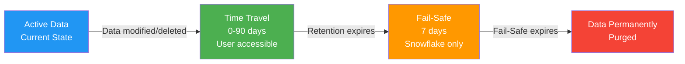

# 4.4 Time Travel and Fail-Safe

## Additional Exam Scenarios

### Scenario 1: DROP Then Recreate with Same Name
**Q:** You DROP TABLE `orders`, then CREATE TABLE `orders` (new table). Can you still UNDROP the original?
**A:** Yes, but you must **rename the new table first**. UNDROP requires no naming conflict. Execute: `ALTER TABLE orders RENAME TO orders_new;` then `UNDROP TABLE orders;`. The original table is restored.

### Scenario 2: UNDROP Transient Table
**Q:** A transient table was dropped 12 hours ago. Can you UNDROP it?
**A:** Yes — transient tables support 0–1 day Time Travel. If the table had `DATA_RETENTION_TIME_IN_DAYS = 1` (default) and was dropped less than 1 day ago, UNDROP works. After 1 day, the data is permanently gone (no Fail-Safe for transient tables).

### Scenario 3: Setting Retention to Zero
**Q:** You run `ALTER TABLE t SET DATA_RETENTION_TIME_IN_DAYS = 0` on a table that previously had 14 days of history. What happens to the existing Time Travel data?
**A:** The historical data is **immediately purged**. Setting retention to 0 does not just prevent future accumulation — it actively removes all existing Time Travel data. This is irreversible and the table loses all UNDROP and historical query capability.

### Scenario 4: Time Travel on Cloned Table
**Q:** A table is cloned. Does modifying the clone affect the source's Time Travel history?
**A:** No — once cloned, the clone has its own **independent** Time Travel timeline. Changes to the clone create new micro-partitions only in the clone's history. The source's Time Travel remains unaffected and vice versa.

### Scenario 5: BEFORE (STATEMENT => 'query_id')
**Q:** What does `SELECT * FROM t BEFORE(STATEMENT => '01abc...')` return?
**A:** It returns the table's state **immediately before** the specified query executed. This is useful for recovering data that a DML statement modified — you see the "pre-change" state. Compare with `AT(STATEMENT => ...)` which returns the state after the statement completed.

### Scenario 6: Standard Edition Retention Limit
**Q:** On Standard Edition, can you set `DATA_RETENTION_TIME_IN_DAYS = 90`?
**A:** **No**. Standard Edition supports only 0 or 1 day of Time Travel. The maximum is 1 day. To get up to 90 days retention, you must upgrade to Enterprise Edition or higher.

### Scenario 7: Fail-Safe Storage Monitoring
**Q:** Where can you see Fail-Safe storage consumption?
**A:** Use the `SNOWFLAKE.ACCOUNT_USAGE.TABLE_STORAGE_METRICS` view. The `FAILSAFE_BYTES` column shows how much storage each table consumes in Fail-Safe. Also available in `SNOWFLAKE.ACCOUNT_USAGE.STORAGE_USAGE` at the account level for total Fail-Safe bytes.

### Scenario 8: UNDROP Entire Schema
**Q:** A schema containing 5 tables was dropped. If you `UNDROP SCHEMA`, do all 5 tables come back?
**A:** Yes — `UNDROP SCHEMA` restores the schema **and all its child objects** (tables, views, stages, sequences, etc.) as they existed at the time of the DROP, provided the schema is still within its Time Travel retention period.

---

[< Previous: 4.3 Semi-Structured Data](./4.3_Semi_Structured_Data.md) | [Domain 4 README](./README.md) | [Home](../README.md)

---

## 1. Overview

Time Travel and Fail-Safe together form Snowflake's **Continuous Data Protection (CDP)** framework. They provide mechanisms to access, restore, and protect historical data without relying on external backup systems.

| Feature | Time Travel | Fail-Safe |
|---------|-------------|-----------|
| **Purpose** | User-accessible historical data | Disaster recovery by Snowflake |
| **Duration** | 0–90 days (configurable) | 7 days (fixed) |
| **Access** | SQL queries, UNDROP, CLONE | Snowflake support only |
| **Table types** | All types | Permanent tables only |
| **Cost** | Storage charges apply | Storage charges apply |

---

## 2. Continuous Data Protection Timeline



**Timeline Example (Enterprise+ with 90-day retention):**

```
Day 0          Day 90              Day 97
|── Active ──>|── Time Travel ──>|── Fail-Safe ──>| Data Gone
              (user accessible)   (Snowflake only)
```

**Timeline Example (Transient table, 1-day retention):**

```
Day 0     Day 1
|── Active ──>|── Time Travel ──>| Data Gone (NO Fail-Safe)
```

---

## 3. Time Travel Configuration

Time Travel is controlled by the `DATA_RETENTION_TIME_IN_DAYS` parameter, which can be set at multiple levels:

```sql
-- Account level
ALTER ACCOUNT SET DATA_RETENTION_TIME_IN_DAYS = 30;

-- Database level
ALTER DATABASE my_db SET DATA_RETENTION_TIME_IN_DAYS = 14;

-- Schema level
ALTER SCHEMA my_db.my_schema SET DATA_RETENTION_TIME_IN_DAYS = 7;

-- Table level
ALTER TABLE my_db.my_schema.my_table SET DATA_RETENTION_TIME_IN_DAYS = 45;

-- Set at table creation
CREATE TABLE important_data (
    id INT,
    value STRING
) DATA_RETENTION_TIME_IN_DAYS = 90;
```

**Hierarchy:** Table > Schema > Database > Account (most specific wins).

---

## 4. Edition Differences

| Snowflake Edition | Maximum Retention | Default Retention | Notes |
|-------------------|-------------------|-------------------|-------|
| **Standard** | 1 day (0 or 1) | 1 day | Cannot exceed 1 day |
| **Enterprise** | 90 days | 1 day | Configurable 0–90 |
| **Business Critical** | 90 days | 1 day | Configurable 0–90 |
| **Virtual Private Snowflake** | 90 days | 1 day | Configurable 0–90 |

Setting retention to `0` effectively disables Time Travel for that object.

---

## 5. Querying Historical Data — AT and BEFORE Clauses

Time Travel allows querying past states of data using `AT` or `BEFORE` with three reference types:

| Clause | Behavior |
|--------|----------|
| `AT(...)` | Returns state **at** the specified point |
| `BEFORE(...)` | Returns state **immediately before** the specified point |

### Reference Types

| Type | Syntax | Description |
|------|--------|-------------|
| **TIMESTAMP** | `AT(TIMESTAMP => '...')` | Exact point in time |
| **OFFSET** | `AT(OFFSET => -N)` | N seconds before current time |
| **STATEMENT** | `AT(STATEMENT => 'query_id')` | State at/before a specific query |

### SQL Examples

```sql
-- Query data as it existed 5 minutes ago
SELECT * FROM sales
AT(OFFSET => -300);

-- Query data at a specific timestamp
SELECT * FROM sales
AT(TIMESTAMP => '2024-03-15 10:30:00'::TIMESTAMP_LTZ);

-- Query data before a specific DML statement executed
SELECT * FROM sales
BEFORE(STATEMENT => '01abc123-0000-0000-0000-000000000001');

-- Restore accidentally deleted rows using Time Travel + INSERT
INSERT INTO sales
SELECT * FROM sales
BEFORE(STATEMENT => '01abc123-0000-0000-0000-000000000001')
WHERE id NOT IN (SELECT id FROM sales);

-- Create a clone from a historical point
CREATE TABLE sales_restored CLONE sales
AT(TIMESTAMP => '2024-03-15 08:00:00'::TIMESTAMP_LTZ);
```

---

## 6. UNDROP Command

`UNDROP` restores objects that were dropped within the Time Travel retention period.

```sql
-- Undrop a table
DROP TABLE customers;
UNDROP TABLE customers;

-- Undrop a schema (restores all child objects)
DROP SCHEMA analytics;
UNDROP SCHEMA analytics;

-- Undrop a database (restores all schemas and tables)
DROP DATABASE staging_db;
UNDROP DATABASE staging_db;
```

**Key Rules:**
- Object must still be within its Time Travel retention period
- If a new object with the same name exists, you must rename it first before UNDROP
- UNDROP restores the object and all its child objects (e.g., undropping a schema restores its tables)
- Uses the most recently dropped version if multiple drops occurred

---

## 7. Table Types and Data Retention

| Table Type | Max Retention | Fail-Safe | Scope | Use Case |
|------------|---------------|-----------|-------|----------|
| **Permanent** | 0–90 days (Enterprise+) | 7 days | Persists until dropped | Production data |
| **Transient** | 0–1 day | **None** | Persists until dropped | ETL staging, intermediate data |
| **Temporary** | 0–1 day | **None** | Session-scoped (auto-dropped) | Session-specific scratch data |

```sql
-- Permanent table (default) with extended retention
CREATE TABLE production_orders (
    order_id INT,
    amount DECIMAL(10,2)
) DATA_RETENTION_TIME_IN_DAYS = 90;

-- Transient table — no Fail-Safe, max 1 day Time Travel
CREATE TRANSIENT TABLE etl_staging (
    raw_data VARIANT
) DATA_RETENTION_TIME_IN_DAYS = 1;

-- Temporary table — session-scoped, no Fail-Safe
CREATE TEMPORARY TABLE session_cache (
    key STRING,
    value STRING
) DATA_RETENTION_TIME_IN_DAYS = 0;
```

> **Transient databases and schemas:** When you create a transient database or schema, all tables created within them are automatically transient.

---

## 8. Fail-Safe

Fail-Safe is a **non-configurable**, 7-day period that begins immediately after Time Travel expires. It provides a last-resort recovery mechanism.

**Characteristics:**
- Duration: Exactly 7 days — cannot be changed
- Access: Only Snowflake support can recover data (not user-accessible)
- Scope: **Permanent tables only** — transient and temporary tables have NO Fail-Safe
- Recovery: Best-effort basis; not guaranteed to recover complete data
- Cost: Storage is billed during the Fail-Safe period

**What Fail-Safe is NOT:**
- It is not a replacement for backups or redundancy
- It is not user-accessible via SQL
- It does not apply to transient or temporary tables
- Recovery is not instantaneous (may take hours to days)

---

## 9. Storage Costs

Total storage for a permanent table includes three components:

```
Total Storage = Active Storage + Time Travel Storage + Fail-Safe Storage
```

| Component | Description | Applies To |
|-----------|-------------|------------|
| **Active** | Current data in the table | All tables |
| **Time Travel** | Changed/deleted micro-partitions retained for TT | All tables (if retention > 0) |
| **Fail-Safe** | Micro-partitions retained after TT expires | Permanent tables only |

**Cost optimization strategies:**
- Use **transient tables** for staging/ETL data to avoid Fail-Safe costs
- Set `DATA_RETENTION_TIME_IN_DAYS = 0` for tables that don't need Time Travel
- Use shorter retention periods where 90 days is unnecessary
- Monitor storage with `SNOWFLAKE.ACCOUNT_USAGE.TABLE_STORAGE_METRICS`

```sql
-- Check storage breakdown per table
SELECT
    table_name,
    active_bytes / (1024*1024*1024) AS active_gb,
    time_travel_bytes / (1024*1024*1024) AS time_travel_gb,
    failsafe_bytes / (1024*1024*1024) AS failsafe_gb
FROM snowflake.account_usage.table_storage_metrics
WHERE table_catalog = 'MY_DB'
ORDER BY (active_bytes + time_travel_bytes + failsafe_bytes) DESC;
```

---

## 10. Cloning and Time Travel Interaction

Cloning interacts with Time Travel in two key ways:

**1. Clone from a historical point:**
```sql
-- Clone table as it existed at a past timestamp
CREATE TABLE orders_backup CLONE orders
AT(TIMESTAMP => '2024-03-01 00:00:00'::TIMESTAMP_LTZ);
```

**2. Clone inherits independent Time Travel:**
- A cloned table has its own independent Time Travel history starting from the moment of cloning
- Changes to the clone do not affect the source's Time Travel, and vice versa
- The clone initially shares micro-partitions with the source (zero-copy) — storage is only consumed when data diverges

**3. Retention on clones:**
- Clones inherit the `DATA_RETENTION_TIME_IN_DAYS` setting from the source
- This can be altered independently after cloning

---

## 11. Comparison: Data Protection by Table Type

| Feature | Permanent | Transient | Temporary |
|---------|-----------|-----------|-----------|
| Time Travel | 0–90 days | 0–1 day | 0–1 day |
| Fail-Safe | 7 days | **None** | **None** |
| UNDROP | Yes (within retention) | Yes (within retention) | No (session-scoped) |
| Persists across sessions | Yes | Yes | **No** |
| Default retention | 1 day | 1 day | 1 day |
| Total max protection | 97 days | 1 day | 1 day (session) |
| Storage cost (TT+FS) | Highest | Lower | Lowest |
| Created in transient schema | Becomes transient | Transient | Temporary |

---

## 12. Key Exam Scenarios

**Scenario 1:** A user on Standard Edition wants 30-day Time Travel.
- **Answer:** Not possible. Standard Edition maximum is 1 day. Must upgrade to Enterprise+.

**Scenario 2:** A transient table was dropped 3 days ago. Can it be recovered?
- **Answer:** No. Transient tables have max 1-day Time Travel and no Fail-Safe. After 1 day, data is permanently gone.

**Scenario 3:** A permanent table's Time Travel expired 5 days ago. Can data be recovered?
- **Answer:** Possibly, via Snowflake support. The data is still within the 7-day Fail-Safe window (day 5 of 7). Contact Snowflake — this is a best-effort recovery.

**Scenario 4:** You need to UNDROP a table but a new table with the same name exists.
- **Answer:** Rename the existing table first, then UNDROP.

**Scenario 5:** Which setting minimizes storage cost for an ETL staging table?
- **Answer:** Create as `TRANSIENT` with `DATA_RETENTION_TIME_IN_DAYS = 0`. No Time Travel storage, no Fail-Safe storage.

---

## 13. Exam Tips

1. **Transient = No Fail-Safe** — This is heavily tested. Transient tables have 0–1 day Time Travel and zero Fail-Safe protection.

2. **Temporary tables are session-scoped** — They are automatically dropped when the session ends, cannot be UNDROP'd after session termination, and have no Fail-Safe.

3. **Standard Edition cap** — Maximum Time Travel is 1 day on Standard. Enterprise+ is required for up to 90 days.

4. **Fail-Safe is not user-accessible** — You cannot query Fail-Safe data. Only Snowflake support can attempt recovery, and it is best-effort.

5. **BEFORE vs AT** — `BEFORE(STATEMENT => ...)` returns data as it was immediately *before* the statement executed. `AT(STATEMENT => ...)` returns data as it was when the statement completed (includes the statement's changes).

6. **Storage formula** — Remember: Active + Time Travel + Fail-Safe = Total. Transient tables eliminate the Fail-Safe component entirely.

7. **UNDROP precedence** — If a table was dropped multiple times, UNDROP restores the most recently dropped version.

8. **Zero-copy cloning + Time Travel** — A clone from a historical point uses Time Travel data. The clone then begins its own independent Time Travel timeline.

9. **DATA_RETENTION_TIME_IN_DAYS hierarchy** — Table-level overrides schema, which overrides database, which overrides account.

10. **Setting retention to 0** — Disables Time Travel entirely. No historical queries, no UNDROP capability. Use with caution.

---

[< Previous: 4.3 Semi-Structured Data](./4.3_Semi_Structured_Data.md) | [Domain 4 README](./README.md) | [Home](../README.md)
