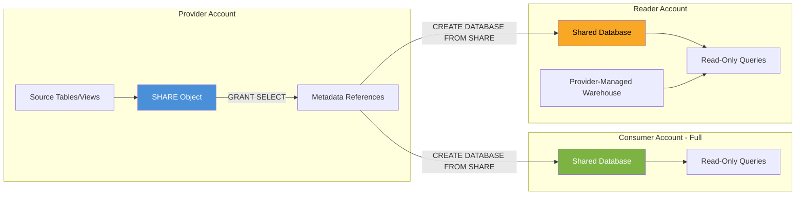

# 5.1 Secure Data Sharing

## Navigation
- **Previous:** None (first in domain)
- **Next:** [5.2 Data Marketplace and Exchange](./5.2_Data_Marketplace_and_Exchange.md)
- **Domain:** [Domain 5: Data Collaboration](./README.md)
- **Home:** [Main README](../README.md)

---

## 1. Overview

Secure Data Sharing is Snowflake's native mechanism for sharing live data between accounts without copying, moving, or transferring the underlying data. It enables real-time access to shared data through metadata-only operations, making it instantaneous and storage-cost-free for consumers. This topic accounts for a significant portion of Domain 5 (Data Collaboration, 10%) on the COF-C03 exam.

---

## 2. Key Concepts

| Concept | Description |
|---------|-------------|
| **No Data Movement** | Shared data remains in the provider's storage; only metadata references are shared |
| **Real-Time Access** | Consumers see live data immediately as the provider updates it |
| **Metadata-Only** | The SHARE object contains pointers (metadata), not copies of data |
| **Read-Only** | Consumers cannot modify shared data; they get SELECT-only access |
| **No Cost to Consumer (Storage)** | Consumers pay zero storage for shared data; they only pay for compute to query it |
| **Same Region Requirement** | Direct sharing works within the same cloud region; cross-region requires replication |

---

## 3. Architecture Diagram



---

## 4. Provider and Consumer Roles

**Data Provider:**
- Owns the source data and creates the SHARE object
- Grants privileges on objects to the share
- Adds consumer accounts to the share
- Can create Reader Accounts for non-Snowflake customers
- Pays all storage costs for shared data

**Data Consumer:**
- Creates a database from the share to access data
- Pays only compute costs for querying shared data
- Cannot modify, re-share, or export shared data (unless provider grants further privileges)
- Cannot create indexes or clustering keys on shared objects

---

## 5. The SHARE Object

A SHARE is a named Snowflake object that encapsulates the metadata needed to share specific database objects with other accounts.

### Creating and Managing a Share (Provider Side)

```sql
-- Step 1: Create the share
CREATE SHARE sales_share
  COMMENT = 'Monthly sales data for partners';

-- Step 2: Grant usage on the database and schema
GRANT USAGE ON DATABASE sales_db TO SHARE sales_share;
GRANT USAGE ON SCHEMA sales_db.public TO SHARE sales_share;

-- Step 3: Grant SELECT on specific objects
GRANT SELECT ON TABLE sales_db.public.transactions TO SHARE sales_share;
GRANT SELECT ON VIEW sales_db.public.v_secure_summary TO SHARE sales_share;

-- Step 4: Add consumer accounts
ALTER SHARE sales_share ADD ACCOUNTS = org1.consumer_acct1, org1.consumer_acct2;
```

### Consuming a Share (Consumer Side)

```sql
-- Create a database from the inbound share
CREATE DATABASE shared_sales FROM SHARE provider_org.provider_acct.sales_share;

-- Grant access to roles in the consumer account
GRANT IMPORTED PRIVILEGES ON DATABASE shared_sales TO ROLE analyst_role;

-- Query the shared data directly
SELECT * FROM shared_sales.public.transactions
WHERE transaction_date >= '2026-01-01';
```

---

## 6. What Can and Cannot Be Shared

### Objects That CAN Be Shared

| Object Type | Notes |
|-------------|-------|
| Tables | Standard and dynamic tables |
| Secure Views | Must use `CREATE SECURE VIEW` |
| Secure Materialized Views | Must use `CREATE SECURE MATERIALIZED VIEW` |
| Secure UDFs | Must use `CREATE SECURE FUNCTION` |
| Schemas (via USAGE grant) | Required for accessing contained objects |
| Databases (via USAGE grant) | Required container for sharing |

### Objects That CANNOT Be Shared

| Object Type | Reason |
|-------------|--------|
| Non-secure views | Could expose underlying logic/data to consumers |
| Stages (internal/external) | File-level access not supported via shares |
| Pipes | Ingestion objects are account-specific |
| Sequences | State-based objects cannot be shared |
| Tasks | Execution objects are account-specific |
| Streams | Change tracking is account-specific |
| Stored procedures | Execution context is account-specific |

> **Exam Tip:** If a view is shared, it MUST be a secure view. Attempting to share a non-secure view produces an error. This is a frequently tested concept.

---

## 7. Secure Views and Sharing

Secure views are critical for data sharing because they:
- Hide the view definition (DDL) from consumers
- Prevent optimizer-based data leakage
- Are the ONLY view type that can be shared

```sql
-- Create a secure view for sharing (provider side)
CREATE OR REPLACE SECURE VIEW sales_db.public.v_partner_data AS
SELECT
    transaction_id,
    transaction_date,
    product_category,
    amount
FROM sales_db.public.transactions
WHERE region = 'NORTH_AMERICA';

-- Grant to share
GRANT SELECT ON VIEW sales_db.public.v_partner_data TO SHARE sales_share;
```

---

## 8. Reader Accounts

Reader Accounts are Snowflake accounts created BY a provider for consumers who do not have their own Snowflake account.

### Direct Share vs. Reader Account Comparison

| Feature | Direct Share (Full Account) | Reader Account |
|---------|---------------------------|----------------|
| **Consumer has Snowflake account** | Yes | No (provider creates one) |
| **Who pays compute** | Consumer | Provider |
| **Who manages warehouses** | Consumer | Provider |
| **Consumer can load own data** | Yes | No |
| **Consumer can create objects** | Yes (in own databases) | Limited |
| **Setup complexity** | Low | Higher (provider manages account) |
| **Use case** | B2B with Snowflake customers | Sharing with non-Snowflake parties |
| **Account type** | Full account | Managed (limited) account |

### Creating a Reader Account

```sql
-- Provider creates a reader account
CREATE MANAGED ACCOUNT partner_reader
  ADMIN_NAME = 'partner_admin',
  ADMIN_PASSWORD = 'SecurePass123!',
  TYPE = READER;

-- Add the reader account to the share
ALTER SHARE sales_share ADD ACCOUNTS = <reader_account_locator>;

-- Provider must create a warehouse FOR the reader account
-- (done within the reader account context)
```

> **Key Point:** The provider pays ALL costs for reader accounts, including both storage and compute. This is a common exam question.

---

## 9. Share Management Commands

```sql
-- List all outbound shares (provider)
SHOW SHARES;

-- List inbound shares (consumer)
SHOW SHARES;  -- shows both inbound and outbound

-- Describe a specific share
DESCRIBE SHARE sales_share;

-- View objects granted to a share
SHOW GRANTS TO SHARE sales_share;

-- Revoke access from a share
REVOKE SELECT ON TABLE sales_db.public.transactions FROM SHARE sales_share;

-- Remove a consumer account
ALTER SHARE sales_share REMOVE ACCOUNTS = org1.consumer_acct2;

-- Drop a share entirely
DROP SHARE sales_share;
```

---

## 10. Cross-Region and Cross-Cloud Sharing

Direct data sharing only works between accounts in the **same cloud provider and region**. For cross-region or cross-cloud sharing:

1. **Database Replication** must be configured to replicate data to the target region/cloud
2. The share is then created in the target region from the replicated database
3. This introduces storage costs for the replicated copy and replication lag

| Sharing Scenario | Mechanism Required |
|-----------------|-------------------|
| Same region, same cloud | Direct share (no replication) |
| Different region, same cloud | Database replication + share in target region |
| Different cloud provider | Database replication + share in target region |

> **Exam Tip:** "Cross-region sharing requires replication" is a core testable concept. Without replication, you cannot share data between accounts in different regions.

---

## 11. Sharing and Time Travel Interaction

- Consumers **cannot** use Time Travel on shared data
- Time Travel is available only to the data owner (provider)
- If the provider drops a shared table and uses Time Travel to restore it, the consumer regains access
- The `DATA_RETENTION_TIME_IN_DAYS` setting on shared objects is controlled by the provider
- Consumers cannot use `AT` or `BEFORE` clauses on shared objects

---

## 12. Exam Tips and Common Pitfalls

1. **Shares are read-only** — consumers cannot INSERT, UPDATE, DELETE, or CREATE objects within a shared database
2. **IMPORTED PRIVILEGES** — consumers must grant `IMPORTED PRIVILEGES` on the shared database to other roles; they cannot grant granular object-level privileges within it
3. **One database per share** — a share can only contain objects from a single database
4. **Secure objects only** — views, UDFs, and materialized views must be SECURE to be shared
5. **Reader accounts = provider pays everything** — storage AND compute
6. **No cloning of shared databases** — consumers cannot CLONE a database created from a share
7. **Share object itself is free** — no cost to create or maintain the SHARE object; costs are only for storage (provider) and compute (whoever queries)
8. **Consumers cannot re-share** — a consumer cannot share received data with a third account unless they first materialize it into their own tables

---

## 13. Summary

| Aspect | Key Fact |
|--------|----------|
| Data movement | None — metadata-only sharing |
| Latency | Real-time (no sync delay) |
| Storage cost to consumer | Zero |
| Compute cost | Consumer pays (or provider pays for reader accounts) |
| Cross-region | Requires database replication |
| Shareable views | SECURE views only |
| Cannot share | Non-secure views, stages, pipes, sequences, streams, tasks |
| Time Travel | Not available to consumers |
| Share scope | Single database only |
| Consumer access level | Read-only (SELECT) |

---

**Next Topic:** [5.2 Data Marketplace and Exchange](./5.2_Data_Marketplace_and_Exchange.md)
