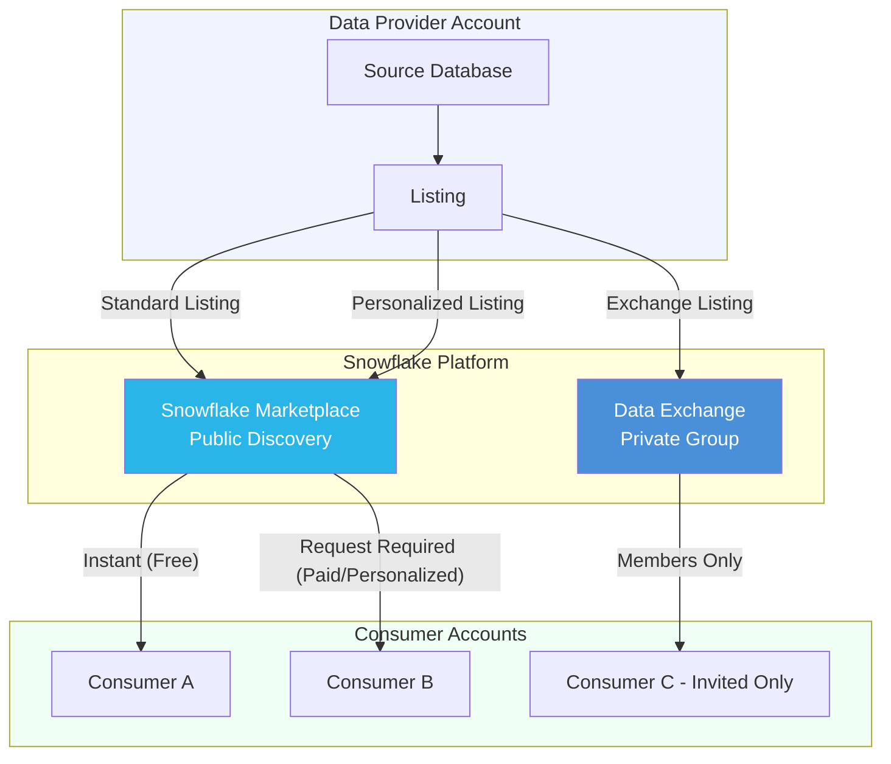

# 5.2 Data Marketplace and Exchange

## Navigation
- Previous: [5.1 Secure Data Sharing](./5.1_Secure_Data_Sharing.md)
- Next: [5.3 Replication and Data Collaboration](./5.3_Replication_and_Data_Collaboration.md)
- Domain README: [Domain 5](./README.md)
- Main README: [Home](../README.md)

---

## 1. Introduction

The Snowflake Marketplace and Data Exchange extend Snowflake's data sharing capabilities into a discovery and distribution platform. While secure data sharing requires knowing your consumer's account, the Marketplace enables providers to publish data products to a broad audience — publicly or privately — without manual share management. This topic covers approximately 3-4% of the COF-C03 exam within Domain 5.

---

## 2. Conceptual Overview

Snowflake offers two distribution mechanisms beyond direct sharing:

- **Snowflake Marketplace** — A public, open marketplace where any Snowflake customer can discover and access data listings from hundreds of providers
- **Data Exchange** — A private, invitation-only hub where a defined group of participants share data among themselves

Both mechanisms build on the same zero-copy architecture as secure data sharing — no data movement, no ETL, real-time access to live data.

---

## 3. How It Works (Architecture)



---

## 4. Key Components

| Component | Description |
|-----------|-------------|
| **Snowflake Marketplace** | Public storefront for data products; accessible to all Snowflake customers |
| **Data Exchange** | Private marketplace for a curated group of accounts |
| **Listing** | A published data product (tables, views, functions) made available via Marketplace or Exchange |
| **Standard Listing** | Available to all Snowflake customers; no approval needed for free listings |
| **Personalized Listing** | Targeted to specific consumer accounts; requires provider approval |
| **Provider** | Organization that publishes data listings |
| **Consumer** | Organization that discovers and accesses listings |
| **Data Product** | The shared content — can include tables, secure views, secure UDFs/UDTFs |

---

## 5. Listing Types

### Standard Listings
- Visible to **all** Snowflake customers on the Marketplace
- Free standard listings provide **instant access** — consumers get the data immediately
- Paid standard listings require the consumer to accept commercial terms
- Provider does not need to approve each consumer individually

### Personalized Listings
- Targeted to **specific consumer accounts** chosen by the provider
- Only visible to those designated consumers
- Always requires a request/approval workflow
- Used for premium or restricted datasets

### Free vs Paid Listings

| Aspect | Free Listing | Paid Listing |
|--------|-------------|-------------|
| Cost to consumer | None | Commercial terms (negotiated externally) |
| Access speed | Instant (standard) or upon approval (personalized) | Requires acceptance of terms |
| Provider motivation | Brand visibility, ecosystem growth | Revenue generation |
| Billing | N/A | Handled outside Snowflake or via Snowflake Marketplace billing |

---

## 6. Data Exchange (Private Marketplace)

A Data Exchange is a private, branded hub for data sharing among a defined group:

- **Created by an administrator** who invites specific accounts as members
- Members can be both providers and consumers within the exchange
- Not publicly visible — only members see exchange listings
- Ideal for industry consortiums, partner networks, or internal enterprise sharing across business units
- Governed by the exchange admin who controls membership and listing approval

```sql
-- View available data exchanges (as a member)
SHOW DATA EXCHANGES;

-- List available listings within an exchange
SHOW LISTINGS IN DATA EXCHANGE my_industry_exchange;
```

---

## 7. Becoming a Provider

### Requirements
1. Must be a Snowflake customer (any edition)
2. Must agree to the Provider Terms of Service
3. Must have ACCOUNTADMIN or a role with CREATE LISTING privilege
4. Data must be in a database the provider owns (not imported/shared data)
5. Listings undergo Snowflake review for quality and compliance

### Publishing a Listing

```sql
-- Step 1: Create a share containing the data product
CREATE SHARE marketplace_weather_share;
GRANT USAGE ON DATABASE weather_db TO SHARE marketplace_weather_share;
GRANT USAGE ON SCHEMA weather_db.public TO SHARE marketplace_weather_share;
GRANT SELECT ON TABLE weather_db.public.daily_forecasts TO SHARE marketplace_weather_share;

-- Step 2: Create the listing (done via Snowsight UI or SQL)
CREATE LISTING my_weather_listing
  IN DATA EXCHANGE snowflake_marketplace
  AS
  $$
  title: "Global Weather Forecasts"
  description: "Daily weather forecasts for 50,000+ locations worldwide"
  listing_terms:
    type: "STANDARD"
  targets:
    accounts: ["ALL"]
  $$;

-- Associate the share with the listing
ALTER LISTING my_weather_listing SET SHARE = marketplace_weather_share;
```

### Approval Process
- Snowflake reviews all Marketplace listings before publication
- Reviews check for data quality, description accuracy, and compliance
- Exchange listings may bypass Snowflake review (governed by exchange admin)

---

## 8. Consumer Experience

### Discovery
- Browse the Marketplace via **Snowsight** (Data > Marketplace)
- Search by category, provider, keyword, or data type
- Preview sample data and metadata before requesting access

### Getting Data

```sql
-- After accepting a free standard listing, a read-only database appears:
-- The database is automatically created in the consumer's account
SHOW DATABASES;
-- Look for databases with origin = 'DATA_SHARING' or type = 'IMPORTED DATABASE'

-- Query the shared data directly — no copy, no ETL
SELECT city, temperature_f, forecast_date
FROM global_weather_forecasts.public.daily_forecasts
WHERE city = 'New York'
ORDER BY forecast_date DESC
LIMIT 10;
```

### Access Patterns
| Listing Type | Consumer Action | Access Speed |
|-------------|----------------|--------------|
| Free Standard | Click "Get" | Instant |
| Paid Standard | Accept terms, complete purchase | After payment confirmation |
| Personalized | Request access | After provider approval |

---

## 9. Data Products

Listings can include rich data products beyond simple tables:

- **Tables and Views** — Standard shared data
- **Secure Views** — Filtered or transformed data with logic hidden from consumers
- **Secure UDFs/UDTFs** — Shared functions that consumers can call without seeing implementation
- **Secure Stored Procedures** — Executable logic shared as a service

This enables providers to share analytics, models, and enrichment functions — not just raw data.

---

## 10. Differences from Traditional Data Sharing

| Aspect | Secure Data Sharing | Marketplace / Exchange |
|--------|--------------------|-----------------------|
| Discovery | Must know consumer account | Public catalog or private exchange |
| Scale | One-to-one or one-to-few | One-to-many (potentially thousands) |
| Setup | Manual share + grants | Listing with metadata, terms, descriptions |
| Consumer management | Provider manages each consumer | Self-service (standard) or request-based |
| Commercial terms | External negotiation | Built-in terms framework |
| Approval | Provider adds accounts manually | Automatic (free standard) or request flow |
| Branding | None | Provider profile, descriptions, categories |
| Cross-region | Requires replication setup | Marketplace handles via auto-fulfillment |

---

## 11. Exam Tips

- The Marketplace is for **public** distribution; Data Exchange is for **private groups**
- Free standard listings give **instant access** — no approval workflow
- Personalized listings are visible **only to designated accounts**
- Consumers query shared data via a **read-only imported database** — same as direct sharing
- Data Exchange requires an **administrator** to manage membership
- Providers can share **functions and procedures**, not just tables
- **No data is copied** — Marketplace uses the same zero-copy architecture as direct sharing
- Snowflake **reviews and approves** all public Marketplace listings
- You cannot list data from an **imported database** (data you received via sharing)
- Cross-region Marketplace access uses **auto-fulfillment** (replication handled by Snowflake)
- Any Snowflake edition can consume Marketplace data; any edition can become a provider

---

## 12. Key Terminology

| Term | Definition |
|------|-----------|
| **Snowflake Marketplace** | Public platform where providers publish and consumers discover data products |
| **Data Exchange** | Private, invitation-only marketplace for a defined group of Snowflake accounts |
| **Standard Listing** | Listing visible to all Snowflake customers on the Marketplace |
| **Personalized Listing** | Listing visible only to specific consumer accounts designated by the provider |
| **Auto-fulfillment** | Snowflake's mechanism to replicate listing data cross-region automatically |
| **Provider Profile** | Provider's branded page on the Marketplace with company info and all listings |
| **Imported Database** | Read-only database created in consumer account when they accept a listing |
| **Data Product** | The combination of shared objects (tables, views, functions) published as a listing |

---

## 13. Summary

The Snowflake Marketplace and Data Exchange transform data sharing from a manual, account-to-account operation into a scalable distribution platform. The Marketplace serves public discovery with standard and personalized listings (free or paid), while Data Exchanges create private hubs for defined groups. Both use zero-copy architecture — consumers get live, real-time data without ETL. For the exam, focus on the distinctions between listing types, the consumer access workflow (instant vs request-based), and how Marketplace differs from direct sharing in terms of discovery, scale, and management overhead.

---

*Domain 5: Data Collaboration (10%) — Topic 5.2: Data Marketplace and Exchange*
