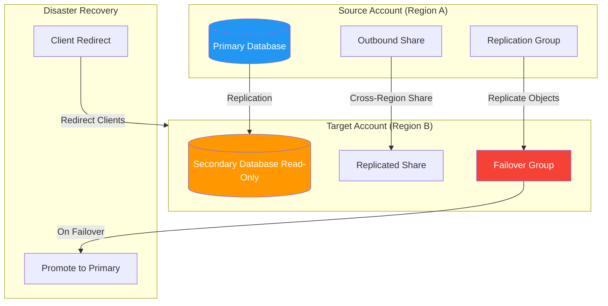

# 5.3 Replication and Data Collaboration

## Navigation
- **Previous**: [5.2 Data Marketplace and Exchange](./5.2_Data_Marketplace_and_Exchange.md)
- **Next**: None (last in domain)
- **Domain README**: [Domain 5](./README.md)
- **Main README**: [Home](../README.md)

---

## 1. Overview

Snowflake replication enables organizations to copy databases, shares, and account objects across regions and cloud platforms for disaster recovery, data locality, and cross-region collaboration. This topic covers database replication, failover groups, account replication, and how replication underpins cross-region data sharing.

**Exam Weight Insight**: Replication questions focus on the distinction between replication groups (read-only) vs. failover groups (promote-able), edition requirements, and how replication enables cross-region sharing.

---

## 2. Architecture Diagram



---

## 3. Database Replication

Database replication creates read-only copies (secondary databases) of a primary database in other accounts, including across regions and cloud providers.

**Key Characteristics**:
- Secondary databases are **read-only** replicas
- Replication works **cross-region** and **cross-cloud** (AWS to Azure, etc.)
- Uses **snapshot-based** incremental replication (only changed micro-partitions transfer)
- Available on **Standard edition and above** for replication (not failover)
- Replication of a database also replicates its schemas, tables, views, and other objects

**What Is Replicated**:
- Tables (data and metadata)
- Views, materialized views, streams, sequences
- Stages (metadata only; external stage data is not copied)
- File formats, UDFs, stored procedures, policies

**What Is NOT Replicated**:
- Pipes, tasks, alerts
- Internal stage files
- Temporary and transient tables (metadata only, no data)

---

## 4. Primary and Secondary Databases

| Property | Primary Database | Secondary Database |
|----------|-----------------|-------------------|
| Read/Write | Full read/write | **Read-only** |
| Count | Exactly one per replication group | One or more |
| Promotion | Can be demoted | Can be promoted to primary |
| Location | Any enabled account | Any linked account |
| DML Operations | Allowed | **Not allowed** |

A database starts as primary when replication is first enabled. Secondary databases receive refreshes from the primary.

```sql
-- Enable replication for a database to target accounts
ALTER DATABASE sales_db ENABLE REPLICATION TO ACCOUNTS
    myorg.target_account_east,
    myorg.target_account_eu;
```

```sql
-- Create a secondary database in the target account
CREATE DATABASE sales_db
    AS REPLICA OF myorg.source_account.sales_db;
```

```sql
-- Manually refresh the secondary database
ALTER DATABASE sales_db REFRESH;
```

---

## 5. Replication Groups and Failover Groups

Snowflake uses **groups** to replicate collections of objects together, ensuring transactional consistency.

### Replication Groups
- Replicate multiple objects as a unit (databases, shares, etc.)
- Secondary copies are **read-only**
- Available on **Standard edition and above**
- Cannot be promoted for failover

### Failover Groups
- Everything a replication group does PLUS the ability to **promote** secondaries to primary
- Requires **Business Critical edition or higher**
- Supports **client redirect** for seamless failover
- Used for true disaster recovery scenarios

```sql
-- Create a failover group (source account, Business Critical+)
CREATE FAILOVER GROUP sales_fg
    OBJECT_TYPES = DATABASES, ROLES, WAREHOUSES
    ALLOWED_DATABASES = sales_db, analytics_db
    ALLOWED_ACCOUNTS = myorg.dr_account
    REPLICATION_SCHEDULE = '10 MINUTE';
```

```sql
-- Promote secondary to primary during failover (target account)
ALTER FAILOVER GROUP sales_fg PRIMARY;
```

**Objects Supported in Groups**:
- Databases
- Shares (inbound and outbound)
- Roles and grants
- Warehouses
- Network policies, resource monitors
- Parameters (account-level)
- Users (failover groups only)

---

## 6. Account Replication

Account replication extends beyond databases to replicate account-level objects:

- **Users and roles** (with privilege grants)
- **Warehouses** (configuration, not running state)
- **Network policies** and security integrations
- **Resource monitors**
- **Account parameters**

Account replication ensures the target account can function independently after failover with all security configurations intact.

---

## 7. Refresh Frequency and Replication Lag

| Configuration | Details |
|---------------|---------|
| Scheduled refresh | `REPLICATION_SCHEDULE = 'N MINUTE'` (minimum 10 minutes) |
| Manual refresh | `ALTER DATABASE db REFRESH` or `ALTER REPLICATION GROUP rg REFRESH` |
| Cron-based | `REPLICATION_SCHEDULE = 'USING CRON 0 */2 * * * UTC'` |
| Lag monitoring | `REPLICATION_GROUP_REFRESH_HISTORY()` function |

**Replication Lag** is the time between the last successful refresh of the secondary and the current state of the primary. Smaller refresh intervals mean less data loss in failover scenarios (lower RPO).

```sql
-- Monitor replication lag
SELECT REPLICATION_GROUP_REFRESH_HISTORY('sales_fg');

-- Check database replication status
SELECT * FROM TABLE(INFORMATION_SCHEMA.DATABASE_REPLICATION_USAGE_HISTORY(
    DATE_RANGE_START => DATEADD('day', -7, CURRENT_TIMESTAMP())
));
```

---

## 8. Data Sharing Across Regions

Direct data sharing in Snowflake only works **within the same region**. To share data across regions:

1. **Replicate** the database to the target region
2. **Create a share** from the replicated (secondary) database in that region
3. Consumer accounts in the target region access the local share

Alternatively, replicate the **share object itself** using replication groups:
- Include `SHARES` in the `OBJECT_TYPES` of a replication/failover group
- The share and its underlying data are replicated together
- Consumers in the target region see the share as local

**Key Exam Point**: Cross-region sharing always requires replication as the underlying mechanism. There is no direct cross-region share without it.

---

## 9. Client Redirect

Client redirect provides connection URL failover so applications automatically connect to the promoted account during disaster recovery.

**How It Works**:
- A **connection URL** is configured that can point to either the primary or secondary account
- On failover, the connection URL is redirected to the new primary
- Applications using the connection URL are seamlessly redirected
- Requires **Business Critical edition or higher**

**Connection URL Format**: `<org_name>-<connection_name>.snowflakecomputing.com`

Client redirect is configured as part of failover groups and does not require application changes beyond using the connection URL initially.

---

## 10. Collaboration Features Overview

Snowflake's collaboration ecosystem combines multiple features:

| Feature | Purpose | Cross-Region? |
|---------|---------|---------------|
| Direct Shares | Share data with specific accounts | Same region only |
| Marketplace | Public/private listings for data products | Same region (replicated listings available) |
| Data Exchange | Private groups for sharing | Same region |
| Replication | Copy data across regions/clouds | Yes |
| Listings + Replication | Auto-fulfilled cross-region listings | Yes (auto-replicate) |

**Auto-Fulfillment**: Marketplace providers can enable auto-fulfillment, where Snowflake automatically replicates listing data to regions where consumers request access, without manual replication setup by the provider.

---

## 11. Key Differences and Comparisons

| Feature | Replication Group | Failover Group |
|---------|------------------|----------------|
| Edition required | Standard+ | **Business Critical+** |
| Read-only secondary | Yes | Yes (until promoted) |
| Promote to primary | **No** | Yes |
| Client redirect | No | Yes |
| Use case | Read replicas, data locality | Disaster recovery |
| Object types | Databases, shares | Databases, shares, users, roles, warehouses |

| Scenario | Solution |
|----------|----------|
| DR with < 10 min RPO | Failover group with 10-min schedule |
| Share data to another region | Replicate DB + create share, or replicate share |
| Read-only analytics in another region | Database replication (Standard edition) |
| Full account failover | Failover group with account objects + client redirect |

---

## 12. Exam Tips and Common Traps

1. **Edition requirement**: Failover = Business Critical+. Replication alone = Standard+. This is a frequently tested distinction.

2. **Secondary databases are read-only**: You cannot run DML on a secondary database until it is promoted to primary.

3. **Cross-region sharing requires replication**: There is no way to share directly across regions without replicating data first.

4. **Minimum refresh interval is 10 minutes**: You cannot schedule replication more frequently than every 10 minutes.

5. **Failover is manual**: Promotion requires an explicit `ALTER FAILOVER GROUP ... PRIMARY` command; it is not automatic.

6. **Client redirect requires failover groups**: Connection URLs for redirect only work with failover groups, not standalone replication groups.

7. **Transient/temporary table data is NOT replicated**: Only metadata is replicated; actual data rows are excluded.

8. **Replication costs**: You pay for data transfer (cross-region/cloud) and compute for the refresh process. Storage is charged in the target account.

---

## 13. Summary

| Concept | Key Detail |
|---------|-----------|
| Database replication | Creates read-only secondary databases across regions/clouds |
| Failover groups | Business Critical+; enables promotion and client redirect |
| Replication groups | Standard+; read-only replication without failover capability |
| Refresh schedule | Minimum 10 minutes; supports cron syntax |
| Cross-region sharing | Requires replication of database or share objects |
| Client redirect | Connection URL-based failover for applications |
| Account replication | Replicates users, roles, warehouses, policies |
| Auto-fulfillment | Marketplace listings auto-replicated to consumer regions |

---

## Additional Exam Scenarios

### Scenario 1: Failover Group Edition Requirement
**Question:** A team on Snowflake Standard edition wants to create a failover group for disaster recovery. Can they?

**Answer:** **No.** Failover groups require **Business Critical edition or higher**. Standard edition supports replication groups (read-only replicas), but NOT failover groups (which allow promotion to primary). If the team needs DR with failover capability, they must upgrade to Business Critical.

| Feature | Standard Edition | Business Critical+ |
|---------|-----------------|-------------------|
| Replication groups | Yes | Yes |
| Failover groups | **No** | Yes |
| Client redirect | **No** | Yes |

---

### Scenario 2: Replication Group vs Failover Group
**Question:** What is the key difference between a replication group and a failover group?

**Answer:** The critical difference is **promotability**:
- **Replication group**: Creates read-only secondary copies. **Cannot** be promoted to primary. Used for read replicas and data locality.
- **Failover group**: Everything a replication group does PLUS the ability to **promote** a secondary to primary via `ALTER FAILOVER GROUP ... PRIMARY`. Used for disaster recovery.

Additionally, failover groups support **client redirect** and can replicate additional object types like users and warehouses.

---

### Scenario 3: Writing to a Secondary Database
**Question:** A user connects to a secondary (replicated) database and tries to run an INSERT statement. What happens?

**Answer:** The INSERT **fails**. Secondary databases are **strictly read-only**. No DML operations (INSERT, UPDATE, DELETE, MERGE) or DDL operations (CREATE, ALTER, DROP) are permitted on secondary databases. They can only be queried with SELECT. To write to the database, it must first be promoted to primary via failover (failover groups only).

---

### Scenario 4: Manual vs Scheduled Refresh Syntax
**Question:** What is the syntax difference between manual and scheduled replication refresh?

**Answer:**

**Manual refresh** (on-demand, run by user):
```sql
ALTER DATABASE sales_db REFRESH;
-- or for groups:
ALTER REPLICATION GROUP sales_rg REFRESH;
```

**Scheduled refresh** (automatic, defined at creation):
```sql
-- Interval-based (minimum 10 minutes):
CREATE FAILOVER GROUP sales_fg
    ...
    REPLICATION_SCHEDULE = '10 MINUTE';

-- Cron-based:
CREATE REPLICATION GROUP analytics_rg
    ...
    REPLICATION_SCHEDULE = 'USING CRON 0 */2 * * * UTC';
```

Key point: the minimum scheduled interval is **10 minutes**. Manual refresh can be triggered at any time regardless of schedule.

---

### Scenario 5: Cross-Region Sharing Requires Manual Setup
**Question:** A provider shares data with a consumer in a different region. Is replication set up automatically?

**Answer:** **No** — for direct shares, replication is NOT automatic. The provider must:
1. Explicitly enable replication on the source database
2. Create a secondary database in the target region
3. Set up refresh schedules
4. Create the share from the replicated database

**Exception**: Marketplace listings with **auto-fulfillment** enabled DO handle replication automatically — Snowflake replicates listing data to regions where consumers request access. But direct shares always require manual replication setup.

---

### Scenario 6: Account Replication — What Gets Replicated?
**Question:** When account replication is configured via failover groups, what account-level objects are replicated?

**Answer:** Account replication can include:

| Object Type | Replicated? |
|-------------|-------------|
| Users | Yes (failover groups only) |
| Roles and privilege grants | Yes |
| Warehouses (configuration) | Yes (not running state) |
| Network policies | Yes |
| Resource monitors | Yes |
| Security integrations | Yes |
| Account parameters | Yes |
| Databases | Yes (specified databases) |
| Shares (inbound and outbound) | Yes |

**NOT replicated**: Running warehouse state, query history, account usage history, session state.

---

### Scenario 7: Client Redirect URL Format
**Question:** What URL format do applications use for client redirect during failover?

**Answer:** The connection URL format is:

```
<org_name>-<connection_name>.snowflakecomputing.com
```

For example: `myorg-sales_connection.snowflakecomputing.com`

Key points:
- The connection URL is **organization-level**, not account-level
- On failover, the URL is redirected to the new primary account
- Applications using this URL are **seamlessly redirected** without code changes
- Requires **Business Critical edition** and failover groups
- Must be configured before failover occurs — applications should use the connection URL from the start

---

### Scenario 8: Replication Lag Monitoring
**Question:** How do you monitor replication lag to understand how far behind the secondary is from the primary?

**Answer:** Use the **`REPLICATION_GROUP_REFRESH_HISTORY()`** table function:

```sql
-- Monitor refresh history and lag for a failover/replication group
SELECT * FROM TABLE(INFORMATION_SCHEMA.REPLICATION_GROUP_REFRESH_HISTORY('sales_fg'));

-- Monitor database-level replication
SELECT * FROM TABLE(INFORMATION_SCHEMA.DATABASE_REPLICATION_USAGE_HISTORY(
    DATE_RANGE_START => DATEADD('day', -7, CURRENT_TIMESTAMP())
));
```

These functions show:
- Last refresh timestamp
- Bytes transferred
- Refresh duration
- Error details (if refresh failed)

**Replication lag** = time since last successful refresh. Lower refresh intervals (minimum 10 min) = lower RPO (Recovery Point Objective) in disaster scenarios.

---

**Navigation**: [Previous: 5.2 Data Marketplace and Exchange](./5.2_Data_Marketplace_and_Exchange.md) | [Domain README](./README.md) | [Home](../README.md)
