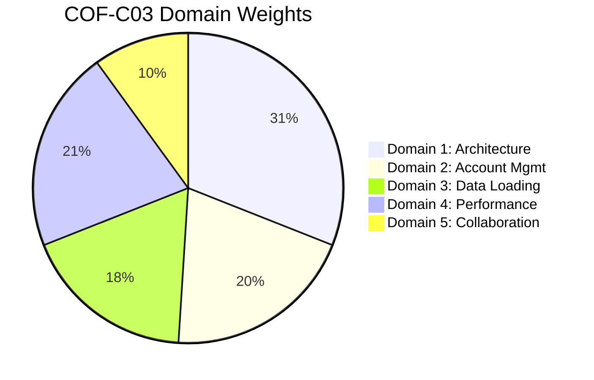

<p align="center">
  
  
  
  
</p>

<h1 align="center">🎓 SnowPro Core Certification Study Guide</h1>

<p align="center">
  <strong>Complete preparation guide for the SnowPro Core Certification (COF-C03)</strong><br/>
  Covers all 5 domains with detailed topic files, scenario-based decision guides, and practice quizzes
</p>

---

## 📋 Exam Overview

| Detail | Value |
|--------|-------|
| **Certification** | SnowPro Core (COF-C03) |
| **Questions** | ~100 multiple choice / multiple select |
| **Duration** | 115 minutes |
| **Passing Score** | 750 / 1000 |
| **Format** | Proctored (remote or test center) |
| **Prerequisites** | None |
| **Cost** | $175 USD |
| **Validity** | 2 years |

---

## 🗂️ Study Guide Structure

### Domain 1: Snowflake AI Data Cloud Features and Architecture (31%)

| # | Topic | Key Focus |
|---|-------|-----------|
| 1.1 | [Snowflake Architecture Overview](./1_Snowflake_AI_Data_Cloud_Features_and_Architecture/1.1_Snowflake_Architecture_Overview.md) | Multi-cluster shared data, 3 layers |
| 1.2 | [Cloud Services Layer](./1_Snowflake_AI_Data_Cloud_Features_and_Architecture/1.2_Cloud_Services_Layer.md) | Metadata, security, optimization |
| 1.3 | [Storage Layer and Micro-Partitions](./1_Snowflake_AI_Data_Cloud_Features_and_Architecture/1.3_Storage_Layer_and_Micro_Partitions.md) | Columnar storage, compression, pruning |
| 1.4 | [Virtual Warehouses and Compute](./1_Snowflake_AI_Data_Cloud_Features_and_Architecture/1.4_Virtual_Warehouses_and_Compute.md) | Sizing, scaling, multi-cluster |
| 1.5 | [Caching and Query Performance](./1_Snowflake_AI_Data_Cloud_Features_and_Architecture/1.5_Caching_and_Query_Performance.md) | Result cache, metadata cache, warehouse cache |
| 1.6 | [Snowflake Editions and Cloud Platforms](./1_Snowflake_AI_Data_Cloud_Features_and_Architecture/1.6_Snowflake_Editions_and_Cloud_Platforms.md) | Standard vs Enterprise vs Business Critical |

📎 [Scenarios: Architecture Decisions](./1_Snowflake_AI_Data_Cloud_Features_and_Architecture/Scenarios_Domain1.md) ·
✅ [Quiz: Domain 1 Questions](./1_Snowflake_AI_Data_Cloud_Features_and_Architecture/quiz/Questions_Domain1.md)

---

### Domain 2: Account Management and Data Governance (20%)

| # | Topic | Key Focus |
|---|-------|-----------|
| 2.1 | [Access Control and RBAC](./2_Account_Management_and_Data_Governance/2.1_Access_Control_and_RBAC.md) | Roles, privileges, DAC vs RBAC |
| 2.2 | [Data Protection and Security](./2_Account_Management_and_Data_Governance/2.2_Data_Protection_and_Security.md) | Encryption, masking, network policies |
| 2.3 | [Resource Monitors and Account Management](./2_Account_Management_and_Data_Governance/2.3_Resource_Monitors_and_Account_Management.md) | Credit controls, parameters, billing |

📎 [Scenarios: Governance Decisions](./2_Account_Management_and_Data_Governance/Scenarios_Domain2.md) ·
✅ [Quiz: Domain 2 Questions](./2_Account_Management_and_Data_Governance/quiz/Questions_Domain2.md)

---

### Domain 3: Data Loading, Unloading, and Connectivity (18%)

| # | Topic | Key Focus |
|---|-------|-----------|
| 3.1 | [Stages and File Formats](./3_Data_Loading_Unloading_and_Connectivity/3.1_Stages_and_File_Formats.md) | Internal/external stages, format options |
| 3.2 | [Data Loading Methods](./3_Data_Loading_Unloading_and_Connectivity/3.2_Data_Loading_Methods.md) | COPY INTO, Snowpipe, bulk vs continuous |
| 3.3 | [Data Unloading and Connectivity](./3_Data_Loading_Unloading_and_Connectivity/3.3_Data_Unloading_and_Connectivity.md) | GET, connectors, drivers, partner tools |

📎 [Scenarios: Loading Decisions](./3_Data_Loading_Unloading_and_Connectivity/Scenarios_Domain3.md) ·
✅ [Quiz: Domain 3 Questions](./3_Data_Loading_Unloading_and_Connectivity/quiz/Questions_Domain3.md)

---

### Domain 4: Performance Optimization, Querying, and Transformation (21%)

| # | Topic | Key Focus |
|---|-------|-----------|
| 4.1 | [Query Optimization and Profiling](./4_Performance_Optimization_Querying_and_Transformation/4.1_Query_Optimization_and_Profiling.md) | Query profile, spilling, pruning |
| 4.2 | [DML, DDL, and Data Transformation](./4_Performance_Optimization_Querying_and_Transformation/4.2_DML_DDL_and_Data_Transformation.md) | MERGE, streams, tasks, sequences |
| 4.3 | [Semi-Structured Data](./4_Performance_Optimization_Querying_and_Transformation/4.3_Semi_Structured_Data.md) | VARIANT, FLATTEN, lateral joins |
| 4.4 | [Time Travel and Fail-Safe](./4_Performance_Optimization_Querying_and_Transformation/4.4_Time_Travel_and_Fail_Safe.md) | Retention, UNDROP, AT/BEFORE |

📎 [Scenarios: Performance Decisions](./4_Performance_Optimization_Querying_and_Transformation/Scenarios_Domain4.md) ·
✅ [Quiz: Domain 4 Questions](./4_Performance_Optimization_Querying_and_Transformation/quiz/Questions_Domain4.md)

---

### Domain 5: Data Collaboration (10%)

| # | Topic | Key Focus |
|---|-------|-----------|
| 5.1 | [Secure Data Sharing](./5_Data_Collaboration/5.1_Secure_Data_Sharing.md) | Shares, reader accounts, listings |
| 5.2 | [Data Marketplace and Exchange](./5_Data_Collaboration/5.2_Data_Marketplace_and_Exchange.md) | Marketplace, private exchange |
| 5.3 | [Replication and Data Collaboration Features](./5_Data_Collaboration/5.3_Replication_and_Data_Collaboration.md) | Database replication, failover |

📎 [Scenarios: Collaboration Decisions](./5_Data_Collaboration/Scenarios_Domain5.md) ·
✅ [Quiz: Domain 5 Questions](./5_Data_Collaboration/quiz/Questions_Domain5.md)

---

## 📊 Content Statistics

<p align="center">
  
  
  
  
  
</p>

---

## 📖 Additional Resources

| Resource | Description |
|----------|-------------|
| [📘 GLOSSARY](./GLOSSARY.md) | 100+ key terms with exam-focused definitions |
| [🤝 CONTRIBUTING](./CONTRIBUTING.md) | How to contribute to this study guide |
| [📋 Official Exam Guide](https://learn.snowflake.com/en/certifications/snowpro-core/) | Snowflake's official COF-C03 page |
| [📖 Snowflake Documentation](https://docs.snowflake.com/) | Primary reference documentation |

---

## 🎯 Study Strategy

### Recommended Study Order (by domain weight):

```
1. Domain 1 — Architecture (31%) ← Start here, heaviest weight
2. Domain 4 — Performance & Querying (21%)
3. Domain 2 — Account Management (20%)
4. Domain 3 — Data Loading (18%)
5. Domain 5 — Data Collaboration (10%)
```

### Study Tips:

- **Focus on numbers** — retention periods, size limits, credit costs appear frequently
- **Understand "when to use X vs Y"** — scenario questions test decision-making
- **Know the default behaviors** — what happens without explicit configuration
- **Practice SQL** — many questions test syntax awareness for specific features
- **Review caching** — the 3 cache types and when each is used is heavily tested

---

## 📝 Domain Weight Distribution



---

<p align="center">
  <em>Built with the certification-study-guide documentation standard</em><br/>
  <strong>Good luck on your SnowPro Core exam! 🎓</strong>
</p>
